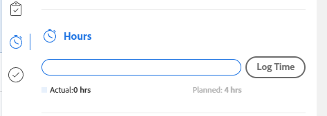

# [!UICONTROL 概要]パネルについて

[!UICONTROL 概要]パネルを使用すると、タスクやイシュー、ドキュメントのリスト、またはタスクやイシューを表示する [!DNL Adobe Workfront] の他のエリアから直接、作業アイテムの情報を確認および更新できます。

[!UICONTROL 概要]パネルが配置され、使用できるエリアは、次の表のとおりです。

<table style="table-layout:auto"> 
 <col data-mc-conditions=""> 
 <tbody> 
  <tr> 
   <td>タスク</td> 
  </tr> 
  <tr> 
   <td> 
次の中のタスクリスト
 
    <ul> 
     <li>プロジェクト</li> 
     <li>サブタスク</li> 
    </ul> </td> 
  </tr> 
  <tr> 
   <td>[!UICONTROL Workload Balancer] の [!UICONTROL Unassigned] および[!UICONTROL Assigned] の作業エリアのタスク</td> 
  </tr> 
  <tr data-mc-conditions=""> 
   <td>イシュー</td> 
  </tr> 
  <tr data-mc-conditions=""> 
   <td> 
次の中のイシューリスト
 
    <ul> 
     <li>プロジェクト</li> 
     <li>タスク</li> 
     <li>サブタスク</li> 
    </ul> </td> 
  </tr> 
  <tr data-mc-conditions=""> 
   <td>[!UICONTROL Workload Balancer] の [!UICONTROL Assigned Work] エリアのイシュー</td> 
  </tr> 
  <tr data-mc-conditions=""> 
   <td>[!UICONTROL Requests] エリアの「[!UICONTROL Submitted]」セクションのイシュー</td> 
  </tr> 
  <tr data-mc-conditions=""> 
   <td>ドキュメント</td> 
  </tr> 
  <tr data-mc-conditions=""> 
   <td>[!UICONTROL Documents] エリア</td> 
  </tr> 
  <tr data-mc-conditions=""> 
   <td>任意のオブジェクト（プロジェクト、タスク、イシュー、プログラム、ポートフォリオ、テンプレート、テンプレートタスク、ユーザー）の「[!UICONTROL Documents]」セクション</td> 
  </tr> 
 </tbody> 
</table>

<!--

Workfront administrators can customize the Summary in the Layout Template. For more information, see <a href="../../administration-and-setup/customize-workfront/use-layout-templates/create-and-manage-layout-templates.md" class="MCXref xref">Create and manage layout templates</a>.

-->

この記事では、リスト内のタスクとイシューの[!UICONTROL 概要]パネルへのアクセス方法と使用方法について説明します。

[!UICONTROL ワークロードバランサー]の[!UICONTROL 概要]へのアクセスについて詳しくは、「[[!UICONTROL ワークロードバランサー]の作業アイテムを[!UICONTROL 概要]](../../resource-mgmt/workload-balancer/update-items-in-summary-panel-in-workload-balancer.md)を使用して更新する」を参照してください。

ドキュメントの[!UICONTROL 概要]へのアクセスについて詳しくは、ドキュメントの[[!UICONTROL 概要]](../../documents/managing-documents/summary-for-documents.md)を参照してください。

## アクセス要件

この記事の手順を実行するには、次のアクセス権が必要です。

<table style="table-layout:auto"> 
 <col> 
 <col> 
 <tbody> 
  <tr> 
   <td role="rowheader"><strong>[!DNL Adobe Workfront] プラン*</strong></td> 
   <td> 
任意
 </td> 
  </tr> 
  <tr> 
   <td role="rowheader"><strong>[!DNL Adobe Workfront] ライセンス*</strong></td> 
   <td> 
[!UICONTROL Request] 以降
 </td> 
  </tr> 
  <tr> 
   <td role="rowheader"><strong>アクセスレベル設定*</strong></td> 
   <td> 
タスク、イシュー、ドキュメントに対する [!UICONTROL View] またはそれ以上の権限
 
ドキュメントの [!UICONTROL Summary] を表示する任意のオブジェクトに対する [!UICONTROL View] またはそれ以上の権限
 
メモ：まだアクセス権がない場合は、アクセスレベルに追加の制限が設定されていないか [!DNL Workfront] 管理者にお問い合わせください。[!DNL Workfront] 管理者がアクセスレベルを変更する方法について詳しくは、<a href="../../administration-and-setup/add-users/configure-and-grant-access/create-modify-access-levels.md" class="MCXref xref">カスタムアクセスレベルの作成または変更</a>を参照してください。
 </td> 
  </tr> 
  <tr> 
   <td role="rowheader"><strong>オブジェクト権限</strong></td> 
   <td> 
タスク、イシュー、ドキュメントに対する[!UICONTROL View] またはそれ以上の権限
 
追加のアクセス権のリクエストについて詳しくは、<a href="../../workfront-basics/grant-and-request-access-to-objects/request-access.md" class="MCXref xref">オブジェクトのアクセスのリクエスト</a>を参照してください。
 </td> 
  </tr> 
 </tbody> 
</table>

&#42;ご利用のプラン、ライセンスの種類、アクセス権を確認するには、[!DNL Workfront] 管理者にお問い合わせください。

## タスクまたはイシューのリストで[!UICONTROL 概要]パネルを表示する

1. タスクまたはイシューに移動し、リストからアイテムを選択します。
1. **[!UICONTROL 概要]**&#x200B;アイコン  をクリックします。

   または

   [!UICONTROL リクエスト]エリアの「[!UICONTROL 送信済み]」セクションにある&#x200B;**[!UICONTROL 概要を開く]**&#x200B;アイコン  をクリックします。

   概要を開いた後、他のタスクやイシューをクリックまたは選択しても、概要は手動で閉じるまで開いたままになります。

   >[!TIP]
   >
   >[!UICONTROL 概要]パネルで詳細を表示するとき、選択できるタスクまたはイシューは一度に 1 つだけです。

   

1. （オプション）[!UICONTROL 概要]パネルを閉じるには、次のいずれかの操作を行います。

   * タスクまたは問題のリストで、**[!UICONTROL 概要を開く]**&#x200B;アイコン  をクリックします。

     または

     [!UICONTROL 概要]パネルの右上隅にある **X** アイコンをクリックします。

   * [!UICONTROL リクエスト]領域の「[!UICONTROL 送信済み]」セクションで、**[!UICONTROL 概要を閉じる]**&#x200B;アイコン  をクリックします。

     または

     概要パネルの右上隅にある **X** アイコンをクリックします。

## [!UICONTROL 完了率]

[!UICONTROL 概要]の上部にある進捗バーを使用すると、選択したタスクまたはイシューの完了率を更新できます。完了率の正しい数値を入力するか、バーをドラッグします。

## [!UICONTROL 更新]

[!UICONTROL 概要]の「[!UICONTROL 更新]」セクションを使用すると、最近の更新を表示したり、選択したタスクまたはイシューを更新したりできます。「**[!UICONTROL すべて表示]**」をクリックすると、タスクの「[!UICONTROL 更新]」タブに直接移動できます。

## [!UICONTROL ドキュメント]

[!UICONTROL 概要]の「[!UICONTROL ドキュメント]」セクションを使用すると、選択したタスクまたはイシューに添付されているドキュメントを表示できます。サムネールをクリックすると、ドキュメントのプレビューが開きます。タスクまたはイシューの「[!UICONTROL ドキュメント]」タブに直接移動するには、「**[!UICONTROL ドキュメント]**」タイトルをクリックします。

## [!UICONTROL 詳細]

[!UICONTROL 概要]の「[!UICONTROL 詳細]」セクションを使用すると、作業項目の概要レベルの詳細を表示したり、割り当てを行ったり、開始日を追加したりできます。「**[!UICONTROL すべて表示]**」をクリックすると、タスクまたはイシューの「[!UICONTROL 詳細]」タブに直接移動できます。

>[!NOTE]
>
>このセクションに表示されるフィールドは、ホームの右パネルに表示されるフィールドと同じです。これらのフィールドはカスタマイズできます。詳しくは、[レイアウトテンプレートを使用した[!UICONTROL ホーム]と[!UICONTROL 概要]のカスタマイズ](../../administration-and-setup/customize-workfront/use-layout-templates/customize-home-summary-layout-template.md)を参照してください。

## [!UICONTROL サブタスク]

このセクションは、タスクに対してのみ使用できます。[!UICONTROL 概要]の「[!UICONTROL サブタスク]」セクションすると、選択したタスクの[!UICONTROL 新規]、[!UICONTROL 処理中]、[!UICONTROL クローズ]のサブタスクを表示できます。**[!UICONTROL ステータス]**&#x200B;ドロップダウンメニューをクリックすると、ステータスを切り替えることができます。タスクの「[!UICONTROL サブタスク]」タブに直接移動するには、「**[!UICONTROL サブタスク]**」タイトルをクリックします。

タスクにサブタスクを追加していない場合は、「**[!UICONTROL ここに追加してください。]**」をクリックして、タスクの「[!UICONTROL サブタスク]」タブに直接に移動します。

## [!UICONTROL 時間数]

[!UICONTROL 概要]の「[!UICONTROL 時間数]」セクションを使用すると、選択したタスクまたはイシューに関する時間を記録できます。「**[!UICONTROL 時間を記録]**」をクリックし、時間を入力します。タスクまたはイシューの「時間数」タブに直接移動するには、「**[!UICONTROL 時間数]**」タイトルをクリックします。

[!UICONTROL 概要]の時間数には、ログに記録した時間が表示されます。[!UICONTROL 概要]で他のユーザーに表示される時間合計は、それらのユーザーがタスクに関して記録した時間によって異なります。

タスクやイシューに関する予定[!UICONTROL 時間数]がなく、時間をログに記録した場合は、時間数バーが赤色で表示されます。

## 承認

[!UICONTROL 概要]の「[!UICONTROL 承認]」セクションを使用すると、選択したタスクまたはイシューに添付された承認を表示できます。まだ承認を追加していない場合は、ドロップダウンメニューから既存の承認を選択するか、「**[!UICONTROL 単一使用承認プロセスを作成]**」をクリックして、タスクまたはイシューの「[!UICONTROL 承認]」タブに直接移動します。

タスクまたはイシューの「[!UICONTROL 承認]」タブに直接移動するには、「**[!UICONTROL 承認]**」タイトルをクリックします。

