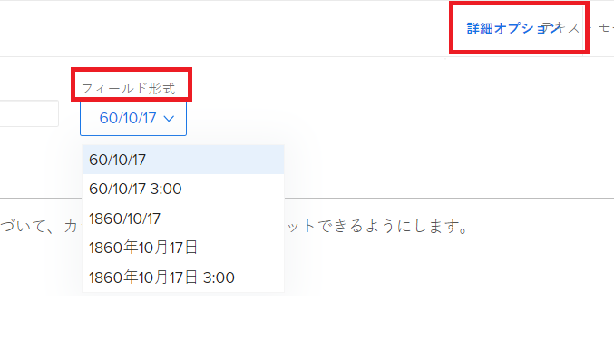
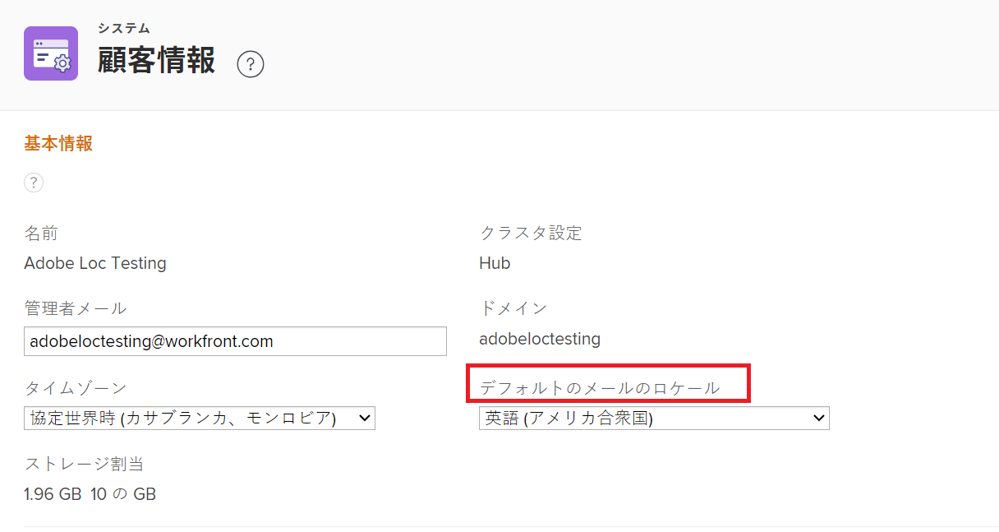
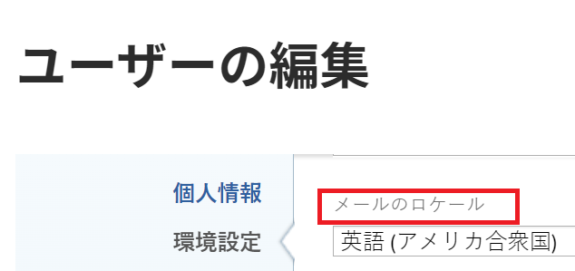

# [!DNL Adobe Workfront] で日付の形式を変更する

<!--this article used to be called "Change the date format in Adobe Workfront when using Chrome". The team decieded to make it more generic and hide the steps. Also see drafted content below-->

日付の日付形式は、 [!DNL Adobe Workfront]、例： [!UICONTROL 計画完了日], [!UICONTROL 実際の完了日]または [!UICONTROL 予定完了日].

例えば、日付フォーマットを _DD/MM/YYYY_ から _MM/DD/YYYY_ その逆も同様です。
また、日付フォーマットを _MM/DD/YY_ から _YYYY 年月 DD 日_.

Workfrontでは、表示する変更と変更を表示する場所に応じて、次の方法で日付形式を変更できます。

* のすべてのページのすべての日付形式を変更するには [!DNL Workfront] 場所と言語に応じて、ブラウザーの言語設定を変更する必要があります。

  例えば、ブラウザーのデフォルト言語が *[!UICONTROL 英語（米国）]*&#x200B;の場合、日付は次の形式で表示されます。

   * MM/DD/YYYY
   * 月曜日 (YYY)

  [!DNL Chrome] またはその他のブラウザーで言語設定を変更するには、そのブラウザーの設定を変更する必要があります。ブラウザーの設定を変更する手順は、ブラウザーによって異なります。 ブラウザーの[!UICONTROL ヘルプ]、[!UICONTROL 環境設定]または[!UICONTROL 設定]エリアを参照し、設定の変更方法を確認してください。

* レポートとビューでのみ日付の形式を変更するには、 [!UICONTROL フィールドの形式] 設定を [!UICONTROL 詳細オプション] 列の領域（レポートまたはビューの作成時） これによって、場所や言語に応じて日付の形式が変更されることはありません。 同じ場所や言語のコンテキストで日付の形式を変更します。

  

  詳しくは、[カスタムレポートの作成](../../reports-and-dashboards/reports/creating-and-managing-reports/create-custom-report.md)を参照してください。

* 組織全体に対するすべての送信電子メール通知で日付の形式を変更するには、 [!UICONTROL デフォルトの電子メールロケール] 設定を [!UICONTROL 顧客情報] 領域 [!UICONTROL 設定].

  

  詳しくは、 [システムの基本情報を設定する](../../administration-and-setup/get-started-wf-administration/configure-basic-info.md).

* 1 人のユーザーに対するすべての送信電子メール通知のすべての日付の形式を変更するには、 [!UICONTROL 電子メールのロケール] 設定を [!UICONTROL 担当者の編集] 」ボックス（ユーザーのプロファイルを編集する際に使用）

  

  詳しくは、[ユーザーのプロファイルの編集](../../administration-and-setup/add-users/create-and-manage-users/edit-a-users-profile.md)を参照してください。

<!--drafted because we should not document steps for a third-party application

To change your language settings in Chrome:

1. Click the 3-dots in the top right corner of your Chrome interface, then click **Settings**.
1. On the left area of the Settings page, expand **Advanced**, then click **Languages**.  
   Or  
   Search for *language*&nbsp;at the top of the Settings page, then click **Languages**.

1. In the **Language** list, locate the language and region that use your preferred date format.

   **Example:** If you speak English and you want the date format to be MM/DD/YYYY, you would select **English (United States)**. If you speak English and you want the date format to be DD/MM/YYY, you would select **English (United Kingdom)**.

1. (Conditional) If the language and region you want to use are not visible in the list, click **Add languages** to add it to the list.
1. Click the 3-dot menu next to the language and region you want to use, then click **Move to the top**.
1. Return to the Workfront interface, then refresh the page.  
   The date format is now updated in projects and other areas of Workfront that use MM/DD/YYYY or DD/MM/YYYY format when displaying dates.

   -->
