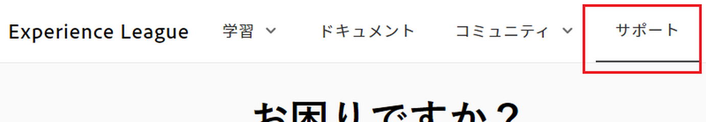
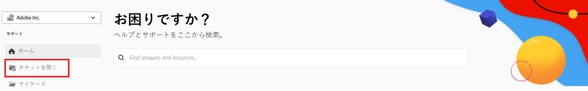
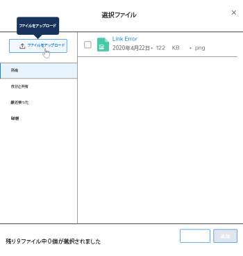

# カスタマーサポートに連絡

<!--Audited: 12/2023-->

<!--

(We need to keep this as a standalone article. It is linked in multiple articles and FAQs.)

-->

As an [!DNL Adobe Workfront] のお客様の場合、 [!DNL Workfront] 電話またはオンラインでチケットを送信して、カスタマーサポートチームに問い合わせます。

>[!NOTE]
>
>重要な問題については、 [!DNL Workfront] 電話によるカスタマーサポート。

## 電話

次の連絡先に： [!DNL Workfront Customer Support] 週に 7 日、日に 24 時間、次の数字で示します。

* 米国： 844-306-HELP(4357)
* EMEA: +44 1256 274200
* オーストラリア： +61 1800 849259

## Web

セルフサービスからサポートチケットを送信できます。 [!DNL Experience League] ポータル。

>[!IMPORTANT]
>
>オンラインサポートチケットを送信できるのは、許可されたサポート連絡先（または権利を持つユーザーをサポート）だけです。

1. 次から： [[!DNL Experience League]](https://experienceleague.adobe.com) web サイト、クリック **[!UICONTROL サポート]**  をクリックします。

   

   The [!UICONTROL サポート] ページが開きます。

   次から： [!UICONTROL サポート] ホームページから、オープンなサポートケースに移動し、新しいケースをログに記録して、上部を表示できます。 [!UICONTROL サポート] 記事を参照するか、追加の学習ソースにアクセスします。

1. ケースを送信するには、「 」オプションを選択します。 **[!UICONTROL サポートケースを開く]**&#x200B;を選択し、次に **[!UICONTROL 署名] In**.

1. クリック **[!UICONTROL ケースを開く]** 左側のサイドバーに表示されます。

<!--
   
-->

The [!UICONTROL ケースの作成] ページが開き、製品名 ([!DNL Adobe Workfront], [!DNL Adobe Workfront Fusion]など )、ケースタイトル、ケースの説明です。

>[!TIP]
>
>問題を説明する際は、トラブルシューティングプロセスを迅速に進めるために、できる限り説明的にしてください。

1. 次のフィールドに情報を入力して、より具体的な情報を提供します。

   * **[!UICONTROL ケースの優先度]** ([!UICONTROL 低], [!UICONTROL 中], [!UICONTROL 高], [!UICONTROL 重大])
   * **[!UICONTROL ケース製品]** ([!UICONTROL DAM], [!DNL Fusion], [!DNL Goals]など )
   * **[!UICONTROL 環境]** ([!UICONTROL 実稼動], [!UICONTROL プレビュー], [!UICONTROL サンドボックス]など )
   * **[!UICONTROL 顧客地域]** （南北アメリカ、EMEA、APAC）

1. 関連するファイルをアップロードし、「 **[!UICONTROL 大文字と小文字を送信]**.

   事件が提出され、 [!UICONTROL マイケース] ページが表示されます。

   <!--
   
   -->

リクエストの送信に関して質問や問題がある場合は、カスタマーサポートチームにお電話ください。

## サポートケースの表示と管理

1. 次に移動： **[!UICONTROL マイケース]** ページに貼り付けます。 このページは、ケースを送信すると開きます。または、 **[!UICONTROL マイケース]** をクリックします。

1. （オプション）ページ上部のオプションを使用して、 **製品 ([!DNL Experience Cloud] ソリューション )** またはケース **[!UICONTROL ステータス]** ([!UICONTROL 開く] または Cl（注）。 また、 [!UICONTROL 検索] ボックスを使用して、サポートケースに関連するキーワードを検索します。

1. （オプション）ケースの詳細を表示するには、 **ケース番号** にアクセスします。

   ケースビューが開きます。

1. （オプション）ケースビューで、最新のコメントを割り当てられたケース所有者と確認し、追加の添付ファイルや応答を追加します。

1. （オプション）ケースをエスカレーションするには、「 **[!UICONTROL 管理にエスカレーション]** **の下のページの右側に[!UICONTROL ケースの詳細].

1. 次をクリック： **[!UICONTROL ケースを閉じる]** ボタンをクリックしてケースを閉じます。

<!--drafted: I took the information above from this blog post by Jon Chen (on September 13, 2022): https://experienceleaguecommunities.adobe.com/t5/workfront-blogs/how-to-submit-a-support-ticket-on-experience-league/ba-p/461737)

- this is the information that was there before - pointing to WorkfrontOne: 

If you are logged in as an Authorized Support Contact, you can contact Workfront Customer Support through the Workfront One site and create a case, formally called a ticket.

1. Log in to [**one.workfront.com**](https://one.workfront.com/) as an Authorized Support Contact.
1. On the **Home** page, click **Support**.

   

   The Customer Support page displays.

   >[!NOTE]
   >
   >If you don't see the Support option on the Home page, you are not an Authorized Support Contact. Your Workfront administrator can contact Workfront Customer Support and request you be added an Authorized Support Contact. If you are the only Workfront administrator for your organization, contact the Workfront Support team by phone.

1. Complete the fields in the **Create a Support Case** form. All fields are required.  

   <table style="table-layout:auto">
    <tr>
        <td><strong>Subject</strong></td>
        <td>Type a brief question or explanation of the issue you are experiencing.</td>
    </tr>
    <tr>
        <td><strong>Description</strong></td>
        <td>Type a detailed description of the issue. Include as much information as possible.</td>
    </tr>
    <tr>
        <td><strong>Priority</strong></td>
        <td> </td>
    </tr>
    <tr>
        <td><strong>Case Product</strong></td>
        <td>Select the product in which you are experiencing the issue. If the issue is not related to a specific product, select None.</td>
    </tr>
    <tr>
        <td><strong>Product Area</strong></td>
        <td>Select the area of the product that best relates to the issue. If the related area is not listed in the drop-down menu, select Not Listed.</td>
    </tr>
    <tr>
        <td><strong>Environment</strong></td>
        <td>Select the environment in which the issue occurs. If you are seeing the issue in both the Production and Sandbox environments, please select Production.</td>
    </tr>
    <tr>
        <td><strong>Customer Region</strong></td>
        <td> </td>
    </tr>
   </table>

1. (Optional) Attach a file, such as an image or video file.

   1. At the bottom of the form, click **Upload File**.
   1. Click **Upload File**, then browse for and select the desired file.

      

   1. Click **Done** to upload the file to the case.

1. Click **Submit** to submit the case to Workfront Customer Support.

-->

