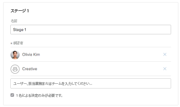

# 重複した承認プロセスが [!UICONTROL ホームの作業リスト]

## 問題

同じ承認が [!UICONTROL ホームの作業リスト].

## 原因

個々のユーザーとして、またチームのメンバーとして承認に割り当てられている。

## 解決策

承認プロセスを設定するユーザーは、承認プロセスに追加する個々のユーザーが、承認プロセスに割り当てられたチームのメンバーでないことを確認する必要があります。

個々のユーザーとして、またチームの一部として割り当てられ、承認が 2 回表示される場合は、エントリの 1 つに対してのみ決定する必要があります。
