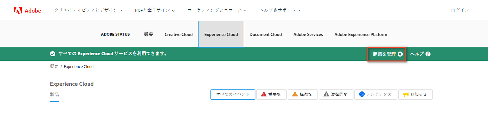

# The [!DNL Adobe Workfront] ステータスサイト

<!-- Audited: 1/2024 -->

## ステータスサイトの概要

のヘルスを確認できます。 [!DNL Workfront] インシデント、定期メンテナンス期間、およびすべての [!DNL Workfront] クラスターにアクセスする方法 [!DNL Workfront Status] サイト。

ステータスサイトの次の情報にアクセスできます。

* リアルタイムシステムパフォーマンス統計
* 計画されたメンテナンススケジュール
* ～が雇用するセーフガードに関する情報 [!DNL Workfront] ユーザーデータを保護する
* 名前付き脆弱性ステータス

## 表示 [!DNL Adobe Workfront] ステータスの更新

ステータスの更新は、 [!DNL Adobe] ステータスサイト。

1. タイプ [status.adobe.com](https://status.adobe.com/) 」をクリックして、ステータスサイトにアクセスします。

1. 選択 **[!UICONTROL Experience Cloud]**.
1. 下にスクロールして、「 」を選択します。 **[!UICONTROL Adobe Workfront]** を選択します。

## 配信登録または配信登録の管理

ステータスサイトを購読する、または既に購読した後で購読を管理するには、次の手順を実行します。

1. に移動します。 [status.adobe.com](https://status.adobe.com/).
1. ステータスバーで、 **[!UICONTROL 購読を管理]**.
   
1. 既存のアカウントがある場合は、そのアカウントにログインし、それ以外の場合は新しいアカウントを作成します。
1. 次をクリック： **[!UICONTROL 購読を作成]** 」ボタンをクリックします。
1. 選択 **[!UICONTROL Adobe Workfront]** の下に **[!UICONTROL Experience Cloud]** ヘッダー、次に「 **[!UICONTROL 続行]**.
1. 地域とイベントタイプの環境設定を選択し、「 **[!UICONTROL 続行]**.
1. クリック **[!UICONTROL 完了]** 購読を確認するには、をクリックします。

## 特定の脆弱性の理解

### 「脆弱性」とは何ですか？ {#what-is-a-named-vulnerability}

コンピュータのセキュリティにおいて、脆弱性とは、攻撃者がシステムの安定性、セキュリティ、または整合性を低下させる脆弱性です。

脆弱性の研究者やクリエイターは、内部的にプロジェクトに名前を付け、参照しやすくします ( 例： [!DNL ShellShock], [!DNL Heartbleed], [!DNL POODLE]、および [!DNL WannaCry]/[!DNL Petya]) をクリックします。 脆弱性が広く影響を及ぼした場合、脆弱性が開示されると、これらの名前は公開されます。

### 特定された名前付きの脆弱性を表示する方法を教えてください。 [!DNL Workfront?] {#how-do-i-view-named-vulnerabilities-identified-by-workfront}

1. に移動します。  [status.adobe.com](https://status.adobe.com/)を選択し、次に **[!UICONTROL セキュリティ]**.

## なぜこれが重要なのか？ {#why-is-this-important}

セキュリティ対応のネットワーク管理者は、ステータスサイトと、Workfrontによって特定される名前付きの脆弱性に精通している必要があります。

大きな影響を及ぼす脆弱性が明らかになった場合は、ベンダーが確実に認識し、データを保護する必要があります。

ステータスサイトには、いつでも到達できるこのような脆弱性の現在のログが用意されています。このログでは、待機がチケットを起動したり、この情報を入手するためにアカウントマネージャーに連絡したりするのを回避できます。
