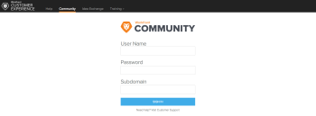
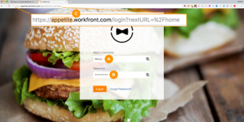

# この [!DNL Adobe Workfront] コミュニティ

アドビ [!DNL Workfront] コミュニティは、10,000 を超えるオンライングループです [!DNL Workfront] ユーザー。 コミュニティを通じて、製品リリースを常に最新の状態に保ち、顧客イベントについて学び、他のユーザーと [!DNL Workfront] 製品とサービス。 質問に対する回答を見つけ、他の人とのつながりを確立します [!DNL Workfront] 顧客。

<!--

-->

## ログイン

* [認証済みサポートの連絡先](#authorized-support-contact)
* [SSO ログインを使用しない非認証サポート連絡先](#non-authorized-support-contact-without-sso-login)
* [SSO ログインに関する権限のないサポートへの問い合わせ](#non-authorized-support-contact-with-sso-login)

### 認証済みサポートの連絡先 {#authorized-support-contact}

認証済みサポート連絡先 (ASC) の場合、 [!UICONTROL ヘルプデスク], [!UICONTROL イノベーションラボ]、および [!DNL Workfront] [!UICONTROL 上昇]. 同じ資格情報を使用して、 [!DNL Workfront] コミュニティ。 この場合、サブドメインは空白のままにします。

### SSO ログインを使用しない非認証サポート連絡先 {#non-authorized-support-contact-without-sso-login}

認証済みサポートの連絡先でない場合は、通常の [!DNL Workfront] インスタンスの資格情報。 同じサブドメインを [!DNL Workfront] インスタンス。

>[!NOTE]
>
>このオプションは、シングルサインオン (SSO) を使用してWorkfrontにログインしない場合にのみ機能します。

### SSO ログインに関する権限のないサポートへの問い合わせ {#non-authorized-support-contact-with-sso-login}

SSO を使用している場合は、 [!DNL Workfront] 電話でアカウントをリクエストするカスタマーサポート。 チケットを送信したり、ライブチャットに参加したりできない場合は、認証済み担当者にお問い合わせください [!DNL Workfront] カスタマーサポートにお問い合わせください。

Ascent Training 内で既にアカウントが設定されている場合は、同じ資格情報を使用してコミュニティサイトにアクセスできます（この場合はサブドメインを空白のままにします）。

コミュニティサイトのパスワードを覚えていない場合は、 [!DNL Workfront Customer Support] そして彼らは君を助ける事が出来る

## FAQ

* [サブドメインとは](#what-s-my-subdomain)
* [ユーザ名またはパスワードを忘れた。 ユーザー名またはパスワードをリセットする方法を教えてください。](#i-forgot-my-username-or-password-how-do-i-reset-my-username-or-password)

### の URL は何ですか。 [!DNL Workfront] コミュニティ？

この [!DNL Workfront] コミュニティは [!DNL Workfront One] web サイトを次の URL で開きます。  [https://one.workfront.com/s/community](https://one.workfront.com/s/community).

### サブドメインとは {#what-s-my-subdomain}

サブドメインに慣れていない場合は、簡単に見つけることができます。 ログインしている場合 [!DNL Workfront]の場合、サブドメインは *.workfront.com*  または *my.workfront.com* 」と入力します。 例えば、Workfront URL が *adective.workfront.com,* その後 *食欲* はサブドメインです。 下の図の「マーカー C」を参照してください。

### ユーザ名またはパスワードを忘れた。 ユーザー名またはパスワードをリセットする方法を教えてください。 {#i-forgot-my-username-or-password-how-do-i-reset-my-username-or-password}

ユーザー名やパスワードを忘れた場合は、サポートにお問い合わせください。また、担当者が資格情報のリセットに役立ちます。
