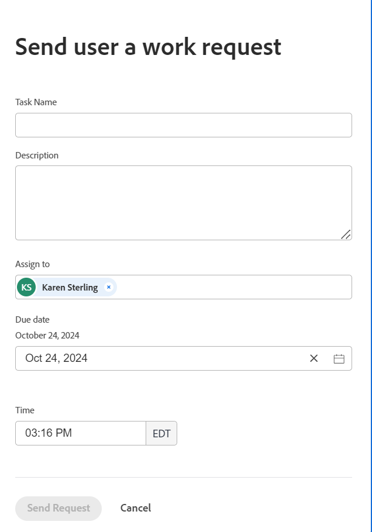

# 個人用タスクを作成する

<!--Audited: 10/2024-->

個人タスクとは、ユーザーに送信したり、自分で送信したり、追加したりするアドホックな作業リクエストのことです。

Adobe Adobe Workfrontは、Adobe Workfrontが各ユーザーに対して自動的に作成するユーザーの個人プロジェクトに対して、一時的な作業リクエストやTo Do アイテムを個人タスクとして保存します。

ユーザーの個人プロジェクトの特徴を以下に示します。

* Workfrontのすべてのユーザーには、「&lt; ユーザーのフルネーム >」という個人用プロジェクトがあります。 例えば、「John Smithのタスク」です。
* 各ユーザーの個人プロジェクトは検索に表示されず、非表示になります。
* ユーザーが非アクティブ化されている場合でも、個人プロジェクトは削除できません。
* 個人プロジェクトのステータスは、常に最新です。 個人プロジェクトは完了またはキャンセルできません。
* 個人タスクはすべて、ユーザーの個人プロジェクトに保存されます。
* 必要に応じて、個人タスクを別のプロジェクトに移動できます。

個人タスクは、次の方法で作成できます。

* ホームエリアでToDo アイテムを作成する

  詳しくは、「[&#x200B; ホーム エリアから作業項目とプロジェクトを作成する](/help/quicksilver/workfront-basics/using-home/using-the-home-area/create-work-items-in-home.md)」を参照してください。

* ユーザープロファイルページから別のユーザーに個人作業リクエストを作成して送信する
* 個人の作業リクエストを作成し、ユーザープロファイルページから自分に送信する

この記事では、ユーザープロファイルページから、ユーザーまたは自分自身の個人作業リクエストを作成する方法について説明します。

個人用タスクの追加方法に関係なく、Workfrontの同じ領域で見つけることができます。 詳しくは、この記事の「[個人用タスクの検索](#locate-personal-tasks)」の節を参照してください。

## アクセス要件

+++ 展開すると、この記事の機能のアクセス要件が表示されます。

<table style="table-layout:auto"> 
 <col> 
 </col> 
 <col> 
 </col> 
 <tbody> 
  <tr> 
   <td role="rowheader"><strong>Adobe Workfront パッケージ</strong></td> 
   <td> 
任意
 </td> 
  </tr> 
  <tr> 
   <td role="rowheader"><strong>Adobe Workfront プラン</strong></td> 
   <td> 
   
標準

   
プラン

   
これは、他のユーザーにリクエストを送信するために必要なライセンスです。 あらゆるユーザーが自分で作業リクエストを作成できます。
 
    </td> 
  </tr> 
  <tr> 
   <td role="rowheader"><strong>アクセスレベル設定</strong></td> 
   <td> 
ユーザーへのアクセス権を編集して、ユーザーの作業リクエストを作成します。 自分の個人的な作業リクエストを作成するためのアクセス権を表示します。 

   </td> 
  </tr>

</tbody> 
</table>

詳しくは、[Workfront ドキュメントのアクセス要件](/help/quicksilver/administration-and-setup/add-users/access-levels-and-object-permissions/access-level-requirements-in-documentation.md)を参照してください。

+++

<!--
Old:
<table style="table-layout:auto"> 
 <col> 
 </col> 
 <col> 
 </col> 
 <tbody> 
  <tr> 
   <td role="rowheader"><strong>Adobe Workfront plan</strong></td> 
   <td> 
Any
 </td> 
  </tr> 
  <tr> 
   <td role="rowheader"><strong>Adobe Workfront license*</strong></td> 
   <td> 
   
New: Standard to send requests to other users. All users can create a work request for themselves.
 
   
Current: Plan to send requests to other users. All users can create a work request for themselves.

    </td> 
  </tr> 
  <tr> 
   <td role="rowheader"><strong>Access level configurations</strong></td> 
   <td> 
Edit access to Users to create a work request for them. View access to create a personal work request for yourself. 

   </td> 
  </tr> 
 
 </tbody> 
</table>
-->

## 個人の作業リクエストの作成

1. ユーザーのプロファイルページに移動するか、表示するアクセス権のある別のユーザーのプロファイルページに移動します。

   >[!TIP]
   >
   >Workfront管理者がアクセスレベルを設定する際に、特定のユーザーが表示されない場合があります。

1. ヘッダーのユーザー名の右側にある&#x200B;**詳細メニュー** をクリックします。
1. 「**作業リクエストを送信**」をクリックします。
「**ユーザーに作業リクエストを送信**」ボックスが表示されます。

   
1. 次の情報を更新します。

   * **タスク名**：これは、アドホック作業リクエストまたは個人タスクの名前です。
   * **説明**: タスクの説明を追加します。
   * **割り当て**：選択したユーザーの名前がデフォルトで表示されます。 より多くのユーザーやチームを追加することができます。
   * **期日**：このタスクを完了する日付です。 デフォルトでは、これは今日の日付です。 過去の日付は選択できません
   * **時間**：このタスクを完了する時間です。 デフォルトでは、これは現在の時間です。

1. 「**リクエストを送信**」をクリックして、作業リクエストを保存します。

   作業リクエストはWorkfrontに個人用タスクとして保存され、ユーザーのホームエリアにあるTo-Do ウィジェットに追加されます。 自分に作業リクエストを送信すると、ホームのTo-Do ウィジェットに表示されます。

## 個人用タスクの検索

個人用タスクは、次の領域に配置できます。

* 個人リクエストが送信されたユーザーのホーム領域にあるTo-dos ウィジェット。

  詳しくは、「[&#x200B; ホーム エリアから作業項目とプロジェクトを作成する](/help/quicksilver/workfront-basics/using-home/using-the-home-area/create-work-items-in-home.md)」を参照してください。

* 個人のタスクレポートやリスト。 個人タスクフィルターを作成してタスクレポートまたはリストに適用し、個人タスクのみを表示し、プロジェクトタスクを除外できます。

  詳しくは、[&#x200B; フィルター：個人タスク &#x200B;](/help/quicksilver/reports-and-dashboards/reports/custom-view-filter-grouping-samples/filter-personal-tasks.md)を参照してください。
