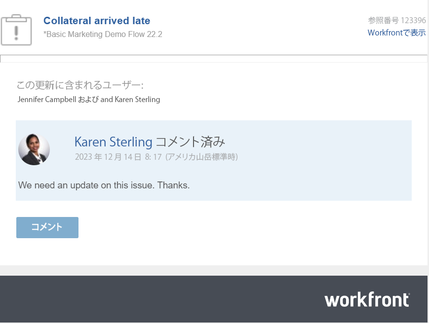

# メール通知への返信

メール通知の設定によっては、アクセス権のある特定のオブジェクトに対して更新が行われた際にメール通知を受信する場合があります。

メール通知から更新に返信する方法は次のとおりです。

* メール内の「コメント」ボタンを使用して、Workfront に戻り、アップデートエリアの更新に返信します。
* 受信したメールに返信します。返信メールは、元のコメントに対する Workfront の返信として追加されます。

>[!NOTE]
>
>クラスター 6 上の環境では、メールによる更新への返信を利用できません。

以下のオブジェクトに対するコメントから生成された Workfront メールに応答できます。

* プロジェクト
* タスク
* イシュー
* ドキュメント
* テンプレートとテンプレートタスク
* ポートフォリオ
* プログラム
* イテレーション
* タイムシート

## アクセス要件

この記事の手順を実行するには、次のアクセス権が必要です。

<table style="table-layout:auto">
 <col> 
 <col> 
 <tbody> 
  <tr> 
   <td role="rowheader"><strong>Adobe Workfront プラン*</strong></td> 
   <td> 
任意
 </td> 
  </tr> 
  <tr> 
   <td role="rowheader"><strong>Adobe Workfront ライセンス*</strong></td> 
   <td> 
イシューとドキュメントについてはリクエスト以上、その他のすべてのオブジェクトについてはレビュー以上
 </td> 
  </tr> 
  <tr> 
   <td role="rowheader"><strong>アクセスレベル設定*</strong></td> 
   <td> 
イシューおよびドキュメントに対して要求者以上、その他すべてのオブジェクトに対してレビュアー以上
 
<b>メモ</b>

まだアクセス権がない場合は、Workfront 管理者に問い合わせて、アクセスレベルに追加の制限が設定されているかどうかを確認してください。Workfront 管理者がアクセスレベルを変更する方法について詳しくは、<a href="../../administration-and-setup/add-users/configure-and-grant-access/create-modify-access-levels.md" class="MCXref xref">カスタムアクセスレベルの作成または変更</a>を参照してください。
 </td>
</tr> 
  <tr> 
   <td role="rowheader"><strong>オブジェクト権限</strong></td> 
   <td> 
オブジェクトに対する表示アクセス権
 
追加のアクセス権のリクエストについて詳しくは、<a href="../../workfront-basics/grant-and-request-access-to-objects/request-access.md" class="MCXref xref">オブジェクトへのアクセス権のリクエスト</a>を参照してください。
 </td> 
  </tr> 
 </tbody> 
</table>

## メール通知から更新に返信

メール通知を受け取ったら、メール通知から関連する Workfront オブジェクトをすばやく開き、応答を通信スレッドに直接追加できます。

1. Workfront の更新で生成されたメール通知を開きます。

   
1. メール通知から「**コメント**」をクリックします。

   オブジェクトの詳細ページが Workfront で開きます。

1. 返信を追加する更新に移動します。

   会話に積極的に関わっているユーザーを見る以外に、各返信でタグ付けされたユーザーをその更新スレッドの上部で確認できます。これらのユーザーは、オブジェクトに登録しているユーザーとともに、オブジェクトに対して更新または返信が行われるたびに通知を受信します。さらに多くのユーザーをタグ付けするには、[更新時に他のユーザーにタグ付け](../../workfront-basics/updating-work-items-and-viewing-updates/tag-others-on-updates.md)を参照してください。

1. 「**返信**」をクリックして返信を入力し、「**返信**」をクリックします。

   応答は、新しいコメントとしてコメントスレッドに追加されます。

## メール通知に返信してオブジェクトに更新を追加する

Workfront のメール通知を受け取った場合、Workfront にログインすることなく、通信スレッドに更新をすばやく追加できます。

>[!IMPORTANT]
>
>* メール通知に返信するには、少なくとも更新をトリガーしたオブジェクトを表示する権限が必要です。
>
>* 送信エラーを避けるには、Outlook ユーザーは返信を入力する前に既存のメールコンテンツを削除する必要があります。

Workfront メールに更新を追加するには、以下の手順を実行します。

1. メールアプリケーションから、返信先の Workfront メールを開き、元のメールから返信メールウィンドウを開きます。

   >[!NOTE]
   >
   >    他のユーザーから転送されたメール通知には返信できません。

1. メールの返信に更新内容を入力します。

   添付ファイルは許可されておらず、メール内の更新に適用されたリッチテキスト書式は、「更新」タブで表示された場合、更新に表示されません。
1. 「**送信**」をクリックします。

   更新が、オブジェクトの通信スレッドへの応答として追加されます。
