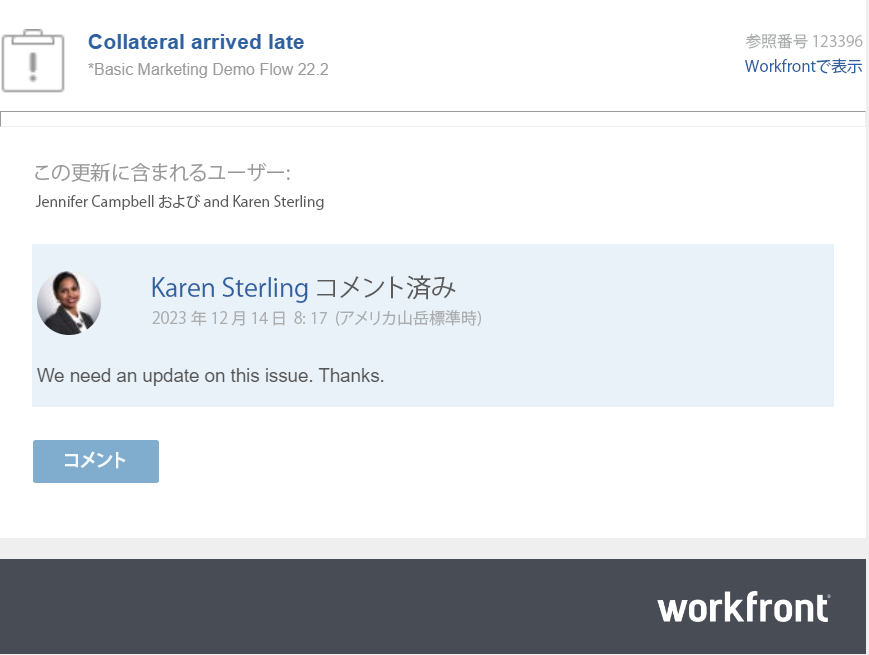

# 更新に返信する

<!--take "Beta" references out when we remove the beta-->

<!--The highlighted information on this page refers to functionality not yet generally available. It is available only in the Preview environment.-->

>[!NOTE]
>
>現在、Adobe Workfrontでのコメント作成エクスペリエンスの再設計中です。
>
>新しいコメントエクスペリエンスについて詳しくは、 [新しいコメントエクスペリエンス](../../product-announcements/betas/new-commenting-experience-beta/unified-commenting-experience.md).
>
>次のオブジェクトの新しいエクスペリエンスにアクセスできます。
> * コメントベータ版を有効にする際の問題。
   >
   >     この機能は、問題の「更新」セクションでのみ使用でき、次の領域では使用できません。
   >
   >     * ホーム
   >     * リストの概要パネル
   >     * タイムシートの概要パネル
>
> * 目標

   >
   >   新しいコメントエクスペリエンスが目標のデフォルトです。 Workfront Goals にアクセスするには、追加のライセンスが必要です。 詳しくは、 [Workfront目標の使用要件](../../workfront-goals/goal-management/access-needed-for-wf-goals.md).
   >
   >    目標のコメントについて詳しくは、 [Adobe Workfront目標で目標コメントを管理](../../workfront-goals/goal-management/manage-goal-comments.md).

誰かが作業オブジェクトのコメントやシステムの更新に返信すると、その返信がそのオブジェクトの [ 更新 ] セクションの通信スレッドに表示されます。

## アクセス要件

この記事の手順を実行するには、次のアクセス権が必要です。

<table style="table-layout:auto"> 
 <col> 
 <col> 
 <tbody> 
  <tr> 
   <td role="rowheader"><strong>Adobe Workfront plan*</strong></td> 
   <td> 
任意
 </td> 
  </tr> 
  <tr> 
   <td role="rowheader"><strong>Adobe Workfront license*</strong></td> 
   <td> 
問題およびドキュメントの要求以上その他のすべてのオブジェクトを確認するか、それ以上の値を設定します
 </td> 
  </tr> 
  <tr> 
   <td role="rowheader"><strong>アクセスレベル設定*</strong></td> 
   <td> 
問題およびドキュメントの要求者以上他のすべてのオブジェクトのレビュー担当者以上
 
<b>メモ</b>

まだアクセス権がない場合は、Workfront管理者に、アクセスレベルに追加の制限を設定しているかどうかを問い合わせてください。 Workfront管理者がアクセスレベルを変更する方法について詳しくは、 <a href="../../administration-and-setup/add-users/configure-and-grant-access/create-modify-access-levels.md" class="MCXref xref">カスタムアクセスレベルの作成または変更</a>.
 </td>
</tr> 
  <tr> 
   <td role="rowheader"><strong>オブジェクト権限</strong></td> 
   <td> 
オブジェクトへのアクセスの表示
 
追加のアクセス権のリクエストについて詳しくは、 <a href="../../workfront-basics/grant-and-request-access-to-objects/request-access.md" class="MCXref xref">オブジェクトへのアクセスのリクエスト </a>.
 </td> 
  </tr> 
 </tbody> 
</table>

&#42;保有しているプラン、ライセンスの種類、アクセス権を確認するには、Workfront管理者に問い合わせてください。

## 更新または返信に返信

コメントまたは返信への返信は、選択したエクスペリエンスとオブジェクトに応じて異なります。

### 現在の更新セクションの更新または返信に返信します

1. 返信を追加するオブジェクトに移動します。
1. の **更新** タブで、返信先の更新または返信を探します。

1. （オプション）既存の更新で画像を表示するには、次のいずれかの操作をおこないます。

   * 次をクリック： **プレビュー** アイコン  画像のサムネールで、フルサイズの画像を新しいブラウザータブで開きます。
   * 次をクリック： **ダウンロード** アイコン  を画像のサムネールにドラッグして、画像をダウンロードします。

1. クリック **返信** 更新時に、表示されるボックスに返信を入力します。

   会話に積極的に関わっているユーザーや、各返信にタグ付けされているユーザーが、その更新スレッドの上部に表示されます。 これらのユーザーは、オブジェクトを購読しているユーザーと共に、オブジェクトに対して更新または返信がおこなわれるたびに通知を受け取ります。 さらに多くのユーザーにタグを付けて、返信に含めることもできます。  さらに多くのユーザーにタグを付けるには、 [更新時の他のユーザーへのタグ付け](../../workfront-basics/updating-work-items-and-viewing-updates/tag-others-on-updates.md).

   
1. （オプション）返信に以前の更新のテキストを含めるには、 **詳細** 見積もりを行う更新または返信の横のメニューから、 **見積もりの返信**. 前の更新のテキストが入力領域に表示され、縦の灰色の線が付きます。
1. （オプション）記事の「Workfrontの更新でのリッチテキストの使用」の節で説明されているように、書式、絵文字、リンク、画像を使用します。 [作業を更新](../../workfront-basics/updating-work-items-and-viewing-updates/update-work.md).
1. クリック **返信** 返信を保存します。

### コメント作成ベータ版エクスペリエンスを使用する際にコメントに返信する

1. 返信を追加するオブジェクトに移動します。
1. クリック **更新**」、「 **コメント** タブをクリックし、返信先のコメントまたは返信を探します。
1. クリック **返信**.

   会話に積極的に関与しているユーザーがの下部に表示されます。 **新しいコメント** 」ボックスに追加して、不要なものを追加したり、削除したりできます。 これらのユーザーは、オブジェクトを購読しているユーザーと共に、オブジェクトに対して更新または返信がおこなわれるたびに通知を受け取ります。 さらに多くのユーザーにタグを付けて、返信に含めることもできます。  さらに多くのユーザーにタグを付けるには、 [更新時の他のユーザーへのタグ付け](../../workfront-basics/updating-work-items-and-viewing-updates/tag-others-on-updates.md).

1. 返信の入力を開始し、リッチテキストツールバーの追加のオプションを使用します。 リッチテキストなどの更新機能の使用について詳しくは、 [作業を更新](../updating-work-items-and-viewing-updates/update-work.md).

1. クリック **送信** 返信を保存します。

1. （オプション） **詳細** メニュー  をクリックし、返信を管理するその他のオプションを選択します。 詳しくは、 [作業を更新](../updating-work-items-and-viewing-updates/update-work.md).

## 電子メール通知で更新に返信

電子メール通知の設定によっては、アクセス権のある特定のオブジェクトに対して更新が行われた際に電子メール通知を受け取る場合があります。

>[!NOTE]
>
>クラスター 6 上の環境では、電子メールによる更新への返信を利用できません。

以下は、タスクの「更新」タブでの更新の結果としてトリガーされる電子メール通知の例です。

E メールから、Workfrontのオブジェクトの通信スレッドに直接返信を簡単に追加できます。 次のオブジェクトに対するコメントから生成された E メールに対して、Workfrontにログインせずに返信を追加することもできます。

* プロジェクト
* タスク
* 問題
* ドキュメント
* テンプレートとテンプレートタスク
* ポートフォリオ
* プログラム
* 反復
* タイムシート

### 電子メール通知から更新に返信

電子メール通知を受け取ったら、関連するWorkfrontオブジェクトをすばやく開き、応答を通信スレッドに直接追加できます。

1. クリック **コメント** 電子メール通知を受け取ります。

   オブジェクトの詳細ページがWorkfrontで開きます。

1. 返信を追加する更新に移動します。

   会話に積極的に関わっているユーザーを見る以外に、各返信でタグ付けされたユーザーをその更新スレッドの上部で確認できます。 これらのユーザーは、オブジェクトを購読しているユーザーと共に、オブジェクトに対して更新または返信がおこなわれるたびに通知を受け取ります。 さらに多くのユーザーにタグを付けるには、 [更新時の他のユーザーへのタグ付け](../../workfront-basics/updating-work-items-and-viewing-updates/tag-others-on-updates.md).

1. クリック **返信、** 返信を入力し、「 **返信**.

### Workfront以外のオブジェクトに更新を追加する

Workfrontの電子メール通知を受け取った場合、Workfrontにログインすることなく、通信スレッドに更新をすばやく追加できます。

Workfront E メールに更新を追加するには：

1. 電子メールアプリケーションから、返信先のWorkfront電子メールを開き、返信電子メールウィンドウを開きます。
1. 更新を入力します。\
   添付ファイルは許可されておらず、メール内の更新に適用されたリッチテキスト書式は、「更新」タブで表示された場合、更新に表示されません。
1. クリック **送信**.

   更新がオブジェクトの通信スレッドに追加されます。
