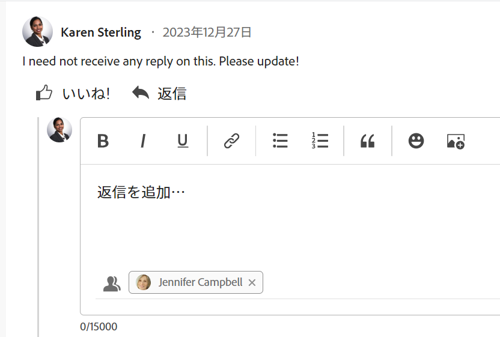

# 更新に返信する

{{highlighted-preview}}

<!--remove legacy and new experience references when we remove the legacy updates in the UI - Jan 2024???-->

<!--
The highlighted information on this page refers to functionality not yet generally available. It is available only in the Preview environment for all customers. After the monthly releases to Production, the same features are also available in the Production environment for customers who enabled fast releases.   
For information about fast releases, see [Enable or disable fast releases for your organization](../../administration-and-setup/set-up-workfront/configure-system-defaults/enable-fast-release-process.md)  

For information about the current release schedule, see [Fourth Quarter 2023 release overview](../../product-announcements/product-releases/23-q4-release-activity/23-q4-release-overview.md) 

-->

>[!IMPORTANT]
>
>現在アドビでは、Adobe Workfront のコメントエクスペリエンスを再設計しているところです。
>
>どのオブジェクトに対してコメント作成機能にアクセスするかに応じて、「更新」セクションに次の機能が表示されます。
>* 新しいエクスペリエンス
>* 従来のエクスペリエンス
>* 新しいエクスペリエンスと従来のエクスペリエンス
>
>新しいコメントエクスペリエンスとその可用性について詳しくは、 [新しいコメントエクスペリエンス](../../product-announcements/betas/new-commenting-experience-beta/unified-commenting-experience.md).
>
>新しいコメントエクスペリエンスは、Workfrontオブジェクトの「更新」セクションでのみ使用でき、次の領域からオブジェクトにアクセスする場合は使用できません。
>
> * ホーム
> * リストの概要パネル
> * タイムシートの概要パネル
> * ワークロードバランサーの概要パネル
>
>新しいコメントエクスペリエンスは、リスト、タイムシート、およびプレビュー環境のワークロードバランサーの [ 概要 ] パネルで使用できます。 <!--and in the Production environment for customers who have opted for the fast release process. For information about fast releases, see [Enable or disable fast releases for your organization](/help/quicksilver/administration-and-setup/set-up-workfront/configure-system-defaults/enable-fast-release-process.md). For information about the current release schedule, see [First Quarter 2024 release overview](/help/quicksilver/product-announcements/product-releases/24-q2-release-activity/24-q2-release-overview.md).-->

誰かが作業オブジェクトのコメントやシステムの更新に返信すると、その返信がそのオブジェクトの「更新」セクションの通信スレッドに表示されます。

>[!IMPORTANT]
>
>新しいコメントエクスペリエンスでは、システムの更新に返信できません。 詳しくは、[新しいコメント機能エクスペリエンス](../../product-announcements/betas/new-commenting-experience-beta/unified-commenting-experience.md)を参照してください。

<!--adjust the sentence before the second IMPORTANT and remove this important note when we remove legacy from the system-->

## アクセス要件

この記事の手順を実行するには、次のアクセス権が必要です。

<table style="table-layout:auto"> 
 <col> 
 <col> 
 <tbody> 
  <tr> 
   <td role="rowheader"><strong>Adobe Workfront プラン*</strong></td> 
   <td> 
任意
 </td> 
  </tr> 
  <tr> 
   <td role="rowheader"><strong>Adobe Workfront ライセンス*</strong></td> 
   <td> 
イシューとドキュメントについてはリクエスト以上、その他のすべてのオブジェクトについてはレビュー以上
 </td> 
  </tr> 
  <tr> 
   <td role="rowheader"><strong>アクセスレベル設定*</strong></td> 
   <td> 
イシューおよびドキュメントに対して要求者以上、その他すべてのオブジェクトに対してレビュアー以上
 
<b>メモ</b>

まだアクセス権がない場合は、Workfront 管理者に問い合わせて、アクセスレベルに追加の制限が設定されているかどうかを確認してください。Workfront 管理者がアクセスレベルを変更する方法について詳しくは、<a href="../../administration-and-setup/add-users/configure-and-grant-access/create-modify-access-levels.md" class="MCXref xref">カスタムアクセスレベルの作成または変更</a>を参照してください。
 </td>
</tr> 
  <tr> 
   <td role="rowheader"><strong>オブジェクト権限</strong></td> 
   <td> 
オブジェクトに対する表示アクセス権
 
追加のアクセス権のリクエストについて詳しくは、<a href="../../workfront-basics/grant-and-request-access-to-objects/request-access.md" class="MCXref xref">オブジェクトへのアクセス権のリクエスト</a>を参照してください。
 </td> 
  </tr> 
 </tbody> 
</table>

&#42;自分のプラン、ライセンスタイプ、アクセス権を確認するには、Workfront 管理者に問い合わせてください。

## Workfront での更新または返信に対する返信

表示できるオブジェクトのスレッド内のコメントに返信したり、Workfront 管理者またはグループ管理者としてログインし、別のユーザーの代わりにコメントに返信したりできます。詳しくは、[別のユーザーとしてログイン](../../administration-and-setup/add-users/create-and-manage-users/log-in-as-another-user.md)を参照してください。

コメントまたは返信への返信は、選択したエクスペリエンスとオブジェクトに応じて異なります。

### 新しいコメントエクスペリエンスを使用する際にコメントに返信

新しいコメント作成エクスペリエンスで使用可能な機能とオブジェクトについて詳しくは、 [新しいコメントエクスペリエンス](../../product-announcements/betas/new-commenting-experience-beta/unified-commenting-experience.md).

1. 返信を追加するオブジェクトに移動します。
1. クリック **更新**」、「 **コメント** タブをクリックし、返信先のコメントまたは返信を検索します。

   または

   次をクリック： **すべて** 「 」タブで、「 」をクリックします。 **コメントで返信** をクリックして「コメント」タブでコメントを開き、そのコメントに返信します。 「すべて」タブでは返信できません。

1. （オプション）返信に以前の更新のテキストを含めるには、 **その他** 返信先のコメントの右上隅にあるメニューで、 **見積もりの返信**. 以前の更新のテキストが入力エリアに表示され、灰色の縦線が付きます。
1. 「**返信**」をクリックします。

   

   会話に積極的に関与しているユーザーがの下部に表示されます。 **返信を追加…** 」ボックスに追加して、不要なものを追加したり、削除したりできます。 これらのユーザー、およびオブジェクトを購読しているユーザーは、オブジェクトに対して更新や返信が行われるたびに通知を受け取ります。さらに多くのユーザーをタグ付けして、返信に含めることもできます。さらに多くのユーザーをタグ付けするには、[更新時の他のユーザーへのタグ付け](../../workfront-basics/updating-work-items-and-viewing-updates/tag-others-on-updates.md)を参照してください。

   >[!TIP]
   >
   >   既存の返信に返信を追加する場合は、 **返信を追加…** ボックスを使用するか、 **返信** 元のコメントに対して。 返信はスレッドの最後に追加されます。

1. 返信の入力を開始し、リッチテキストツールバーの追加のオプションを使用します。リッチテキストなどの更新機能の使用について詳しくは、[作業を更新](../updating-work-items-and-viewing-updates/update-work.md)を参照してください。

1. 「**送信**」をクリックして返信を保存します。

1. （オプション） **その他** メニュー  返信先のコメントの右上隅に、返信を管理する他のオプションが表示されます。 詳しくは、[作業の更新](../updating-work-items-and-viewing-updates/update-work.md)を参照してください。

### 従来の更新セクションの更新または返信に返信します

1. 返信を追加するオブジェクトに移動します。
1. オブジェクトの「**更新**」タブで、返信する更新または返信を探します。

1. （オプション）既存の更新で画像を表示するには、次のいずれかの操作を実行します。

   * 画像のサムネールで&#x200B;**プレビュー**&#x200B;アイコン  をクリックして、フルサイズの画像を新しいブラウザータブで開きます。
   * 画像のサムネールで&#x200B;**ダウンロード**&#x200B;アイコン  をクリックして、画像をダウンロードします。

1. 更新で「**返信**」をクリックして、表示されるボックスに返信を入力します。

   会話に積極的に参加しているユーザーや各返信にタグ付けされているユーザーが、その更新スレッドの上部に表示されます。これらのユーザー、およびオブジェクトを購読しているユーザーは、オブジェクトに対して更新や返信が行われるたびに通知を受け取ります。さらに多くのユーザーをタグ付けして、返信に含めることもできます。さらに多くのユーザーをタグ付けするには、[更新時の他のユーザーへのタグ付け](../../workfront-basics/updating-work-items-and-viewing-updates/tag-others-on-updates.md)を参照してください。

   

1. （オプション）返信に以前の更新のテキストを含めるには、引用を行う更新または返信の横にある&#x200B;**その他**&#x200B;メニュー、「**引用返信**」の順にクリックします。以前の更新のテキストが入力エリアに表示され、灰色の縦線が付きます。
1. （オプション）[作業を更新](../../workfront-basics/updating-work-items-and-viewing-updates/update-work.md)記事内「Workfront の更新でのリッチテキストの使用」の節で説明されているように、リンクまたは画像を含む書式、絵文字を使用します。
1. 「**返信**」をクリックして、返信を保存します。

## メール通知から更新に返信

メール通知の設定によっては、アクセス権のある特定のオブジェクトに対して更新が行われた際にメール通知を受信する場合があります。

メール通知から更新に返信する方法は次のとおりです。

* 受信したメールに返信します。返信メールは、元のコメントに対する Workfront の返信として追加されます。
* メール内の「コメント」ボタンを使用して、Workfront に戻り、アップデートエリアの更新に返信します。

以下は、タスクの「更新」タブでの更新の結果としてトリガーされるメール通知の例です。

詳しくは、[メール通知に返信](../updating-work-items-and-viewing-updates/reply-to-email-notifications.md)を参照してください。

