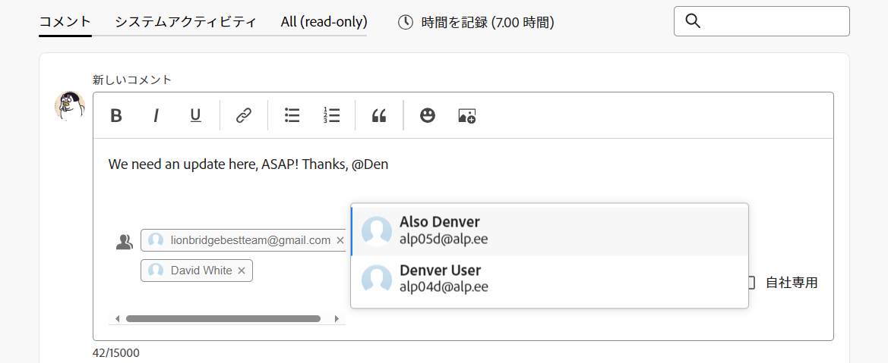
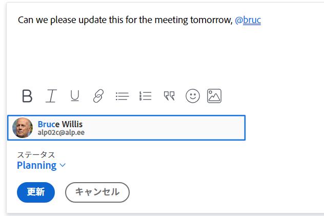
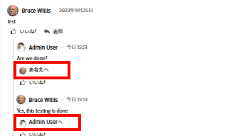

# 更新時の他のユーザーのタグ付け

<!--take new commenting and legacy commenting out when we remove the legacy commenting and the new one is the only experience-->

<!--

The highlighted information on this page refers to functionality not yet generally available. It is available only in the Preview environment for all customers. After the monthly releases to Production, the same features are also available in the Production environment for customers who enabled fast releases.   
For information about fast releases, see [Enable or disable fast releases for your organization](../../administration-and-setup/set-up-workfront/configure-system-defaults/enable-fast-release-process.md)  

For information about the current release schedule, see [Fourth Quarter 2023 release overview](../../product-announcements/product-releases/23-q4-release-activity/23-q4-release-overview.md) 
-->

>[!IMPORTANT]
>
>現在アドビでは、Adobe Workfront のコメントエクスペリエンスを再設計しているところです。
>
>どのオブジェクトに対してコメント作成機能にアクセスするかに応じて、「更新」セクションに次の機能が表示されます。
>* 新しいエクスペリエンス
>* 従来のエクスペリエンス
>* 新しいエクスペリエンスと従来のエクスペリエンス
>
>新しいコメントエクスペリエンスとその可用性について詳しくは、 [新しいコメントエクスペリエンス](../../product-announcements/betas/new-commenting-experience-beta/unified-commenting-experience.md).
>
>新しいコメントエクスペリエンスは、Workfrontオブジェクトの「更新」セクションでのみ使用でき、次の領域からオブジェクトにアクセスする場合は使用できません。
>
> * ホーム
> * リストの概要パネル
> * タイムシートの概要パネル
> * ワークロードバランサーの概要パネル

ユーザーが従わない可能性のあるオブジェクトに注意を向けたい場合は、オブジェクトの更新時にユーザーにタグを付けることができます。

オブジェクトにユーザー割り当てたり、登録させたりしてオブジェクトに含める代わりに、アップデート時にタグ付けすれば、オブジェクトを共有することができます。タグ付けられたユーザーは、アップデートに関する通知を受け取ります。

## 更新でのユーザーのタグ付けに関する考慮事項

* 更新のタグ付けされたユーザーが電子メール通知を受け取るには、プロファイルで個人通知を有効にする必要があります。 詳しくは、 [独自の電子メール通知を変更する](../../workfront-basics/using-notifications/activate-or-deactivate-your-own-event-notifications.md).

  アップデートを Workfront オブジェクトに追加する方法について詳しくは、[作業の更新](../../workfront-basics/updating-work-items-and-viewing-updates/update-work.md)を参照してください。

* イシューをプロジェクトやタスクに変換すると、アップデート内容は新しいプロジェクトやタスクにコピーされますが、タグ付けされたユーザーはコピーされません。会話を続けるには、参加者に再度タグを付ける必要があります。

## アクセス要件

この記事の手順を実行するには、次のアクセス権が必要です。

<table style="table-layout:auto"> 
 <col> 
 </col> 
 <col> 
 </col> 
 <tbody> 
  <tr> 
   <td role="rowheader"><strong>Adobe Workfront プラン*</strong></td> 
   <td> 
任意
 </td> 
  </tr> 
  <tr> 
   <td role="rowheader"><strong>Adobe Workfront ライセンス*</strong></td> 
   <td> 
イシューとドキュメントについてはリクエスト以上、その他のすべてのオブジェクトについてはレビュー以上
 </td> 
  </tr> 
  <tr> 
   <td role="rowheader"><strong>アクセスレベル設定*</strong></td> 
   <td> 
イシューおよびドキュメントに対して要求者以上、その他すべてのオブジェクトに対してレビュアー以上
 
   
<b>メモ</b>

まだアクセス権がない場合は、Workfront 管理者に問い合わせて、アクセスレベルに追加の制限が設定されているかどうかを確認してください。Workfront 管理者がアクセスレベルを変更する方法について詳しくは、<a href="../../administration-and-setup/add-users/configure-and-grant-access/create-modify-access-levels.md" class="MCXref xref">カスタムアクセスレベルの作成または変更</a>を参照してください。
 </td>
</tr> 
  <tr> 
   <td role="rowheader"><strong>オブジェクト権限</strong></td> 
   <td> 
オブジェクトに対する表示アクセス権
 
追加のアクセス権のリクエストについて詳しくは、<a href="../../workfront-basics/grant-and-request-access-to-objects/request-access.md" class="MCXref xref">オブジェクトへのアクセス権のリクエスト</a>を参照してください。
 </td> 
  </tr> 
 </tbody> 
</table>

*保有するプラン、ライセンスタイプまたはアクセス権を確認するには、Workfront 管理者にお問い合わせください。

## 更新時の他のユーザーのタグ付け

アップデートで他のユーザーにタグ付けする方法は、選択するエクスペリエンスとオブジェクトに応じて異なります。

### 新しいコメントエクスペリエンスの更新時に他のユーザーにタグ付けする

新しいコメントエクスペリエンスの更新では、次の方法で他のユーザーにタグ付けできます。

* **自動**：ユーザーがスレッドを開始したり、コメントを追加したり、返信を追加したりすると、自動的にタグ付けされ、コメントボックスの「ユーザーにタグ付け」領域または「チームに追加」領域に追加されます。 <!--remove the tip below when the new commenting stream is the only stream and the legacy commenting is removed-->

  >[!TIP]
  >
  >従来のコメント作成エクスペリエンスでスレッドが開始した場合、スレッド参加者は自動的にタグ付けされません。

* **手動**：ユーザーを手動でコメントボックスの「人物またはチームにタグ付け」エリアに追加します。

また、コメントの編集時やコメントへの返信時に誤ってタグ付けされたユーザーを削除することもできます。

1. [作業の更新](../../workfront-basics/updating-work-items-and-viewing-updates/update-work.md)の説明に従って、作業項目の更新を開始します。コメントの所有者は自動的にタグ付けされ、コメントボックスの「人物またはチームにタグ付け」エリアに追加されます。

   >[!TIP]
   >
   >コメントの所有者は、コメントボックスの「人物またはチームにタグ付け」エリアで自分の名前を確認できません。

1. 「**人物またはチームにタグ付け**」フィールドで、追加するユーザーまたはチームの名前の入力を開始し、名前がドロップダウンリストに表示されたらクリックします。

   または

   「**コメントを記入**」エリアに @ 記号を入力して、更新に含めるユーザーまたはチームの名前の入力を開始し、ドロップダウンリストに名前が表示されたらクリックします。

   >[!TIP]
   > 
   >類似または同一の名前を持つユーザーが複数いる場合に正しいユーザーを識別するには、アバター、ユーザーのプライマリの役割、またはメールアドレスに注意します。
   > 
   >更新でタグ付けする際にユーザーを表示するには、ユーザーを少なくとも 1 つの担当業務に関連付ける必要があります。
   > 
   >ユーザーがユーザーのメールを表示するには、アクセスレベルで、連絡情報の表示の設定を有効にしておく必要があります。詳しくは、[ユーザーへのアクセス権の付与](../../administration-and-setup/add-users/configure-and-grant-access/grant-access-other-users.md)を参照してください。

   

1. （オプション）更新を非公開にするには、更新ボックスの右下隅にある「**社外秘**」を有効にします。これにより、更新が社内ユーザーのみに表示されるようになります。「**社外秘**」オプションは、Workfront プロファイルで会社が指定されている場合にのみ使用できます。

   >[!NOTE]
   >
   >* このオプションは、ユーザーが会社に関連付けられている場合にのみ表示されます。
   >* タグ付けされた社外のユーザーは、「更新」タブに非公開コメントは表示されませんが、アプリ内通知やメールを引き続き受け取ることができます。情報を共有したくない場合は、更新で外部ユーザーにタグ付けしないことをお勧めします。

1. （オプション）複数のユーザーやチームを追加するには、手順 2 を繰り返します。<!--insure this stays accurate-->

   >[!NOTE]
   >
   >「人物またはチームにタグ付け」フィールドに一覧表示されるすべてのユーザーとチームメンバーは、更新のアプリ内通知を受け取り、メール通知設定に応じてはメールを受け取る場合があります。コメントや返信で自分にタグ付けしたユーザーは、そのコメントや返信に関する通知を受け取り、スレッドの残りについてはそのスレッドのメンバーとしてリストに名前が表示されますが、自分にタグ付けし直さない限り、別の通知を受け取りません。詳しくは、 [独自の電子メール通知を変更する](../../workfront-basics/using-notifications/activate-or-deactivate-your-own-event-notifications.md) および [システムの全員に対するイベント通知を設定する](../../administration-and-setup/manage-workfront/emails/configure-event-notifications-for-everyone-in-the-system.md).

1. 「**送信**」をクリックします。\
   更新に含まれるユーザーには、オブジェクトに対する表示権限が自動的に付与され、オブジェクトに対する更新の表示と応答が可能になります。

   タグ付きエンティティの名前は、アバターの横に、最大 2 つのエンティティまで表示されます。 3 つ以上のエンティティがタグ付けされている場合、最初のエンティティの名前が表示され、さらにタグ付けされたエンティティの数も表示されます。

   

   作業項目の更新時に使用できる追加機能について詳しくは、[作業の更新](../../workfront-basics/updating-work-items-and-viewing-updates/update-work.md)を参照してください。

1. （オプション） **その他** メニュー  コメントの右上隅で、 **編集**. タグ付きユーザーを削除し、続いて「**送信**」をクリックします。コメントは入力後 15 分以内にのみ編集できます。編集できるのは、自分が追加したコメントだけです。

   >[!TIP]
   >
   >従来のコメント作成機能を使用してコメントや返信を追加する場合、特にタグ付けされていないコメントの所有者は、新しいコメント作成機能を使用するユーザーによって手動で削除することはできません。

### 「従来の更新」セクションの更新に関する他のユーザーのタグ付け

「従来の更新」セクションでは、ユーザーに手動でタグ付けできます。

1. [作業の更新](../../workfront-basics/updating-work-items-and-viewing-updates/update-work.md)の説明に従って、作業項目の更新を開始します。
1. **通知**&#x200B;フィールドに含めるユーザーまたはチームの名前を入力し、名前がドロップダウンリストに表示されたらクリックします。

   または

   「**新しい更新を開始**」エリアに @ 記号を入力して、更新に含めるユーザーまたはチームの名前の入力を開始し、ドロップダウンリストに名前が表示されたらクリックします。

   >[!TIP]
   >
   >類似または同一の名前を持つユーザーが複数いる場合に正しいユーザーを識別するには、アバター、ユーザーのプライマリの役割、またはメールアドレスに注意します。
   >
   >更新でタグ付けする際にユーザーを表示するには、ユーザーを少なくとも 1 つの担当業務に関連付ける必要があります。
   >
   >ユーザーがユーザーのメールを表示するには、アクセスレベルで、連絡情報の表示の設定を有効にしておく必要があります。詳しくは、[ユーザーへのアクセス権の付与](../../administration-and-setup/add-users/configure-and-grant-access/grant-access-other-users.md)を参照してください。

   

1. （オプション）更新を非公開にするには、更新ボックスの右下隅にある「**社外秘**」を有効にします。これにより、更新が社内ユーザーのみに表示されるようになります。「**社外秘**」オプションは、Workfront プロファイルで会社が指定されている場合にのみ使用できます。

   >[!NOTE]
   >
   >タグ付けされた社外のユーザーは、「更新」タブに非公開コメントは表示されませんが、アプリ内通知やメールを引き続き受け取ることができます。情報を共有したくない場合は、更新で外部ユーザーにタグ付けしないことをお勧めします。

1. （オプション）複数のユーザーやチームを追加するには、手順 2 を繰り返します。

   >[!NOTE]
   >
   >「通知」フィールドに一覧表示されるすべてのユーザーとチームメンバーは、更新のアプリ内通知を受け取り、メール通知設定に応じてはメールを受け取る場合があります。コメントや返信で自分にタグ付けしたユーザーは、そのコメントや返信に関する通知を受け取り、スレッドの残りについては「通知」フィールドに自分の名前が表示されますが、自分自身にタグ付けし直さない限り、通知を再度受け取ることはありません。詳しくは、 [独自の電子メール通知を変更する](../../workfront-basics/using-notifications/activate-or-deactivate-your-own-event-notifications.md) および [システムの全員に対するイベント通知を設定する](../../administration-and-setup/manage-workfront/emails/configure-event-notifications-for-everyone-in-the-system.md).

1. 「**更新**」をクリックします。\
   更新に含まれるユーザーには、オブジェクトに対する表示権限が自動的に付与され、オブジェクトに対する更新の表示と応答が可能になります。

   更新スレッドの最上部で、各返信にタグ付けされたユーザーを確認できます。これらのユーザー、およびオブジェクトを購読しているユーザーは、オブジェクトに対して更新や返信が行われるたびに通知を受け取ります。

   

   作業項目の更新時に使用できる追加機能について詳しくは、[作業の更新](../../workfront-basics/updating-work-items-and-viewing-updates/update-work.md)を参照してください。

