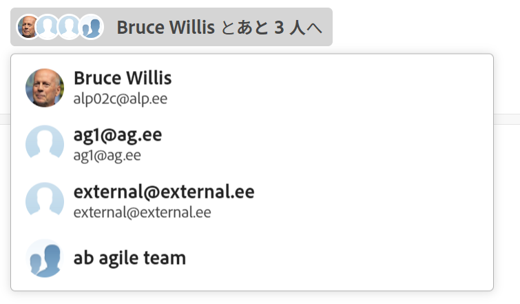

# 更新時の他のユーザーのタグ付け

<!--Audited: April, 2024-->

<!--
>[!IMPORTANT]
>
>We are currently redesigning the commenting experience in Adobe Workfront.
>
>Depending on what objects you access the commenting experience for, you might see the following functionality for the Updates section:
>* The new experience
>* The legacy experience
>* The new and the legacy experience
>
>For more information about the new commenting experience and its availability, see [New commenting experience](../../product-announcements/betas/new-commenting-experience-beta/unified-commenting-experience.md). 
>
> The legacy commenting experience has been removed from projects, tasks, issues, and documents in the Preview environment. 
>
>The new commenting experience is available only for the Updates section of Workfront objects, and it is not available when you access updates from the following areas:
>
> * Home
> * Summary panel in lists
> * Summary panel in timesheets 
> * Summary panel in the Workload Balancer
>
>The new commenting experience is available in the Summary panel in lists, timesheets, and the Workload Balancer in the Preview environment and in the Production environment for customers who have opted for the fast release process.  
-->

ユーザーがフォローしない可能性のあるオブジェクトにユーザーの注意を引きたい場合は、オブジェクトをアップデートする際にユーザーにタグを付けることができます。

オブジェクトにユーザー割り当てたり、登録させたりしてオブジェクトに含める代わりに、アップデート時にタグ付けすれば、オブジェクトを共有することができます。タグ付けされたユーザーには、入力した更新に関するWorkfront通知が届きます。 通知設定に応じて、入力した更新に関するメールも送信されます。

## アップデートでのユーザーのタグ付けに関する考慮事項

* アップデートにタグ付けされたユーザーがメール通知を受信するには、プロファイルで個人通知を有効にしている必要があります。詳しくは、[自身のメール通知の変更](../../workfront-basics/using-notifications/activate-or-deactivate-your-own-event-notifications.md)を参照してください。

  アップデートを Workfront オブジェクトに追加する方法について詳しくは、[作業の更新](../../workfront-basics/updating-work-items-and-viewing-updates/update-work.md)を参照してください。

* イシューをプロジェクトやタスクに変換すると、アップデート内容は新しいプロジェクトやタスクにコピーされますが、タグ付けされたユーザーはコピーされません。会話を続けるには、参加者に再度タグを付ける必要があります。

## アクセス要件

この記事の手順を実行するには、次のアクセス権が必要です。

<table style="table-layout:auto">
 <col> 
 <col> 
 <tbody> 
  <tr> 
   <td role="rowheader"><strong>Adobe Workfront プラン</strong></td> 
   <td> 
任意
 </td> 
  </tr> 
  <tr> 
   <td role="rowheader"><strong>Adobe Workfront プラン*</strong></td> 
   <td> 
新規：イシューとドキュメントにはコントリビューター以上、その他のすべてのオブジェクトにはライト以上

   
現在：イシューとドキュメントについてはリクエスト以上、その他のすべてのオブジェクトについてはレビュー以上
 </td> 
  </tr> 
  <tr> 
   <td role="rowheader"><strong>アクセスレベル設定</strong></td> 
   <td> 
返信を投稿するオブジェクトへの表示以上のアクセス
 </td> 
  </tr> 
  <tr> 
   <td role="rowheader"><strong>オブジェクト権限</strong></td> 
   <td> 
返信を投稿するオブジェクトに対する以上の権限を表示します
 </td> 
  </tr> 
 </tbody> 
</table>

*ご利用のプラン、ライセンスタイプまたはアクセス権を確認するには、Workfront 管理者にお問い合わせください。詳しくは、[Workfront ドキュメントのアクセス要件](/help/quicksilver/administration-and-setup/add-users/access-levels-and-object-permissions/access-level-requirements-in-documentation.md)を参照してください。

## 更新時の他のユーザーのタグ付け

次の方法で、更新で他のユーザーにタグ付けできます。

* **自動**：ユーザーがスレッドを開始したり、コメントを追加したり、返信を追加したりすると、ユーザーは自動的にタグ付けされ、コメントボックスの人物またはチームにタグ付け領域に追加されます。
* **手動**：ユーザーを手動でコメントボックスの「人物またはチームにタグ付け」エリアに追加します。

また、コメントの編集時やコメントへの返信時に誤ってタグ付けされたユーザーを削除することもできます。

1. [作業の更新](../../workfront-basics/updating-work-items-and-viewing-updates/update-work.md)の説明に従って、作業項目の更新を開始します。コメントの所有者は自動的にタグ付けされ、コメントボックスの「人物またはチームにタグ付け」エリアに追加されます。

   >[!TIP]
   >
   >コメントの所有者は、コメントボックスの「人物またはチームにタグ付け」エリアで自分の名前を確認できません。

1. 「**人物またはチームにタグ付け**」フィールドで、追加するユーザーまたはチームの名前の入力を開始し、名前がドロップダウンリストに表示されたらクリックします。

   または

   「**コメントを記入**」エリアに @ 記号を入力して、更新に含めるユーザーまたはチームの名前の入力を開始し、ドロップダウンリストに名前が表示されたらクリックします。

   >[!TIP]
   > 
   >類似または同一の名前を持つユーザーが複数いる場合に正しいユーザーを識別するには、アバター、ユーザーのプライマリの役割、またはメールアドレスに注意します。
   > 
   >更新でタグ付けする際にユーザーを表示するには、ユーザーを少なくとも 1 つの担当業務に関連付ける必要があります。
   > 
   >ユーザーがユーザーのメールを表示するには、アクセスレベルで、連絡情報の表示の設定を有効にしておく必要があります。詳しくは、[ユーザーへのアクセス権の付与](../../administration-and-setup/add-users/configure-and-grant-access/grant-access-other-users.md)を参照してください。

   

1. （オプション）更新を非公開にするには、更新ボックスの右下隅にある「**社外秘**」を有効にします。これにより、更新が社内ユーザーのみに表示されるようになります。「**社外秘**」オプションは、Workfront プロファイルで会社が指定されている場合にのみ使用できます。

   >[!NOTE]
   >
   >* このオプションは、ユーザーが会社に関連付けられている場合にのみ表示されます。
   >* タグ付けされた社外のユーザーは、「更新」タブに非公開コメントは表示されませんが、アプリ内通知やメールを引き続き受け取ることができます。情報を共有したくない場合は、更新で外部ユーザーにタグ付けしないことをお勧めします。

1. （オプション）複数のユーザーやチームを追加するには、手順 2 を繰り返します。<!--insure this stays accurate-->

   >[!NOTE]
   >
   >「人物またはチームにタグ付け」フィールドに一覧表示されるすべてのユーザーとチームメンバーは、更新のアプリ内通知を受け取り、メール通知設定に応じてはメールを受け取る場合があります。コメントや返信で自分にタグ付けしたユーザーは、そのコメントや返信に関する通知を受け取り、スレッドの残りについてはそのスレッドのメンバーとしてリストに名前が表示されますが、自分にタグ付けし直さない限り、別の通知を受け取りません。詳しくは、[自身のメール通知の変更](../../workfront-basics/using-notifications/activate-or-deactivate-your-own-event-notifications.md)や[システムの全ユーザーに対するイベント通知の設定](../../administration-and-setup/manage-workfront/emails/configure-event-notifications-for-everyone-in-the-system.md)を参照してください。

1. 「**送信**」をクリックします。\
   更新に含まれるユーザーには、オブジェクトに対する表示権限が自動的に付与され、オブジェクトに対する更新の表示と応答が可能になります。

   タグ付きエンティティの名前が、アバターの横に最大 2 つのエンティティまで表示されます。3 つ以上のエンティティがタグ付けされている場合は、最初のエンティティの名前に加えて、タグ付けされている追加のエンティティの数が表示されます。

   

   コメントテキストでタグ付けされている場合、そのコメント内で自分の名前がハイライト表示されます。

   作業項目の更新時に使用できる追加機能について詳しくは、[作業の更新](../../workfront-basics/updating-work-items-and-viewing-updates/update-work.md)を参照してください。

1. （オプション）コメントの右上隅にある&#x200B;**その他**&#x200B;メニュー  をクリックしたあと、「**編集**」をクリックします。タグ付けされたユーザーを削除して、「**送信**」をクリックします。

   >[!IMPORTANT]
   >
   >コメントは入力後 15 分以内にのみ編集できます。編集できるのは、自分が追加したコメントだけです。

<!--
   >[!TIP]
   >
   >When using the legacy commenting experience to add comments and replies, comment owners that were not specifically tagged cannot be manually removed by people who use the new commenting experience.
-->

<!--
### Tag others on updates in the legacy Updates section

You can manually tag users in the legacy Updates section. 

1. Begin updating a work item, as described in [Update work](../../workfront-basics/updating-work-items-and-viewing-updates/update-work.md).
1. In the **Notify** field, begin typing the name of the user or team you want to include, then click the name when it appears in the drop-down list.

   Or

   Type the @ symbol in the **Start a new update** area, begin typing the name of the user or team you want to include on the update, then click the name when it appears in the drop-down list.

   >[!TIP]
   >
   >To identify the correct user when there are users with similar or identical names, notice the avatar, the user's Primary Role, or their email address. 
   >
   >Users must be associated with at least one job role to view it as you tag them in an update. 
   >
   >You must have the View Contact Info setting enabled in your access level for Users to view users' emails. For information, see [Grant access to users](../../administration-and-setup/add-users/configure-and-grant-access/grant-access-other-users.md).

   

1. (Optional) To make the update private, enable **Private to my company** in the lower-right corner of the update box. This makes the update visible just to users in your company. The **Private to my company** option is available only when a Company is specified in your Workfront profile. 

   >[!NOTE]
   >
   >Tagged users outside the company could still receive an in-app notification or email, even though they will not see the private comments on the Updates tab. We recommend not to tag external users on an update if you do not want to share the information with them.  

1. (Optional) To add multiple users and teams, repeat step 2.

   >[!NOTE]
   >
   >All users and team members listed in the Notify field receive an in-app notification for the update and might receive an email, depending on the configuration of their email notification settings. Users who tag themselves in a comment or reply receive a notification for that comment or reply and can see their name in the Notify field for the remainder of the thread, but they do not receive another notification unless they tag themselves again. For more information, see [Modify your own email notifications](../../workfront-basics/using-notifications/activate-or-deactivate-your-own-event-notifications.md) and [Configure event notifications for everyone in the system](../../administration-and-setup/manage-workfront/emails/configure-event-notifications-for-everyone-in-the-system.md).

1. Click **Update**.  
   Users included in the update are automatically granted View permission to the object and can view and respond to updates made to the object.

   You can see who has been tagged in each reply at the top of the update thread. These users, along with any users subscribed to the object, receive a notification whenever an update or reply is made on the object.

   
-->

作業項目の更新時に使用できる追加機能について詳しくは、[作業の更新](../../workfront-basics/updating-work-items-and-viewing-updates/update-work.md)を参照してください。

