# 作業を更新

<!--for the August 10 release: look for these words to see the edits: "August 10"-->

<!--take "Beta" references out when we remove the beta-->

<!--The highlighted information on this page refers to functionality not yet generally available. It is available for all customers only in the Preview environment.-->

>[!NOTE]
>
>現在、Adobe Workfrontでのコメント作成エクスペリエンスの再設計中です。
>
>新しいコメントエクスペリエンスについて詳しくは、 [新しいコメントエクスペリエンス](../../product-announcements/betas/new-commenting-experience-beta/unified-commenting-experience.md).
>
>次のオブジェクトの新しいエクスペリエンスにアクセスできます。
> * イシュー、プロジェクト、タスク、およびドキュメント。
>
>     これは、コメント作成ベータ版のエクスペリエンスを有効にした場合に使用できます。
>
>     この機能は、「更新」セクションでのみ使用でき、次の領域では使用できません。
>
>     * ホーム
>     * リスト内の概要パネル
>     * タイムシートの [ 概要 ] パネル
>
> * 目標、ボード領域のカード
>
>   新しいコメントエクスペリエンスは、目標とカードの唯一のエクスペリエンスです。 Workfront Goals にアクセスするには、追加のライセンスが必要です。 詳しくは、 [Workfront目標の使用要件](../../workfront-goals/goal-management/access-needed-for-wf-goals.md).
>
>     カードの「コメント」セクションと「システムアクティビティ」セクションを有効にすると、「ボード」領域でカードの更新を追加し、表示することができます。 詳しくは、 [ボードへのアドホックカードの追加](../../agile/get-started-with-boards/add-card-to-board.md).

## 作業の更新に関する考慮事項

* 「更新」セクションのAdobe Workfrontのほとんどのオブジェクトにコメントを追加できます。 更新セクションを表示するオブジェクトの詳細については、 [アップデートセクションの概要](../updating-work-items-and-viewing-updates/updates-tab-overview.md).

* Workfrontと統合されている他のアプリケーションやWorkfrontモバイルアプリから、Workfrontオブジェクトにコメントを追加できます。

  Workfrontと統合されているすべてのアプリケーションに、Workfrontオブジェクトにコメントを追加する機能があるわけではありません。

  WorkfrontのオブジェクトからWorkfrontオブジェクトにアクセスする場合、アプリケーションの「更新」セクションで使用できる機能の一部が他のアプリケーションで使用できるわけではありません。 例えば、リッチテキスト機能や、コメントを会社の非公開にする場合は、サードパーティのアプリケーションからWorkfrontオブジェクトにコメントを追加する際に、使用できない可能性があります。

* オブジェクトにコメントを付ける際に、Workfrontオブジェクト（プロジェクト、タスクまたはイシュー）の進捗状況を伝えることができます。 オブジェクトを割り当てられた、またはサブスクライブしたユーザーは、更新に関する通知を受け取ることができます。 オブジェクトへの表示アクセス権を持つユーザーは誰でも、更新を表示できます。

* ユーザーにタグを付けて、更新に注意を向けることができます。 タグ付きユーザーには、アプリ内通知と更新に関する電子メールが送信されます。

  >[!TIP]
  >
  >   新しいコメントエクスペリエンスでは、コメントの所有者は自動的にタグ付けされます。 詳しくは、 [更新時の他のユーザーへのタグ付け](../../workfront-basics/updating-work-items-and-viewing-updates/tag-others-on-updates.md).
  <!--take the "in the new commenting experience" out when this is the only experience-->

* 表示可能なオブジェクトにコメントを追加したり、Workfrontまたはグループ管理者としてログインして、別のユーザーの代わりにコメントを追加したりできます。 詳しくは、 [別のユーザーとしてログイン](../../administration-and-setup/add-users/create-and-manage-users/log-in-as-another-user.md).

* Workfrontの次の領域で、プロジェクト、タスクおよびイシューに更新を追加できます。

   * Workfrontオブジェクトの「更新」セクションで、
   * 「ホーム」領域から（タスクおよび問題に関する）
   * オブジェクトの一覧の [ 概要 ] パネル、またはタイムシート（タスクと問題の場合）から

このページの情報では、Workfrontオブジェクトに対するコメントの作成方法と、プロジェクト、タスクおよび問題の更新方法について説明します。

目標のコメントについて詳しくは、 [Adobe Workfront目標で目標コメントを管理](../../workfront-goals/goal-management/manage-goal-comments.md). Workfront Goals にアクセスするには、追加のライセンスが必要です。

ボード領域でのカードのコメントについて詳しくは、 [ボードへのアドホックカードの追加](../../agile/get-started-with-boards/add-card-to-board.md).

## アクセス要件

<!--
drafted for P&P release:
<table style="table-layout:auto"> 
 <col> 
 </col> 
 <col> 
 </col> 
 <tbody> 
  <tr> 
   <td role="rowheader"><strong>Adobe Workfront plan*</strong></td> 
   <td> 
Any
 </td> 
  </tr> 
  <tr> 
   <td role="rowheader"><strong>Adobe Workfront license*</strong></td> 
   <td> 
Current license: Contributor or higher for issues and documents: Light or higher for all other objects
 
   Or
   
Legacy  license: Request or higher for issues and documents; Review or higher for all other objects

   </td> 
  </tr> 
  <tr> 
   <td role="rowheader"><strong>Access level configurations*</strong></td> 
   <td> 
View or Edit access for the object the update is on
 
<b>NOTE</b>
   
   If you still don't have access, ask your Workfront administrator if they set additional restrictions in your access level. For information on how a Workfront administrator can modify your access level, see <a href="../../administration-and-setup/add-users/configure-and-grant-access/create-modify-access-levels.md" class="MCXref xref">Create or modify custom access levels</a>.
 </td> 
  </tr> 
  <tr> 
   <td role="rowheader"><strong>Object permissions</strong></td> 
   <td> 
View access to the object
 
For information on requesting additional access, see <a href="../../workfront-basics/grant-and-request-access-to-objects/request-access.md" class="MCXref xref">Request access to objects </a>.
 </td> 
  </tr> 
 </tbody> 
</table>
-->
この記事の手順を実行するには、次のアクセス権が必要です。

<table style="table-layout:auto"> 
 <col> 
 </col> 
 <col> 
 </col> 
 <tbody> 
  <tr> 
   <td role="rowheader"><strong>Adobe Workfront plan*</strong></td> 
   <td> 
任意
 </td> 
  </tr> 
  <tr> 
   <td role="rowheader"><strong>Adobe Workfront license*</strong></td> 
   <td> 
問題およびドキュメントに対する要求以上、その他のすべてのオブジェクトに対する確認以上
 </td> 
  </tr> 
  <tr> 
   <td role="rowheader"><strong>アクセスレベル設定*</strong></td> 
   <td> 
更新先のオブジェクトのアクセスを表示または編集
 
<b>メモ</b>

まだアクセス権がない場合は、Workfront管理者に、アクセスレベルに追加の制限を設定しているかどうかを問い合わせてください。 Workfront管理者がアクセスレベルを変更する方法について詳しくは、 <a href="../../administration-and-setup/add-users/configure-and-grant-access/create-modify-access-levels.md" class="MCXref xref">カスタムアクセスレベルの作成または変更</a>.
 </td>
</tr> 
  <tr> 
   <td role="rowheader"><strong>オブジェクトの権限</strong></td> 
   <td> 
オブジェクトへのアクセスの表示
 
追加のアクセス権のリクエストについて詳しくは、 <a href="../../workfront-basics/grant-and-request-access-to-objects/request-access.md" class="MCXref xref">オブジェクトへのアクセスのリクエスト </a>.
 </td> 
  </tr> 
 </tbody> 
</table>

&#42;保有するプラン、ライセンスの種類、アクセス権を確認するには、Workfront管理者に問い合わせてください。

## 作業項目に更新を追加する

<!--drafted for the commenting experience - change the NOTE at the top of the following section with every new release to other objects -->

作業項目に更新を追加する方法は、[ 更新 ] セクションのバージョンと選択したオブジェクトによって異なります。

### 現在の更新セクションの作業項目に更新を追加する

>[!NOTE]
>
>次の機能は、目標とカードを除くすべてのオブジェクトで使用できます。 Workfront Goals にアクセスするには、追加のライセンスが必要です。 目標のコメントについて詳しくは、 [Adobe Workfront目標で目標コメントを管理](../../workfront-goals/goal-management/manage-goal-comments.md).
>
>カードの「コメント」セクションと「システムアクティビティ」セクションを有効にすると、「ボード」領域でカードの更新を追加し、表示することができます。 詳しくは、 [ボードへのアドホックカードの追加](../../agile/get-started-with-boards/add-card-to-board.md).

1. 更新を行う作業項目（プロジェクト、タスク、タスクなど）に移動します。
1. 次をクリック： **更新** 」セクションに入力します。
1. クリック **新しい更新を開始し、** 次に、更新を入力します。
1. （オプション）リッチテキストを使用するか、更新に絵文字、リンク、画像を追加して、コンテンツを拡張します。 詳しくは、 [Workfrontの更新でのリッチテキストの使用](#use-rich-text-in-a-workfront-update) 」の節を参照してください。
1. （オプション）作業項目に関する次の情報を更新します。

   <table style="table-layout:auto"> 
    <col> 
    <col> 
    <tbody> 
     <tr> 
      <td role="rowheader"><strong>通知 </strong></td> 
      <td>更新の通知を受け取る必要があるユーザーを特定します。 オブジェクトに割り当てられた、またはサブスクライブされたユーザーは、更新がおこなわれると、自動的に通知を受け取ります。 
更新に他のユーザーを含める方法について詳しくは、 <a href="../../workfront-basics/updating-work-items-and-viewing-updates/tag-others-on-updates.md" class="MCXref xref">更新時の他のユーザーへのタグ付け</a>.
</td> 
     </tr> 
     <tr> 
      <td role="rowheader"><strong>コミット日</strong></td> 
      <td>日付選択で、作業項目を完了するためにコミットする日付を選択します。 コミット日の詳細は、 <a href="../../manage-work/projects/updating-work-in-a-project/overview-of-commit-dates.md" class="MCXref xref">コミット日の概要</a>.</td> 
     </tr> 
     <tr> 
      <td role="rowheader"><strong>状況</strong></td> 
      <td>タスクまたはタスクの新しい条件を選択します。 条件の選択について詳しくは、 <a href="../../manage-work/projects/updating-work-in-a-project/update-condition-for-tasks-and-issues.md" class="MCXref xref">タスクおよび問題の条件を更新</a>.</td> 
     </tr> 
     <tr> 
      <td role="rowheader"><strong>ステータス</strong></td> 
      <td>現在のステータスの横にある矢印をクリックし、ドロップダウンメニューから目的のステータスを選択します。 ステータスの設定について詳しくは、 <a href="../../manage-work/projects/updating-work-in-a-project/update-task-status.md" class="MCXref xref">タスクステータスを更新</a>.
作業項目のステータスを更新しても、プロジェクトのステータスは自動的には変更されません。 プロジェクトの設定に応じて、プロジェクトのステータスを個別に更新できます。 様々なプロジェクト更新タイプの詳細については、 <a href="../../manage-work/projects/manage-projects/select-project-update-type.md" class="MCXref xref">プロジェクトの更新タイプを選択 </a>.

<b>メモ</b>

   作業項目のステータスが「承認待ち」の場合は、ステータスを変更できません。
</td>
   </tr> 
     <tr> 
      <td role="rowheader"><strong>完了バー</strong></td> 
      <td>（タスクでのみ使用可能）進行状況バーを目的の割合にスライドして、完了した作業の割合を示します。 完了バーをダブルクリックして、完了率を入力することもできます。</td> 
     </tr> 
     <tr> 
      <td role="rowheader"><strong>社外秘</strong></td> 
      <td> 
このオプションを無効にすると、会社外のユーザーがこの更新を表示する権限を持たなくなります。
 
      
<b>メモ</b>

      
このオプションは、ユーザーが会社に関連付けられている場合にのみ表示されます。

      </td> 
     </tr> 
    </tbody> 
   </table>

1. クリック **更新** をクリックして、Workfrontオブジェクトに更新を追加します。

   >[!NOTE]
   >
   >クリック後 7 秒間、小さなポップアップウィンドウが表示されます **更新**&#x200B;を使用すると、更新を取り消し、更新が投稿される前に編集ウィンドウに戻ることができます。 取り消しポップアップを閉じたり、ポップアップが表示されなくなるのを待ったり、ページから移動したりすると、更新が投稿されます。
   >
   >Workfront管理者がアクセスレベルで「ユーザーによるコメントの削除を許可しない」設定を選択した場合、コメントを取り消すことはできません。 詳しくは、 [カスタムアクセスレベルの作成と変更](../../administration-and-setup/add-users/configure-and-grant-access/create-modify-access-levels.md).

1. 更新に返信するには、 [更新情報に返信](../../workfront-basics/updating-work-items-and-viewing-updates/reply-to-updates.md).

### コメントベータ版エクスペリエンスを使用して作業項目の更新を追加する

新しいコメントエクスペリエンスで使用できる機能とオブジェクトについて詳しくは、 [新しいコメントエクスペリエンス](../../product-announcements/betas/new-commenting-experience-beta/unified-commenting-experience.md).

1. 更新するオブジェクトを探し、その名前をクリックしてオブジェクトのページを開きます。
1. クリック  **更新** をクリックします。
1. を有効にします。 **Commenting Beta** 「更新」領域の右上隅を切り替えて、 **同意する** （ベータ版使用許諾契約）。 これにより、「更新」領域が「コメントベータ版」のエクスペリエンスに切り替わります。
The **コメント** 「 」タブがデフォルトで選択されています。
1. でコメントの入力を開始 **新しいコメント** ボックス。

   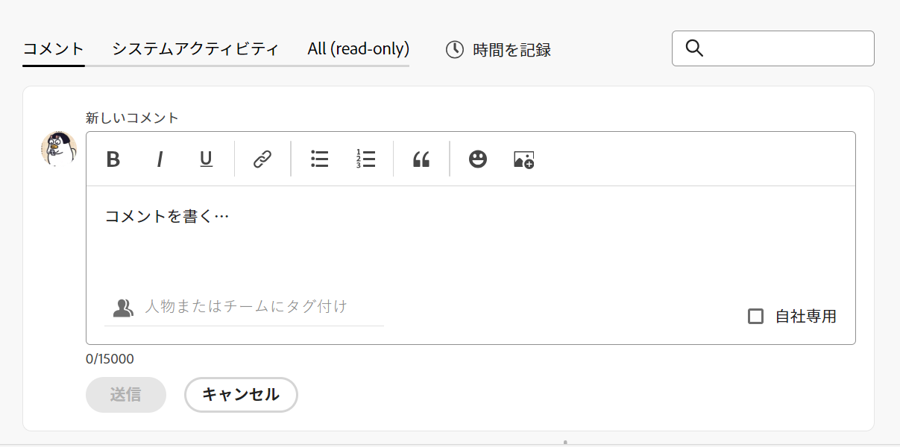

   >[!TIP]
   >
   >コメントを入力して送信する前に「更新」セクションから移動すると、ログオフしてログオンし直した後でも、ページ上のコメントがドラフトモードのままになります。 コメントに追加された画像も下書きに保存されます。 ドラフトは 7 日間保存され、その後は破棄され、復元できません。 下書きのコメントは、ユーザーが入力した場合にのみ表示されます。

1. （オプション）変更の取り消しまたはやり直しをおこなうには、次のショートカットキーを使用します。
   * Ctrl + Z( Macの場合は⌘+z)：変更を元に戻します。
   * Ctrl + Y( Macの場合は⌘+y)：変更をやり直します。
1. （オプション） **担当者またはチームのタグ付け** 領域に入力し、このコメントに含めるユーザーまたはチームの名前やメールを入力して、リストに表示されたら選択します。
1. （オプション）リッチテキストを使用するか、 <!--hidden for August 10: emojis,--> コンテンツを拡張するためのリンクまたは画像を更新に追加します。 詳しくは、 [Workfrontの更新でのリッチテキストの使用](#use-rich-text-in-a-workfront-update) 」の節を参照してください。

   >[!TIP]
   >
   >別のユーザーが、更新しようとしている同じ項目にコメントを送信すると、赤い線に「新規」インジケータが表示され、新しいコメントが通知されます。
   >
   >インジケーターは、コメントがアイテムに送信された後にのみ表示され、コメントがまだ構成されている場合は表示されません。
   >
   >「新規」インジケーターは、新しい更新を入力したユーザーと、現在更新を入力しているユーザーの両方が新しいコメント付けエクスペリエンスを使用している場合にのみ表示されます。
   >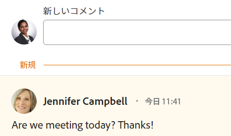

1. 次をクリック： **添付ファイルを追加** アイコン  <!--replace this icon with this new one for August 10: --> をクリックして、コメントに画像を追加します。 イメージを接続する前に、そのイメージをコンピュータに保存する必要があります。 <!--**************** this might be renamed to "Add image")-->

1. クリック **送信** をクリックして、Workfrontオブジェクトに更新を追加します。
1. （オプション）コメントを編集するには、 **その他** メニュー  「いいね！」アイコンの右側にあるをクリックし、 **編集**.
1. コメント内の情報の編集、画像の追加や削除、タグ付きユーザーの削除をおこないます。
コメントは、送信後 15 件以内に編集できます。 コメントが更新された際に表示される日付スタンプの左側に、「編集済み」のインジケーターが追加されます。

   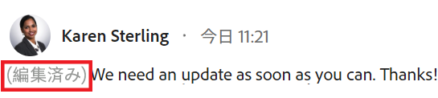

   >[!TIP]
   >
   >* 元の更新を送信した場合にのみ、ユーザーに更新を通知する電子メールが生成されます。 更新を編集した後は、電子メールは生成されません。
   >* コメントの横の日付スタンプは、最後の編集の日付ではなく、元のコメントの日付です。

1. （オプション）「 **返信** 既存のコメントに返信するには、上記の手順 4～8 に従います。 <!--(**************insure this stays accurate***********)--> 更新への返信について詳しくは、 [更新情報に返信](../../workfront-basics/updating-work-items-and-viewing-updates/reply-to-updates.md).
1. （条件付きおよびオプション）「更新」セクションの表示領域の外側に表示されるコメントを他のユーザーが追加した場合は、 **表示** 青の中に **新しいコメントバナー** をクリックして、これらのコメントを表示します。

   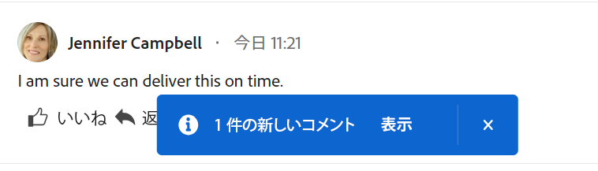

   追加のコメントが画面の下部に表示されます。

   >[!NOTE]
   >
   >   「新しいコメント」インジケーターと「表示」ボタンは、新しい更新を入力したユーザーと、現在「更新」セクションを表示しているユーザーの両方が新しいコメントエクスペリエンスを使用している場合にのみ表示されます。

1. （オプション） **次に類似** アイコン. アイコンは「いいね！」の数に応じて更新されます。
1. （条件付きおよびオプション）コメントに追加の担当者を含める場合は、更新に含まれるメンバーの数をクリックして、入力したコメントが共有されているエンティティのリストを表示します。

   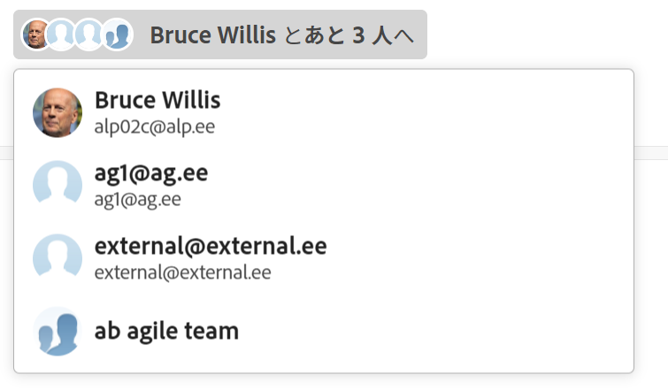
1. （オプション） **システムアクティビティ** タブをクリックして、システムによって記録された更新を表示します。 オブジェクトまたはその子オブジェクトが更新されると、Workfrontはその更新に関するメモを生成し、「システムアクティビティ」タブに表示します。

   詳しくは、 [アップデートセクションの概要](../updating-work-items-and-viewing-updates/updates-tab-overview.md)

   >[!TIP]
   >
   >システム更新にコメントを追加することはできません。

## Workfrontの更新でのリッチテキストの使用{#use-rich-text-in-a-workfront-update}

<!--August 10: remove this top note when we get to parity with the current version, OR change the note to mention that some options are ONLY available in the Beta version and not the current one.-->

>[!NOTE]
>
>リッチテキストツールバーの一部のオプションは、コメントベータ版のエクスペリエンスでは使用できない場合があります。

リッチテキストを使用したり、絵文字、リンク、画像などの様々な項目を追加したりして、更新内容を強化できます。

1. 次に移動： **更新** Workfrontオブジェクトの領域に入力し、コメントの入力を開始します。
1. （オプション）リッチテキスト書式を更新に追加するには、 **リッチテキスト** ツールバーを使用します。 <!--on August 10, add a screen shot of the complete Rich Text bar here, before the table-->

   | **属性** | **ツールバーボタン** | **Macショートカットキー** | **Windows のショートカットキー** |
   |---|---|---|---|
   | 太字 |  | ⌘+b | Ctrl+B |
   | 斜体 |  | ⌘+i | Ctrl + I |
   | 下線 |  | ⌘+u | Ctrl+U |
   | ハイパーリンク |  |  「リンクを作成」または「リンクを追加」ボックスを開くには、⌘+K を使用します。   コメント化ベータ版のエクスペリエンスで、選択したテキストにリンクを貼り付けます (⌘+V)。  |  「リンクを作成」または「リンクを追加」ボックスを開くには、Ctrl+K を押します。   コメントベータ版エクスペリエンスで、選択したテキストにリンクを貼り付けるには、Ctrl+V を使用します。  |
   | 箇条書き |  | ⌘+Shift+8 | Ctrl+Shift+8 |
   | 番号付きリスト |  | ⌘+Shift+7 | Ctrl+Shift+7 |
   | ブロック引用 |  | ⌘+Shift+9 | Ctrl+Shift+9 |
   | 絵文字 |  | ⌘+. | ⊞+. |

   テキストの書式設定を停止するには、 **リッチテキスト** ツールバー。

   <!-- in the table above: take "Create Links" verbiage from the hyperlink when the old commenting is removed and the commenting beta is the only way to comment-->

   >[!NOTE]
   >
   >* また、ユーザーが受け取った更新内容を含む電子メール通知にも、フォーマットが表示されます。
   >* E メールの更新に適用したリッチテキスト書式は、「更新」タブで表示した場合、更新に表示されません。
   >* 組織が Internet Explorer でWorkfrontを使用している場合、更新に貼り付けた書式付きテキストはリッチテキストの書式が失われ、プレーンテキストとして表示されます。 リッチテキストツールバーの属性を使用して、テキストの書式を変更できます。
   >* リッチテキストの書式設定は、[ タイムシート ] 領域で行われた更新や、レポート内の [ メモ ] および [ 最終条件 ] オブジェクトで表示された更新には使用できません。

1. （オプション）以前の更新のテキストや他のソースのテキストを含め、独自の更新と区別する場合は、ブロック引用としてマークできます。 次をクリック： **ブロック見積もり** アイコン  引用するテキストを入力します。 引用されたテキストは、垂直の灰色の線でマークされて表示されます。 次をクリック： **ブロック見積もり** 通常の書式に戻るにはアイコンを再度使用します。

   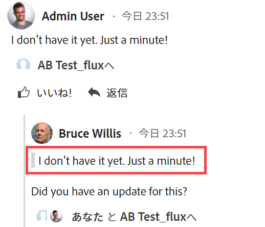

1. （オプション）更新に絵文字を追加します。

   >[!NOTE]
   >
   >* Workfrontでは、 ：などの句読点の顔文字は絵文字に置き換えられません。
   >* レポートに表示される「メモ」および「最終条件」オブジェクトでは、絵文字は使用できません。
   >* Workfrontの絵文字機能では Unicode 文字を使用するので、は Unicode コードポイントをサポートするブラウザーとオペレーティングシステムでのみ表示されます。 お使いのプラットフォーム、ブラウザー、またはオペレーティングシステムのバージョンが異なるユーザーは、同じ絵文字にアクセスできない場合があります。
   >* サポートされていない絵文字は、黒または白のボックスで表されます。
   >* Windows 7 では、黒と白の絵文字のみがサポートされています。
   >* 電子メールでおこなった更新に適用される絵文字は、「更新」領域に表示されると、更新に表示されません。

1. （オプション）追加の情報ソースに URL リンクを追加するには：

   1. リンクを挿入する更新内をクリックします。
   1. 次の日： **リッチテキスト** ツールバーで、 **ハイパーリンク** アイコン .

   1. Adobe Analytics の **リンクを作成** 表示されるボックス（下） **URL**、リンク先のソースの URL を入力または貼り付けます。

   1. の下 **表示するテキスト**、リンクテキストを入力または貼り付けます。
   1. 「**保存**」をクリックします。

1. （オプション）更新に画像を添付するには、使用する環境に応じて、次のいずれかの操作を実行します。

   * 次をクリック： **画像** アイコン  現在の更新エクスペリエンスを使用する場合は、コンピューター上の画像を参照するか、画像を更新領域にドラッグします。

   または

   次をクリック： **添付ファイルを追加** アイコン  コメントベータ版の使用時に、コンピュータ上の画像を参照します。 <!--the name of the icon and the icon for it might change-->

   >[!NOTE]
   >
   >* 画像または添付ファイルを追加アイコンを表示するには、Workfront管理者が、Workfrontインターフェイス領域の「フィードの環境設定を更新」セクションで画像の追加を有効にする必要があります。 詳しくは、 [ユーザーの更新の環境設定を構成する](../../administration-and-setup/set-up-workfront/system-tracked-update-feeds/configure-preferences-user-updates.md).
   >* 画像ファイルの最大サイズは 7 MB です。 サポートされる画像ファイルタイプは、.jpg、.gif および.png です。
   >* 画像は、オブジェクトの「更新」セクションからアクセスでき、「ドキュメント」領域でも使用できます。
   >* 画像とテキストを含まない更新を送信できます。
   >* 画像を含むコメントを削除する場合、選択したエクスペリエンスに応じて、次のシナリオが存在します。
   >
   >     * 現在のコメントエクスペリエンスでは、画像は「ドキュメント」領域に残りますが、「更新」セクションには表示されません。
   >     * 新しいコメントエクスペリエンスでは、画像は「更新」セクションおよび「ドキュメント」領域から削除されます。 コメントを編集して画像を削除すると、その画像もドキュメント領域から削除されます。
   >* コメントに添付された画像を「ドキュメント」領域から削除すると、その画像はコメントからも削除されます。

1. クリック **更新**  または **送信**（コメント機能ベータ版のエクスペリエンスを使用する場合）

## 更新情報をコピー

更新をコピーする方法はいくつかあります。 リンクをコピーした後、他のユーザーとリンクを共有して、更新に導くことができます。

更新のコピーは、使用するコメントエクスペリエンスに応じて異なります。

### 現在のコメントエクスペリエンスの更新をコピー

* [更新をコピー](#copy-the-update)
* [スレッドリンクをコピー](#copy-the-thread-link)
* [更新リンクをコピー](#copy-the-update-link)

#### 更新をコピー {#copy-the-update}

このオプションは、特定の更新からクリップボードにテキストをコピーします。

1. コピーする更新または返信に移動します。
1. 次をクリック： **その他** メニュー、次に「 **本文をコピー**.

   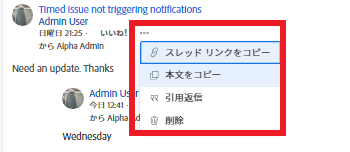

#### スレッドリンクをコピー {#copy-the-thread-link}

このオプションは、スレッドを他のユーザーと共有できるように、完全なスレッドリンクをクリップボードにコピーします。

1. コピーする更新スレッドに移動します。

1. 次をクリック： **その他** メニュー、次に「 **スレッドリンクをコピー**.

   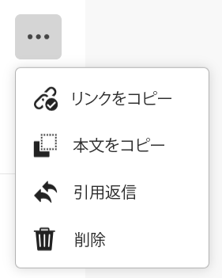

#### 更新リンクをコピー {#copy-the-update-link}

このオプションは、特定の更新リンクをクリップボードにコピーします。 更新リンクを共有すると、リンクをたどるユーザーには、更新の周囲に境界線が表示されます。

1. コピーする更新または返信に移動します。
1. 次をクリック： **その他** 個々の更新の横にあるメニューで、 **更新リンクをコピー**.

   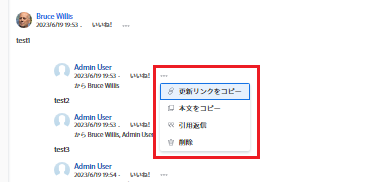

### 新しいコメントエクスペリエンスでの更新のコピー

新しいコメントエクスペリエンスで使用できる機能とオブジェクトについて詳しくは、 [新しいコメントエクスペリエンス](../../product-announcements/betas/new-commenting-experience-beta/unified-commenting-experience.md).

<!--when we remove and deprecate the legacy stream, add screen shots in the sections below-->

* [リンクをコピー](#copy-link)
* [本文をコピー](#copy-body-text)

#### リンクをコピー

このオプションは、コメントまたはスレッドのリンクをクリップボードにコピーして、他のユーザーとコメントまたはスレッド全体を共有できるようにします。

1. リンクをコピーする更新に移動します。

1. 次をクリック： **その他** メニュー、次に「 **リンクをコピー**.

#### 本文をコピー

このオプションは、特定の更新からクリップボードにテキストをコピーします。

1. コピーする更新または返信に移動します。
1. 次をクリック： **その他** メニュー、次に「 **本文をコピー**.

## 更新または返信の削除

Workfront管理者がユーザーに提供するアクセス権によっては、オブジェクトの「更新」タブで追加した更新を削除できる場合があります。 詳しくは、 [カスタムアクセスレベルの作成または変更](../../administration-and-setup/add-users/configure-and-grant-access/create-modify-access-levels.md#creating-a-new-access-from-scratch) 記事内 [カスタムアクセスレベルの作成または変更](../../administration-and-setup/add-users/configure-and-grant-access/create-modify-access-levels.md).

別のユーザーがおこなった更新を削除できるWorkfrontユーザー (Workfront管理者を含む ) はいません。 ただし、ユーザーのアクセスレベルでユーザーが自分の更新を削除できる場合、Workfront管理者はそのユーザーとしてログインし、加えた更新を削除できます。 詳しくは、 [カスタムアクセスレベルの作成または変更](../../administration-and-setup/add-users/configure-and-grant-access/create-modify-access-levels.md#creating-a-new-access-from-scratch) および [別のユーザーとしてログイン](../../administration-and-setup/add-users/create-and-manage-users/log-in-as-another-user.md).

1. 削除する更新または返信に移動します。
1. 次をクリック： **その他** 削除する更新または返信の横のメニューから、 **削除**.

   

1. 表示されるメッセージで、 **確認** または、 **削除**（コメント機能ベータ版のエクスペリエンスを使用する場合）

   >[!NOTE]
   >
   >画像が添付された更新を削除すると、コメントと画像の両方が削除されます。 詳しくは、 [Workfrontの更新でのリッチテキストの使用](#use-rich-text-in-a-workfront-update) 」の節を参照してください。

   削除したコメントに返信が関連付けられている場合は、コメントが削除されたユーザーの名前で削除されたことを示すメッセージが表示されます。

   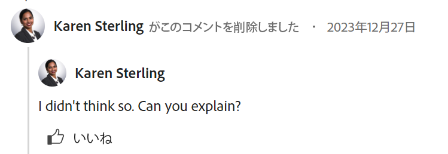

   コメントベータ版エクスペリエンスを使用する場合、削除されたコメントはWorkfrontから直ちに削除されます。 「更新」セクションを使用するユーザーは、別のユーザーがコメントをリアルタイムで削除しているのを確認します。

   <!--when we remove the beta, take out the first part of the sentence above about only when commenting in beta experience. Leave the rest though-->

<!--this is no longer needed - adding timesheet comments is just like adding comments to any other object now

## Add an update on a Timesheet

1. Go to a Timesheet on which you want to make an update.
1. Click the Timesheet to open it.
1. At the bottom of the Timesheet, click **Include a comment**.
1. In the box that displays at the bottom of the Timesheet, type an update.

   

1. (Conditional) To save your update without submitting the Timesheet for approval, click **Save for Later**.

   Or

   To save your update and submit the Timesheet for approval, click **Submit for Approval**.

   Or

   If your Timesheet is not set up with an approver, click **Save and Close Timesheet** to save your update.

-->

## システム更新を有効または無効にする

<!--remove the preview tag with 23.2 production, but keep the note till we remove Beta and it becomed the only exprience: -->

>[!NOTE]
>
>新しいコメントエクスペリエンスを使用する際に、システムの更新を無効にすることはできません。
>この節の情報は、現在の更新セクションで利用できる機能のみを示しています。
>ベータ版のシステム更新の詳細については、 [アップデートセクションの概要](../updating-work-items-and-viewing-updates/updates-tab-overview.md).

Workfrontオブジェクトの「更新」セクションには、次の 2 種類の情報が表示されます。

* **ユーザーの更新：** ユーザーの更新とは、自分とシステム内の他のユーザーが入力するコメントです。

  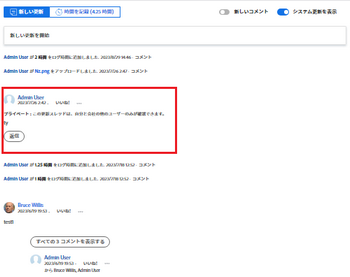

* **システムの更新：** アセットの削除、バージョンの追加または削除、承認リクエストの添付または削除、およびオブジェクト上のドキュメントに対する編集または変更が記録されます。

  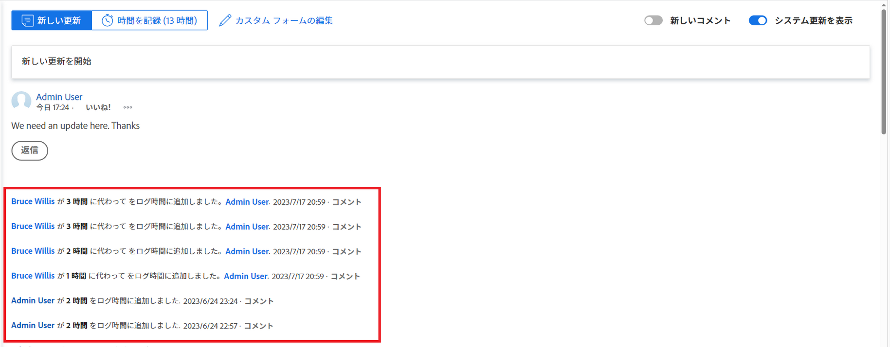

  ご使用のWorkfrontライセンスに応じて、システムのアップデートがデフォルトで有効になっている場合があります。 Workfrontの管理者は、システムの更新で何を追跡するかを決定できます。詳しくは、 [システムで追跡された更新](../../administration-and-setup/set-up-workfront/system-tracked-update-feeds/system-tracked-update-feeds.md). また、システムの更新やアクティビティを除外して、すべてのオブジェクトのユーザー更新のみを表示することもできます。

  次のオブジェクトには、システムで生成された更新はありません。

   * チーム
   * テンプレート
   * テンプレート タスク

システム更新を有効または無効にするには：

1. 次をクリック： **更新** タブをクリックします。
1. クリック **システムの更新を表示** スイッチを左（無効）または右（有効）にスライドさせます。

   

   このオプションは、Workfront全体のすべてのオブジェクトにわたって永続的で、Workfrontからログアウトした場合でも、選択した位置にとどまります。

   >[!TIP]
   >
   >   システムの更新を記録しないオブジェクトの [ 更新 ] 領域に [ システムの更新を表示 ] オプションはありません。

   <!--when Anna adds the new updates stream to ALL objects, she will remove the System Activity tab from the objects that don't record system updates - add another line to the TIP above to say: The System Activity tab is not available for objects that don't record system-generated updates.*************** OR: maybe make this part of the statement where we list which objects these are, above???  -->

