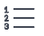

# 作業の更新

{{highlighted-preview}}

<!-- Audited: 1/2024 -->

<!--take "legacy" and "new commenting" references out when we remove the legacy - April 2024???-->

<!--The highlighted information on this page refers to functionality not yet generally available. It is available only in the Preview environment for all customers. 

For information about the current release schedule, see [First Quarter 2024 release overview](../../product-announcements/product-releases/24-q1-release-activity/24-q1-release-overview.md). -->

<!--
After the monthly releases to Production, the same features are also available in the Production environment for customers who enabled fast releases.   
For information about fast releases, see [Enable or disable fast releases for your organization](../../administration-and-setup/set-up-workfront/configure-system-defaults/enable-fast-release-process.md)  
-->

>[!IMPORTANT]
>
>現在アドビでは、Adobe Workfront のコメントエクスペリエンスを再設計しているところです。
>
>どのオブジェクトに対してコメント作成機能にアクセスするかに応じて、「更新」セクションに次の機能が表示されます。
>* 新しいエクスペリエンス
>* 従来のエクスペリエンス
>* 新しいエクスペリエンスと従来のエクスペリエンス
>
>新しいコメントエクスペリエンスとその可用性について詳しくは、 [新しいコメントエクスペリエンス](../../product-announcements/betas/new-commenting-experience-beta/unified-commenting-experience.md).
>
>新しいコメントエクスペリエンスは、Workfrontオブジェクトの「更新」セクションでのみ使用でき、次の領域から更新にアクセスする場合は使用できません。
>
> * ホーム
> * リストの概要パネル
> * タイムシートの概要パネル
> * ワークロードバランサーの概要パネル
>
>新しいコメントエクスペリエンスは、リスト、タイムシート、およびプレビュー環境のワークロードバランサーの [ 概要 ] パネルで使用できます。

<!-- with October 26 release: add somewhere this, and decide where we need to keep information about the legacy commenting. Should we create an article about iterations comments like we have for goals and cards?!:

>[!NOTE]
>
>Iterations display the legacy commenting experience.-->

<!--old message, before Auhust 17: 

>[!NOTE]
>
>We are currently redesigning the commenting experience in Adobe Workfront.
>
>For more information about the new commenting experience, see [New commenting experience](../../product-announcements/betas/new-commenting-experience-beta/unified-commenting-experience.md). 
>
>You can access the new experience for the following objects:
> * Issues, projects, tasks, and documents.
>
>     This is available when you enable the commenting Beta experience.
>
>     This functionality is available only for the Updates section, and it is not available for the following areas:
>
>     * Home
>     * Summary panel in lists
>     * Summary panel in timesheets
>
> * Goals, cards in the Boards area
>
>   The new commenting experience is the only experience for goals and cards. You must have an additional license to access Workfront Goals. For more information, see [Requirements to use Workfront Goals](../../workfront-goals/goal-management/access-needed-for-wf-goals.md). 
>
>     You can add and view updates to cards in the Boards area when you enable the Comments and System Activity sections on a card. For more information, see [Add an ad hoc card to a board](../../agile/get-started-with-boards/add-card-to-board.md).
-->

## 作業の更新に関する考慮事項

* 「更新」セクションでは、Adobe Workfront のほとんどのオブジェクトにコメントを追加できます。「更新」セクションが表示される Workfront オブジェクトについて詳しくは、[「更新」セクションの概要](../updating-work-items-and-viewing-updates/updates-tab-overview.md)を参照してください。

* Workfront と統合されている他のアプリケーションや Workfront モバイルアプリから、Workfront オブジェクトにコメントを追加できます。

  Workfrontと統合されているすべてのアプリケーションがWorkfrontオブジェクトにコメントを追加できるわけではありません。

  アプリケーションから Workfront オブジェクトにアクセスする場合、Workfront のオブジェクトの「更新」セクションで使用できるすべての機能が他のアプリケーションでも使用できるわけではありません。例えば、サードパーティのアプリケーションから Workfront オブジェクトにコメントを追加する場合は、リッチテキスト機能を利用したりコメントを会社に非公開にしたりすることができない可能性があります。

* オブジェクトにコメントを付ける際に、Workfront オブジェクト（プロジェクト、タスクまたはイシュー）の進行状況を伝えることができます。オブジェクトに割り当てられているまたは登録しているユーザーは、更新に関する通知を受け取ることができます。オブジェクトへの表示アクセス権を持つユーザーは誰でも、更新を表示できます。

* ユーザーにタグ付けして、更新に注意を向けさせることができます。タグ付きユーザーには、更新に関するアプリ内通知とメールが届きます。

  >[!TIP]
  >
  >   新しいコメントエクスペリエンスでは、コメントの所有者は自動的にタグ付けされます。詳しくは、[更新時の他のユーザーへのタグ付け](../../workfront-basics/updating-work-items-and-viewing-updates/tag-others-on-updates.md)を参照してください。
  <!--take the "in the new commenting experience" out when this is the only experience-->

* 表示可能なオブジェクトにコメントを追加したり、Workfront 管理者またはグループ管理者としてログインして、別のユーザーの代わりにコメントを追加したりできます。詳しくは、[別のユーザーとしてのログイン](../../administration-and-setup/add-users/create-and-manage-users/log-in-as-another-user.md)を参照してください。

* Workfront の次のエリアから、プロジェクト、タスクおよびイシューに更新を追加できます。

   * 「更新」セクションの Workfront オブジェクトから
   * ホームエリアから（タスクおよびイシューの場合）
   * オブジェクトの一覧、タイムシート、またはワークロードバランサー（タスクと問題）の [ 概要 ] パネルから

このページの情報では、Workfrontオブジェクトにコメントする方法と、コメントを追加する際にプロジェクト、タスクおよび問題を更新する方法について説明します。

<!--take this out (below) when we remove legacy out of the application-->

目標に対するコメントについては、[Adobe Workfront Goals での目標コメントの管理](../../workfront-goals/goal-management/manage-goal-comments.md)を参照してください。Workfront Goals にアクセスするには、追加のライセンスが必要です。

ボードエリアのカードにコメントする方法については、[ボードへのアドホックカードの追加](../../agile/get-started-with-boards/add-card-to-board.md)を参照してください。

## アクセス要件

この記事の手順を実行するには、次のアクセス権が必要です。

<table style="table-layout:auto"> 
 <col> 
 </col> 
 <col> 
 </col> 
 <tbody> 
  <tr> 
   <td role="rowheader"><strong>Adobe Workfront プラン</strong></td> 
   <td> 
任意
 </td> 
  </tr> 
  <tr> 
   <td role="rowheader"><strong>Adobe Workfront ライセンス</strong></td> 
   <td> 
   
現在：問題およびドキュメントに対する要求以上、その他のすべてのオブジェクトに対する確認以上

   
新規： Contributor 以降（問題およびドキュメントの場合）：他のすべてのオブジェクトの場合は Light 以上
 
   </td> 
  </tr> 
  <tr> 
   <td role="rowheader"><strong>アクセスレベル設定</strong></td> 
   <td> 
更新先のオブジェクトに対する表示または編集アクセス権
</td> 
  </tr> 
  <tr> 
   <td role="rowheader"><strong>オブジェクト権限</strong></td> 
   <td> 
オブジェクトに対する表示アクセス権
</td> 
  </tr> 
 </tbody> 
</table>

この表の情報の詳細については、 [Workfrontドキュメントのアクセス要件](/help/quicksilver/administration-and-setup/add-users/access-levels-and-object-permissions/access-level-requirements-in-documentation.md).

## 作業アイテムへの更新の追加

作業項目に更新を追加する方法は、使用する「更新」セクションのバージョンに応じて異なります。

次のオブジェクトに更新を追加できます。

* プロジェクト
* タスク
* イシュー
* プログラム
* ポートフォリオ
* テンプレート
* テンプレートタスク
* ユーザー
* タイムシート
* チーム
* Goals
* 「ボード」領域のカード
* イテレーション

### 「レガシー更新」セクションの作業項目に更新を追加する

>[!IMPORTANT]
>
>このページの情報では、プロジェクト、タスクおよび問題を更新する方法について説明します。

1. 更新対象の作業アイテム（プロジェクト、タスク、イシューなど）に移動します。
1. 「**更新**」セクションをクリックします。
1. （条件付き）有効な場合、 **新しいコメント** オプションを使用して、従来のコメント作成機能を有効にすることができます。
1. 「**新しい更新を開始**」をクリックしたあと、更新内容を入力します。
1. （オプション）リッチテキストツールバーのオプションを使用して、テキストの書式設定、絵文字、リンク、画像を更新に追加し、コンテンツを拡張できます。 詳しくは、[Workfront における更新へのリッチテキストの使用](#use-rich-text-in-a-workfront-update)の節を参照してください。
1. （オプション）作業アイテムに関する次の情報を任意に更新します。

   <table style="table-layout:auto"> 
    <col> 
    <col> 
    <tbody> 
     <tr> 
      <td role="rowheader"><strong>通知</strong></td> 
      <td>更新の通知が必要なユーザーを特定します。オブジェクトに割り当てられているまたは登録しているユーザーは、更新が行われると、自動的に通知を受け取ります。 
更新時に他のユーザーを含める方法については、<a href="../../workfront-basics/updating-work-items-and-viewing-updates/tag-others-on-updates.md" class="MCXref xref">更新時の他のユーザーへのタグ付け</a>を参照してください。
</td> 
     </tr> 
     <tr> 
      <td role="rowheader"><strong>コミット日</strong></td> 
      <td>日付選択で、作業アイテムの完了を約束する日付を選択します。コミット日に関しては、<a href="../../manage-work/projects/updating-work-in-a-project/overview-of-commit-dates.md" class="MCXref xref">コミット日の概要</a>を参照してください。</td> 
     </tr> 
     <tr> 
      <td role="rowheader"><strong>状況</strong></td> 
      <td>タスクまたはイシューの新しい状況を選択します。状況の選択について詳しくは、<a href="../../manage-work/projects/updating-work-in-a-project/update-condition-for-tasks-and-issues.md" class="MCXref xref">タスクおよびイシューの状況の更新</a>を参照してください。</td> 
     </tr> 
     <tr> 
      <td role="rowheader"><strong>ステータス</strong></td> 
      <td>現在のステータスの横にある矢印をクリックし、ドロップダウンメニューから目的のステータスを選択します。ステータスの設定については、<a href="../../manage-work/projects/updating-work-in-a-project/update-task-status.md" class="MCXref xref">タスクステータスの更新</a>を参照してください。
作業アイテムのステータスをアップデートしても、プロジェクトのステータスは自動的には変更されません。プロジェクトの設定に応じて、プロジェクトステータスを個別に更新する場合があります。プロジェクトの様々な更新タイプについて詳しくは、<a href="../../manage-work/projects/manage-projects/select-project-update-type.md" class="MCXref xref">プロジェクト更新タイプの選択</a>を参照してください。

<b>メモ</b>

   作業アイテムのステータスが「承認保留中」の場合は、ステータスを変更できません。
</td>
   </tr> 
     <tr> 
      <td role="rowheader"><strong>完了バー</strong></td> 
      <td>（タスクでのみ使用可能）進捗バーを目的のパーセンテージにスライドして、作業の完了率を指定します。完了バーをダブルクリックして、完了率を入力することもできます。</td> 
     </tr> 
     <tr> 
      <td role="rowheader"><strong>社外秘</strong></td> 
      <td> 
社外のユーザーにこの更新が表示されないようにするには、このオプションを有効にします。
 
      
<b>メモ</b>

      
このオプションは、ユーザーが会社に関連付けられている場合にのみ表示されます。

      
このオプションは、更新を追加できるすべての領域で使用できるわけではありません。 例えば、から更新を追加できるサードパーティアプリケーションでは使用できません。 

      </td> 
     </tr> 
    </tbody> 
   </table>

1. 「**更新**」をクリックして、Workfront オブジェクトに更新を追加します。

   >[!NOTE]
   >
   >「**更新**」をクリックすると、小さなポップアップウィンドウが 7 秒間表示されます。このポップアップウィンドウを使用すると、更新が投稿される前に更新を取り消して編集ペインに戻ることができます。取り消しポップアップを閉じたり、ポップアップが表示されなくなるのを待ったり、ページから移動したりすると、更新が投稿されます。
   >
   >Workfront 管理者がアクセスレベルで「ユーザーによるコメントの削除を許可しない」設定を選択した場合、コメントを取り消すことはできません。詳しくは、[カスタムアクセスレベルを作成および変更](../../administration-and-setup/add-users/configure-and-grant-access/create-modify-access-levels.md)を参照してください。

1. アップデートに返信するには、[更新に返信](../../workfront-basics/updating-work-items-and-viewing-updates/reply-to-updates.md)を参照してください。

### 新しいコメントエクスペリエンスを使用して作業項目に更新を追加する

1. 更新するオブジェクト（プロジェクト、タスク、またはイシュー）を探し、名前をクリックしてオブジェクトのページを開きます。
1. 左側のパネルの「**更新**」をクリックします。
1. （条件付き） **新しいコメント** オプションは無効です。クリックして有効にします。

   これにより、新しいコメントの操作が可能になります。 デフォルトでは、「**コメント**」タブが選択されています。

1. **新しいコメント**&#x200B;ボックスにコメントを入力します。

   

   プレビュー環境の新しいコメントボックスの例：
   

   

   実稼動環境の新しいコメントボックスの例：
   

   >[!TIP]
   >
   >コメント入力を完了して送信する前に更新セクションから移動すると、ログオフしてログオンし直した後でも、ページ上のコメントがドラフトモードのままになっています。コメントに追加された画像も下書きに保存されます。ドラフトは 7 日間保存され、その後は破棄され、復元できません。下書きのコメントは、入力したユーザーのみに表示されます。

1. （オプション）変更の取り消しまたはやり直しを行うには、以下のショートカットキーを使用します。
   * Ctrl + Z（Mac の場合は ⌘+z）で、変更を元に戻します
   * Ctrl + Y（Mac の場合は ⌘+y）で、変更をやり直します
1. （オプション）**担当者またはチームのタグ付け**&#x200B;エリアで、このコメントに含めるユーザーまたはチームの名前やメールを入力して、リストに表示されたら選択します。
1. （オプション）リッチテキストツールバーのオプションを使用して、テキストの書式設定、絵文字、リンク、画像を更新に追加し、コンテンツを拡張できます。 詳しくは、[Workfront の更新でリッチテキストを使用](#use-rich-text-in-a-workfront-update)の節を参照してください。

   >[!TIP]
   >
   >別のユーザーが、更新しようとしている同じ項目にコメントを送信した場合、赤い線に「新規」インジケータが表示され、新しいコメントが通知されます。
   >
   >インジケーターは、コメントが項目に送信された後にのみ表示され、コメントがまだ構成されている場合は表示されません。
   >
   >「新規」インジケーターは、新しい更新を入力したユーザーと、現在更新を入力しているユーザーの両方が新しいコメント機能のエクスペリエンスを使用している場合にのみ表示されます。
   >

1. 「**送信**」をクリックして、Workfront オブジェクトに更新を追加します。
1. （オプション）コメントを編集するには、 **その他** メニュー  コメントの右上隅で、 **編集**.

   >[!IMPORTANT]
   >
   >コメントは送信後 15 分以内にのみ編集できます。

1. コメント内の情報の編集、画像の追加や削除、タグ付きユーザーの削除をおこないます。 コメントの入力時に表示される日付スタンプの左側に、「編集済み」のインジケーターが追加されます。

   >[!TIP]
   >
   >現在の年からのコメントでは、日付スタンプに年は表示されません。 タイムスタンプの上にマウスポインターを置くと、年を含む完全な日付が表示されます。

   

   >[!TIP]
   >
   >* 元の更新を送信した場合にのみ、ユーザーに更新を通知するメールが生成されます。更新を編集した後は、メールは生成されません。
   >* コメントの横の日付スタンプは、最後の編集の日付ではなく、元のコメントの日付です。
   >* 別のユーザーの代わりにコメントを追加する場合 (Workfrontまたはグループ管理者として別のユーザーとしてログインする場合 )、他のユーザーとしてログインしている場合はコメントを編集できません。 コメントは、ユーザーとしてログアウトし、自分で再度ログインした後にのみ編集できます。

1. （オプション）「 **返信** または、 **返信を追加…** 「 」領域に移動し、既存のコメントに返信する場合は、上記の手順 4～8 に従います。 <!--(**************insure this stays accurate***********)--> 更新への返信について詳しくは、[更新に返信](../../workfront-basics/updating-work-items-and-viewing-updates/reply-to-updates.md)を参照してください。

1. （条件付きおよびオプション）コメントの追加中に、「更新」セクションの表示領域の外側に表示されるコメントを他のユーザーが追加した場合は、「 **表示** 青の中に **新しいコメントバナー** をクリックして、これらのコメントを表示します。

   

   追加のコメントが画面の下部に表示されます。

   >[!NOTE]
   >
   >   「新しいコメント」インジケーターと「表示」ボタンは、新しい更新を入力したユーザーと、現在「更新」セクションを表示しているユーザーの両方が新しいコメント機能のエクスペリエンスを使用している場合にのみ表示されます。

1. （オプション）**いいね！**&#x200B;アイコン  をクリックします。アイコンは「いいね！」の数に応じて更新されます。
1. （条件付きおよびオプション）コメントに追加の担当者を含める場合は、更新に含まれるメンバーの数をクリックして、入力したコメントが共有されているエンティティのリストを表示します。

   

   >[!TIP]
   >
   >最初の 2 つのタグ付きエンティティの名前が、アバターの横に表示されます。 3 つ以上のエンティティがタグ付けされている場合は、最初のエンティティの名前と追加エンティティの数のみが表示されます。

1.  （オプション）コメントの名前をクリックして、情報ボックスにその名前、役割、電子メールアドレスを表示します。 情報ボックスでコメントの名前を再度クリックして、ユーザープロファイルを開きます。
1. （オプション）「**システムアクティビティ**」タブをクリックして、システムによって記録された更新を表示します。オブジェクトまたはその子のいずれかが更新されると、Workfront はその更新に関するメモを生成し、「システムアクティビティ」タブに表示します。

   詳しくは、 [アップデートセクションの概要](../updating-work-items-and-viewing-updates/updates-tab-overview.md).

   >[!TIP]
   >
   >システム更新にコメントを追加することはできません。 ただし、従来のコメント作成エクスペリエンスのシステムアクティビティレコードに対する返信は、「システムアクティビティ」タブに読み取り専用として設定されます。

1. （オプション） **すべて** タブを使用して、ユーザーコメントとシステムアクティビティコメントの両方を 1 か所で表示できます。 これは表示専用のタブです。

   >[!TIP]
   >
   >「すべて」タブでは、既存のコメント内のコメントに対して返信したり、他のユーザーにタグ付けしたりすることはできません。 「すべて」タブでコメントに返信するには、 **コメントで返信** をクリックして、「コメント」タブでコメントを開きます。

## Workfront の更新にリッチテキストを使用{#use-rich-text-in-a-workfront-update}

<!--October 2023: remove this top note when we get to parity with the current version, OR change the note to mention that some options are ONLY available in the Beta version and not the current one.-->

>[!NOTE]
>
>以下では、特に指定のない限り、新しいコメントエクスペリエンスでのリッチテキストの使用について説明します。

リッチテキストを使用したり、絵文字、リンク、画像などの様々な項目を追加したりして、更新内容を強化できます。

1. Workfront オブジェクトの&#x200B;**更新**&#x200B;エリアに移動し、コメントの入力を開始します。
1. （オプション）リッチテキスト書式を更新に追加するには、 **リッチテキスト** ツールバーを使用します。

   

   <!--October 2023: the individual icons in the toolbar will need replacing-->

   | **属性** | **ツールバーボタン** | **Mac ショートカットキー** | **Windows ショートカットキー** |
   |---|---|---|---|
   | 太字 |  | ⌘+b | Ctrl+B |
   | 斜体 |  | ⌘+i | Ctrl+I |
   | 下線 |  | ⌘+u | Ctrl+U |
   | ハイパーリンク |  |  リンクを追加ボックスを開くには、⌘+K を押します。   選択したテキストにリンクを貼り付けるには、⌘+V を使用します。  |  「リンクを追加」ボックスを開くには、Ctrl+K を押します。   選択したテキストにリンクを貼り付けるには、Ctrl+V を押します。  |
   | 箇条書き |  | ⌘+Shift+8 | Ctrl+Shift+8 |
   | 番号付きリスト |  | ⌘+Shift+7 | Ctrl+Shift+7 |
   | ブロック引用 |  | ⌘+Shift+9 |  Ctrl+Shift+9   これは、新しいコメントエクスペリエンスでは使用できません。   |

   <!--remove the last row when we remove legacy from the system-->

   テキストの書式設定を停止するには、**リッチテキスト**&#x200B;ツールバーで、属性を選択解除します。

   <!-- in the table above: take "Create Links" verbiage from the hyperlink when the old commenting is removed and the commenting beta is the only way to comment - with October 2023-->

   >[!NOTE]
   >
   >* 書式設定は、ユーザーが受信するメール通知（更新を含む）にも表示されます。
   >* メール内の更新に適用されたリッチテキスト形式は、「更新」タブで表示した場合には、更新に表示されません。
   >* 組織が Internet Explorer でWorkfront を使用している場合、更新に貼り付けた書式設定済のテキストからはリッチテキストの書式が失われ、プレーンテキストとして表示されます。リッチテキストツールバーの属性を使用して、テキストの書式を変更できます。
   >* リッチテキストの書式設定は、レポートで表示されるタイムシートエリアで行われた更新や、メモおよび最終状況オブジェクトの更新には使用できません。

1. （オプションおよび条件付き）以前の更新のテキストや他のソースのテキストを含め、独自の更新と区別する場合は、ブロック引用としてマークできます。 「**ブロック引用**」アイコンをクリックし、引用するテキストを入力します。引用されたテキストは、垂直の灰色の線でマークされて表示されます。次をクリック： **ブロック見積もり** 通常の書式に戻るにはアイコンを再度使用します。 これは、新しいコメントエクスペリエンスでは使用できません。

   <!--remove this picture below and the bullet above when we remove legacy-->

   

1. （オプション） **絵文字** アイコン  をクリックして、更新に絵文字を追加します。

   >[!NOTE]
   >
   >* Workfront は、:) などの句読点絵文字を絵文字に置き換えません。
   >* レポートに表示されるメモおよび最終状況オブジェクトでは、絵文字は使用できません。
   >* Workfront の絵文字機能では Unicode 文字を使用するため、Unicode コードポイントをサポートするブラウザーとオペレーティングシステムでのみ表示されます。お使いのプラットフォーム、ブラウザー、またはオペレーティングシステムのバージョンが異なるユーザーは、同じ絵文字にアクセスできない場合があります。
   >* サポートされていない絵文字は、黒または白のボックスで表されます。
   >* Windows 7 では、黒と白の絵文字のみがサポートされています。
   >* メールを介して行われた更新に適用される絵文字は、更新エリアに表示されると、更新には表示されません。

1. （オプション）追加の情報ソースに URL リンクを追加するには、以下のように行います。

   1. リンクを挿入するアップデート内をクリックします。
   1. **リッチテキスト**&#x200B;ツールバーで、**ハイパーリンク**&#x200B;アイコン  をクリックします。

   1. **URL** の下に表示される&#x200B;**リンクを作成**&#x200B;ボックスに、リンク先のソースの URL を入力またはペーストします。

   1. **表示するテキスト**&#x200B;で、リンクテキストを入力またはペーストします。
   1. 「**保存**」をクリックします。

1. （オプション）更新に画像を添付するには、次のいずれかの操作を行います。

   * コンピューター上に画像を保存し、新しいコメント領域にドラッグ&amp;ドロップします。
   * コンピューターからスクリーンショットをコピーし、コメントに貼り付けます。 これは、従来のコメントエクスペリエンスでは使用できません。
   * 次をクリック： **画像を追加** アイコン  お使いのコンピューター上の画像を参照します。

   >[!NOTE]
   >
   >* 画像アイコンや、添付ファイルを追加アイコンを表示するには、Workfront 管理者が、画像の追加を Workfront インターフェイスエリアの「フィードの環境設定を更新」セクションで有効にする必要があります。詳しくは、[ユーザーの更新用に環境設定を指定](../../administration-and-setup/set-up-workfront/system-tracked-update-feeds/configure-preferences-user-updates.md)を参照してください。
   >* 画像ファイルの最大サイズは 7 MB です。サポートされる画像ファイルタイプは、.jpg、.gif および .png です。
   >* 画像は、オブジェクトの「更新」セクションからアクセスでき、メインメニューの「ドキュメント」領域でも使用できます。
   >* 画像を貼り付けるには、新しいコメントを右クリックするか、Windows の場合は Ctrl + V(Macの場合は⌘ + V) を押します。
   >* 画像は含むがテキストを含まないアップデートを送信できます。
   >* 画像を含むコメントを削除する場合、選択したエクスペリエンスに応じて、以下のシナリオが存在します。
   >
   >     * 従来のコメントエクスペリエンスでは、画像は「ドキュメント」領域に残りますが、「更新」セクションには表示されません。
   >     * 新しいコメントエクスペリエンスでは、画像はアップデートセクションおよびドキュメントエリアから削除されます。コメントを編集して画像を削除すると、その画像もドキュメントエリアから削除されます。
   >* コメントに添付された画像をドキュメントエリアから削除すると、その画像はコメントからも削除されます。

   <!--remove the statement above about legacy, when we remove the legacy environment.-->

1. （オプション）既存の更新で画像を表示するには、次のいずれかの操作を実行します。

   * 画像のサムネールで&#x200B;**プレビュー**&#x200B;アイコン  をクリックして、フルサイズの画像を新しいブラウザータブで開きます。
   * 画像のサムネールで&#x200B;**ダウンロード**&#x200B;アイコン  をクリックして、画像をダウンロードします。

1. クリック **送信** コメントを追加します。

## 更新を検索

>[!NOTE]
>
>この機能は、新しいコメントエクスペリエンスの「コメント」タブでのみ使用できます。 これは、[ 更新 ] セクションの [ システムアクティビティ ] タブでは使用できません。

オブジェクトの「更新」セクションで、コメントや返信を検索できます。

1. 次に移動： **更新** セクションに含める必要があります。
1. キーワードの入力を開始する <!--or a user's name --> （内） **検索** ボックス **コメント** タブをクリックします。

   <!--Add this tip or note instead of the note below - when it'll be possible: You can search for users who have been tagged or for comment owners.-->

   >[!NOTE]
   >
   >検索できるのは、コメントまたは返信のテキストに属する単語のみです。 更新でタグ付けされたユーザーまたはチームの名前は検索できません。

   

   プレビュー環境での検索例：
   

   

   実稼動環境での検索の例：
   

   キーワード <!--or user--> 検索した項目がハイライト表示され、それを含むコメントが「更新」セクションの上部に表示されます。

   Workfrontは、画面に表示されるコメントの外側にある、オブジェクトの更新ストリーム全体を検索します。

1. 次をクリック： **x** 検索フィールド内のアイコンを使用して、検索結果を消去し、すべてのコメントに戻ります。

<!-- when we release search to production, check above and make sure you don't have to add that the users tagged/ owners are also searchable-->

## 更新情報をコピー

更新をコピーする方法はいくつかあります。リンクをコピーした後、他のユーザーとリンクを共有して、ユーザーを更新に誘導することができます。

更新のコピーは、使用するコメントエクスペリエンスに応じて異なります。

### 新しいコメントエクスペリエンスに更新をコピー

新しいコメントエクスペリエンスで使用できる機能とオブジェクトについて詳しくは、[新しいコメントエクスペリエンス](../../product-announcements/betas/new-commenting-experience-beta/unified-commenting-experience.md)を参照してください。

<!--when we remove and deprecate the legacy stream, add screen shots in the sections below- October 2023-->

次のいずれかの操作を行って、既存のコメントから情報をコピーできます。

* [リンクをコピー](#copy-link)
* [本文をコピー](#copy-body-text)
* [見積もりの返信](#quote-reply-1)

#### リンクをコピー

「リンクをコピー」オプションを選択すると、コメントまたはスレッドのリンクがクリップボードにコピーされ、他のユーザーとコメントまたはスレッド全体を共有できます。

1. リンクをコピーする更新に移動します。

1. **その他**&#x200B;メニュー、「**リンクをコピー**」の順にクリックします。

1. 前の手順でコピーしたリンクを電子メールまたは他のアプリケーションに貼り付けて、他のユーザーと共有します。 リンクを共有したコメントが共有リンクによって開きます。

   >[!TIP]
   >
   >上位のオブジェクトから子オブジェクト上の会話のリンクを共有すると、そのリンクは上位のオブジェクトの [ 更新 ] 領域でスレッドを開きます。
   >
   >例えば、タスクコメントのリンクをプロジェクトの更新領域からコピーすると、コメントはプロジェクトページを開きます。

#### 本文をコピー

「本文テキストをコピー」オプションは、特定の更新内容からクリップボードにテキストをコピーします。

1. コピーする更新に移動、あるいは返信します。
1. **その他**&#x200B;メニュー、「**本文テキストをコピー**」の順にクリックします。

#### 見積もりの返信

「Quote reply」オプションは、元のコメントを新しい返信にブロック引用としてコピーします。

1. コピーする更新に移動、あるいは返信します。
1. 次をクリック： **その他** メニュー、次に「 **見積もりの返信**.

   新しいコメントボックスが開き、引用の返信が新しいコメントに含まれ、ブロック引用符としてマークされます。

   

   <!--ensure the screen shot above is correct - missing he block quote icon in rich text -->

1. 更新の追加を続行し、「 **送信** をクリックしてコメントを追加します。

### 従来のコメントエクスペリエンスでの更新のコピー

<!--remove legacy when removed from the UI-->

* [更新をコピー](#copy-the-update)
* [スレッドリンクをコピー](#copy-the-thread-link)
* [更新リンクをコピー](#copy-the-update-link)
* [引用返信](#quote-reply)

  >[!TIP]
  >
  >上位のオブジェクトから子オブジェクト上の会話のリンクをコピーして共有すると、そのリンクは子オブジェクトの [ 更新 ] 領域でスレッドを開きます。
  >
  >例えば、プロジェクトの更新領域からタスクコメントのリンクをコピーすると、そのコメントはタスクページを開きます。

#### 更新をコピー {#copy-the-update}

このオプションは、テキストを特定の更新からクリップボードにコピーします。

1. コピーする更新に移動、あるいは返信します。
1. **その他**&#x200B;メニュー、「**本文テキストをコピー**」の順にクリックします。

   

#### スレッドリンクをコピー {#copy-the-thread-link}

このオプションは、完全なスレッドリンクをクリップボードにコピーして、スレッドを他のユーザーと共有できるようにします。

1. コピーするアップデートスレッドに移動します。

1. **その他**&#x200B;メニュー、「**スレッドリンクをコピー**」の順にクリックします。

   

1. 前の手順でコピーしたリンクを電子メールまたは他のアプリケーションに貼り付けて、他のユーザーと共有します。 リンクを共有したコメントが共有リンクによって開きます。

#### 更新リンクをコピー {#copy-the-update-link}

このオプションは、特定のアップデートリンクをクリップボードにコピーします。更新リンクを共有すると、リンクをたどるユーザーには、更新の周囲に境界線が表示されます。

1. コピーする更新に移動、あるいは返信します。
1. 個々の更新の横にある&#x200B;**その他**&#x200B;メニューをクリックし、次に「**更新リンクをコピー**」をクリックします。

   

1. 前の手順でコピーしたリンクを電子メールまたは他のアプリケーションに貼り付けて、他のユーザーと共有します。 リンクを共有したコメントが共有リンクによって開きます。

#### 引用返信

「Quote Reply」オプションは、元のコメントを新しい返信にブロック引用としてコピーします。

1. コピーする更新に移動、あるいは返信します。
1. 次をクリック： **その他** メニュー、次に「 **見積もりの返信**.

   新しいコメントボックスが開き、引用の返信が新しいコメントに含まれ、ブロック引用符としてマークされます。

1. 更新の追加を続行し、「 **返信** をクリックしてコメントを追加します。

## 更新または返信を削除

Workfront 管理者がユーザーに提供するアクセス権によっては、オブジェクトの「更新」タブで追加したアップデートを削除できる場合があります。詳しくは、[カスタムアクセスレベルを作成または変更](../../administration-and-setup/add-users/configure-and-grant-access/create-modify-access-levels.md)の記事にある[カスタムアクセスレベルを作成または変更](../../administration-and-setup/add-users/configure-and-grant-access/create-modify-access-levels.md#creating-a-new-access-from-scratch)を参照してください。

Workfront ユーザー（Workfront 管理者を含む）は、別のユーザーが行った更新を削除できません。ただし、あるユーザーが自身の更新を削除できるアクセスレベルを有している場合、Workfront 管理者はそのユーザーとしてログインして、ユーザーが行った更新を削除できます。詳しくは、[カスタムアクセスレベルを作成または変更](../../administration-and-setup/add-users/configure-and-grant-access/create-modify-access-levels.md#creating-a-new-access-from-scratch)および[別のユーザーとしてログイン](../../administration-and-setup/add-users/create-and-manage-users/log-in-as-another-user.md)を参照してください。

1. 削除する更新または返信に移動します。
1. 次をクリック： **その他** 削除する更新または返信の横のメニューから、 **削除**. <!--October 2023 - replace screen shot here-->

   

1. 表示されるメッセージで、 **削除**.

   >[!NOTE]
   >
   >画像が添付された更新を削除すると、コメントと画像の両方が削除されます。詳しくは、[Workfront の更新でリッチテキストを使用](#use-rich-text-in-a-workfront-update)の節を参照してください。

   削除したコメントに返信が関連付けられている場合は、コメントが削除されたことが、削除したユーザーの名前とともに表示されます。

   

   削除されたコメントは、Workfrontから直ちに削除されます。 更新セクションを使用するユーザーには、他のユーザーによるコメントの削除が、リアルタイムで表示されます。

   <!--when we remove the beta, take out the first part of the sentence above about only when commenting in beta experience. Leave the rest though-->

<!--this is no longer needed - adding timesheet comments is just like adding comments to any other object now

## Add an update on a Timesheet

1. Go to a Timesheet on which you want to make an update.
1. Click the Timesheet to open it.
1. At the bottom of the Timesheet, click **Include a comment**.
1. In the box that displays at the bottom of the Timesheet, type an update.

   

1. (Conditional) To save your update without submitting the Timesheet for approval, click **Save for Later**.

   Or

   To save your update and submit the Timesheet for approval, click **Submit for Approval**.

   Or

   If your Timesheet is not set up with an approver, click **Save and Close Timesheet** to save your update.

-->

## システム更新を有効化または無効化

<!--update this section when we remove legacy, to just point to the article in green below and rename this section as "Review system activity updates" or something-->

<!--October 2023: when the new stream goes to all objects production, consider updating this article also, to say there is no System Activity tab to be disabled for objects anymore: help\quicksilver\administration-and-setup\set-up-workfront\system-tracked-update-feeds\system-tracked-update-feeds.md-->

>[!NOTE]
>
>新しいコメントエクスペリエンスを使用する際は、システム更新を無効にすることはできません。
>この節の情報は、「レガシーアップデート」節で利用できる機能のみに関するものです。 &lt;! — システムからレガシーを削除する場合は、このセクションを削除します。->
>新しいコメント作成機能でのシステム更新について詳しくは、 [アップデートセクションの概要](../updating-work-items-and-viewing-updates/updates-tab-overview.md).

Workfront オブジェクトの更新セクションには、以下の 2 種類の情報が表示されます。

* **ユーザーの更新：** ユーザーの更新とは、自分とシステム内の他のユーザーが入力するコメントです。 <!--October 2023 - new screen shot -->

  

* **システムの更新：** アセットの削除、バージョンの追加または削除、承認リクエストの添付または削除、およびオブジェクト上のドキュメントに対する編集または変更が記録されます。 <!--October 2023 - new screen shot -->

  

  ご使用の Workfront ライセンスに応じて、システム更新がデフォルトで有効になっている場合があります。[システムで追跡された更新](../../administration-and-setup/set-up-workfront/system-tracked-update-feeds/system-tracked-update-feeds.md)で説明されているように、Workfront の管理者は、システム更新で何をトラックするかを決定できます。また、システムの更新やアクティビティを除外して、すべてのオブジェクトのユーザー更新のみを表示することもできます。

  次のオブジェクトには、システムで生成された更新はありません。

   * チーム
   * テンプレート
   * テンプレートタスク

システム更新を有効または無効にするには：

1. オブジェクトで「**更新**」タブをクリックします。
1. 「**システムの更新を表示**」をクリックして、スイッチを左（無効）または右（有効）にスライドさせます。

   

   このオプションは、Workfront 全体のすべてのオブジェクトにわたって永続的で、Workfront からログアウトした場合でも、選択した位置にとどまります。

   >[!TIP]
   >
   >   システムの更新を記録しないオブジェクトの更新エリアには、「システムの更新を表示」オプションはありません。

   <!--when Anna adds the new updates stream to ALL objects, she will remove the System Activity tab from the objects that don't record system updates - add another line to the TIP above to say: The System Activity tab is not available for objects that don't record system-generated updates.*************** OR: maybe make this part of the statement where we list which objects these are, above???  -->

