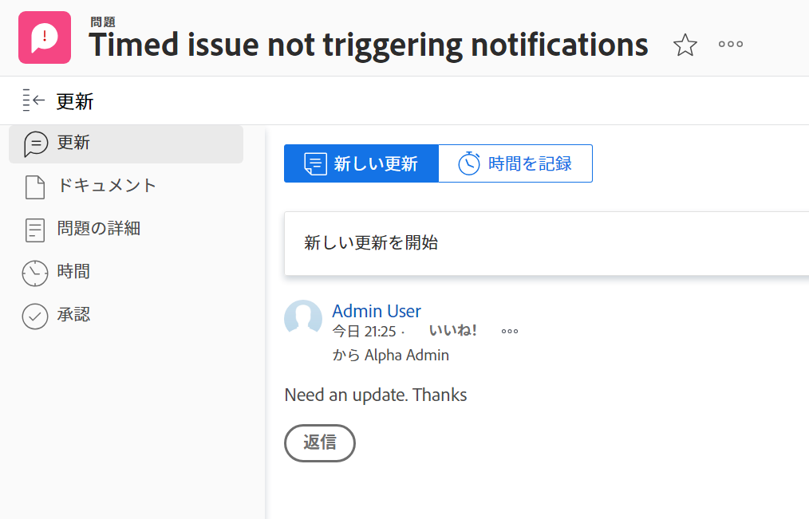
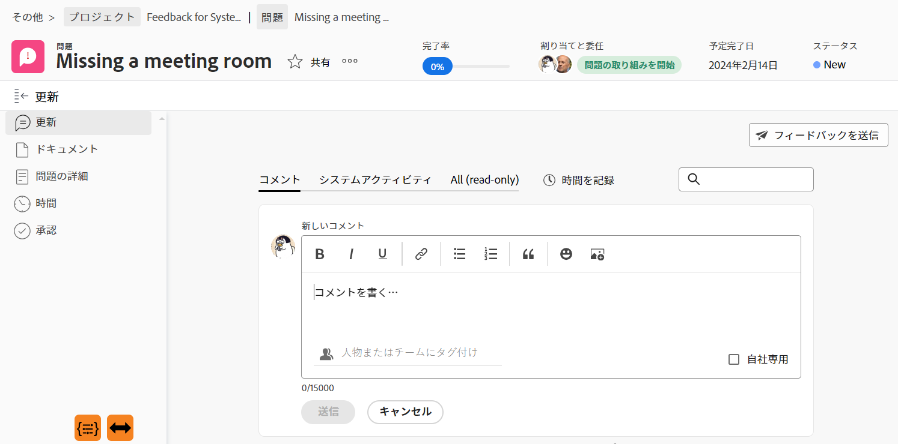

# アップデートセクションの概要

<!--take "Beta" references out when we remove the beta-->

このページで強調表示されている情報は、まだ一般に利用できない機能を示しています。 この機能は、プレビュー環境でのみ、すべてのお客様が利用できます。

>[!NOTE]
>
>現在、Adobe Workfrontでのコメント作成エクスペリエンスの再設計中です。
>
>新しいコメントエクスペリエンスについて詳しくは、 [新しいコメントエクスペリエンス](../../product-announcements/betas/new-commenting-experience-beta/unified-commenting-experience.md).
>
>次のオブジェクトの新しいエクスペリエンスにアクセスできます。
> * 問題、 プロジェクト、タスク、ドキュメント.
>
>     これは、コメント作成ベータ版のエクスペリエンスを有効にした場合に使用できます。
>
>     この機能は、「更新」セクションでのみ使用でき、次の領域では使用できません。
>
>     * ホーム
>     * リストの概要パネル
>     * タイムシートの概要パネル
>
> * 目標、ボード領域のカード
>
>   新しいコメントエクスペリエンスは、目標とカードの唯一のエクスペリエンスです。 Workfront Goals にアクセスするには、追加のライセンスが必要です。 詳しくは、 [Workfront目標の使用要件](../../workfront-goals/goal-management/access-needed-for-wf-goals.md).
>
>     カードの「コメント」セクションと「システムアクティビティ」セクションを有効にすると、「ボード」領域でカードの更新を追加し、表示することができます。 詳しくは、 [ボードへのアドホックカードの追加](../../agile/get-started-with-boards/add-card-to-board.md).

オブジェクトの「更新」(Updates) セクションには、オブジェクトに対してユーザーが行ったコメント、またはオブジェクトの変更を追跡するシステム更新が表示されます。

## アップデートセクションの概要

「更新」セクションの情報は、アクセス元の環境に応じて異なります。

### 現在の更新の節の概要

オブジェクトの「更新」セクションには、過去 90 日以内におこなわれた最新の更新のうち、最大 200 個が表示されます。

現在の更新のセクションには、次の情報が表示されます。

* ユーザーが行ったコメントと、そのコメントへの返信。
* 特定のイベントをオブジェクトに記録するためにWorkfrontが作成する情報メッセージです。 例えば、システムの更新を含むステータス、名前、またはカスタムフィールドの変更を取り込むことができます。 Workfrontまたはグループ管理者が、オブジェクトのシステム更新を有効にすることができます。 詳しくは、 [システム更新の構成](../../administration-and-setup/set-up-workfront/system-tracked-update-feeds/configure-system-updates.md).

次のオブジェクトの「更新」セクションが表示されます。

<table style="table-layout:auto"> 
 <col> 
 <col> 
 <tbody> 
  <tr> 
   <td> 
    <ul> 
     <li>ドキュメント</li> 
     <li>目標</li> 
     <li>問題</li> 
     <li>イテレーション</li> 
     <li>プロジェクト</li> 
     <li>プログラム</li> 
     <li>ポートフォリオ</li> 
    </ul> </td> 
   <td> 
    <ul> 
     <li>ストーリー*</li> 
     <li>タスク</li> 
     <li>テンプレート</li> 
     <li>テンプレート タスク</li> 
     <li>タイムシート</li> 
     <li>ユーザー</li>
    </ul> </td> 
  </tr> 
 </tbody> 
</table>
*ストーリーはタスクです。 タスクに関する情報はすべて、ストーリーに対しても利用できます。

### ベータコメントエクスペリエンスの更新の節の概要

新しいコメントエクスペリエンスで使用できる機能とオブジェクトについて詳しくは、 [新しいコメントエクスペリエンス](../../product-announcements/betas/new-commenting-experience-beta/unified-commenting-experience.md).

「更新」セクションには、新しいコメントエクスペリエンスの次のタブに情報が表示されます。

* **コメント**:ユーザーが行ったコメントと、それらのコメントに対する返信を表示します。 新しいコメントエクスペリエンスでのオブジェクトの更新について詳しくは、 [作業を更新](../updating-work-items-and-viewing-updates/update-work.md).
* **システムアクティビティ**:特定のイベントをオブジェクトに記録するためにWorkfrontが作成する情報メッセージであるシステム更新を表示します。 例えば、システムの更新を含むステータス、名前、またはカスタムフィールドの変更を取り込むことができます。 Workfrontまたはグループ管理者が、オブジェクトのシステム更新を有効にすることができます。 詳しくは、 [システム更新の構成](../../administration-and-setup/set-up-workfront/system-tracked-update-feeds/configure-system-updates.md).

現在、次のオブジェクトに対する新しいコメント作成機能を使用して、コメントを追加したり、更新に返信したりできます。

<table style="table-layout:auto"> 
 <col> 
 <col> 
 <tbody> 
  <tr> 
   <td> 
    <ul> 
     <li>
目標

     <li>ボード領域のカード*</li>
      これが目標とカードの唯一の経験です。
     </li> 
     <li>プロジェクト</li>
    </ul> </td> 
   <td> 
    <ul> 
     <li>問題</li> 
     <li>タスク</li>
     <li>ドキュメント</li>
     </ul> </td> 
  </tr> 
 </tbody> 
</table>

*カードの「コメント」セクションと「システムアクティビティ」セクションを有効にすると、ボードエリアでカードの更新を追加および表示できます。 詳しくは、 [ボードへのアドホックカードの追加](../../agile/get-started-with-boards/add-card-to-board.md).

## 上位のオブジェクトにも表示される更新

特定のオブジェクトに対して更新を加えたコメントや返信は、上位のオブジェクトの「更新」セクションにも表示されます。

たとえば、タスクに更新を追加すると、更新がタスクの [ 更新 ] セクションと、タスクを含むプロジェクトの [ 更新 ] セクションに表示されます。

>[!NOTE]
>
>新しいコメントベータ版エクスペリエンスを有効にすると、コメントは次の上位のオブジェクトに表示されます。
>
>* 問題
>* プロジェクト
>* タスク
>
>詳しくは、 [新しいコメントエクスペリエンス](../../product-announcements/betas/new-commenting-experience-beta/unified-commenting-experience.md).

次の表に、コメントが上位のオブジェクトにも表示されるオブジェクトを示します。

<table style="table-layout:auto"> 
 <col> 
 <col> 
 <thead> 
  <tr> 
   <th><strong>元の更新が追加されたオブジェクト</strong> </th> 
   <th> 
<strong>元の更新も表示される上位のオブジェクト</strong> 
 </th> 
  </tr> 
 </thead> 
 <tbody> 
  <tr> 
   <td>問題</td> 
   <td>プロジェクト</td> 
  </tr> 
  <tr> 
   <td>タスク</td> 
   <td>プロジェクト</td> 
  </tr> 
  <tr> 
   <td>プロジェクト</td> 
   <td>プログラム、Portfolio</td> 
  </tr> 
  <tr data-mc-conditions=""> 
   <td>ドキュメント </td> 
   <td>ドキュメントが添付されるオブジェクト、プロジェクト </td> 
  </tr> 
  <tr> 
   <td>プログラム</td> 
   <td>ポートフォリオ</td> 
  </tr> 
  <tr> 
   <td>ユーザー</td> 
   <td>チーム</td> 
  </tr> 
  <tr> 
   <td>タイムシート</td> 
   <td>ユーザー、チーム</td> 
  </tr> 
  <tr> 
   <td>テンプレート タスク</td> 
   <td>テンプレート</td> 
  </tr> 
  <tr> 
   <td>ストーリー</td> 
   <td>反復、チーム</td> 
  </tr> 
  <tr> 
   <td>反復</td> 
   <td>チーム</td> 
  </tr>

<tr> 
   <td>目標</td> 
   <td>結果、アクティビティ</td> 
  </tr> 
 </tbody> 
</table>

>[!NOTE]
>
>システム更新に追加された返信は、親オブジェクトにロールアップされません。 子オブジェクトに対する直接応答と、既存の更新に追加された返信のみが、親オブジェクトにロールアップされます。
>
>Adobe Workfrontのオブジェクト階層について詳しくは、 [Adobe Workfrontのオブジェクトについて](../../workfront-basics/navigate-workfront/workfront-navigation/understand-objects.md).
>
> 新しいコメントベータ版エクスペリエンスでは、システムの更新に返信できません。 詳しくは、 [新しいコメントエクスペリエンス](../../product-announcements/betas/new-commenting-experience-beta/unified-commenting-experience.md).

## 更新の節の制限

チームの「更新」セクションでは、他のユーザーに代わって更新を入力する場合の制限事項がいくつかあります。

### ユーザーおよびチームの制限

チームを更新することはできません。 チームの「更新」セクションには、次のオブジェクトに入力された更新が入力されます。

* ユーザー
* タイムシート
* ストーリー
* イテレーション

ユーザーおよびチームの「更新」セクションでは、過去 90 日間に入力された更新を表示できます。

ユーザーまたはチームに対しておこなわれたすべての更新を 90 日の制限を超えて確認する場合は、メモに関するレポートを作成できます。 ユーザーまたはチームが行った更新をすべて表示する時間フィルターをレポートに含めないでください。 詳しくは、 [カスタムレポートの作成](../../reports-and-dashboards/reports/creating-and-managing-reports/create-custom-report.md).

### 別のユーザーの代わりにコメントを入力する際の制限

Adobe Workfrontの管理者とグループ管理者は、他のユーザーとしてログインし、Workfrontでコメントの入力などのアクションを実行できます。

詳しくは、 [別のユーザーとしてログイン](../../administration-and-setup/add-users/create-and-manage-users/log-in-as-another-user.md).

別のユーザーに代わって行われたコメントは、コメントに示されます。

>[!NOTE]
>
>新しいコメントエクスペリエンスを使用する場合、コメントは別のユーザーとしてログインしたユーザーとして追加され、他のユーザーに代わってコメントを追加していることを示すものではありません。
>
>例えば、Workfront管理者が別のユーザーとしてログインした場合、コメントに関連付けられているユーザーはWorkfront管理者になります。 詳しくは、 [新しいコメントエクスペリエンス](../../product-announcements/betas/new-commenting-experience-beta/unified-commenting-experience.md). 

グループ管理者は、別のユーザーの代わりにコメントを作成できますが、そのコメントは削除できません。 別のユーザーに代わって作成したコメントを削除できるのは、Adobe Workfront管理者のみです。

## 仕訳入力レポートを使用して作業項目のシステム更新を表示

仕訳レポートは、プロジェクト、タスクおよび問題の更新領域からシステムの更新を表示します。

このレポートでは、次の情報を確認できます。

* ステータスの変更が発生した回数
* タスクまたはイシューが削除されたとき
* 重要なカスタムフィールドの値がプロジェクトの過程でどのように変化したか
* プロジェクトの過程で変わった重要な日付
* プロジェクトの進行中に優先度が変更された場合
* プロジェクトの所有者が変更された場合

詳しくは、 [更新領域に関するレポート](../../reports-and-dashboards/reports/creating-and-managing-reports/create-journal-entry-report.md).
