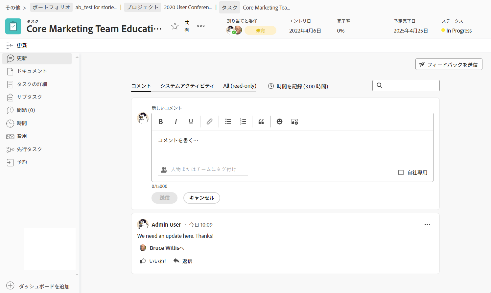
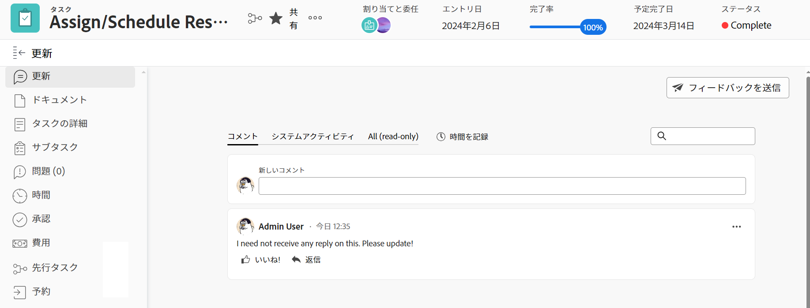

# 「更新」セクションの概要

{{highlighted-preview}}

<!-- Audited: 1/2024 -->

<!--take "legacy" and "new commenting" references out when we remove the legacy - April 2024???-->

<!--The highlighted information on this page refers to functionality not yet generally available. It is available only in the Preview environment for all customers. 

For information about the current release schedule, see [First Quarter 2024 release overview](/help/quicksilver/product-announcements/product-releases/24-q1-release-activity/24-q1-release-overview.md). -->

>[!IMPORTANT]
>
>現在アドビでは、Adobe Workfront のコメントエクスペリエンスを再設計しているところです。
>
>どのオブジェクトに対してコメント作成機能にアクセスするかに応じて、「更新」セクションに次の機能が表示されます。
>* 新しいエクスペリエンス
>* 従来のエクスペリエンス
>* 新しいエクスペリエンスと従来のエクスペリエンス
>
>この記事では、更新の新しいバージョンと従来のバージョンに関する情報を説明します。
>
>新しいコメントエクスペリエンスとその可用性について詳しくは、 [新しいコメントエクスペリエンス](../../product-announcements/betas/new-commenting-experience-beta/unified-commenting-experience.md).
>
>新しいコメントエクスペリエンスは、Workfrontオブジェクトの「更新」セクションでのみ使用でき、次の領域からオブジェクトにアクセスする場合は使用できません。
>
> * ホーム
> * リストの概要パネル
> * タイムシートの概要パネル
> * ワークロードバランサーの概要パネル
>
>新しいコメントエクスペリエンスは、リスト、タイムシート、およびプレビュー環境のワークロードバランサーの [ 概要 ] パネルで使用できます。

## 「更新」セクションの概要

オブジェクトの「更新」セクションには、システムの更新と、過去 90 日以内にユーザーが行った最新の更新のうち、最大 200 個が表示されます。

プレビュー環境の「更新」セクションの例：

実稼動環境の「更新」セクションの例：

どのオブジェクトに対してコメント作成機能にアクセスするかに応じて、「更新」セクションに次のような操作が表示されます。

* 次のオブジェクトの新しいコメントエクスペリエンスと従来のコメントエクスペリエンスの両方：

   * プロジェクト
   * タスク（ストーリーを含む）
   * イシュー
   * ドキュメント

     >[!TIP]
     >
     >「新しいコメント」オプションを使用して、新しいコメントエクスペリエンス（有効にした場合）または従来のコメントエクスペリエンス（無効にした場合）を表示します。 新しいコメントエクスペリエンスがデフォルトです。 詳しくは、[新しいコメントエクスペリエンス](../../product-announcements/betas/new-commenting-experience-beta/unified-commenting-experience.md)を参照してください。

* 以下に示すオブジェクトの新しいコメントエクスペリエンスのみ。 これらのオブジェクトに対して従来のコメント作成機能を有効にするオプションはありません。

   * 目標

     >[!NOTE]
     >
     >Workfront のこのエリアにアクセスするには、Adobe Workfront Goals に対する追加のライセンスが必要です。詳しくは、[Workfront Goals の使用要件](../../workfront-goals/goal-management/access-needed-for-wf-goals.md)を参照してください。

   * ボード上のカード
   * チーム
   * テンプレート
   * テンプレートタスク
   * タイムシート
   * プログラム
   * ポートフォリオ
   * ユーザー

* 次のオブジェクトに対する従来のコメントエクスペリエンスのみ：

   * イテレーション

     繰り返しの新しいコメントエクスペリエンスを有効にするオプションはありません。

### 新しいコメントエクスペリエンスの更新の節の概要

プレビュー環境の「更新」セクションの例：

実稼動環境の「更新」セクションの例：

>[!NOTE]
>
>新しいコメントエクスペリエンスは、繰り返しでは使用できません。

* 「更新」セクションには、新しいコメントエクスペリエンスの次のタブに情報が表示されます。

   * **コメント**：ユーザーが行ったコメントと、そのコメントに対する返信を表示します。「コメント」タブを使用して、新しいコメントを追加したり、既存のコメントに返信したりします。 新しいコメントエクスペリエンスでのオブジェクトの更新について詳しくは、[作業の更新](../updating-work-items-and-viewing-updates/update-work.md)を参照してください。
   * **システムアクティビティ**：オブジェクトに関する特定のイベントを記録するために Workfront が作成する情報メッセージである、システム更新を表示します。例えば、ステータス、名前、またはカスタムフィールドの変更は、システムの更新によって取り込まれます。 Workfront またはグループ管理者は、オブジェクトのシステム更新を有効にすることができます。詳しくは、[システム更新の設定](../../administration-and-setup/set-up-workfront/system-tracked-update-feeds/configure-system-updates.md)を参照してください。
   * **すべて（読み取り専用）**：ユーザーコメントとシステムアクティビティコメントの両方を 1 か所に表示します。 これは表示専用のタブです。 「すべて」タブでは、既存のコメント内のコメントに対して返信したり、他のユーザーにタグ付けしたりすることはできません。 特定のコメントに返信するには、「すべて」タブから「コメント」タブへのリンクを使用します。 新しいコメントエクスペリエンスでのオブジェクトの更新について詳しくは、 [作業を更新](../updating-work-items-and-viewing-updates/update-work.md).

* 次のオブジェクトには「システムアクティビティ」タブがありません または「すべて」タブ:

   * チーム
   * テンプレート
   * テンプレートタスク
   * アドホックカード

### 従来のアップデートの節の概要

<!--when we remove legacy, make this section an "Iterations-only" section-->

「従来の更新」セクションには、次の情報が表示されます。

* **ユーザーの更新**：ユーザーがおこなったコメント、およびそれらのコメントに対する返信。
* **システムの更新**：オブジェクトに特定のイベントを記録するためにWorkfrontが作成する情報メッセージ。 例えば、システム更新を含むステータス、名前、またはカスタムフィールドの変更を取り込むことができます。Workfront またはグループ管理者は、オブジェクトのシステム更新を有効にすることができます。詳しくは、[システム更新の設定](../../administration-and-setup/set-up-workfront/system-tracked-update-feeds/configure-system-updates.md)を参照してください。

次のオブジェクトでは、システム更新は記録されません。

* チーム
* テンプレート
* テンプレートタスク
* イテレーション

## 上位のオブジェクトにも表示される更新

特定のオブジェクトに対するコメント、返信、またはシステム更新も、上位のオブジェクトの [ 更新 ] セクションに表示されます。

例えば、タスクを更新すると、その更新はタスクの「更新」セクションと、そのタスクを含んだプロジェクトの「更新」セクションに表示されます。

コメントが上位のオブジェクトにも表示されるオブジェクトを次の表に示します。

<table style="table-layout:auto"> 
 <col> 
 <col> 
 <thead> 
  <tr> 
   <th><strong>元の更新が追加されたオブジェクト</strong> </th> 
   <th> 
<strong>元の更新も表示される上位のオブジェクト</strong> 
 </th> 
  </tr> 
 </thead> 
 <tbody> 
  <tr> 
   <td>イシュー</td> 
   <td>プロジェクト</td> 
  </tr> 
  <tr> 
   <td>タスク</td> 
   <td>プロジェクト</td> 
  </tr> 
  <tr> 
   <td>プロジェクト</td> 
   <td>プログラム、ポートフォリオ</td> 
  </tr> 
  <tr data-mc-conditions=""> 
   <td>ドキュメント </td> 
   <td>ドキュメントが添付されるオブジェクト、プロジェクト </td> 
  </tr> 
  <tr> 
   <td>プログラム</td> 
   <td>ポートフォリオ</td> 
  </tr> 
  <tr> 
   <td>ユーザー</td> 
   <td>チーム</td> 
  </tr> 
  <tr> 
   <td>タイムシート</td> 
   <td>
ユーザー、チーム

   
<b>メモ</b>

   
タイムシートのコメントは、コメントを作成したユーザーの [ 更新 ] セクションと、ホームチームの [ 更新 ] セクションに表示されます。

   </td> 
  </tr> 
  <tr> 
   <td>テンプレートタスク</td> 
   <td>テンプレート</td> 
  </tr> 
  <tr> 
   <td>ストーリー</td> 
   <td>イテレーション、チーム</td> 
  </tr> 
  <tr> 
   <td>イテレーション</td> 
   <td>チーム</td> 
  </tr>

<tr> 
   <td>結果</td> 
   <td>目標</td> 
  </tr> 
  <tr> 
   <td>アクティビティ</td> 
   <td>目標</td> 
  </tr> 
 </tbody> 
</table>

>[!NOTE]
>
>システム更新に追加された返信は、親オブジェクトにロールアップされません。子オブジェクトに対する直接応答と、既存の更新に追加された返信のみが、親オブジェクトにロールアップされます。
>
>Adobe Workfront でのオブジェクトの階層について詳しくは、[Adobe Workfront のオブジェクトについて](../../workfront-basics/navigate-workfront/workfront-navigation/understand-objects.md)を参照してください。
>
> 新しいコメントエクスペリエンスでは、システムの更新に返信できません。 詳しくは、[新しいコメント機能のエクスペリエンス](../../product-announcements/betas/new-commenting-experience-beta/unified-commenting-experience.md)を参照してください。

## 「更新」セクションの概要

チームの「更新」セクションでは、他のユーザーに代わって更新を入力する場合の制限事項がいくつかあります。

### ユーザーおよびチームの制限

ユーザーおよびチームの更新を表示する際は、次の点を考慮してください。

* チームの「更新」セクションで新しいコメントを追加することはできません。

* チームで表示する更新に返信を追加できます。 返信は、チームの更新セクションに表示され、返信が属するオブジェクトの更新セクションにも表示されます。

* チームの「更新」セクションには、次のオブジェクトに入力された更新が入力されます。

   * ユーザー
   * タイムシート*
   * ストーリー
   * 反復*

  *新しいコメントエクスペリエンスでは使用できません。

* ユーザーおよびチームの「更新」セクションでは、過去 90 日間に入力された更新を表示できます。

  ユーザーまたはチームに対して行われたすべての更新を 90 日の制限を超えて確認する場合は、メモに関するレポートを作成できます。ユーザーまたはチームが行った更新をすべて表示する時間フィルターをレポートに含めないでください。詳しくは、[カスタムレポートの作成](../../reports-and-dashboards/reports/creating-and-managing-reports/create-custom-report.md)を参照してください。

### 別のユーザーの代わりにコメントを入力する際の制限

Adobe Workfront 管理者とグループ管理者は、他のユーザーとしてログインし、Workfront でコメントの入力などのアクションを実行できます。

詳しくは、[別のユーザーとしてログイン](../../administration-and-setup/add-users/create-and-manage-users/log-in-as-another-user.md)を参照してください。

別のユーザーとしてログインし、コメントを追加する際は、次の点を考慮してください。

* 別のユーザーに代わって行われたコメントは、コメントに示されます。

* グループ管理者は、別のユーザーの代わりにコメントを作成できますが、そのコメントは削除できません。別のユーザーに代わって作成したコメントを削除できるのは、Adobe Workfront 管理者のみです。

* Workfrontまたはグループ管理者は、別のユーザーとしてログアウトし、自分自身として再度ログインした場合にのみ、自分が追加したコメントを編集できます。 別のユーザーに代わってコメントを削除することはできません。

## ジャーナルエントリレポートを使用した作業アイテムのシステム更新の表示

ジャーナルエントリレポートには、プロジェクト、タスク、イシューの更新エリアからシステムの更新が表示されます。

このレポートでは、次の情報を確認できます。

* ステータスの変更が発生した回数
* タスクまたはイシューがいつ削除されたか
* 重要なカスタムフィールドの値が、プロジェクトの過程でどのように変化したか
* プロジェクトの過程で変わった重要な日付
* プロジェクトの過程で優先度が変更されたかどうか
* プロジェクトの所有者が変更されたかどうか

詳しくは、[更新エリアのレポート](../../reports-and-dashboards/reports/creating-and-managing-reports/create-journal-entry-report.md)を参照してください。
