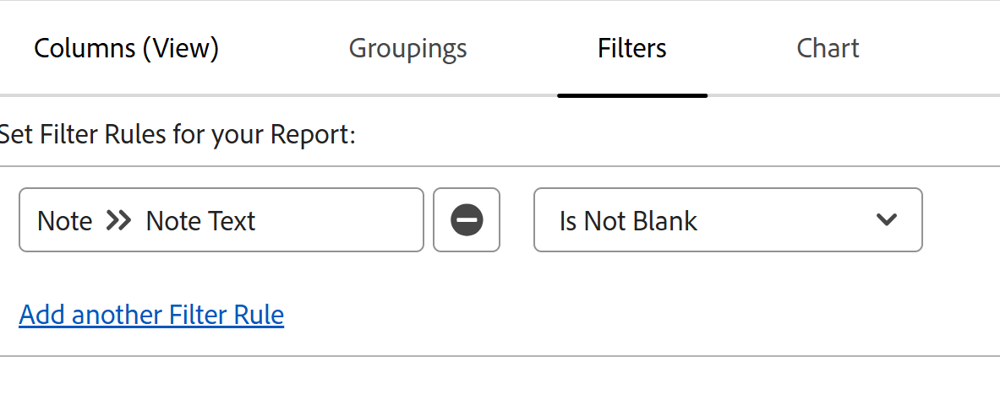

# メモレポートでのすべての更新の表示

<!-- Audited: 10/2025 -->

<!--

(NOTE: Alina: ***This is a report and it is in the Getting Started/ Updates section because I think it makes more sense to be in this area, where people want to view updates. - added this to this section from Reporting on 7/3/2018 ) 

-->

オブジェクトの「更新」領域には、デフォルトで最大200件の更新が表示されます。 ユーザーがオブジェクトに入力したすべての更新を確認するには、すべての更新を表示するメモ レポートを作成します。

>[!NOTE]
>
>レポートを作成して、ジャーナルエントリレポートを使用してプレビューでオブジェクトの更新を表示できます。詳しくは、「[ ジャーナルエントリレポートを使用した更新領域に関するレポート ](../../reports-and-dashboards/reports/creating-and-managing-reports/create-journal-entry-report.md)」を参照してください。

## アクセス要件

+++ 展開すると、この記事の機能のアクセス要件が表示されます。

<table style="table-layout:auto"> 
 <col> 
 </col> 
 <col> 
 </col> 
 <tbody> 
  <tr> 
   <td role="rowheader">Adobe Workfront パッケージ</td> 
   <td> 
任意
 </td> 
  </tr> 
  <tr> 
   <td role="rowheader">Adobe Workfront プラン</td> 
   <td> 
標準

   
プラン
 </td> 
  </tr> 
  <tr> 
   <td role="rowheader">アクセスレベル設定</td> 
   <td> 
次の作成機能を持つ編集アクセス：
 
    <ul> 
     <li> 
レポート、ダッシュボード、カレンダー
 </li> 
     <li> 
フィルター、ビュー、グループ化
 </li> 
    </ul> </td> 
  </tr> 
  <tr> 
   <td role="rowheader">オブジェクト権限</td> 
   <td> 
レポート内のオブジェクトに対する権限の表示

   </td> 
  </tr> 
 </tbody> 
</table>

詳しくは、[Workfront ドキュメントのアクセス要件](/help/quicksilver/administration-and-setup/add-users/access-levels-and-object-permissions/access-level-requirements-in-documentation.md)を参照してください。

+++

<!--
Old:
<table style="table-layout:auto"> 
 <col> 
 </col> 
 <col> 
 </col> 
 <tbody> 
  <tr> 
   <td role="rowheader">Adobe Workfront plan</td> 
   <td> 
Any
 </td> 
  </tr> 
  <tr> 
   <td role="rowheader">Adobe Workfront license</td> 
   <td> 
New: Standard 

   
Current: Plan
 </td> 
  </tr> 
  <tr> 
   <td role="rowheader">Access level configurations</td> 
   <td> 
Edit access to:
 
    <ul> 
     <li> 
Create Reports, Dashboards, and Calendars
 </li> 
     <li> 
Create Filters, Views, and Groupings
 </li> 
    </ul> </td> 
  </tr> 
  <tr> 
   <td role="rowheader">Object permissions</td> 
   <td> 
View

    
Note: If you do not have View permission or higher to an object, information for that object doesn't display in the report.
  </td> 
  </tr> 
 </tbody> 
</table>
-->

## メモレポートの作成

どのオブジェクトのメモに関しても、レポートの作成は、オブジェクトに関係なく同じです。

例えば、プロジェクト上のすべてのメモに関するメモレポートを作成するには、次の手順を実行します。

{{step1-to-reports}}

1. ページの左上隅にある「**新規レポート**」をクリックし、「**メモ**」を選択します。

1. （オプション）「**（列）ビュー**」をクリックし、**列**&#x200B;を追加して、**プロジェクト**&#x200B;の&#x200B;**名**&#x200B;をレポートのビューに追加します。

1. （オプション）複数のプロジェクトを同時に報告する場合は、**グループ化**&#x200B;をクリックし、**グループ化を追加**&#x200B;して、**プロジェクト**&#x200B;の&#x200B;**名前**&#x200B;でグループ化します。 これにより、メモが各プロジェクトごとにグループ化され、レポートが読みやすくなります。

1. （オプション）「**フィルター**」をクリックしてから、**フィルタールールを追加**&#x200B;します。
1. **Note** > **Note Text** > **Is Not Blank**&#x200B;のフィルターを追加します。

   

   >[!TIP]
   >
   >   プロジェクトフィールドが更新されたが、更新時にメモが追加されなかった場合、更新の&#x200B;**メモテキスト**&#x200B;は&#x200B;**（更新に追加されたテキストはありません）**&#x200B;と表示されます。

1. （オプション） **プロジェクト** > **名前** > **次と等しい**&#x200B;の別のフィルターを追加し、メモを表示する1つまたは複数のプロジェクト名を追加します。
1. **保存+閉じる**&#x200B;をクリックします。 プロジェクトを表示する権限を持つすべてのユーザーがプロジェクトに入力したすべての更新が、レポートに表示されます。
