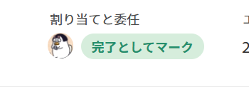
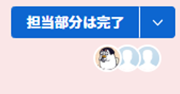

# 「作業と完了」ボタンの概要

タスクまたはイシューに割り当てられた場合は、コンテキストボタンを使用して、作業項目に関与した内容に応じて名前や機能を変更できます。

コンテキストボタンを使用して作業項目を確定または完了すると、Adobe Workfrontでは、手動で項目を更新しなくても、項目に関する複数のフィールドを更新できます。

## 操作と「完了」ボタン名

次のシナリオに示すように、タスクまたはイシューにアクセスする元のWorkfrontの領域に応じて、「Work On It」または「Done」ボタンの名前が変わる場合があります。 

* タスクまたはタスクが最初に割り当てられ、ステータスが [ 新規 ] になると、ボタンは [ 作業 ] と表示されます。

   

   >[!TIP]
   >
   >「Work On It」ボタンを「Start」ボタンに置き換えることができます。 「Work On It」ボタンを「Start」ボタンに置き換える方法については、  [「作業対象」ボタンを「開始」ボタンに置き換えます](../../people-teams-and-groups/create-and-manage-teams/work-on-it-button-to-start-button.md) .

* 「作業を承認」をクリックした後、Workfrontでタスクにアクセスした場所やタスクの内容に応じて、ボタンが「完了としてマーク」または「完了」に変わります。 「Work On It」ボタンにアクセスできる場所について詳しくは、「 [「作業と完了」ボタンを見つけます。](#locate-the-work-on-it-and-done-button) 」を参照してください。

   

* タスクまたはイシューに割り当てられた項目だけでなく、[ ホーム ] 領域の [ 作業リスト ] から作業項目にアクセスする場合、ボタンは [ 自分のパーツで完了 ] に変わります。

   

## 「作業と完了」ボタンを見つけます。 {#locate-the-work-on-it-and-done-button}

Workfrontの次の領域に、「作業」ボタンと「完了」ボタンがあります。

* [ ホーム ] 領域（[ 作業リスト ] または [ 詳細 ] パネル内）

   ホーム領域での完了としての項目のマークについては、 [ホーム領域で項目を完了としてマーク](../../workfront-basics/using-home/using-the-home-area/mark-item-done-in-home.md).

* タスクまたはイシューのヘッダー

   オブジェクトヘッダーについて詳しくは、 [新しいオブジェクトヘッダー](../../workfront-basics/the-new-workfront-experience/new-object-headers.md).

* リストまたはワークロードバランサーのタスクまたは問題の概要パネル

   概要パネルの使用については、 [概要の概要](../../workfront-basics/the-new-workfront-experience/summary-overview.md).

## 「作業と完了」ボタンをクリックすると自動的に更新されるフィールドの概要

「 IT での作業」ボタンと「完了」ボタンを使用する利点は、Workfrontが割り当てられた作業項目に関する情報を自動的に更新できることです。

* [「作業」ボタン](#work-on-it-button)
* [開始ボタン](#start-button)
* [「完了」ボタン](#the-done-button)

### 「作業」ボタン {#work-on-it-button}

「作業」をクリックすると、次の項目も更新されます。

* 割り当てステータスの更新がリクエスト済みから作業中に

   >[!TIP]
   >
   >「割り当てステータス」フィールドは、レポートおよびリストにのみ表示されます。 「割り当てステータス」フィールドについて詳しくは、 [Adobe Workfrontの用語集](../../workfront-basics/navigate-workfront/workfront-navigation/workfront-terminology-glossary.md).

* コミット日

   コミット日について詳しくは、 [コミット日の概要](../../manage-work/projects/updating-work-in-a-project/overview-of-commit-dates.md).

### 開始ボタン {#start-button}

チームの編集にアクセスできる場合は、「 Work On It 」ボタンをチームの「 Start 」ボタンに置き換えることができます。 そのチームをホームチームとして持つユーザーが、割り当て先の項目の [ 開始 ] ボタンをクリックすると、作業項目の追加フィールドが自動的に更新されます。 「Work On It」ボタンを「Start」ボタンに置き換える方法については、 [「作業対象」ボタンを「開始」ボタンに置き換えます](../../people-teams-and-groups/create-and-manage-teams/work-on-it-button-to-start-button.md).

[ 作業 ] ボタンをクリックすると更新されるフィールドに加え、次のフィールドは、[ 開始 ] ボタンをクリックすると、タスクまたは問題に関する情報も自動的に更新されます。

* ステータス
* 実際の開始日

   実際の開始日については、 [プロジェクトの概要実績開始日](../../manage-work/projects/planning-a-project/project-actual-start-date.md).

* 実際の完了日： 「開始」ボタンが、「完了」または「クローズ」のステータスに関連付けられている場合。

   実際の完了日については、 [プロジェクトの概要実績完了日](../../manage-work/projects/planning-a-project/project-actual-completion-date.md).

>[!NOTE]
>
>[ 元に戻す ] ボタンをクリックすると、作業項目が元の状態に戻り、実際の開始日が削除されます。
>
>以下の領域では、「元に戻す」ボタンは使用できません。
>
>* チームリクエスト
>* タスクヘッダー
>

### 「完了」ボタン {#the-done-button}

チームの編集にアクセスできる場合は、チームが項目を完了済みとマークしたときにタスクまたは問題のステータスを更新するための「完了」ボタンを設定できます。 そのチームをホームチームとして持つユーザーがアイテムの [ 完了 ] ボタンをクリックすると、次のフィールドがタスクまたはイシューで自動的に更新されます。

* ステータス
* 割り当てステータスの更新（作業から完了）
* 実際の完了日

チームの「完了」ボタンの設定については、次の記事を参照してください。

* [タスクの「完了」ボタンの設定](../../people-teams-and-groups/create-and-manage-teams/configure-the-done-button-for-tasks.md)
* [問題が発生しないように「完了」ボタンを設定します](../../people-teams-and-groups/create-and-manage-teams/configure-the-done-button-for-issues.md)
