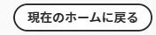

# Adobe Workfrontの新しいホームを開始する

新しいホームは、作業を管理するための強力な新機能です。 この柔軟なスペースは、ユーザーにとって最も重要な作業を強調し、タスク、発行、リクエスト、承認の管理を合理化するためにカスタマイズできます。

## 新規ホームのカスタマイズ

New Home は、高度にカスタマイズ可能に設計され、最も重要な作業を追跡するウィジェットを選択したり、期限に応じてその作業の範囲をフィルターしたり、色のスプラッシュを追加したりできます。

### ウィジェット

ウィジェットは、新しいホームの基礎です。 ウィジェットをホームページに追加することで、作業のニーズに最も合うように表示する情報のタイプを選択できます。 一部のウィジェットは、特定のライセンスの種類に対してのみ使用できます。それらのウィジェットが追跡するオブジェクトは、それらのライセンスに対してのみ使用できるからです。 ウィジェットの追加、移動、サイズ変更、削除について詳しくは、 [新しいホームでウィジェットを追加、編集、または削除する](/help/quicksilver/workfront-basics/using-home/new-home/add-edit-remove-widgets-in-new-home.md).

以下に、現在選択可能な 10 個のウィジェットと、それらが表示する情報の概要を示します。

* **担当作業**\
    このウィジェットは、様々な作業を管理するための開始点として最適で、割り当てられたすべてのタスク、イシュー、リクエストが 1 か所に表示されます。

* **マイプロジェクト**\
    自分に割り当てられているプロジェクトをテーブルに表示します。このテーブルを並べ替えて、自分が所有するプロジェクトのみを表示するか、標準のフィルター、ビューおよびグループ化オプションを使用しているすべてのプロジェクトを表示できます。また、新しいプロジェクトを直接作成するボタンも表示します。

* **マイタスク**\
    自分に割り当てられたタスクを、カスタマイズ可能なフィルター、ビュー、グループを備えたテーブルに表示し、新しいタスクを直接作成するボタンも表示します。

* **マイ問題**\
    カスタマイズ可能なフィルター、ビュー、グループ化を含むテーブル内に、自分に割り当てられている問題と、新しい問題を直接作成するためのボタンが表示されます。 このウィジェットには、関連するプロジェクトが「現在」に設定されている問題のみが含まれます。

* **私のリクエスト**\
    送信したすべてのリクエスト、開いているリクエストのみを表示するフィルター、およびリクエストの概要ペインを開くボタンが表示されます。

* **チームリクエスト**\
    自分が所属するチームのすべての保留中のリクエストをチームごとに並べ替えて表示します。また、直接ユーザーにリクエストを割り当てたり、自分で作業したりするためのボタンも表示します。

* **マイ承認待ち**\
    すべての保留中の割り当て済みまたは委任済みの承認、承認を委任するボタン、直接ウィジェット内で承認の決定を行うボタンを表示します。

* **すべての承認**\
    組織のすべての承認を、カスタマイズ可能な列を含むテーブルに表示し、特定の承認を検索できる検索バーも表示します。

* **メンション**\
    Workfront全体（マイアップデートページと同様）からの最近のコメントスレッドと、ウィジェット内で返信を作成できる返信ボタンを表示します。 このウィジェットは、過去 30 日間にタスクまたはイシューが更新された限り、タスクやイシューに対するコメント、自分が他のユーザーに割り当てたコメント、自分が所有しているコメント、主な連絡先、自分が作成したコメントも表示します。

* **To Do**\
    この独自のウィジェットを使用すると、自由に編集できる個人用チェックリストにテキスト項目を追加できます。

  >[!NOTE]
  >
  >TODO ウィジェットで TODO を作成するには、タスクを作成する権限が必要です。

デフォルトでは、ホームページには、ライセンスの種類に基づいて、いくつかの特定のウィジェットが入力されます。 次の表は、各ライセンスタイプのユーザーが最初に新規ホームに移動したときに表示されるウィジェットの概要を示しています。

<table border="1" class="inlineTable">
    <tr>
        <td><b>現在のライセンスの種類</b></td>
        <td><b>デフォルトのウィジェット</b></td>
    </tr>
    <tr>
        <td>標準</td>
        <td>自分のプロジェクト、自分の仕事、メンション、To-Do</td>
    </tr>
    <tr>
        <td>ライト</td>
        <td>私の仕事、私の承認待ち</td>
    </tr>
    <tr>
        <td>コントリビューター</td>
        <td>自分のリクエスト、メンション、自分の承認待ち、ボード</td>
    </tr>
    <tr>
        <td>外部</td>
        <td>承認待ち</td>
    </tr>
</table>

<table border="1" class="inlineTable">
    <tr>
        <td><b>レガシーライセンスの種類</b></td>
        <td><b>デフォルトのウィジェット</b></td>
    </tr>
    <tr>
        <td>計画</td>
        <td>マイプロジェクト、メンション、To-Do</td>
    </tr>
    <tr>
        <td>作業</td>
        <td>自分の仕事、メンション、To-Do</td>
    </tr>
    <tr>
        <td>確認</td>
        <td>自分の作業、メンション</td>
    </tr>
    <tr>
        <td>リクエスト</td>
        <td>マイプロジェクト（承認待ち）</td>
    </tr>
    <tr>
        <td>参加</td>
        <td>自分の作業、メンション</td>
    </tr>
    <tr>
        <td>外部</td>
        <td>承認待ち</td>
    </tr>
</table>

### バックグラウンドのカスタマイズ

ページの上部のカラフルなバナーを選択することで、ホームページに個人用のフレアを少し追加できます。

**ホームの背景の色を変更するには：**

1. Adobe Workfrontアイコンをクリックして、ホームページに移動します。  をクリックします。  次に、 **ホーム**.

1. 画面の右上隅にある「カスタマイズ」ボタンをクリックします。

   

1. Adobe Analytics の **背景** のセクション **カスタマイズ** 表示されたウィンドウで、[ ホーム ] の背景に選択する色をクリックします。 また、 **なし** をクリックして背景を削除します。

## 現在のホームエクスペリエンスに戻す

既存のホームエクスペリエンスを希望するユーザーの場合は、新しいホームをオフに切り替えることができます。

**現在のホームエクスペリエンスに戻るには：**

1. Adobe Workfrontアイコンをクリックして、ホームページに移動します。  をクリックします。  次に、 **ホーム**.

1. をクリックします。 **現在のホームに戻る** 」ボタンをクリックします。

   

1. 表示される確認ウィンドウで、新しいホームでのエクスペリエンスに関する簡単な調査を行うか、 **現在のホームに戻る** 決定を完了し、現在のホームエクスペリエンスに戻す。

>[!NOTE]
>
> システム管理者は、ユーザーのデフォルトとして [ 新しいホーム ] を無効にできます。 システム全体でユーザーのデフォルトのホームエクスペリエンスを変更する方法について詳しくは、 [システム環境設定の指定](/help/quicksilver/administration-and-setup/manage-workfront/security/configure-security-preferences.md).
