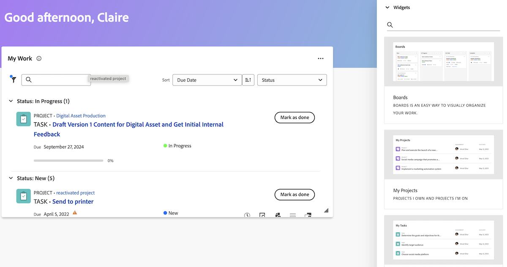

# 従来のホームから新しいホームへの移動

従来のホームは、第 4 四半期のリリースで 10 月 17 日にWorkfrontから削除されます。 この記事では、新しいホームで使用できる機能に関する情報と、ユーザーを新しいホームエクスペリエンスに移行させるWorkfront管理者向けの推奨事項を提供します。

従来のホームの非推奨（廃止予定）について詳しくは、『 [ 従来のホームの非推奨ガイド ](/help/quicksilver/product-announcements/announcements/legacy-home-deprecation.md) 』を参照してください。

## 従来のホームから新しいホームに変化している内容の理解

### 作業リスト

#### 担当作業ウィジェットを使用した作業の整理

自分の作業ウィジェットは、従来のホームのワークリストをできる限り正確に反映するためにウィジェット形式で作成されました。 ユーザーは、類似のフィルターとグループ化を使用して、マイ作業ウィジェットで作業リストをグループ化およびフィルタリングできます。

| **フィルター** | **グループ化** |
|------------|-----------|
| -   を処理中 – 開始準備完了   – 準備未完了   - リクエスト   - デリゲート   – 完了 | - プロジェクト   - ステータス   – 期日   – なし |

**新しいホームで従来のホームグループを使用できない**

* 予定完了日 – 新しいホームで期限に名前が変更された
* 予定開始
* コミット日
* マイ優先度

| **レガシーホーム** | **新しいホーム** |
|------------|-----------|
|  |  |

#### 作業の委任

ユーザーは、次のウィジェットで新しいホームから作業を引き続き委任できます。

* 担当作業
* マイタスク
* マイイシュー
* マイ承認待ち

ユーザーは、次のウィジェットを使用して、自分に委任された作業を検索できます。

* 自分に委任フィルターを使用した自分の作業ウィジェット
* 代理承認フィルターを使用した自分の承認待ち

| **レガシーホーム** | **新しいホーム** |
|------------|-----------|
|  |  |

#### カレンダービューの使用

新しいホームではカレンダーの表示は使用できなくなりましたが、カレンダーの置き換えは優先度のロードマップに記載されています。

#### 個人用タスクの作成

ユーザーは、従来のホームで行ったのと同じ方法で個人タスクを作成できなくなり、代わりに、To Do アイテムを作成できます。

#### 送信済みの承認を表示する

ユーザーが新しいホームで送信した承認を表示できない。 組織内のユーザーがこの機能を必要とする場合は、回避策として承認レポートを作成するか、以下のコミュニティ投稿でアップ投票またはコメントを投稿できます。

* [ 新しいホームに「自分が送信した承認」ウィジェットを追加 ](https://experienceleaguecommunities.adobe.com/t5/workfront-ideas/add-quot-approvals-i-submitted-quot-widget-to-new-home/idc-p/704664#M25269)
* [ 新しいホームに「送信済みの承認」を追加する ](https://experienceleaguecommunities.adobe.com/t5/workfront-ideas/add-quot-approvals-i-submitted-quot-widget-to-new-home/idc-p/704664#M25269)

#### マイ優先度に項目を追加

ユーザーは、新しいホームでマイ優先機能にアクセスできなくなりました。 これを置き換える優先度を持つ新しいマイフォーカス列を導入しています。

ユーザーは、ボードウィジェットを使用して、優先度の高い項目を必要に応じて追跡できます。

### 作業項目を更新

従来のホームでは、ユーザーは右側のパネルを使用して作業内容を更新できます。 新しいホームでは、ユーザーは概要パネルを使用して作業を更新するようになりました。 これは、プロジェクト、タスク、問題、およびドキュメントで使用できる概要パネルと同じです。

#### 概要パネルの使用

概要では、ユーザーは次のことができます

* 完了率の更新
* 更新を追加
* ドキュメント エリアに移動して、ドキュメントをアップロードします
* 作業項目の詳細の表示とカスタムフィールドの更新
Workfront管理者は、レイアウトテンプレートの概要に表示するフィールドをカスタマイズできます。 詳しくは、[ レイアウトテンプレートを使用してホームと概要をカスタマイズする ](/help/quicksilver/administration-and-setup/customize-workfront/use-layout-templates/customize-home-summary-layout-template.md) を参照してください。
* 作業項目の状態の変更
* サブタスクの表示
* 時間を記録
* 添付された承認プロセスの表示
* ファイルのアップロード – この機能は新しくなりました

| **レガシーホーム** | **新しいホーム** |
|------------|-----------|
|  |  |

#### 概要パネルを開きます

ユーザーは、作業項目にマウスポインターを置き、「**概要** アイコンをクリックすると、概要パネルを開くことがで  ます。

概要パネルの使用方法について詳しくは、[ 概要の概要 ](/help/quicksilver/workfront-basics/the-new-workfront-experience/summary-overview.md) を参照してください。

#### クイックアクションの使用

概要パネルに加えて、クイックアクションを使用して次の操作を行うこともできます

* 時間を記録
* 更新を追加
* カスタムフォームの更新
* ファイルのアップロード

クイックアクションメニューを見つけるには、作業項目にポインタを合わせます。 クイックアクションリストは、**作業対象** または **完了** ボタンの近くに表示されます。

### 承認およびチーム要求の表示

ユーザーは、次のウィジェットを使用して、新しいホームで引き続き承認とチームリクエストを管理できます。

* マイ承認待ち
* すべての承認
* チームのリクエスト

新しいホームページへのウィジェットの追加について詳しくは、[ 新しいホームでのウィジェットの追加、編集、削除 ](/help/quicksilver/workfront-basics/using-home/new-home/add-edit-remove-widgets-in-new-home.md) を参照してください。

## 使用可能なウィジェットについて学ぶ

ウィジェットは、新しいホームの基礎です。 ホームページにウィジェットを追加することで、ユーザーは、作業のニーズに最も合わせて表示する情報のタイプを選択できます。 一部のウィジェットは、特定のライセンスの種類に対してのみ使用できます。それらのウィジェットが追跡するオブジェクトは、それらのライセンスに対してのみ使用できるからです。

Workfront管理者は、レイアウトテンプレートを使用して、新しいホームで使用できるウィジェットをカスタマイズできます。 詳しくは、[レイアウトテンプレートを使用したオブジェクトヘッダーのカスタマイズ](/help/quicksilver/administration-and-setup/customize-workfront/use-layout-templates/customize-new-home-layout-template.md)を参照してください。

+++ 展開すると、使用可能なウィジェットの詳細なリストが表示されます
以下は、現在選択可能な 11 のウィジェットと、表示される情報の概要です。

* **担当作業**\
   割り当てられたタスク、イシュー、リクエストをすべて 1 か所で表示します。 「作業対象」ボタンをクリックして項目の作業を開始するか、「完了」ボタンをクリックして完了をマークできます。 タスクと問題に関する情報（ステータス、条件、完了率）を更新したり、時間を記録したり、担当作業ウィジェットから更新を追加したりすることもできます。

* **ボード**\
    作成したボードや使用を招待されたボードが表示されます。 基本ボード、かんばんボード、レトロボード、動的ボードなどのテンプレートに基づいて、新しいボードを作成することもできます。

* **マイプロジェクト**\
    _自分が所有するプロジェクト_ または _自分が参加しているプロジェクト_ をリストに表示します。 既存のフィルター、ビュー、グループ化を使用してリストをカスタマイズすることも、ウィジェットから直接プロジェクトを作成することもできます。

* **マイタスク**\
    自分に割り当てられたタスクをリストに表示します。既存のフィルター、ビュー、グループ化を使用してリストをカスタマイズすることも、ウィジェットから直接タスクを作成することもできます。また、オフィスを離れている間にタスクを委任することもできます。

* **マイイシュー**\
    自分に割り当てられたイシューをリストに表示します。既存のフィルター、ビュー、グループ化を使用してリストをカスタマイズすることも、ウィジェットから直接イシューを作成することもできます。このウィジェットには、関連するプロジェクトが現在に設定され、完了したプロジェクトが含まれていないイシューのみが含まれます。 また、オフィスを離れている間にイシューを委任することもできます。

* **マイリクエスト**\
    送信したすべてのリクエスト、開いているリクエストのみを表示するフィルター、リクエストの概要パネルを開くボタンを表示します。

* **チームリクエスト**\
    自分が所属しているチームのすべての保留中のリクエストをチームごとに並べ替えて表示します。また、リクエストをユーザーに直接割り当てるか、自分で作業するためのボタンも表示します。

* **マイ承認待ち**\
    保留中のすべての割り当て済みまたはデリゲートされた承認、承認をデリゲートするボタン、承認の決定をウィジェット内で直接行うボタンを表示します。

* **すべての承認**\
        平均承認時間と決定に関する情報を含む 2 つのグラフと、保留中および期限切れの承認のリストビューを表示します。 この機能は段階的リリースの一部で、現在は特定のお客様のみが利用できます。

* **メンション**\
    マイアップデート ページと同様に、Workfront全体からの最近のコメントスレッドを表示します。 返信ボタンを使用して、ウィジェット内で返信を作成できます。このウィジェットには、タスクまたはイシューが過去 30 日間に更新されている限り、自分が割り当てられている、他のユーザーに割り当てられている、自分が所有している、自分がプライマリ連絡先である、または自分が作成したタスクとイシューに関して作成されたコメントも表示されます。

* **To Do**\
    この独自のウィジェットを使用すると、自由に編集できる個人用チェックリストに項目を追加できます。To-Do は個人プロジェクトのタスクとして追跡され、完了後最大 2 週間保持されます。

  >[!NOTE]
  >
  >To Do ウィジェットで To Do を作成するには、タスクを作成する権限が必要です。現在のユーザーが入力した個人タスクのみがウィジェットに表示されます。

+++

  

### 各ライセンスタイプで使用可能なウィジェットを表示します

デフォルトでは、ホームページには、ライセンスの種類に基づいて、いくつかの特定のウィジェットが入力されます。次の表は、各ライセンスタイプのユーザーが最初に新しいホームに移動したときに表示されるウィジェットの概要を示しています。

<table border="1" class="inlineTable">
    <tr>
        <td><b>新しいライセンスタイプ</b></td>
        <td><b>デフォルトのウィジェット</b></td>
    </tr>
    <tr>
        <td>標準</td>
        <td>マイプロジェクト、担当作業、メンション、To-Do</td>
    </tr>
    <tr>
        <td>ライト</td>
        <td>担当作業、マイ承認待ち</td>
    </tr>
    <tr>
        <td>コントリビューター</td>
        <td>マイリクエスト、メンション、マイ承認待ち、ボード</td>
    </tr>
    <tr>
        <td>外部</td>
        <td>マイ承認待ち</td>
    </tr>
</table>

<table border="1" class="inlineTable">
    <tr>
        <td><b>現在のライセンスタイプ</b></td>
        <td><b>デフォルトのウィジェット</b></td>
    </tr>
    <tr>
        <td>プラン</td>
        <td>マイプロジェクト、メンション、To-Do</td>
    </tr>
    <tr>
        <td>ワーク</td>
        <td>担当作業、メンション、To-Do</td>
    </tr>
    <tr>
        <td>レビュー</td>
        <td>担当作業、メンション</td>
    </tr>
    <tr>
        <td>リクエスト</td>
        <td>マイプロジェクト、マイ承認待ち</td>
    </tr>
    <tr>
        <td>参加</td>
        <td>担当作業、メンション</td>
    </tr>
    <tr>
        <td>外部</td>
        <td>マイ承認待ち</td>
    </tr>
</table>

## 廃止に向けた準備

お客様およびお客様の組織の混乱を最小限に抑えるために、移行を容易にする推奨事項を以下に示します。

### 新しいホームへの移行を開始

私たちの主な推奨事項は、できるだけ早く新しいホームへの移行を開始することです。 つまり、管理者が、従来のホームと同様に、レイアウトテンプレートを使用してユーザーのエクスペリエンスをカスタマイズし、各ユーザーが必要な情報を確実に入手できるようにします。

管理者には、次の操作をお勧めします。

1. レイアウトテンプレートを使用して、デフォルトの新規ホームページのレイアウトを作成します（または、オプションで、一意のレイアウトを必要とするユーザー、チーム、グループ、担当業務ごとに作成します）。 詳しくは、[ レイアウトテンプレートを使用して新しいホームをカスタマイズする ](/help/quicksilver/administration-and-setup/customize-workfront/use-layout-templates/customize-new-home-layout-template.md) を参照してください。

1. 新しいレイアウトテンプレートを少数のテストユーザーに割り当てます。テストユーザーは、ウィジェットと一般設定が作業のニーズを満たしていることを確認できます。

1. 残りのユーザーを新しいホームページのレイアウトに再割り当てします。

これはできるだけ早く行うことで、ユーザーが新しいエクスペリエンスに適応し、個々のニーズに最適に新しいホームページをカスタマイズする時間を確保できます。 ユーザーが新しいホームページでウィジェットをカスタマイズする方法については、[ 新しいホームでのウィジェットの削除、追加、並べ替え ](/help/quicksilver/workfront-basics/using-home/new-home/add-edit-remove-widgets-in-new-home.md) を参照してください。