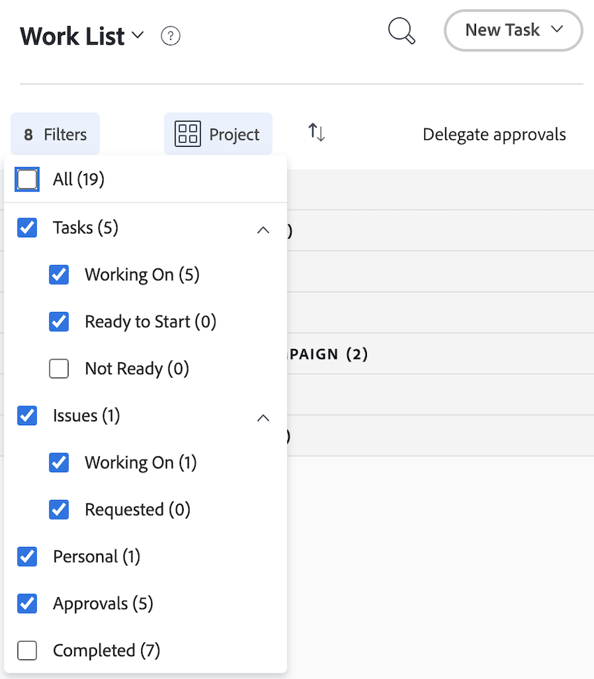
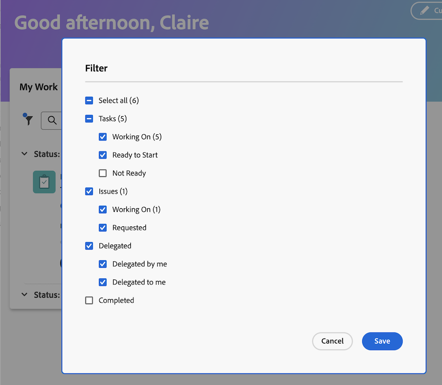
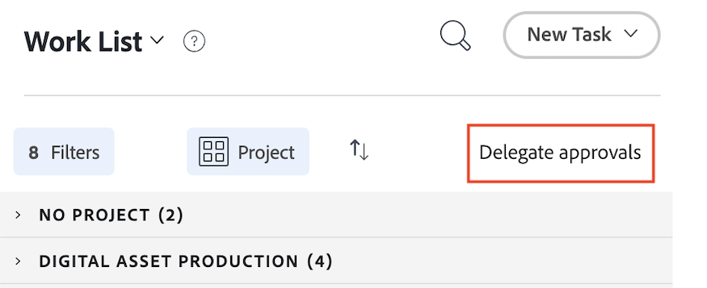
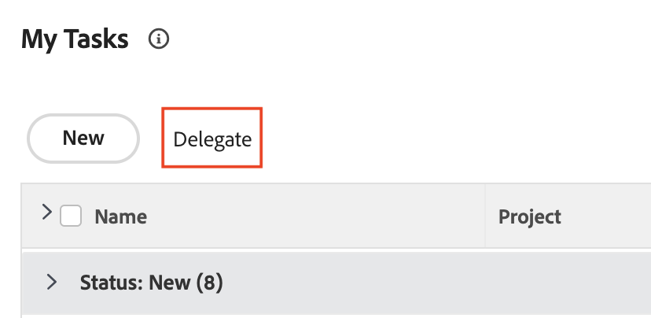
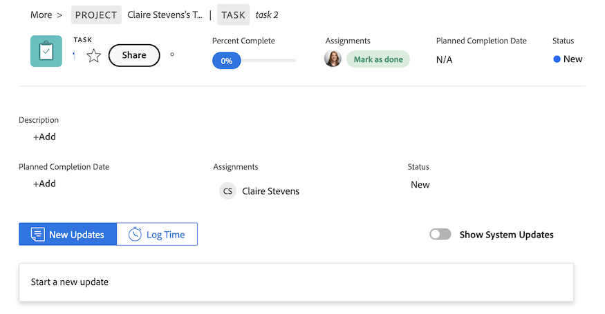
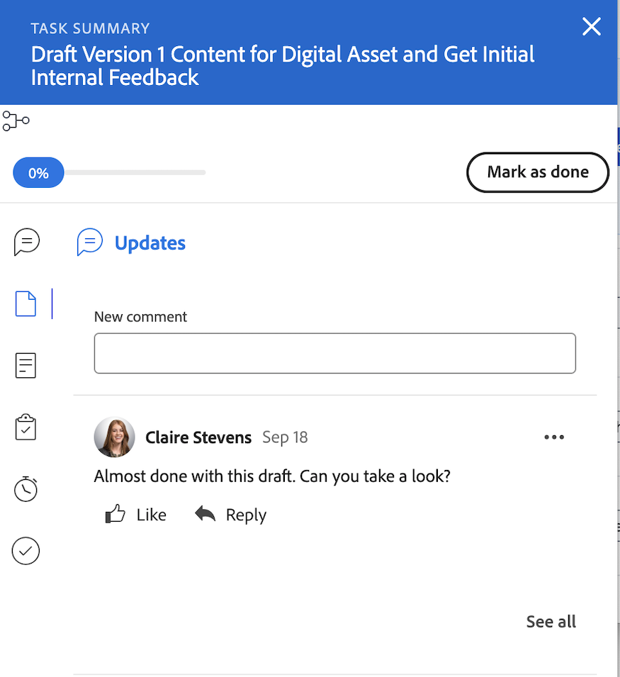
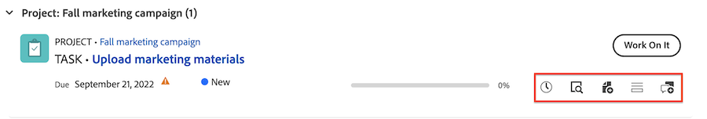
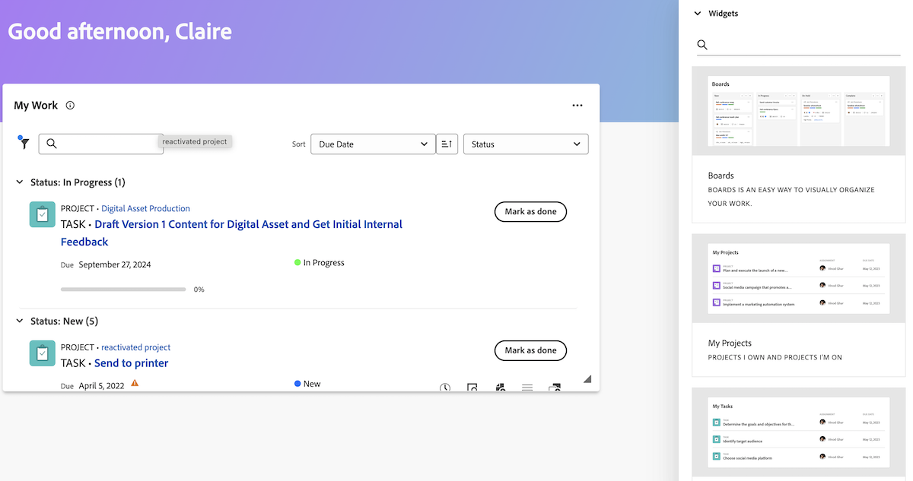

# レガシーホームから新しいホームへの移行

Legacy Homeは、第4四半期のリリースで10月17日にWorkfrontから削除されます。 この記事では、新しいホームで使用できる機能に関する情報と、Workfront管理者がユーザーを新しいホーム体験に移動する際の推奨事項について説明します。

レガシーホームの廃止について詳しくは、[ レガシーホームの廃止ガイド ]を参照してください。

## レガシーホームから新しいホームへの変更を理解する

### 作業リスト

#### マイワークウィジェットを使用した作業の整理

マイワークウィジェットは、レガシーホームのワークリストをできるだけミラーリングするためにウィジェット形式で作成されました。 ユーザーは、My Work ウィジェットの作業リストを、同様のフィルターとグループ化を使用してグループ化およびフィルタリングできます。

| **フィルター** | **グループ化** |
|------------|-----------|
| -  に取り組んでいます –  を開始する準備ができました –  の準備ができていません – リクエスト済み  – 委任された  – 完了 | - プロジェクト   - ステータス   – 期日  – なし |

**レガシーホームのグループ化は、新しいホームでは利用できません**

* 予定完了日 – 新しいホームの期日に名前変更
* 予定開始
* コミット日
* マイ優先度

| **レガシーホーム** | **新しいホーム** |
|------------|-----------|
|  |  |

#### 作業の委任

ユーザーは、次のウィジェットで新規ホームから作業を委任できます。

* 担当作業
* マイタスク
* マイイシュー
* マイ承認

ユーザーは、次のウィジェットで自分に委任された作業を見つけることができます。

* 「自分に委任」フィルターを使用した自分の作業ウィジェット
* 「委任された承認」フィルターを使用した自分の承認

| **レガシーホーム** | **新しいホーム** |
|------------|-----------|
|  |  |

#### カレンダービューの活用

新しいホームではカレンダービューは使用できなくなりましたが、優先度のロードマップにはカレンダーの置き換えがあります。

#### 個人用タスクの作成

ユーザーは、従来のホームと同じように個人タスクを作成できなくなり、代わりにTo Do アイテムを作成できます。

#### 送信した承認を表示

ユーザーは、「自分が送信した承認」フィルターを使用して、自分の承認ウィジェットの「新規ホーム」で送信した承認を表示できます。

#### 自分の優先度に項目を追加

ユーザーは、新しいホームのMy Priority機能にアクセスできなくなりました。 「My Focus」の新しい列を導入します。

ユーザーは、Boards ウィジェットを使用して、必要に応じて優先度の高い項目を追跡できます。

### 作業項目の更新

従来のホームでは、ユーザーは右側のパネルを使用して作業を更新できます。 新規ホームで、ユーザーは概要パネルを使用して作業を更新できるようになりました。 これは、プロジェクト、タスク、イシューおよびドキュメントで使用できるサマリーパネルと同じです。

#### 概要パネルの使用

概要では、次のことが可能です

* 完了率の更新
* アップデートを追加
* ドキュメント エリアに移動してドキュメントをアップロードします
* 作業項目の詳細の表示とカスタムフィールドの更新
Workfront管理者は、レイアウトテンプレートの概要に表示されるフィールドをカスタマイズできます。 詳しくは、「[&#x200B; レイアウトテンプレートを使用したホームと概要のカスタマイズ &#x200B;](/help/quicksilver/administration-and-setup/customize-workfront/use-layout-templates/customize-home-summary-layout-template.md)」を参照してください。
* 作業項目のステータスの変更
* サブタスクの表示
* 時間を記録
* 添付された承認プロセスの表示
* ファイルのアップロード – この機能は新しいものです

| **レガシーホーム** | **新しいホーム** |
|------------|-----------|
|  |  |

#### 概要パネルを開きます

ユーザーは、作業項目の上にマウスポインターを置いて、**概要** アイコン をクリックすると、概要パネルを開くことができます。

概要パネルの使用方法について詳しくは、[概要](/help/quicksilver/workfront-basics/the-new-workfront-experience/summary-overview.md)を参照してください。

#### クイックアクションを使用

概要パネルに加えて、ユーザーはクイックアクションを使用して、次のこともできます

* 時間を記録
* アップデートを追加
* カスタムフォームの更新
* ファイルのアップロード

クイックアクションメニューを見つけるには、作業項目にカーソルを合わせます。 クイックアクションリストは、「**作業中**」または「**完了**」ボタンの近くに表示されます。

### 承認とチームのリクエストを表示

ユーザーは、次のウィジェットを使用して、新規ホームで承認とチームリクエストを管理できます。

* 自分の承認
* すべての承認
* チームのリクエスト

新しいホームページへのウィジェットの追加について詳しくは、[新しいホームでのウィジェットの追加、編集または削除]を参照してください。

## 利用可能なウィジェットについて詳しく見る

ウィジェットは新しい家の基礎です。 ホーム ページにウィジェットを追加することで、ユーザーは作業ニーズに最適な情報タイプを選択できます。 一部のウィジェットは、特定のライセンスの種類に対してのみ使用できます。それらのウィジェットが追跡するオブジェクトは、それらのライセンスに対してのみ使用できるからです。

Workfront管理者は、レイアウトテンプレートを使用して、新規ホームで使用できるウィジェットをカスタマイズできます。 詳しくは、[レイアウトテンプレートを使用したオブジェクトヘッダーのカスタマイズ](/help/quicksilver/administration-and-setup/customize-workfront/use-layout-templates/customize-new-home-layout-template.md)を参照してください。

+++ 展開すると、使用可能なウィジェットの詳細リストが表示されます
現在利用可能な11のウィジェットと、それらのウィジェットで表示される情報の概要を以下に示します。

* **担当作業**\
   割り当てられたタスク、イシュー、リクエストをすべて1か所に表示します。 「作業中」ボタンをクリックして項目の作業を開始するか、「完了」ボタンをクリックして完了をマークできます。 タスクとイシューに関する情報（ステータス、条件、完了率）の更新、時間の記録、マイワークウィジェットからの更新の追加も可能です。

* **ボード**\
    作成した、または使用するように招待されたボードを表示します。 基本ボード、カンバンボード、レトロスペクティブボード、ダイナミックボードのテンプレートに基づいて、新しいボードを作成することもできます。

* **マイプロジェクト**\
    自分が所有している&#x200B;_プロジェクト_&#x200B;または&#x200B;_件のプロジェクトをリストで表示します。_&#x200B;既存のフィルター、ビュー、グループ化を使用してリストをカスタマイズすることも、ウィジェットから直接プロジェクトを作成することもできます。

* **マイタスク**\
    自分に割り当てられたタスクをリストに表示します。 既存のフィルター、ビュー、グループ化を使用してリストをカスタマイズすることも、ウィジェットから直接タスクを作成することもできます。 また、オフィスを離れている間にタスクを委任することもできます。

* **マイイシュー**\
    自分に割り当てられたイシューをリストに表示します。 既存のフィルター、ビュー、グループ化を使用してリストをカスタマイズすることも、ウィジェットから直接イシューを作成することもできます。 このウィジェットには、関連するプロジェクトが「現在」に設定されている問題のみが含まれ、完了したプロジェクトは含まれません。 また、オフィスを離れている間にイシューを委任することもできます。

* **マイリクエスト**\
    送信したすべてのリクエスト、開いているリクエストのみを表示するフィルター、リクエストの概要パネルを開くボタンが表示されます。

   プレビュー環境では、このウィジェットには、送信したすべてのリクエスト、指定した条件を満たすリクエストのみを表示するフィルター、ウィジェットの列を並べ替えることができるボタンが表示されます。

* **チームリクエスト**\
    自分が所属しているチームのすべての保留中のリクエストをチームごとに並べ替えて表示します。また、リクエストをユーザーに直接割り当てるか、自分で作業するためのボタンも表示します。

* **自分の承認**\
    保留中のすべての割り当て済みまたはデリゲートされた承認、承認をデリゲートするボタン、承認の決定をウィジェット内で直接行うボタンを表示します。

* **すべての承認**\
        平均承認時間と決定、保留中および期限切れの承認のリストビューに関する情報を含む2つのグラフを表示します。 この機能は段階的リリースの一部で、現在は特定のお客様のみが利用できます。

* **メンション**\
    マイアップデートページと同様に、Workfront全体の最近のコメントスレッドを表示します。 返信ボタンを使用して、ウィジェット内で返信を作成できます。 このウィジェットには、タスクまたはイシューが過去 30 日間に更新されている限り、自分が割り当てられている、他のユーザーに割り当てられている、自分が所有している、自分がプライマリ連絡先である、または自分が作成したタスクとイシューに関して作成されたコメントも表示されます。

* **To Do**\
    この独自のウィジェットを使用すると、自由に編集できる個人用チェックリストに項目を追加できます。 To-Do は個人プロジェクトのタスクとして追跡され、完了後最大 2 週間保持されます。

  >[!NOTE]
  >
  >To-dos ウィジェットでTo-dosを作成するには、タスクを作成する権限が必要です。現在のユーザーが入力した個人タスクのみがウィジェットに表示されます。

+++

### 各ライセンスタイプで使用可能なウィジェットを表示

デフォルトでは、ホームページには、ライセンスの種類に基づいて、いくつかの特定のウィジェットが入力されます。 次の表は、各ライセンスタイプのユーザーが最初に新しいホームに移動したときに表示されるウィジェットの概要を示しています。

<table border="1" class="inlineTable">
    <tr>
        <td><b>新しいライセンスタイプ</b></td>
        <td><b>デフォルトのウィジェット</b></td>
    </tr>
    <tr>
        <td>標準</td>
        <td>マイプロジェクト、担当作業、メンション、To-Do</td>
    </tr>
    <tr>
        <td>ライト</td>
        <td>自分の作業、自分の承認</td>
    </tr>
    <tr>
        <td>コントリビューター</td>
        <td>マイ要求、メンション、マイ承認、ボード</td>
    </tr>
    <tr>
        <td>外部</td>
        <td>自分の承認</td>
    </tr>
</table>

<table border="1" class="inlineTable">
    <tr>
        <td><b>現在のライセンスタイプ</b></td>
        <td><b>デフォルトのウィジェット</b></td>
    </tr>
    <tr>
        <td>プラン</td>
        <td>マイプロジェクト、メンション、To-Do</td>
    </tr>
    <tr>
        <td>ワーク</td>
        <td>担当作業、メンション、To-Do</td>
    </tr>
    <tr>
        <td>レビュー</td>
        <td>担当作業、メンション</td>
    </tr>
    <tr>
        <td>リクエスト</td>
        <td>マイ プロジェクト、マイ承認</td>
    </tr>
    <tr>
        <td>参加</td>
        <td>担当作業、メンション</td>
    </tr>
    <tr>
        <td>外部</td>
        <td>自分の承認</td>
    </tr>
</table>

## 廃止に備える

ここでは、業務の混乱を最小限に抑えるために、移行を円滑化するための推奨事項をいくつか紹介します。

### 新しいホームへの移行を開始

私たちの主な提言は、できるだけ早く新しい家への移行を開始することです。 組織レベルでは、管理者はレイアウトテンプレート（従来のホームと同様）を使用してユーザーエクスペリエンスをカスタマイズし、各ユーザーが必要なものを確実に入手できるようにします。

管理者におすすめ：

1. レイアウトテンプレートを使用して、デフォルトの新しいホームページのレイアウトを作成します（または、オプションで、一意のレイアウトを必要とするユーザー、チーム、グループ、またはジョブロールごとに作成します）。 詳しくは、[&#x200B; レイアウトテンプレートを使用した新しいホームのカスタマイズ &#x200B;](/help/quicksilver/administration-and-setup/customize-workfront/use-layout-templates/customize-new-home-layout-template.md)を参照してください。

1. 少数のテストユーザーに新しいレイアウトテンプレートを割り当て、ユーザーがウィジェットと一般設定を作業ニーズに合わせて検証できるようにします。

1. 残りのユーザーを新しいホームページ レイアウトに再割り当てします。

できるだけ早くこれを行うことで、ユーザーは新しいエクスペリエンスに適応し、個々のニーズに最適にカスタマイズする時間を確保できます。 ユーザーが自分の新しいホームページでウィジェットをカスタマイズする方法については、[新しいホームでウィジェットを削除、追加、並べ替えを行う]を参照してください。

### エンドユーザー向けのリソース

**ヘルプ記事**

* [ マイワークウィジェットを使用して作業を管理]

**トレーニング**

* [ホームチュートリアルでのウィジェットの削除、追加、並べ替え](https://experienceleague.adobe.com/ja/docs/workfront-learn/tutorials-workfront/home/remove-add-and-rearrange-widgets)
* [Adobe Workfrontのワーカーの基本](https://adobe-ats.sabacloud.com/Saba/Web_spf/PRODTNT100/app/me/learningeventdetail/cours000000000098821?regId=regdw000000001250612)

>[!IMPORTANT]
>
>これは無料のコースですが、ログインして登録してアクセスする必要があります。
