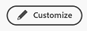

# ホームでウィジェットを追加、編集、または削除

<!-- Audited: 4/2025 -->

多数のウィジェットから選択して、ホームページに表示されるコンテンツをカスタマイズできます。 これらのウィジェットは、サイズを変更したり、並べ替えたりできます。

## 特定のライセンスタイプで使用可能なウィジェット

デフォルトでは、ホームページには、ライセンスの種類に基づいて特定のウィジェットが表示されます。

+++ 展開すると、各ライセンスタイプで使用可能なウィジェットが表示されます

<table border="1" class="inlineTable">
    <tr>
        <td><b>新しいライセンスタイプ</b></td>
        <td><b>デフォルトのウィジェット</b></td>
    </tr>
    <tr>
        <td>標準</td>
        <td>マイプロジェクト、担当作業、メンション、To-Do</td>
    </tr>
    <tr>
        <td>ライト</td>
        <td>進捗、承認</td>
    </tr>
    <tr>
        <td>コントリビューター</td>
        <td>マイリクエスト、メンション、承認、ボード</td>
    </tr>
    <tr>
        <td>外部</td>
        <td>マイ承認</td>
    </tr>
</table>

<table border="1" class="inlineTable">
    <tr>
        <td><b>現在のライセンスタイプ</b></td>
        <td><b>デフォルトのウィジェット</b></td>
    </tr>
    <tr>
        <td>プラン</td>
        <td>マイプロジェクト、メンション、To-Do</td>
    </tr>
    <tr>
        <td>ワーク</td>
        <td>担当作業、メンション、To-Do</td>
    </tr>
    <tr>
        <td>レビュー</td>
        <td>担当作業、メンション</td>
    </tr>
    <tr>
        <td>リクエスト</td>
        <td>マイ プロジェクト、マイ承認</td>
    </tr>
    <tr>
        <td>参加</td>
        <td>担当作業、メンション</td>
    </tr>
    <tr>
        <td>外部</td>
        <td>マイ承認</td>
    </tr>
</table>

+++

## ホームにウィジェットを追加

ウィジェットはホームの基本です。 ウィジェットをホームページに追加することで、作業のニーズに最も合うように表示する情報のタイプを選択できます。 一部のウィジェットは、特定のライセンスの種類に対してのみ使用できます。それらのウィジェットが追跡するオブジェクトは、それらのライセンスに対してのみ使用できるからです。 詳しくは、上記の「特定のライセンスタイプで使用可能な[ ウィジェット ](#widgets-available-for-specific-license-types)」の節を参照してください。

ウィジェットを追加するには：

1. ホームページに移動します。ホームページがランディングページとして設定されている場合は、画面上部のAdobe Workfront アイコン をクリックするか、メインメニューアイコン をクリックして、**ホーム**&#x200B;をクリックします。

1. 画面の右上隅にある「**カスタマイズ**」をクリックします。

   
1. 「**ウィジェット**」セクションまでスクロールし、追加するウィジェットを選択します。

   +++ 展開すると、使用可能なウィジェットの詳細リストが表示されます

   * **担当作業**\
       割り当てられたタスク、イシュー、リクエストをすべて1か所に表示します。 「作業中」ボタンをクリックして項目の作業を開始するか、「完了」ボタンをクリックして完了をマークできます。 タスクとイシューに関する情報（ステータス、条件、完了率）の更新、時間の記録、マイワークウィジェットからの更新の追加も可能です。

   * **ボード**\
       作成した、または使用するように招待されたボードを表示します。 基本ボード、カンバンボード、レトロスペクティブボード、ダイナミックボードのテンプレートに基づいて、新しいボードを作成することもできます。

   * **マイプロジェクト**\
       所有しているプロジェクトまたは参加中のプロジェクトをリストに表示します。 既存のフィルター、ビュー、グループ化を使用してリストをカスタマイズすることも、ウィジェットから直接プロジェクトを作成することもできます。

   * **マイタスク**\
       自分に割り当てられたタスクをリストに表示します。 既存のフィルター、ビュー、グループ化を使用してリストをカスタマイズすることも、ウィジェットから直接タスクを作成することもできます。 また、オフィスを離れている間にタスクを委任することもできます。

   * **マイイシュー**\
       自分に割り当てられたイシューをリストに表示します。 既存のフィルター、ビュー、グループ化を使用してリストをカスタマイズすることも、ウィジェットから直接イシューを作成することもできます。 このウィジェットには、関連するプロジェクトが「現在」に設定されている問題のみが含まれ、完了したプロジェクトは含まれません。 また、オフィスを離れている間にイシューを委任することもできます。

   * **マイリクエスト**\
       送信したすべてのリクエスト、開いているリクエストのみを表示するフィルター、リクエストの概要パネルを開くボタンが表示されます。

   * **チームリクエスト**\
       自分が所属しているチームのすべての保留中のリクエストをチームごとに並べ替えて表示します。また、リクエストをユーザーに直接割り当てるか、自分で作業するためのボタンも表示します。

   * **自分の承認**\
       保留中のすべての割り当て済みまたはデリゲートされた承認、承認をデリゲートするボタン、承認の決定をウィジェット内で直接行うボタンを表示します。 承認の順序は次のとおりです。
      * 期限切れ
      * 今後の期限
      * 期限のないアイテム

   * **ドキュメント承認指標**\
           平均承認時間と決定、保留中および期限切れの承認のリストビューに関する情報を含む2つのグラフを表示します。 このウィジェットを使用するには、[統合承認](/help/quicksilver/review-and-approve-work/document-reviews-and-approvals/document-approvals-overview.md)を有効にする必要があります。

   * **メンション**\
       マイアップデートページと同様に、Workfront全体の最近のコメントスレッドを表示します。 返信ボタンを使用して、ウィジェット内で返信を作成できます。 このウィジェットには、タスクまたはイシューが過去 30 日間に更新されている限り、自分が割り当てられている、他のユーザーに割り当てられている、自分が所有している、自分がプライマリ連絡先である、または自分が作成したタスクとイシューに関して作成されたコメントも表示されます。

   * **To Do**\
       この独自のウィジェットを使用すると、自由に編集できる個人用チェックリストに項目を追加できます。 To-Do は個人プロジェクトのタスクとして追跡され、完了後最大 2 週間保持されます。

     >[!NOTE]
     >
     >To-dos ウィジェットでTo-dosを作成するには、タスクを作成する権限が必要です。現在のユーザーが入力した個人タスクのみが表示されます。

   +++

1. 「**ウィジェットを追加**」をクリックします。

## ホームページ上のウィジェットを移動またはサイズ変更

1. ホームページに移動します。ホームページがランディングページとして設定されている場合は、画面上部のAdobe Workfront アイコン をクリックするか、メインメニューアイコン をクリックして、**ホーム**&#x200B;をクリックします。

1. ホームページ上で移動またはサイズ変更するウィジェットを見つけます。

1. ウィジェットを移動するには、ウィジェットの上端にポインタを合わせ、手のアイコンになったらクリックしてウィジェットを目的の場所までドラッグします。 ウィジェットを移動するにつれて、周囲の他のウィジェットも移動します。

1. ウィジェットのサイズを変更するには、ウィジェットの右下隅にあるサイズ変更アイコン  をクリックしてドラッグします。

## ホームページからウィジェットを削除

1. ホームページに移動します。ホームページがランディングページとして設定されている場合は、画面上部のAdobe Workfront アイコン をクリックするか、メインメニューアイコン をクリックして、**ホーム**&#x200B;をクリックします。

1. 削除するホームページでウィジェットを見つけたら、ウィジェットの右上隅にある&#x200B;**詳細** アイコン をクリックします。

1. 「**削除**」をクリックします。

## 背景の色を変更する

1. ホームページに移動します。ホームページがランディングページとして設定されている場合は、画面上部のAdobe Workfront アイコン をクリックするか、メインメニューアイコン をクリックして、**ホーム**&#x200B;をクリックします。

1. 画面の右上隅にある「**カスタマイズ**」をクリックします。

   

1. **カスタマイズ**&#x200B;パネルの「**背景**」セクションで、ホームの背景に選択する色をクリックします。 また、「**なし**」をクリックして背景を削除します。
