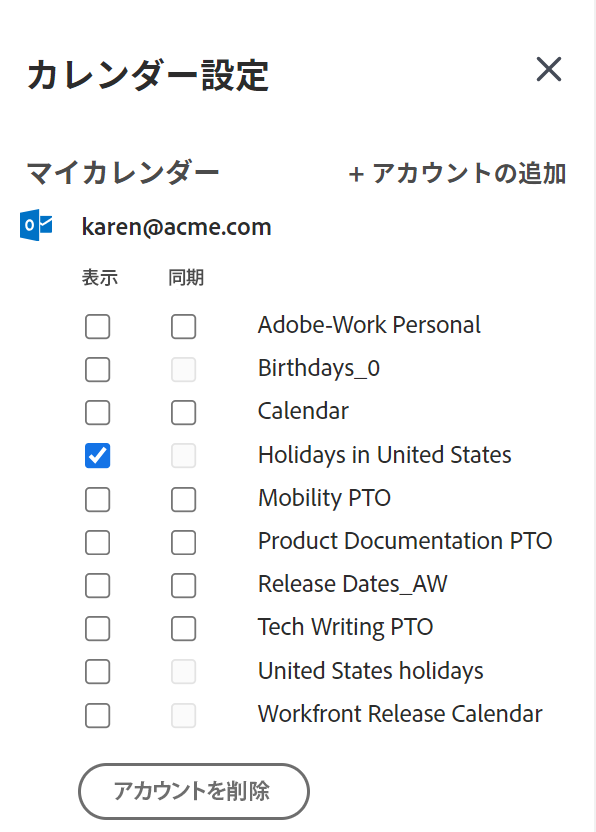
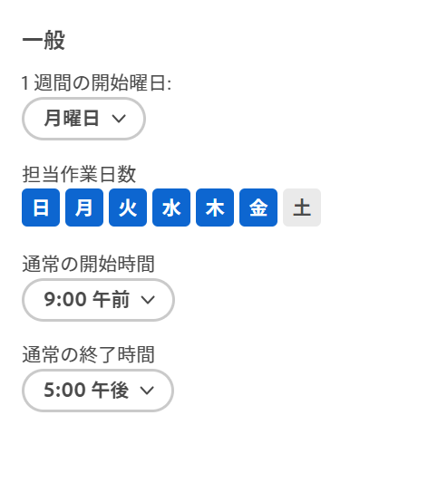

# を設定します。 [!UICONTROL ホームカレンダー] 設定を表示

<!--Audited: 01/2024-->

次の項目を設定できます。 [!UICONTROL ホームカレンダー] 次の操作を行う設定を指定します。

* クラウドでホストされている [!DNL Office 365] または [!DNL Outlook Live] の web ベースバージョンの [!DNL Outlook] と統合するOutlook の予定表のすべてのイベントと、自分で選択した関連する予定表を表示できます [!UICONTROL ホームカレンダー] Adobe Workfrontで
* 作業負荷を、 [!UICONTROL 配分] バー。

ホームカレンダーの詳細については、 [[!UICONTROL ホームカレンダー] 表示](../../../workfront-basics/using-home/using-the-home-area/home-calendar-view.md).

この記事では、ホームカレンダーの設定を構成し、ホームカレンダーを外部の Outlook カレンダーと統合する方法について説明します。

## アクセス要件

この記事の手順を実行するには、次のアクセス権が必要です。

<table style="table-layout:auto"> 
 <col> 
 </col> 
 <col> 
 </col> 
 <tbody> 
  <tr> 
   <td role="rowheader"><strong>[!DNL Adobe Workfront plan]</strong></td> 
   <td> 
任意
 </td> 
  </tr> 
  <tr> 
   <td role="rowheader"><strong>[!DNL Adobe Workfront] ライセンス*</strong></td> 
   <td> 
現在： [!UICONTROL Work] 以降
 
   または
   
新規： [!UICONTROL Standard]
 
   </td> 
  </tr> 
   </tbody> 
</table>

*お持ちのプランやライセンスの種類を確認するには、 [!DNL Workfront] 管理者。 詳しくは、 [Workfrontドキュメントのアクセス要件](/help/quicksilver/administration-and-setup/add-users/access-levels-and-object-permissions/access-level-requirements-in-documentation.md).

## 統合について [!DNL Microsoft Outlook] カレンダー

ホームカレンダーを [!DNL Microsoft Outlook] カレンダー：

* 統合できるのは、Web ベースのバージョンのみです [!DNL Outlook] クラウドでホストされている [!DNL Office 365] または [!DNL Outlook Live].

  オンプレミス [!DNL Outlook] および [!DNL Outlook] クラウドベースの企業で [!DNL Exchange] サーバーはサポートされていません。

  組織でシングルサインオンを使用している場合は、 [!DNL Microsoft 365 E3] または [!DNL E5].

* お客様の [!DNL Outlook] イベントが [!DNL Outlook] イベントを設定します。
* との統合 [!DNL Outlook] カレンダーは、各ユーザーごとに個別に入力する必要があります。
* イベント [!UICONTROL 期限] バーが [!DNL Microsoft] カレンダーをドラッグしない限り [!UICONTROL 作業用リスト] を [!DNL Adobe Workfront] カレンダー。 詳しくは、 [[!UICONTROL 期限] バー](../../../workfront-basics/using-home/using-the-home-area/home-calendar-view.md#viewing-the-due-bar) および [次に示す作業リスト： [!UICONTROL ホームカレンダー]](../../../workfront-basics/using-home/using-the-home-area/home-calendar-view.md#using-the-left-panel-of-the-home-view) in [[!UICONTROL ホームカレンダー] 表示](../../../workfront-basics/using-home/using-the-home-area/home-calendar-view.md).

* との統合を有効にする場合 [!DNL Outlook]（にドラッグされた作業項目のみ） [!UICONTROL ホームカレンダー] それ以降は同期されます。 統合を有効にする前にホームカレンダーにあった項目は表示されません。項目をに表示するには、それらの項目を再度ホームカレンダーにドラッグする必要があります。 [!DNL Outlook].
* 共有（または共有解除）時に、 [!DNL Outlook] 他のユーザーとカレンダーを共有したり、他のユーザーと共有するカレンダーのアクセス許可レベルを変更した場合、この変更は約 30 分間カレンダーに影響を与えません。 詳しくは、 [!DNL Microsoft Outlook] ドキュメント。\
   その結果、 [!DNL Workfront] カレンダーと [!DNL Outlook] 他のユーザーと共有したカレンダーには、他のユーザーには表示されません [!DNL Workfront] カレンダー項目を約 30 分間保持します。

>[!NOTE]
>
>The [!DNL Outlook] カレンダーの設定は、 [!DNL Outlook] アドイン ([!UICONTROL [!DNL Outlook] 統合] または [!DNL Workfront Outlook]) をクリックします。 カレンダーを設定するためにインストールする必要はありませんが、 [!DNL Outlook] アドインです。 詳しくは、 [!DNL Outlook] アドイン：「 」を参照 [設定 [!DNL Adobe Workfront for Outlook]](../../../workfront-integrations-and-apps/using-workfront-with-outlook/set-up-workfront-for-outlook.md).

## を設定します。 [!UICONTROL ホームカレンダー] 設定を表示し、Outlook の予定表と統合する

1. Adobe Analytics の [!UICONTROL ホームカレンダー] ビューを開き、 **[!UICONTROL 設定]** 歯車アイコン  を開くには、右上隅に **[!UICONTROL カレンダーの設定]** パネルを右に表示します。

   にアクセスする方法について [!UICONTROL ホームカレンダー] 表示： [次を表示： [!UICONTROL ホームカレンダー]](../../../workfront-basics/using-home/using-the-home-area/view-home-calendar.md).

1. （オプション） [!DNL Microsoft Outlook] カレンダー、クリック **[!UICONTROL アカウントを追加]** の右上隅に **[!UICONTROL カレンダーの設定]** パネル。 次に、要求された場合は、 [!DNL Microsoft Outlook] ログイン情報。 この手順を繰り返して、複数の [!DNL Outlook] アカウント。

   >[!NOTE]
   >
   >与えなければならない [!DNL Workfront] 次の項目にアクセスする権限： [!DNL Outlook] カレンダー。 権限の付与を許可しています [!DNL Workfront] カレンダーデータへのアクセスを維持するには、 [!DNL outlook] プロファイルを作成し、 [!DNL Microsoft] カレンダー。

1. ブラウザーウィンドウを更新して、 [!DNL Outlook] カレンダーおよび [!UICONTROL カレンダーの設定] パネル。
1. 次をクリック： **[!UICONTROL 設定]** 右上隅の歯車アイコンを再度開き、 **[!UICONTROL カレンダーの設定]** パネル。 

1. （オプション）各 [!DNL Microsoft] 前の手順で追加したアカウントで、「 」を選択します。 **[!UICONTROL 表示]** または **[!UICONTROL 同期]**:

   * **[!UICONTROL 表示]**：これは、 [!DNL Microsoft] カレンダーイベント [!UICONTROL ホームカレンダー].
   * **[!UICONTROL 同期]**：このオプションを使用すると、 [!DNL Microsoft] および [!UICONTROL ホーム] カレンダー。 言い換えれば、 [!DNL Workfront] [!UICONTROL ホームカレンダー] に書き出す項目 [!DNL Microsoft] カレンダーと [!DNL Microsoft] Workfrontにインポートするカレンダー項目 [!UICONTROL ホームカレンダー] リアルタイムで。

     

1. （オプション） [!DNL Workfront] アカウントまたは統合アカウントで、表示するカレンダーを選択します [!UICONTROL ホームカレンダー] （PTO、誕生日、休日のカレンダーなど）次に、ブラウザーの [!UICONTROL 更新] または [!UICONTROL リロード] ボタンをクリックして変更を確認します。

1. （オプション） **[!UICONTROL 一般]** の下のセクション **[!UICONTROL 開始週]**&#x200B;をクリックし、ホームカレンダーの週の最初の曜日として表示する日を選択します。

   

1. 次のオプションを設定します。

   * **[!UICONTROL 勤務日]:** 勤務日を選択します。
   * **[!UICONTROL 通常の開始時刻]:** 勤務日を開始する時刻を選択します。
   * **[!UICONTROL 通常の終了時刻]:** 勤務日を終了する時間を選択します。

   [!DNL Workfront] は、これら 3 つの設定を使用して、1 週間の勤務時間数を計算します。 この数は、 [!UICONTROL 配分] バー：使用可能な勤務時間に対するワークロードの追跡に役立ちます。 詳しくは、 [[!UICONTROL 配分] バー](../../../workfront-basics/using-home/using-the-home-area/home-calendar-view.md#understanding-the-allocation-of-time) 記事内 [[!UICONTROL ホームカレンダー] 表示](../../../workfront-basics/using-home/using-the-home-area/home-calendar-view.md).

1. の外側をクリック **[!UICONTROL カレンダーの設定]** 領域を閉じます。

   [!DNL Workfront] 変更内容は自動的に保存されます。

詳しくは、 [!UICONTROL カレンダー] 作業の割り当てと統合されたカレンダーイベントを管理するには、 [以下を使用します。 [!UICONTROL ホームカレンダー] 表示](../../../workfront-basics/using-home/using-the-home-area/use-home-calendar-view.md).

<!--
<MadCap:conditionalText data-mc-conditions="QuicksilverOrClassic.Draft mode">
(NOTE: from Courtney: [step #] Type your weekly work hours under How many hours a week do you work?This number affects the Allocation bar, which helps you track your workload against your available work hours. For more information, see "Allocation Bar" in the article "Understanding the Home Calendar View.")
</MadCap:conditionalText>
-->
