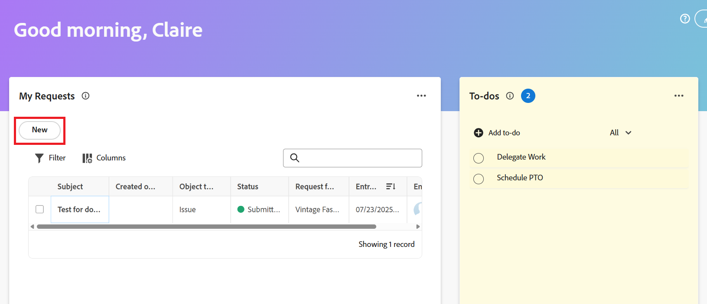
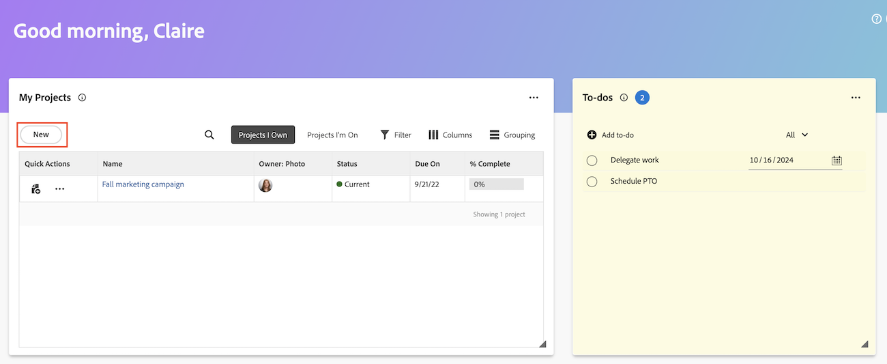

# ホームエリアからの作業項目とプロジェクトの作成

[!UICONTROL  ホーム ] エリアから作業項目およびプロジェクトを作成できます。

ホームでは、次のことができます

* リクエストの送信
* 特定のプロジェクトへのタスクと問題の追加
* テンプレートまたは空のプロジェクトからプロジェクトを作成するか、MS プロジェクトをインポートします。

## アクセス要件

+++ 展開すると、この記事の機能のアクセス要件が表示されます。 

<table style="table-layout:auto"> 
 <col> 
 <col> 
 <tbody> 
  <tr> 
   <td role="rowheader"><strong>[!DNL Adobe Workfront package]</strong></td> 
   <td> 
任意
 </td> 
  </tr> 
  <tr> 
   <td role="rowheader"><strong>[!DNL Adobe Workfront] ライセンス</strong></td> 
   <td>
    
標準
 
    
ワークまたはそれ以上
 </td> 
  </tr> 
    <tr> 
   <td role="rowheader"><strong>アクセスレベル設定</strong></td> 
   <td> 
更新先のオブジェクトに対する表示または編集アクセス権
 </td> 
  </tr> 
   <tr> 
   <td role="rowheader"><strong>その他の製品</strong></td> 
   <td>計画リクエストまたはリクエストフォームを表示するには、Adobe Workfront Planning が必要です。</td>
  </tr> 
  <tr> 
   <td role="rowheader"><strong>オブジェクト権限</strong></td> 
   <td> 
タスクに対する [!UICONTROL Edit] アクセス権以上
 </td> 
  </tr> 
 </tbody> 
</table>

詳しくは、[Workfront ドキュメントのアクセス要件](/help/quicksilver/administration-and-setup/add-users/access-levels-and-object-permissions/access-level-requirements-in-documentation.md)を参照してください。

+++

## 個人の To Do アイテムを作成する

[!UICONTROL  ホーム ] エリアの To Do ウィジェットに、個人の To Do アイテムを作成できます。 To Do アイテムは、自分で作成する個人用タスクです。

自分および他のユーザーは、自分の個人タスクを個人タスクレポートで表示できます。 必要に応じて、そこからプロジェクトに追加できます。

>[!TIP]
>
>ユーザープロファイルページから他のユーザーまたは自分に送信した作業項目も、ユーザーのホーム領域の To-Do ウィジェットに表示されます。 詳しくは、[ 個人タスクの作成 ](/help/quicksilver/workfront-basics/updating-work-items-and-viewing-updates/create-personal-tasks.md) を参照してください。

To Do 項目を作成するには：

1. 右上隅の **[!UICONTROL メインメニュー]** をクリックするか、左上隅の **メインメニュー** をクリックして（使用可能な場合）、**[!UICONTROL ホーム]** をクリックします。
1. （条件付き） **カスタマイズ** をクリックし、**To-Do** をクリックして、To-Do ウィジェットをホーム画面に追加します。
1. **To Do** ウィジェットに移動し、「**To Do を追加** をクリックします。
1. 個人の To Do アイテムの名前を入力し、[Enter] をクリックします。
1. （オプション） **日付** アイコン  をクリックして、項目の期限を追加します。
   
1. （任意）個人用タスクレポートまたはフィルターを作成します。 個人用タスク フィルタの作成については、「[ フィルタ：個人用タスク ](/help/quicksilver/reports-and-dashboards/reports/custom-view-filter-grouping-samples/filter-personal-tasks.md)」を参照してください。
個人タスクレポートには、自分の To Do 項目と他のユーザーの To Do 項目を表示できます。

## プロジェクトへのタスクの追加

ホーム エリアから既存のプロジェクトに直接タスクを追加できます。

1. 右上隅の **[!UICONTROL メインメニュー]** をクリックし、**[!UICONTROL ホーム]** をクリックします。
1. （条件付き） **マイタスク** ウィジェットをホーム画面に追加します。 **カスタマイズ** をクリックし、**マイタスク** を検索します。
1. **マイタスク** ウィジェットに移動し、「新規 **をクリックし** す。
   
1. **新規タスク** ダイアログボックスで、タスク名を入力します。
1. プロジェクト名の入力を開始し、リストから名前を選択します。
1. （オプション）次のフィールドに情報を入力します。

   | フィールド | 手順 |
   |----------|----------|
   | **説明** | 説明を入力します。 |
   | **割り当て** | ユーザーを割り当てます。 |
   | **期間** | 期間を入力します。 |
   | **予定完了日** | 計画完了日を選択します。 |
   | **その他のオプション** | その他のオプションを選択して、タスクのその他の設定を構成します。 タスクの作成について詳しくは、[ タスクの編集 ](/help/quicksilver/manage-work/tasks/manage-tasks/edit-tasks.md) を参照してください。 |

1. **タスクを作成** をクリックします。

## プロジェクトへのイシューの追加

ホーム領域から既存のプロジェクトにイシューを直接追加できます。

1. 右上隅の **[!UICONTROL メインメニュー]** をクリックし、**[!UICONTROL ホーム]** をクリックします。
1. （条件付き） **マイ問題** ウィジェットをホーム画面に追加します。 **カスタマイズ** をクリックし、**マイイシュー** を見つけます。
1. **自分のイシュー** ウィジェットに移動し、「新規 **をクリックし** す。
   
1. **新しいイシュー** ダイアログボックスで、プロジェクト名の入力を開始し、リストから名前を選択します。
1. イシュー名を入力します。
1. （オプション）次のフィールドに情報を入力します。

   | フィールド | 手順 |
   |----------|----------|
   | **説明** | 説明を入力します。 |
   | **割り当て** | ユーザーを割り当てます。 |
   | **優先度** | 優先度レベルを選択します。 |
   | **ドキュメント** | ドキュメントをアップロードします。 |

1. **新しいイシューを保存** をクリックします。

## リクエストの作成

リクエストは、ホーム エリアから直接作成できます。

1. 右上隅の **[!UICONTROL メインメニュー]** をクリックし、**[!UICONTROL ホーム]** をクリックします。
1. （条件付き） **マイリクエスト** ウィジェットをホーム画面に追加します。 **カスタマイズ** をクリックし、**マイリクエスト** を見つけます。
1. **マイリクエスト** ウィジェットに移動し、「新規 **をクリックし** す。
   

1. **新規リクエスト** ダイアログで、検索バーにWorkfront リクエストキューまたはWorkfront Planning リクエストフォームの名前を入力し始め、表示されたら選択します。
1. 関連するフィールドに入力します。
1. 「**送信**」をクリックします。

リクエストの送信について詳しくは、[ リクエストの作成と送信 ](/help/quicksilver/manage-work/requests/create-requests/create-submit-requests.md) を参照してください。

## プロジェクトを作成

ホームエリアから直接プロジェクトを作成できます。

1. 右上隅の **[!UICONTROL メインメニュー]** をクリックし、**[!UICONTROL ホーム]** をクリックします。
1. （条件付き） **マイプロジェクト** ウィジェットをホーム画面に追加します。 **カスタマイズ** をクリックし、**マイプロジェクト** を見つけます。
1. **マイプロジェクト** ウィジェットに移動し、「新規 **をクリックし** す。
   
1. 次のいずれかのオプションを選択します。

   | フィールド | 手順 |
   |----------|----------|
   | テンプレートから | テンプレートからプロジェクトを作成する手順について詳しくは、[ テンプレートを使用してプロジェクトを作成 ](/help/quicksilver/manage-work/projects/create-projects/create-project-from-template.md) を参照してください。 |
   | 空のプロジェクト | 空のプロジェクトを作成する手順について詳しくは、[ ゼロからプロジェクトを作成 ](/help/quicksilver/manage-work/projects/create-projects/create-project.md#create-a-project-from-scratch) を参照してください。 |
   | MS Project を読み込み | MS プロジェクトを読み込む手順について詳しくは、[Microsoft プロジェクトからプロジェクトを読み込む ](/help/quicksilver/manage-work/projects/create-projects/import-project-from-ms-project.md) を参照してください。 |

<!--
## Create a board

You can create a board directly from the Home area:

1. Click the **[!UICONTROL Main Menu]**  in the upper-right corner, then click **[!UICONTROL Home]**.
1. (Conditional) Add the **Boards** widget to your home screen. Click **Customize**, and find **Boards**. -->

<!--
## Delete a to-do item

1. Click the **[!UICONTROL Main Menu]**  in the upper-right corner, then click **[!UICONTROL Home]**.
1. Go to the to-do widget.
1. Hover over the item, then click the **Delete** icon . 

## Edit a to-do item

1. Click the **[!UICONTROL Main Menu]**  in the upper-right corner, then click **[!UICONTROL Home]**.
1. Go to the to-do widget.
1. Edit the item name.
1. Click on the **Date** icon  to add or adjust a due date. -->
