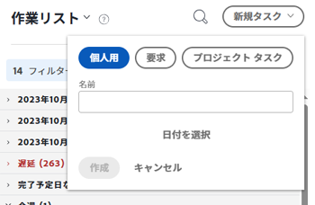
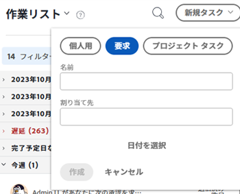
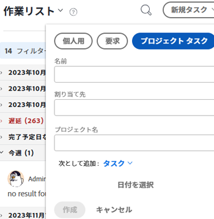

# ホーム領域から作業項目を作成する

<!--

(NOTE: From Courtney: Need to rename)

-->

作業項目は、 [!UICONTROL ホーム] 領域。 自分で個人用タスクを作成したり、他のユーザーに仕事を依頼したり、特定のプロジェクトにタスクを追加したりできます。

## アクセス要件

この記事の手順を実行するには、次のアクセス権が必要です。

<table style="table-layout:auto"> 
 <col> 
 <col> 
 <tbody> 
  <tr> 
   <td role="rowheader"><strong>[!DNL Adobe Workfront plan*]</strong></td> 
   <td> 
任意
 </td> 
  </tr> 
  <tr> 
   <td role="rowheader"><strong>[!DNL Adobe Workfront] ライセンス*</strong></td> 
   <td> 
[!UICONTROL Work] 以降
 </td> 
  </tr> 
  <tr> 
   <td role="rowheader"><strong>アクセスレベル設定*</strong></td> 
   <td> 
[!UICONTROL Worker]
 
<b>メモ</b>
 
   
まだアクセス権がない場合は、 [!DNL Workfront] 管理者（アクセスレベルに追加の制限を設定している場合） を参照してください。 [!DNL Workfront] 管理者はアクセスレベルを変更できます。詳しくは、 <a href="../../../administration-and-setup/add-users/configure-and-grant-access/create-modify-access-levels.md" class="MCXref xref">カスタムアクセスレベルの作成または変更</a>.
 </td> 
  </tr> 
  <tr> 
   <td role="rowheader"><strong>オブジェクトの権限</strong></td> 
   <td> 
タスクに対する [!UICONTROL 編集 ] アクセス権以上
 
追加のアクセス権のリクエストについて詳しくは、 <a href="../../../workfront-basics/grant-and-request-access-to-objects/request-access.md" class="MCXref xref">オブジェクトへのアクセスのリクエスト </a>.
 </td> 
  </tr> 
 </tbody> 
</table>

&#42;ご利用のプラン、ライセンスの種類、アクセス権を確認するには、 [!DNL Workfront] 管理者。

## 個人用タスクの作成

個人用タスクは、 [!UICONTROL ホーム] 領域：

1. 次をクリック： **[!UICONTROL メインメニュー]**  右上隅で、「 **[!UICONTROL ホーム]**.
1. クリック **[!UICONTROL 新規タスク]** > **[!UICONTROL 個人]**.

   

1. Adobe Analytics の **[!UICONTROL 名前]** 「 」フィールドで、タスクの名前を指定します。
1. （オプション）「 **[!UICONTROL 日付を選択]**&#x200B;をクリックし、タスクの期限日を選択します。 これにより、 [!UICONTROL 計画完了日] タスクの\
   次の項目を変更できます。 **[!UICONTROL 計画完了日]** 右側のパネルで日付をクリックするか、 **[!UICONTROL これは、次の方法でおこないます：]** 日付を直接タスクに追加します。

1. クリック **[!UICONTROL 作成]** をクリックしてタスクを保存します。\
   タスクが自分に割り当てられ、 [!UICONTROL ホーム] 領域。

>[!NOTE]
>
>* 個人用タスクを作成すると、そのタスクは、で検索できない「非表示」プロジェクトに保存されます。 [!UICONTROL Workfront]. プロジェクトの名前は「&lt; ユーザー名 > のタスク」です。 「ユーザー名」は、タスクを作成したユーザーのフルネームです。 このプロジェクトにアクセスできるのは、 [!UICONTROL ホーム] 領域（タスクのパンくずリストなど）
>
>* 通常のプロジェクトタスクとは異なり、個人用タスクには、Workfrontインターフェイスに表示される一部のフィールドが制限され、プロジェクトのタイムラインや進行状況には影響しません。 個人用タスクを別のユーザーに再割り当てすると、すべてのタスクフィールドが個人用タスクに追加されますが、タスクはタスクを作成したユーザーの個人用プロジェクトに残ります。
>
>
>* 個人用タスクは、時間が記録されている場合、またはタイムシートに固定されている場合にのみ、タイムシートに表示されます。 個人のタスクをタイムシートに固定できるのは、タスクに対して時間が記録されている場合のみです。 詳しくは、 [ログ時間](../../../timesheets/create-and-manage-timesheets/log-time.md).
> 
>* 個人用タスクを通常のワークフローの一部にしたい場合は、プロジェクトを作成し、個人用タスクをそのプロジェクトに移動することをお勧めします。
>
> ![[!UICONTROL 個人用タスクのプロジェクト]](assets/createworkitems-personal--project-350x105.png)

## 別のユーザーからの作業をリクエスト

別のユーザーに対しては、「ホーム」領域から直接作業を要求できます。 この節で説明するように別のユーザーに作業を要求すると、ユーザーがクリックするまで、タスクはユーザーのホーム領域にリクエストとして表示されます **[!UICONTROL 作業する]**.

別のユーザーに対して [!UICONTROL ホーム] 領域：

1. 次をクリック： **[!UICONTROL メインメニュー]**  右上隅で、「 **[!UICONTROL ホーム]**.
1. クリック **[!UICONTROL 新規タスク]**&#x200B;を選択し、「 **[!UICONTROL リクエスト]**.

   

1. Adobe Analytics の **[!UICONTROL 名前]** 「 」フィールドで、タスクの名前を指定します。
1. Adobe Analytics の **[!UICONTROL 割り当て先]** フィールドに、割り当てるユーザー、チームまたは役割の名前を入力し、ドロップダウンメニューに表示されたら名前をクリックします。
1. Adobe Analytics の [!UICONTROL 名前を付けて追加] ドロップダウンメニューから、タスクを追加するか、タスクを発行するかを選択します。
1. クリック **[!UICONTROL 日付を選択]**&#x200B;次に、タスクの期限の日時を選択します。
1. クリック **[!UICONTROL 作成]** をクリックしてタスクを保存します。\
   タスクは、作業要求として [!UICONTROL ホーム] 指定したユーザーの領域。

## プロジェクトにタスクまたはイシューを追加する

既存のプロジェクトにタスクやイシューを「ホーム」領域から直接追加できます。

1. 次をクリック： **[!UICONTROL メインメニュー]**  右上隅で、「 **ホーム**.
1. クリック **[!UICONTROL 新規タスク]**&#x200B;を選択し、「 **[!UICONTROL プロジェクトタスク]**.

   

1. Adobe Analytics の **[!UICONTROL 名前]** 「 」フィールドで、タスクまたはタスクの名前を指定します。
1. Adobe Analytics の **[!UICONTROL 割り当て先]** フィールドに、割り当てるユーザー、チームまたは役割の名前を入力し、ドロップダウンメニューに表示されたら名前をクリックします。
1. タスクまたはイシューを作成するプロジェクトの名前を入力し、ドロップダウンメニューに表示されたら名前をクリックします。

   >[!IMPORTANT]
   >
   >タスクまたは問題が [!UICONTROL 作業用リスト] プロジェクトが [!UICONTROL ステータス] が [!UICONTROL 現在].

1. （条件付き）イシューを作成するには、「 **[!UICONTROL 問題]** から **[!UICONTROL 名前を付けて追加]** ドロップダウンメニュー。 デフォルトでは、 **[!UICONTROL タスク]** が選択されている。

1. クリック **[!UICONTROL 日付を選択]**&#x200B;次に、タスクの期限の日時を選択します。
1. クリック **[!UICONTROL 作成]** をクリックしてタスクを保存します。
