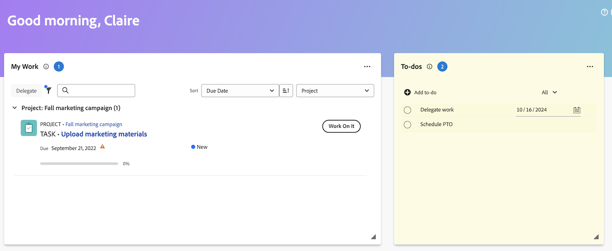
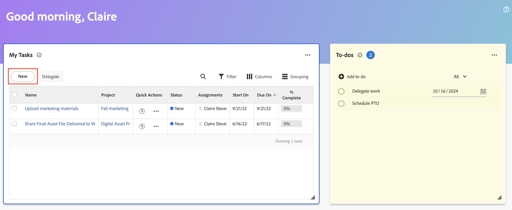
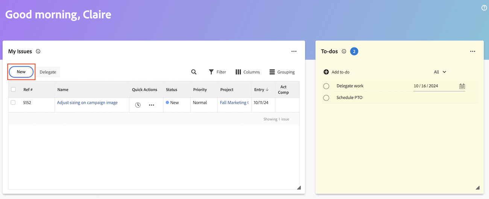
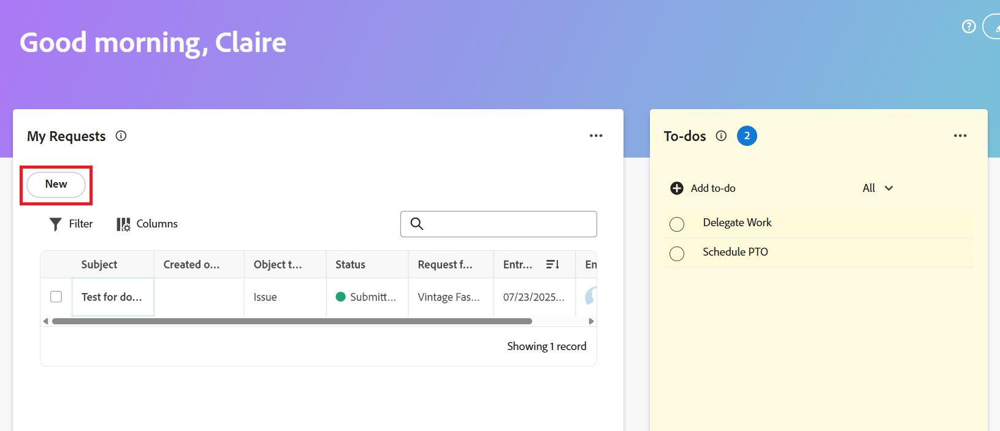
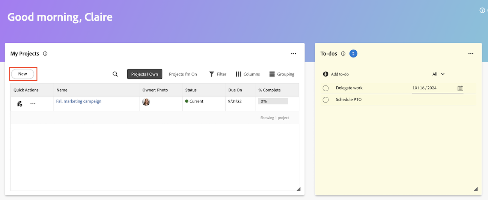

# ホームエリアからの作業アイテムとプロジェクトの作成

作業項目とプロジェクトは、[!UICONTROL &#x200B; ホーム &#x200B;]領域から作成できます。

ホームから、次のことができます

* リクエストの送信
* 特定のプロジェクトへのタスクとイシューの追加
* テンプレートからプロジェクトを作成するか、空白のプロジェクトを作成するか、MS プロジェクトを読み込みます。

## アクセス要件

+++ 展開すると、この記事の機能のアクセス要件が表示されます。 

<table style="table-layout:auto"> 
 <col> 
 <col> 
 <tbody> 
  <tr> 
   <td role="rowheader"><strong>[!DNL Adobe Workfront package]</strong></td> 
   <td> 
任意
 </td> 
  </tr> 
  <tr> 
   <td role="rowheader"><strong>[!DNL Adobe Workfront] ライセンス</strong></td> 
   <td>
    
標準
 
    
Work またはそれ以上
 </td> 
  </tr> 
    <tr> 
   <td role="rowheader"><strong>アクセスレベル設定</strong></td> 
   <td> 
更新先のオブジェクトに対する表示または編集アクセス権
 </td> 
  </tr> 
   <tr> 
   <td role="rowheader"><strong>その他の製品</strong></td> 
   <td>プランニングリクエストまたはリクエストフォームを表示するには、Adobe Workfront Planningが必要です</td>
  </tr> 
  <tr> 
   <td role="rowheader"><strong>オブジェクト権限</strong></td> 
   <td> 
タスクに対する [!UICONTROL Edit] アクセス権以上
 </td> 
  </tr> 
 </tbody> 
</table>

詳しくは、[Workfront ドキュメントのアクセス要件](/help/quicksilver/administration-and-setup/add-users/access-levels-and-object-permissions/access-level-requirements-in-documentation.md)を参照してください。

+++

## 個人のToDo アイテムの作成

[!UICONTROL &#x200B; ホーム &#x200B;] エリアのTo-dos ウィジェットで、個人のTo-Do アイテムを作成できます。 ToDo アイテムは、自分で作成した個人的なタスクです。

個人タスクレポートでは、自分と他のユーザーが個人タスクを表示できます。 その後、必要に応じてプロジェクトに追加することができます。

>[!TIP]
>
>ユーザープロファイルページから他のユーザーまたは自分に送信した作業項目も、ユーザーのホーム領域のTo-Do ウィジェットに表示されます。 詳しくは、[個人用タスクの作成](/help/quicksilver/workfront-basics/updating-work-items-and-viewing-updates/create-personal-tasks.md)を参照してください。

ToDo アイテムを作成するには：

1. 右上隅の&#x200B;**[!UICONTROL メインメニュー]** 、または左上隅の&#x200B;**メインメニュー** をクリックしてから、**[!UICONTROL ホーム]**&#x200B;をクリックします。
1. （条件付き）「**カスタマイズ**」をクリックし、**To-dos**」をクリックして、To-dos ウィジェットをホーム画面に追加します。
1. **To-do** ウィジェットに移動し、**To-do**&#x200B;を追加をクリックします。
1. 個人のToDo項目の名前を入力し、「Enter」をクリックします。
1. （オプション）「**日付**」アイコン「」をクリックして、項目の期日を追加します。
   
1. （オプション）個人用タスクレポートまたはフィルターを作成します。 個人タスクフィルターの作成について詳しくは、[&#x200B; フィルター：個人タスク &#x200B;](/help/quicksilver/reports-and-dashboards/reports/custom-view-filter-grouping-samples/filter-personal-tasks.md)を参照してください。
個人タスクレポートでは、ToDo項目だけでなく、他のユーザーのToDo項目も表示できます。

## プロジェクトへのタスクの追加

ホーム領域から直接、既存のプロジェクトにタスクを追加できます。

1. 右上隅の&#x200B;**[!UICONTROL メインメニュー]** をクリックし、**[!UICONTROL ホーム]**&#x200B;をクリックします。
1. （条件付き）ホーム画面に&#x200B;**マイタスク** ウィジェットを追加します。 **カスタマイズ**&#x200B;をクリックして、**マイタスク**&#x200B;を見つけます。
1. **マイタスク** ウィジェットに移動し、**新規**&#x200B;をクリックします。
   
1. **新規タスク** ダイアログボックスで、タスク名を入力します。
1. プロジェクト名を入力し、リストから名前を選択します。
1. （オプション）次のフィールドに情報を入力します。

   | フィールド | 手順 |
   |----------|----------|
   | **説明** | 説明を入力します。 |
   | **割り当て** | ユーザーの割り当て： |
   | **期間** | 期間を入力します。 |
   | **予定完了日** | 予定完了日を選択します。 |
   | **その他のオプション** | その他のオプションを選択して、タスクの設定を追加します。 タスクの作成について詳しくは、[&#x200B; タスクの編集](/help/quicksilver/manage-work/tasks/manage-tasks/edit-tasks.md)を参照してください。 |

1. 「**タスクを作成**」をクリックします。

## プロジェクトにイシューを追加する

ホーム領域から既存のプロジェクトにイシューを直接追加できます。

1. 右上隅の&#x200B;**[!UICONTROL メインメニュー]** をクリックし、**[!UICONTROL ホーム]**&#x200B;をクリックします。
1. （条件付き）ホーム画面に&#x200B;**マイイシュー** ウィジェットを追加します。 「**カスタマイズ**」をクリックし、**自分の問題**&#x200B;を見つけます。
1. **マイイシュー** ウィジェットに移動し、**新規**&#x200B;をクリックします。
   
1. **新しい問題ダイアログ** ボックスで、プロジェクト名の入力を開始し、リストから名前を選択します。
1. イシュー名を入力します。
1. （オプション）次のフィールドに情報を入力します。

   | フィールド | 手順 |
   |----------|----------|
   | **説明** | 説明を入力します。 |
   | **割り当て** | ユーザーの割り当て： |
   | **優先度** | 優先度レベルの選択： |
   | **ドキュメント** | ドキュメントをアップロードします。 |

1. **新しい問題を保存**&#x200B;をクリックします。

## リクエストの作成

リクエストは、ホーム領域から直接作成できます。

1. 右上隅の&#x200B;**[!UICONTROL メインメニュー]** をクリックし、**[!UICONTROL ホーム]**&#x200B;をクリックします。
1. （条件付き）ホーム画面に&#x200B;**マイリクエスト** ウィジェットを追加するには。 **カスタマイズ**&#x200B;をクリックして、**自分のリクエスト**&#x200B;を見つけます。
1. **My Requests** ウィジェットに移動し、**New**&#x200B;をクリックします。
   

1. **新しいリクエスト** ダイアログで、検索バーにWorkfront リクエストキューまたはWorkfront Planning リクエストフォームの名前を入力し始め、表示されたら選択します。
1. 関連するフィールドに入力します。
1. 「**送信**」をクリックします。

リクエストの送信について詳しくは、[&#x200B; リクエストの作成と送信](/help/quicksilver/manage-work/requests/create-requests/create-submit-requests.md)を参照してください。

## プロジェクトの作成

プロジェクトは、ホーム領域から直接作成できます。

1. 右上隅の&#x200B;**[!UICONTROL メインメニュー]** をクリックし、**[!UICONTROL ホーム]**&#x200B;をクリックします。
1. （条件付き）ホーム画面に&#x200B;**My Projects** ウィジェットを追加します。 **カスタマイズ**&#x200B;をクリックして、**マイプロジェクト**&#x200B;を見つけます。
1. **My Projects** ウィジェットに移動し、**New**&#x200B;をクリックします。
   
1. 次のいずれかのオプションを選択します。

   | フィールド | 手順 |
   |----------|----------|
   | テンプレートから | テンプレートからプロジェクトを作成する詳細な手順については、[&#x200B; テンプレートを使用したプロジェクトの作成](/help/quicksilver/manage-work/projects/create-projects/create-project-from-template.md)にアクセスしてください。 |
   | 空のプロジェクト | 空のプロジェクトの作成手順の詳細については、[&#x200B; ゼロからプロジェクトを作成](/help/quicksilver/manage-work/projects/create-projects/create-project.md#create-a-project-from-scratch)に移動してください。 |
   | MS Project を読み込み | MS プロジェクトの読み込みの詳細な手順については、[Microsoft プロジェクトからプロジェクトを読み込む](/help/quicksilver/manage-work/projects/create-projects/import-project-from-ms-project.md)を参照してください。 |

<!--
## Create a board

You can create a board directly from the Home area:

1. Click the **[!UICONTROL Main Menu]**  in the upper-right corner, then click **[!UICONTROL Home]**.
1. (Conditional) Add the **Boards** widget to your home screen. Click **Customize**, and find **Boards**.
-->

<!--
## Delete a to-do item

1. Click the **[!UICONTROL Main Menu]**  in the upper-right corner, then click **[!UICONTROL Home]**.
1. Go to the to-do widget.
1. Hover over the item, then click the **Delete** icon . 

## Edit a to-do item

1. Click the **[!UICONTROL Main Menu]**  in the upper-right corner, then click **[!UICONTROL Home]**.
1. Go to the to-do widget.
1. Edit the item name.
1. Click on the **Date** icon  to add or adjust a due date.
-->
