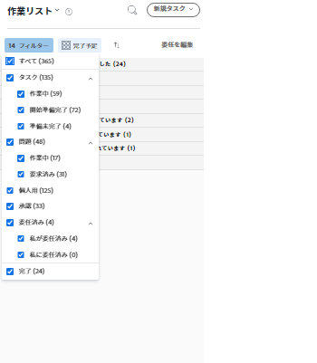
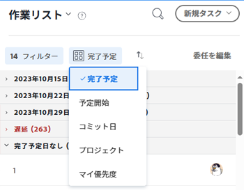
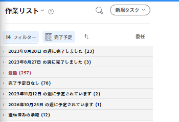
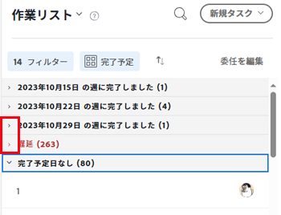

# 項目を [!UICONTROL 作業用リスト] ホームエリア内

この [!UICONTROL 作業用リスト] 内 [!UICONTROL ホーム] 領域には、自分に割り当てられているすべての作業項目が表示されます。 表示する項目を [!UICONTROL 作業] 以下に説明するリスト。

## アクセス要件

この記事の手順を実行するには、次のアクセス権が必要です。

<table style="table-layout:auto"> 
 <col> 
 </col> 
 <col> 
 </col> 
 <tbody> 
  <tr> 
   <td role="rowheader"><strong>[!DNL Adobe Workfront plan*]</strong></td> 
   <td> 
任意
 </td> 
  </tr> 
  <tr> 
   <td role="rowheader"><strong>[!DNL Adobe Workfront] ライセンス*</strong></td> 
   <td> 
[!UICONTROL Review] ：承認のみ
 
[!UICONTROL Work] 以降（他のすべてのオブジェクト用）
 </td> 
  </tr> 
  <tr> 
   <td role="rowheader"><strong>アクセスレベル設定*</strong></td> 
   <td> 
[!UICONTROL 表示 ] 以降で、プロジェクト、タスク、問題、ドキュメントにアクセスできる
 
注意：まだアクセス権がない場合は、 [!DNL Workfront] 管理者（アクセスレベルに追加の制限を設定している場合） を参照してください。 [!DNL Workfront] 管理者はアクセスレベルを変更できます。詳しくは、 <a href="../../../administration-and-setup/add-users/configure-and-grant-access/create-modify-access-levels.md" class="MCXref xref">カスタムアクセスレベルの作成または変更</a>.
 </td> 
  </tr> 
  <tr> 
   <td role="rowheader"><strong>オブジェクト権限</strong></td> 
   <td> 
作業が必要なタスクや問題に、権限以上を貢献する
 
追加のアクセス権のリクエストについて詳しくは、 <a href="../../../workfront-basics/grant-and-request-access-to-objects/request-access.md" class="MCXref xref">オブジェクトへのアクセスのリクエスト</a>.
 </td> 
  </tr> 
 </tbody> 
</table>

&#42;ご利用のプラン、ライセンスの種類、アクセス権を確認するには、 [!DNL Workfront] 管理者。

## フィルター [!UICONTROL 作業用リスト]

フィルターを適用すると、 [!UICONTROL 作業用リスト] をクリックして、特定のタイプの項目のみを表示します。 例えば、 [!UICONTROL 作業用リスト] をクリックして、問題またはリクエストのみを表示します。

>[!NOTE]
>
>フィルターオプションは、ブラウザーに保存されます。 同じコンピューター上で一貫して同じブラウザーを使用している（サイトのデータをクリアしない）場合、選択したフィルターは変更されません。 ブラウザーまたはコンピューターを切り替えると、フィルターがデフォルトのオプションに戻り、すべてのフィルターが選択解除されます。

1. 次をクリック： **[!UICONTROL メインメニュー]**  右上隅で、「 **[!UICONTROL ホーム]**.
1. 次をクリック： **[!UICONTROL フィルター]**  ドロップダウンメニュー。
1. 次のフィルターオプションから選択して、表示する項目のタイプを指定します。

   <table style="table-layout:auto"> 
    <col> 
    <col> 
    <tbody> 
     <tr> 
      <td role="rowheader"><strong>[!UICONTROL すべて ]</strong></td> 
      <td>すべての項目を表示および選択します。 これには、タスク、タスク、タスク、承認、個人タスク、完了したタスクおよびタスクが含まれます。 </td>
     </tr> 
     <tr> 
      <td role="rowheader"><strong>[!UICONTROL 作業中のタスク ]</strong></td> 
      <td> 
作業中のタスクのみを表示します。 これらは、[!UICONTROL Work On It] ボタンをクリックしたユーザーに割り当てられたタスクです。
 </td> 
     </tr> 
     <tr> 
      <td role="rowheader"><strong>[!UICONTROL タスクの開始準備完了 ]</strong></td> 
      <td> 
       
 
        
開始する準備が整ったタスクのみを表示します。 次のステートメントの両方が真である必要があります。
 
        <ul> 
         <li> 
タスクとその親には、作業を妨げる先行タスクやタスクの制約はありません。
 </li> 
         <li> 
タスクの [!UICONTROL 予定開始日 ] が過去のタスクか、最大 2 週間後のタスクです。
 </li> 
        </ul> 
       
 </td> 
     </tr> 
     <tr> 
      <td role="rowheader"><strong>[!UICONTROL タスクの準備ができていません ]</strong></td> 
      <td> 
       
 
        
まだ開始する準備ができていないタスクのみを表示します。 次のいずれかのステートメントが true である必要があります。
 
        <ul> 
         <li> 
タスクとその親には、作業を妨げる先行タスクやタスクの制約がある場合があります。
 </li> 
         <li> 
タスクには [!UICONTROL 予定開始日 ] があり、これは 2 週間以上後です。
 </li> 
        </ul> 
       
 </td> 
     </tr> 
     <tr> 
      <td role="rowheader"><strong>[!UICONTROL での作業に関する問題</strong></td> 
      <td> 
現在作業中の問題のみが表示されます。 これらは、[!UICONTROL 作業 ] ボタンをクリックしたユーザーに割り当てられた問題です。
 </td> 
     </tr> 
     <tr> 
      <td role="rowheader"><strong>[!UICONTROL リクエストされた問題 ]</strong></td> 
      <td>割り当てられているが [!UICONTROL 作業 ] ボタンをクリックしていない問題のみを表示します。</td> 
     </tr> 
     <tr> 
      <td role="rowheader"><strong>個人用</strong></td> 
      <td>個人のタスクのみを表示します。 これらは、[!UICONTROL タスク ] タスクとして作成するタスクです (「 <a href="../../../workfront-basics/using-home/using-the-home-area/create-work-items-in-home.md#creating-a-personal-task">個人用タスクの作成</a> 記事内 <a href="../../../workfront-basics/using-home/using-the-home-area/create-work-items-in-home.md">[!UICONTROL Home] 領域から作業項目を作成する</a>.</td> 
     </tr> 
     <tr> 
      <td role="rowheader"><strong>[!UICONTROL 承認 ]</strong></td> 
      <td> 
       
 
        
自分に割り当てられた、または委任された承認と、自分が送信した承認のみを表示します。 承認には、作業項目（プロジェクト、タスク、問題）に対する承認、およびドキュメント、配達確認、アクセス要求、タイムシートに対する承認が含まれます。 承認について詳しくは、次の記事を参照してください。
 
        <ul> 
         <li><a href="../../../review-and-approve-work/manage-approvals/view-approvals.md" class="MCXref xref">承認を表示</a> </li> 
        </ul> 
        <ul> 
         <li> 
<a href="../../../review-and-approve-work/manage-approvals/manage-approvals.md" class="MCXref xref">作業承認</a> 
 </li> 
        </ul> 
        
注意：自分が送信した承認と、自分が承認者の 1 人でもある場所が、2 回カウントされます。
 
       
 </td> 
     </tr> 
     <tr> 
      <td role="rowheader"><strong>[!UICONTROL 完了 ]</strong></td> 
      <td> 
完了したタスク、タスクおよび個人のタスクのみを表示します。 過去 2 週間の完了した作業が表示され、完了した週に応じてワークリストにグループ化されます。 承認は含まれません。
 
このフィルターを選択しない限り、完了した作業は [!UICONTROL 作業リスト ] に表示されません。
 </td> 
     </tr> 
    </tbody> 
   </table>

   

   >[!TIP]
   >
   >* フィルターオプションは、オブジェクト（タスク、問題、承認、個人用タスク）に基づきます。
   >* タスクと問題は、タスクに対する対応準備状況 ([!UICONTROL 作業], [!UICONTROL 開始準備完了], [!UICONTROL 準備ができていません] タスク、および [!UICONTROL 作業] および [!UICONTROL リクエスト] （問題を参照）。 特定の状態のタスクまたはタスクを表示するか、「タスク」または「タスク」をクリックしてすべての状態を選択して表示できます。
   >* 完了した項目には別個のフィルターがあり、タスクと問題の両方が含まれます。 これには承認は含まれません。 この [!UICONTROL 完了] フィルターには、個人用タスクが含まれます。
   >* 一度に 1 つの状態のみ選択できます。 例えば、 [!UICONTROL 作業] タスクとのみ [!UICONTROL リクエスト] 問題。
   >* チームの 1 つに割り当てられた項目に対してフィルターを適用することはできません。また、それらの項目は、直接割り当てられた項目には含まれません。

1. （オプション） [!UICONTROL 作業用リスト]（を参照） [日付、プロジェクト、優先度でグループ化および並べ替え](#group-and-sort-by-date-project-and-priority) 」を参照してください。

## グループ化と並べ替え基準 [!UICONTROL 日付], [!UICONTROL プロジェクト]、および [!UICONTROL 優先度]

グループ化して並べ替えを行うには、 [!UICONTROL 作業用リスト] 作成者 [!UICONTROL 計画完了日], [!UICONTROL コミット日], [!UICONTROL プロジェクト]または [!UICONTROL 優先度]. 選択するオプションによって、 [!UICONTROL 作業用リスト].

1. 次をクリック： **[!UICONTROL メインメニュー]**  右上隅で、「 **[!UICONTROL ホーム]**.
1. 次をクリック： **[!UICONTROL グループ化の基準]** ドロップダウンメニュー。

   

1. 次のオプションから選択します。

   <table style="table-layout:auto"> 
    <col> 
    <col> 
    <tbody> 
     <tr> 
      <td role="rowheader"><strong>[!UICONTROL 計画完了 ]</strong></td> 
      <td> 
 項目は、[!UICONTROL 予定完了日 ] に応じて、[!UICONTROL ワークリスト ] 内の次のグループに表示されます（各グループに含まれる項目の数は、見出しのタイトルの横に括弧で囲まれて表示されます）。
 
       <ul> 
        <li> 
[!UICONTROL 遅延 ]
 </li> 
        <li> 
[!UICONTROL 完了予定日なし ]
 </li> 
        <li> 
[!UICONTROL 今週 ]
 
このグループ化は、デフォルトで展開されます。
 </li> 
        <li> 
[!UICONTROL 来週 ]
 </li> 
        <li> 
[!UICONTROL 計画済み ] に続き、様々な [!UICONTROL 計画完了日 ]（複数のグループ）が続きます。
 </li> 
        <li> 
[!UICONTROL 完了 ]
 </li> 
       </ul> </td> 
     </tr> 
     <tr> 
      <td role="rowheader"><strong>[!UICONTROL 予定開始 ]</strong></td> 
      <td> 
項目は、[!UICONTROL 予定開始日 ] に応じて、[!UICONTROL ワークリスト ] 内の次のグループに表示されます（各グループに含まれる項目の数は、見出しのタイトルの横に括弧で囲まれて表示されます）。
 
       <ul> 
        <li> 
[!UICONTROL 遅延 ]
 </li> 
        <li> 
[!UICONTROL 今週 ] 
 
このグループ化は、デフォルトで展開されます。
 </li> 
        <li> 
[!UICONTROL 来週 ]
 </li> 
        <li> 
[!UICONTROL 計画済み ] に続き、様々な [!UICONTROL 計画開始日 ] が続く（複数のグループ化）
 </li> 
       </ul> </td> 
     </tr> 
     <tr> 
      <td role="rowheader"><strong>[!UICONTROL コミット日 ]</strong></td> 
      <td> 
項目は、[!UICONTROL ワークリスト ] 内の次のグループに表示されます（各グループに含まれる項目の数は、見出しのタイトルの横に括弧で囲まれて表示されます）。
 
       <ul> 
        <li> 
[!UICONTROL コミット日なし ]
 </li> 
        <li> 
[!UICONTROL コミット来週 ]
 </li> 
       </ul> </td> 
     </tr> 
     <tr> 
      <td role="rowheader"><strong>[!UICONTROL プロジェクト ]</strong></td> 
      <td>項目はプロジェクトに従ってグループ化され、プロジェクトは [!UICONTROL ワークリスト ] でアルファベット順に表示されます。 （各グループ内に含まれる項目の数は、見出しのタイトルの横に括弧で囲まれて表示されます）。</td> 
     </tr> 
     <tr> 
      <td role="rowheader"><strong>[!UICONTROL マイ優先度 ]</strong></td> 
      <td>選択した順序で項目が表示されます。 詳しくは、 <a href="../../../workfront-basics/using-home/using-the-home-area/prioritize-work-in-home.md" class="MCXref xref">[!UICONTROL ホーム ] 領域で作業を優先する</a>.</td> 
     </tr> 
    </tbody> 
   </table>

>[!NOTE]
>
>デフォルトの並べ替えは昇順です。 並べ替えを降順に変更すると、選択した並べ替えオプションがブラウザーに保存されます。 同じコンピューター上で同じブラウザーを一貫して使用し、サイトのデータをクリアしない場合、並べ替えは変更されませんが、ブラウザーまたはコンピューターを切り替えた場合、並べ替えはデフォルトの並べ替えに変更されます。

## 遅れた項目を表示

[!DNL Adobe Workfront] は、次の日付を使用して、作業要求が遅れているかどうかを判断します。

* **タスク**: [!UICONTROL 計画完了日]
* **問題**: [!UICONTROL 計画完了日]
* **ドキュメント**: [!UICONTROL 送信日]
* **タイムシート**: [!UICONTROL 送信日]
* **承認**: [!UICONTROL 送信日]
* **配達確認の承認**: [!UICONTROL 配達確認期限]

## 検索 [!UICONTROL 作業用リスト]

検索時に [!UICONTROL 作業用リスト]に設定されている場合、割り当てられた項目は検索で返されます（現在画面に読み込まれていない項目も含む）。 この [!UICONTROL 完了を表示] 「 」オプションが選択されている場合、過去 2 週間以内に完了とマークした項目も返されます。

また、作業項目の名前のみが検索されます（作業項目内の情報は検索されず、作業項目が存在するプロジェクトの名前も検索されません）。

を検索するには、以下を実行します。 [!UICONTROL 作業用リスト]:

1. 次をクリック： **[!UICONTROL メインメニュー]**  右上隅で、「 **[!UICONTROL ホーム]**.
1. （オプション） [!UICONTROL 作業用リスト]( [フィルター [!UICONTROL 作業用リスト]](#filter-the-work-list) および [日付、プロジェクト、優先度でグループ化および並べ替え](#group-and-sort-by-date-project-and-priority).

1. （オプション）既に完了している作業項目を検索する場合は、 [!UICONTROL 作業用リスト] ：検索の前に完了した項目を表示します。
1. 

1. 検索する項目名の入力を開始します。\
   この [!UICONTROL 作業用リスト] は、名前が一致する項目を含めるように、として自動的にフィルタリングされます。

## 作業リストのサイズを変更する

この [!UICONTROL 作業用リスト] そのため、ホームエリアの約 4 分の 1 から約半分までの間に消費される [!UICONTROL ホーム] 領域

1. 次をクリック： **[!UICONTROL メインメニュー]**  右上隅で、「 **[!UICONTROL ホーム]**.
1. マウスを右端の上に置きます。 [!UICONTROL 作業用リスト]を選択し、「作業用リスト」が目的のサイズになるまで、左右にドラッグします。

## グループ化を折りたたみ、展開する

次の項目： [!UICONTROL 作業用リスト] はグループ内に表示されます。 グループ化を折りたたんだり展開したりして、特定の時点でページに表示する情報の量を制御できます。

グループ化は、 [!UICONTROL 作業用リスト] 表示される情報をより適切に制御する。\
デフォルトでは、 [!UICONTROL 今週] グループ化が展開され、その他のグループはすべて折りたたまれます。 変更を加えた場合、次回ホーム領域にアクセスしたときにその変更が記憶されます。

1. 次をクリック： **[!UICONTROL メインメニュー]**  右上隅で、「 **[!UICONTROL ホーム]**.
1. 次をクリック： **[!UICONTROL 展開]** または **[!UICONTROL 折りたたむ]** 展開または折りたたむグループの横にある矢印。

   

   または\
   すべてのグループを同時に展開または折りたたむには、 **[!UICONTROL 展開]** または **[!UICONTROL 折りたたむ]** キーを押しながらグループの横にある矢印 [!UICONTROL Shift] キー。
