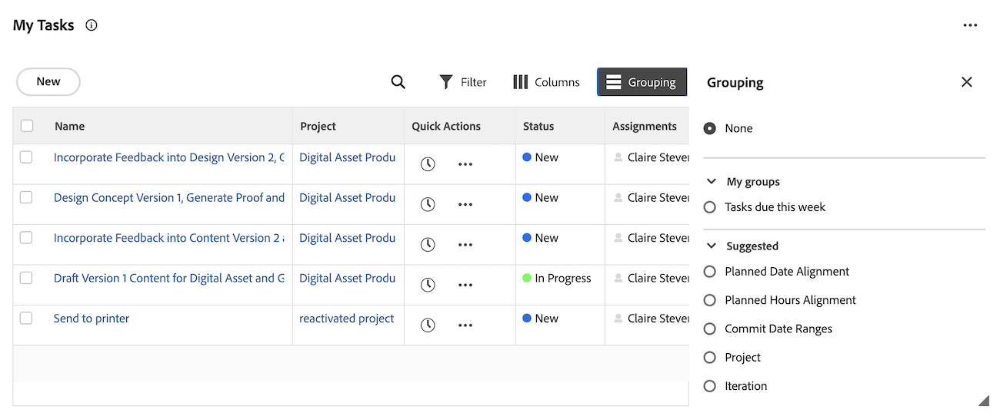

# [!UICONTROL  ホーム ]領域の[!UICONTROL  ワークリスト ]にアイテムを表示します

<!-- Audited: 1/2024 -->

各ウィジェットには、独自のワークリストが含まれています。 ワークリストには、割り当てられた作業項目がすべて表示されます。 フィルターとグループ化を使用して、[!UICONTROL  ワークリスト ]に表示する項目を制御できます。

>[!IMPORTANT]
>
>* ホーム ウィジェットにタスクとイシューを表示するには、親プロジェクトが現在のステータスか、現在のステータスと同じステータスである必要があります。
>* プロジェクトは、現在のステータスまたは現在のステータスと同じステータスで、ホームに表示される必要があります。

## アクセス要件

+++ 展開すると、この記事の機能のアクセス要件が表示されます。

<table style="table-layout:auto"> 
 <col> 
 </col> 
 <col> 
 </col> 
 <tbody> 
  <tr> 
   <td role="rowheader"><strong>[!DNL Adobe Workfront package]</strong></td> 
   <td> 
任意
 </td> 
  </tr> 
  <tr> 
   <td role="rowheader"><strong>[!DNL Adobe Workfront] ライセンス</strong></td> 
   <td><ul><li>[!UICONTROL Contributor]（承認のみ）</li> <li>[!UICONTROL Standard] 以上（他のすべてのオブジェクト）</li> 
または
 
  </ul><ul><li>[!UICONTROL Review]（承認のみ）</li> <li>[!UICONTROL Work] 以上（他のすべてのオブジェクト）</li> </td> 
  </tr> </ul>
  <tr> 
   <td role="rowheader"><strong>アクセスレベル設定</strong></td> 
   <td> 
プロジェクト、タスク、イシュー、ドキュメントに対する [!UICONTROL View] 以上のアクセス
 </td> 
  </tr> 
  <tr> 
   <td role="rowheader"><strong>オブジェクト権限</strong></td> 
   <td> 
作業する必要のあるタスクや問題に対して、権限を付与する必要があります
  </td> 
  </tr> 
 </tbody> 
</table>

詳しくは、[Workfront ドキュメントのアクセス要件](/help/quicksilver/administration-and-setup/add-users/access-levels-and-object-permissions/access-level-requirements-in-documentation.md)を参照してください。

+++

## ワークリストに表示する作業項目の要件

特定のウィジェットの作業リストに作業項目が表示される組み込みの要件があります。 次のウィジェットのワークリストに表示するには、作業項目がこれらの要件を満たしている必要があります。

### マイタスクウィジェット

マイタスクウィジェットに表示するには、タスクが次の要件を満たしている必要があります。

* タスクのステータスが「完了」と等しくない。
* ログインしたユーザーをタスクに割り当てる必要があります。
* タスクのステータスが「完了」と等しくありません。
* タスクが属するプロジェクトは、現在と同じステータスである必要があります。

### マイイシューのウィジェット

マイイシューのウィジェットに表示するには、イシューが次の要件を満たしている必要があります。

* ログインしたユーザーをイシューに割り当てる必要があります。
* イシューのステータスが「完了」と一致しません。
* イシューに未解決オブジェクトがアタッチされていません。
* 問題のステータスが「完了」と等しくありません。
* 問題が属するプロジェクトは、現在と同じステータスである必要があります。

### マイチームウィジェット

チームリクエストがマイチームウィジェットに表示されるには、次の要件を満たす必要があります。

* ログインユーザーは、作業項目が割り当てられているチームに属します。
* 作業項目のステータスが「完了」と一致しません。
* この作業項目には、未解決の承認プロセスが添付されていません。
* 作業項目は繰り返しタスクではありません。
* 作業項目が属するプロジェクトは、現在と同じステータスである必要があります。

## 作品をフィルター

ウィジェットの[!UICONTROL  ワークリスト ]の項目をフィルタリングして、特定の種類の項目のみを表示できます。 例えば、マイワーク [!UICONTROL  ワークリスト ]をフィルタリングして、問題または要求のみを表示できます。

>[!NOTE]
>
>フィルターオプションは、ブラウザーに保存されます。 同じコンピューターで同じブラウザーを一貫して使用し、選択したフィルターを削除しない場合は、変更しないでください。 ブラウザーまたはコンピューターを切り替えると、フィルターはデフォルトのオプションに戻ります。このオプションでは、すべてのフィルターの選択が解除されています。

作業をフィルタリングするには：

1. 右上隅の&#x200B;**[!UICONTROL メインメニュー]** をクリックし、**[!UICONTROL ホーム]**&#x200B;をクリックします。
1. （条件付き）次のいずれかのウィジェットを追加するには、**カスタマイズ**&#x200B;をクリックします。

   | ウィジェット | 説明 |
   |--------------|---------------------------------------------------------------------------------------------------|
   | ボード | 作成した、または使用するように招待されたボードを表示します |
   | 担当作業 | 割り当てられたタスクとイシューを表示します |
   | マイプロジェクト | 所有しているプロジェクトまたは所有しているプロジェクトを表示します |
   | マイタスク | 割り当てられたタスクを表示します |
   | マイイシュー | 割り当てられたイシューを表示 |
   | マイリクエスト | 送信したすべてのリクエストを表示します |
   | マイ承認 | 保留中、割り当て済み、委任済み、送信済みのすべての承認を表示します |

1. ウィジェットワークリストの右上隅にある&#x200B;**フィルター** アイコン をクリックします。
1. **候補** フィルターまたは作成したフィルターを選択します。
推奨フィルターについて詳しくは、[ ホームウィジェットフィルターの概要](/help/quicksilver/workfront-basics/using-home/using-the-home-area/widget-filter-overview-home.md)を参照してください。
1. （オプション）「**フィルターをスタック**」を切り替えて、複数のフィルターオプションを選択します。

   

## 作業のグループ化

ウィジェット [!UICONTROL  ワークリスト ]をグループ化して、作業項目を整理しておくことができます。

ワークリストをグループ化するには：

1. 右上隅の&#x200B;**[!UICONTROL メインメニュー]** をクリックし、**[!UICONTROL ホーム]**&#x200B;をクリックします。
1. （条件付き）次のいずれかのウィジェットを追加するには、**カスタマイズ**&#x200B;をクリックします。

   | ウィジェット | 説明 |
   |--------------|---------------------------------------------------------------------------------------------------|
   | ボード | 作成した、または使用するように招待されたボードを表示します |
   | 担当作業 | 割り当てられたタスクとイシューを表示します |
   | マイプロジェクト | 所有しているプロジェクトまたは所有しているプロジェクトを表示します |
   | マイタスク | 割り当てられたタスクを表示します |
   | マイイシュー | 割り当てられたイシューを表示 |
   | マイリクエスト | 送信したすべてのリクエストを表示します |
   | マイ承認 | 保留中、割り当て済み、委任済み、送信済みのすべての承認を表示します |

1. ウィジェットワークリストの右上隅にある&#x200B;**グループ** アイコン をクリックします。
1. 作成した&#x200B;**推奨** グループまたはグループを選択します。
   

## ワークリスト列のカスタマイズ

ウィジェットワークリストに表示する列を選択できます。

1. 右上隅の&#x200B;**[!UICONTROL メインメニュー]** をクリックし、**[!UICONTROL ホーム]**&#x200B;をクリックします。
1. （条件付き）次のいずれかのウィジェットを追加するには、**カスタマイズ**&#x200B;をクリックします。

   | ウィジェット | 説明 |
   |--------------|---------------------------------------------------------------------------------------------------|
   | ボード | 作成した、または使用するように招待されたボードを表示します |
   | 担当作業 | 割り当てられたタスクとイシューを表示します |
   | マイプロジェクト | 所有しているプロジェクトまたは所有しているプロジェクトを表示します |
   | マイタスク | 割り当てられたタスクを表示します |
   | マイイシュー | 割り当てられたイシューを表示 |
   | マイリクエスト | 送信したすべてのリクエストを表示します |
   | マイ承認 | 保留中、割り当て済み、委任済み、送信済みのすべての承認を表示します |

1. ウィジェットワークリストの右上隅にある&#x200B;**列** アイコン をクリックします。
1. 好みに応じて、列のオンとオフを切り替えます。
1. （オプション） **ドラッグ** アイコン をクリックして、列を並べ替えます。
   

## 遅れた項目を表示する

[!DNL Adobe Workfront] は、次の日付を使用して、作業リクエストが遅れているかどうかを判断します。

* **タスク**：[!UICONTROL 予定完了日]
* **イシュー**：[!UICONTROL 予定完了日]
* **ドキュメント**：[!UICONTROL 送信日]
* **タイムシート**：[!UICONTROL 送信日]
* **承認**：[!UICONTROL 送信日]
* **プルーフの承認**：[!UICONTROL プルーフの期限]

