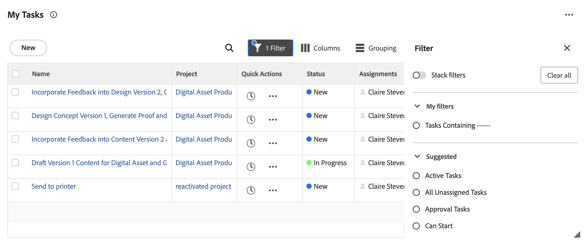

# [!UICONTROL &#x200B; 作業リスト &#x200B;] の項目を [!UICONTROL &#x200B; ホーム &#x200B;] エリアに表示

<!-- Audited: 1/2024 -->

各ウィジェットには、独自のワークリストが含まれています。 作業リストには、自分に割り当てられているすべての作業項目が表示されます。 フィルターとグループ化を使用して、[!UICONTROL &#x200B; ワークリスト &#x200B;] に表示する項目を制御できます。

>[!IMPORTANT]
>
>* ホームウィジェットにタスクと問題を表示するには、その親プロジェクトが現在のステータスまたは現在と同じステータスである必要があります。
>* また、プロジェクトは、現在のステータスまたはホームに表示される現在のステータスに等しいステータスである必要があります。

## アクセス要件

+++ 展開すると、この記事の機能のアクセス要件が表示されます。

<table style="table-layout:auto"> 
 <col> 
 </col> 
 <col> 
 </col> 
 <tbody> 
  <tr> 
   <td role="rowheader"><strong>[!DNL Adobe Workfront package]</strong></td> 
   <td> 
任意
 </td> 
  </tr> 
  <tr> 
   <td role="rowheader"><strong>[!DNL Adobe Workfront] ライセンス</strong></td> 
   <td><ul><li>[!UICONTROL Contributor]（承認のみ）</li> <li>[!UICONTROL Standard] 以上（他のすべてのオブジェクト）</li> 
または
 
  </ul><ul><li>[!UICONTROL Review]（承認のみ）</li> <li>[!UICONTROL Work] 以上（他のすべてのオブジェクト）</li> </td> 
  </tr> </ul>
  <tr> 
   <td role="rowheader"><strong>アクセスレベル設定</strong></td> 
   <td> 
プロジェクト、タスク、イシュー、ドキュメントに対する [!UICONTROL View] 以上のアクセス
 </td> 
  </tr> 
  <tr> 
   <td role="rowheader"><strong>オブジェクト権限</strong></td> 
   <td> 
作業が必要なタスクと問題に対する権限以上の投稿
  </td> 
  </tr> 
 </tbody> 
</table>

詳しくは、[Workfront ドキュメントのアクセス要件](/help/quicksilver/administration-and-setup/add-users/access-levels-and-object-permissions/access-level-requirements-in-documentation.md)を参照してください。

+++

## 作業リストに作業項目を表示するための要件

作業項目が特定のウィジェットの作業リストに表示される組み込み要件があります。 作業項目が次のウィジェットのワークリストに表示されるためには、これらの要件を満たす必要があります。

### マイタスクウィジェット

タスクがマイタスクウィジェットに表示されるには、次の要件を満たす必要があります。

* タスクの状態が完了と等しくありません。
* ログインしたユーザーは、タスクに割り当てられている必要があります。
* タスクの状態が完了と等しくありません。
* タスクが属するプロジェクトは、現在と同じステータスである必要があります。

### 自分の問題ウィジェット

問題がマイ問題ウィジェットに表示されるには、次の要件を満たす必要があります。

* ログインしたユーザーは、イシューに割り当てられている必要があります。
* 問題のステータスが完了と等しくない。
* この問題に添付されている未解決のオブジェクトはありません。
* イシューのステータスが完了と等しくない。
* イシューが属するプロジェクトは、現在と同じステータスである必要があります。

### マイチームウィジェット

チームリクエストがマイチーム ウィジェットに表示されるには、次の要件を満たす必要があります。

* ログイン ユーザーは、作業項目が割り当てられているチームに属しています。
* 作業項目の状態が完了と等しくありません。
* 作業項目に未解決の承認プロセスが添付されていません。
* 作業項目は定期タスクではありません。
* 作業項目が属するプロジェクトは、現在と同じステータスである必要があります。

## 作業をフィルター

ウィジェットの [!UICONTROL &#x200B; ワークリスト &#x200B;] の項目をフィルタリングして、特定のタイプの項目のみを表示できます。 例えば、担当作業 [!UICONTROL &#x200B; 作業リスト &#x200B;] をフィルタリングして、イシューまたはリクエストのみを表示できます。

>[!NOTE]
>
>フィルターオプションは、ブラウザーに保存されます。同じコンピューターで一貫して同じブラウザーを使用する（かつサイトデータを消去しない）場合、選択したフィルターは変更されません。 ブラウザーまたはコンピューターを切り替えると、フィルターはデフォルトのオプションに戻ります。つまり、すべてのフィルターが選択解除されます。

作業をフィルタリングするには：

1. 右上隅の **[!UICONTROL メインメニュー]** をクリックし、**[!UICONTROL ホーム]** をクリックします。
1. （条件付き） **カスタマイズ** をクリックして、次のいずれかのウィジェットを追加します。

   | ウィジェット | 説明 |
   |--------------|---------------------------------------------------------------------------------------------------|
   | ボード | 作成または招待したボードを表示します |
   | 担当作業 | 自分に割り当てられているタスクおよび問題を表示します |
   | マイプロジェクト | 所有しているプロジェクトまたは自分が参加しているプロジェクトを表示します |
   | マイタスク | 自分に割り当てられているタスクを表示します |
   | マイイシュー | 自分に割り当てられている問題を表示します |
   | マイリクエスト | 送信したすべての要求を表示します |
   | マイ承認 | 承認待ち、割り当て、委任、および送信済みのすべてを表示します |

1. ウィジェットワークリストの右上隅にある **フィルター** アイコン  をクリックします。
1. **候補** フィルターまたは作成したフィルターを選択します。
提案フィルターについて詳しくは、「ホームウィジェットフィルターの概要 [&#x200B; を参照してください &#x200B;](/help/quicksilver/workfront-basics/using-home/using-the-home-area/widget-filter-overview-home.md)。
1. （任意） **フィルターをスタック** をオンにして、複数のフィルターオプションを選択します。

   

## 作業のグループ化

ウィジェット [!UICONTROL &#x200B; ワークリスト &#x200B;] をグループ化して、作業項目を整理しておくことができます。

ワークリストをグループ化するには：

1. 右上隅の **[!UICONTROL メインメニュー]** をクリックし、**[!UICONTROL ホーム]** をクリックします。
1. （条件付き） **カスタマイズ** をクリックして、次のいずれかのウィジェットを追加します。

   | ウィジェット | 説明 |
   |--------------|---------------------------------------------------------------------------------------------------|
   | ボード | 作成または招待したボードを表示します |
   | 担当作業 | 自分に割り当てられているタスクおよび問題を表示します |
   | マイプロジェクト | 所有しているプロジェクトまたは自分が参加しているプロジェクトを表示します |
   | マイタスク | 自分に割り当てられているタスクを表示します |
   | マイイシュー | 自分に割り当てられている問題を表示します |
   | マイリクエスト | 送信したすべての要求を表示します |
   | マイ承認 | 承認待ち、割り当て、委任、および送信済みのすべてを表示します |

1. ウィジェットワークリストの右上隅にある **グループ** アイコン  をクリックします。
1. 作成した **候補** グループまたはグループ化を選択します。
   

## ワークリスト列のカスタマイズ

ウィジェットのワークリストに表示する列を選択できます。

1. 右上隅の **[!UICONTROL メインメニュー]** をクリックし、**[!UICONTROL ホーム]** をクリックします。
1. （条件付き） **カスタマイズ** をクリックして、次のいずれかのウィジェットを追加します。

   | ウィジェット | 説明 |
   |--------------|---------------------------------------------------------------------------------------------------|
   | ボード | 作成または招待したボードを表示します |
   | 担当作業 | 自分に割り当てられているタスクおよび問題を表示します |
   | マイプロジェクト | 所有しているプロジェクトまたは自分が参加しているプロジェクトを表示します |
   | マイタスク | 自分に割り当てられているタスクを表示します |
   | マイイシュー | 自分に割り当てられている問題を表示します |
   | マイリクエスト | 送信したすべての要求を表示します |
   | マイ承認 | 承認待ち、割り当て、委任、および送信済みのすべてを表示します |

1. ウィジェットワークリストの右上隅にある **列** アイコン  をクリックします。
1. 環境設定に応じて、列のオン/オフを切り替えます。
1. （オプション） **ドラッグ** アイコン  をクリックして、列を並べ替えます。
   

## 遅れた項目を表示する

[!DNL Adobe Workfront] は、次の日付を使用して、作業リクエストが遅れているかどうかを判断します。

* **タスク**：[!UICONTROL 予定完了日]
* **イシュー**：[!UICONTROL 予定完了日]
* **ドキュメント**：[!UICONTROL 送信日]
* **タイムシート**：[!UICONTROL 送信日]
* **承認**：[!UICONTROL 送信日]
* **プルーフの承認**：[!UICONTROL プルーフの期限]

