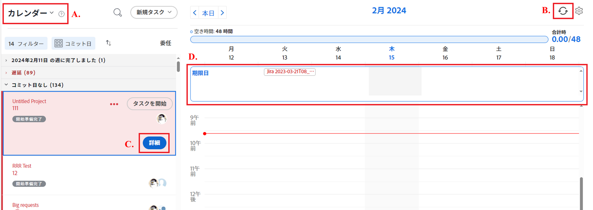
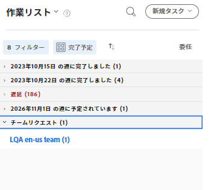
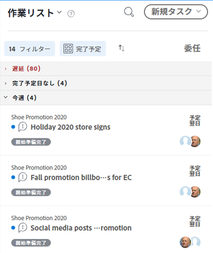
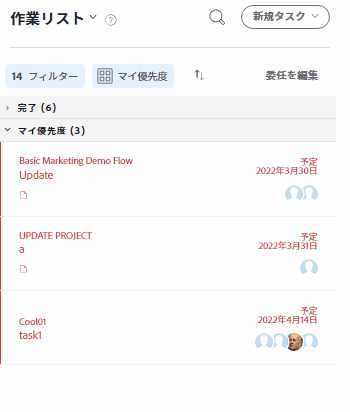
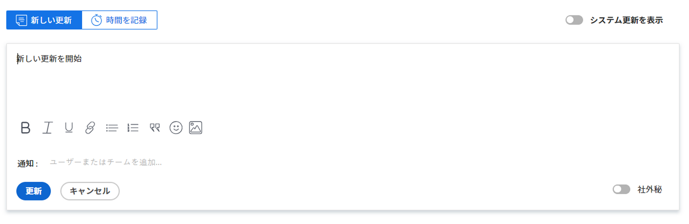
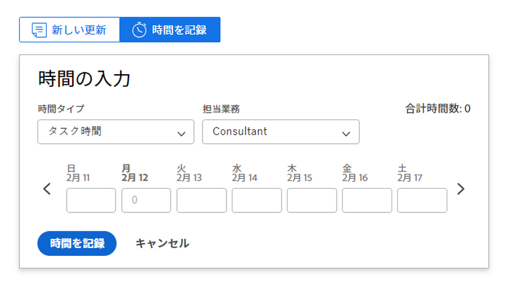

# の基本を学ぶ [!UICONTROL ホーム]

<!--Audited: 12/2023-->

この記事では、現在の [!UICONTROL ホーム] 領域 [!DNL Adobe Workfront]. 新しい [!UICONTROL ホーム]を参照してください。 [新しいホームを使い始める](../new-home/get-started-with-new-home.md).

現在の [!UICONTROL ホーム] 領域：

* 次から： [!UICONTROL 作業用リスト]
* 次から： [!UICONTROL カレンダー].

## [!UICONTROL 作業用リスト]

割り当てられたすべての作業を、 [!UICONTROL 作業用リスト]:

![[!UICONTROL 作業用リスト] パネル](assets/worklist-and-right-panel-home.png)

現在の [!UICONTROL ホーム] 領域（上の画像でハイライト表示されている）

* **A**：左側のパネルを使用して、割り当てられた作業をフィルタリング、並べ替え、選択します。

* **B**：左側のパネルで作業項目を選択した後、右側のパネルを使用してカスタムフィールドの操作、更新、およびログ時間をおこないます。

詳しくは、 [!UICONTROL ホームの作業リスト]（次の記事を参照）。

* [次の項目を [!UICONTROL 作業用リスト] （内） [!UICONTROL ホーム] 領域](../../../workfront-basics/using-home/using-the-home-area/display-items-in-home-work-list.md)
* [から作業項目を作成する [!UICONTROL ホーム] 領域](../../../workfront-basics/using-home/using-the-home-area/create-work-items-in-home.md)

## [!UICONTROL カレンダー]

作業項目が期限切れになったときに表示することで、作業内容を視覚化できます。また、作業内容を [!UICONTROL カレンダー] （内） [!UICONTROL ホーム] 領域：

現在の [!UICONTROL ホーム] 領域（上の画像でハイライト表示されている）

* **A**：を使用します。 [!UICONTROL カレンダー] 表示を使用して、完了する必要のある作業のビジュアルマップを作成します。 作業項目を [!UICONTROL 作業用リスト] に [!UICONTROL カレンダー] 働く時間をブロックする

* **B**：を使用します。 [!UICONTROL カレンダー]の同期オプションを [!DNL Outlook] カレンダー。 会議を管理し、すべてを 1 か所で作業します。

* **C**：を使用します。 [!UICONTROL 詳細] ボタンをクリックして新しい右パネルを開き、作業項目の詳細を表示できます。

* **D**：期限バーを使用して、自分に割り当てられている作業の期限を追跡します。

ホームカレンダーの使用方法の詳細については、「 [以下を使用します。 [!UICONTROL ホームカレンダー] 表示](../../../workfront-basics/using-home/using-the-home-area/use-home-calendar-view.md).

## 作業の検索

The [!UICONTROL ホーム] area は、割り当てられたタスク、問題、および承認を検索するためのワンストップショップです。 フィルター、グループ化、並べ替えの各オプションは、作業項目を目的の方法で整理する際に役立ちます。 グループ化を使用して、項目をグループ化したり、完了する必要がある作業にフィルターを適用したり、最後に並べ替えて、項目をグループ化の昇順または降順にリスト化したりできます。

>[!NOTE]
>
>フィルターおよび並べ替えのオプションは、ブラウザーに保存されます。 同じコンピューターで一貫して同じブラウザーを使用している（サイトのデータをクリアしない）場合、フィルターと並べ替えは変更されませんが、ブラウザーまたはコンピューターを切り替えた場合、フィルターと並べ替えは異なります。

### 類似した作業項目をグループ化と共にグループ化します

グループ化を使用すると、ワークリストの共通ヘッダーの下に、同様の項目を表示できます。 項目を次の項目でグループ化できます。

* [!UICONTROL 計画完了]
* [!UICONTROL 計画開始]
* [!UICONTROL コミット日]
* [!UICONTROL プロジェクト]
* [!UICONTROL 優先度]

グループ化の使用方法について詳しくは、 [次の項目を [!UICONTROL 作業用リスト] （内） [!UICONTROL ホーム] 領域](../../../workfront-basics/using-home/using-the-home-area/display-items-in-home-work-list.md).

### フィルターでフォーカスを絞り込む

The [!UICONTROL 作業用リスト] フィルターを使用すると、特定の作業項目にフォーカスを絞り込むことができます。

次に、ホームで表示した項目をフィルタする方法の例を示します。

* 項目のタイプと状態でフィルターします。

  例えば、すべてのタスクを表示する場合は、 [!UICONTROL タスク] フィルター。 これより具体的に作業を開始する準備が整ったタスクのみを表示する場合は、 [!UICONTROL 開始準備完了] フィルターを [!UICONTROL タスク] フィルター。

* 項目タイプのみでフィルターします。

  例えば、 [!UICONTROL 問題] すべての州のすべての問題を見るには ([!UICONTROL 作業中] または [!UICONTROL リクエスト済み]) または [!UICONTROL 承認] すべての作業項目、アクセス要求、タイムシート、ドキュメント、および配達確認の承認を表示するには、次の手順に従います。

フィルターの使用方法について詳しくは、 [次の項目を [!UICONTROL 作業用リスト] （内） [!UICONTROL ホーム] 領域](../../../workfront-basics/using-home/using-the-home-area/display-items-in-home-work-list.md).

### チームに割り当てられた作業にアクセス

The [!UICONTROL ホーム] 領域に永続的なグループ化 ([!UICONTROL チームリクエスト]) をクリックして、チームに割り当てられたタスクと問題を表示します。 チームはこのセクションに表示されます。 チームの名前をクリックすると、そのチームのチームリクエストページが開きます。

>[!NOTE]
>
>フィルターおよび並べ替えオプションは、 [!UICONTROL チームリクエスト] グループ化。 このグループは、チームに作業が割り当てられている限り表示されます。

チームリクエストへのアクセスについて詳しくは、この記事を参照してください。 [[!UICONTROL 管理] での作業とチームのリクエスト [!UICONTROL ホーム] 領域](../../../workfront-basics/using-home/using-the-home-area/manage-work-and-team-requests-home.md).

### 送信した作業を監視します

直接承認用に送信した作業を次の場所から追跡する [!UICONTROL 作業用リスト]. 次の項目が永続的にグループ化されています： [!UICONTROL 送信済みの承認] 表示を選択したとき [!UICONTROL 承認] （内） [!UICONTROL 作業用リスト]. 承認が必要な作業を承認者に通知することができます。 必要に応じて、承認を取り消すこともできます。

>[!NOTE]
>
>フィルターと並べ替えは、 [!UICONTROL 送信済みの承認] グループ化。 承認待ちの作業がある限り、このグループは表示されます。
>
>内の承認数 [!UICONTROL 承認] フィルターには、承認用に送信した項目数が表示されません。 The [!UICONTROL 承認] フィルターには、承認を待っている項目のみが表示されます。

## 重要な項目を優先する

The [!UICONTROL 作業用リスト] を使用すると、 [!UICONTROL 優先度] グループ化。 最大 20 個の項目を [!UICONTROL 優先度] リスト。

>[!NOTE]
>
>次に追加された作業項目： [!UICONTROL 優先度] は自分にのみ表示され、自分の仕事を優先する人はいません。

の使用方法の詳細については、 [!UICONTROL 優先度]を参照してください。 [の作業を優先する [!UICONTROL ホーム] 領域](../../../workfront-basics/using-home/using-the-home-area/prioritize-work-in-home.md).

## 完了

項目名をクリックした後 [!UICONTROL 作業用リスト]を使用する場合は、 [!UICONTROL ホーム] をクリックして、作業を更新し、完了します。

### カスタマイズされたスペースで作業する

お使いの [!DNL Workfront] 管理者は、最大 16 個のカスタムフィールドを [!UICONTROL 作業用リスト]必要な情報を簡単に見つけて更新できるようにします。 ほとんどのフィールドは編集可能なので、作業項目に移動する必要はありません。

この領域のフィールドを更新するには、単にフィールドをクリックします。 フィールドが編集可能な場合は、右パネルで変更できます。

>[!NOTE]
>
>次を更新できません： [!UICONTROL コミット日] このフィールドをレイアウトテンプレートから作業項目に追加する場合。

### 他のユーザーを重要な情報で更新する

他のユーザーと迅速かつ効率的にコミュニケーションを取る [!UICONTROL ホーム] 領域。 作業項目のコメント領域を使用すると、質問をしたり、最近の更新を他のユーザーに通知したり、 [!UICONTROL ホーム] 領域。 さらに、進行中の他のユーザーを更新するには、次の手順を実行します。

* の更新 [!UICONTROL コミット日] コメント領域で

  >[!NOTE]
  >
  >   ここでは、ホームでコミット日を更新できる唯一の場所です。

* コメントを追加または [!UICONTROL 条件] 項目の
* 割合完了バーの更新

詳しくは、 [!UICONTROL ホーム] 領域、詳しくは、 [作業を更新](../../../workfront-basics/updating-work-items-and-viewing-updates/update-work.md).

### 時刻を記録

個々の作業項目に対して行った作業時間を追跡します。 一般的な時間タイプ（例： ）を選択できます。 [!UICONTROL タスク時間]または、 [!DNL Workfront] 管理者。

のログに時刻を記録する方法の詳細 [!UICONTROL ホーム] 領域（「セクション」を参照） [ホーム](../../../timesheets/create-and-manage-timesheets/log-time.md#home) 記事内 [ログ時間](../../../timesheets/create-and-manage-timesheets/log-time.md).

