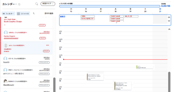
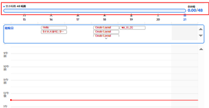
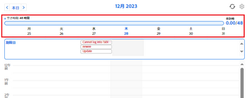

# [!UICONTROL ホームカレンダー] 表示

<!--

Updated for QS except for section about expanding a work item in the list--this isn't working yet in QS.

-->

The [!UICONTROL ホームカレンダー] 表示 [!UICONTROL ホーム] 「 」領域では、自分だけが表示できる個人の作業カレンダーで、作業週や作業の割り当てを表示および管理できます。 これを使用して、作業を実行するタイミングをスケジュール設定できます。 また、外部のカレンダー ( [!UICONTROL Microsoft Outlook] カレンダー。

>[!NOTE]
>
>The [!UICONTROL ホームカレンダー] 表示が次と異なる [!UICONTROL カレンダー] レポート。 詳しくは、 [!UICONTROL カレンダー] レポート： [[!UICONTROL カレンダー] レポートの概要](../../../reports-and-dashboards/reports/calendars/calendar-reports-overview.md).

の設定手順が必要な場合は、 [!UICONTROL ホームカレンダー]を参照してください。 [を設定します。 [!UICONTROL ホームカレンダー] 設定を表示](../../../workfront-basics/using-home/using-the-home-area/configure-home-calendar-view.md).

にアクセスする方法について詳しくは、 [!UICONTROL ホームカレンダー] 表示： [次を表示： [!UICONTROL ホームカレンダー]](../../../workfront-basics/using-home/using-the-home-area/view-home-calendar.md).

の統合について詳しくは、 [!UICONTROL ホームカレンダー] 外部カレンダーを使用する場合は、 [[!UICONTROL [!UICONTROL ホームカレンダーの設定]] ビュー設定](../../../workfront-basics/using-home/using-the-home-area/configure-home-calendar-view.md).

この記事の残りの節では、 [!UICONTROL ホームカレンダー] 詳細を表示します。

## 次に示す作業リスト： [!UICONTROL ホームカレンダー]

自分、自分のグループ、自分のチーム、自分の役割に割り当てられた作業項目（タスク、問題、リクエスト、承認）が [!UICONTROL 作業リスト] カレンダーの左側の [!UICONTROL ホーム] 領域。

作業項目は、 [!UICONTROL 作業リスト] を [!UICONTROL ホームカレンダー] を使用して、いつ作業を行うかをスケジュール設定します。 作業のスケジュールについて詳しくは、 [以下を使用します。 [!UICONTROL ホームカレンダー] 表示](../../../workfront-basics/using-home/using-the-home-area/use-home-calendar-view.md).

リスト内の作業項目をクリックすると、その作業内容を表示および更新できます。

作業用リストで選択した項目について、項目に応じて、カレンダーの左側に次の情報が表示される場合があります。

* **[!UICONTROL プロジェクト名]**：作業項目の左上に表示されます。 これは、項目が関連付けられているプロジェクトです。 上記の例では、プロジェクトタイトルは「2020 campaign での Fall」です。
* **[!UICONTROL 作業項目名]**：プロジェクト名の下にが表示されます。 上の例では、作業項目のタイトルは「September 15 issue」です。
* **[!UICONTROL 完了]**：作業割り当てのステータスを次に変更するには、このボタンをクリックします。 [!UICONTROL 完了]. このボタンは、タスクまたはタスクに割り当てられている場合にのみ表示されます。
* **[!UICONTROL 私の部分で完了]**: [!UICONTROL 私の部分で完了] ボタンをクリックして、作業割り当てのステータスを次に変更します。 [!UICONTROL 完了].
* **[!UICONTROL 計画済み]**：リソースマネージャーが、その項目に対して完了するために割り当てた作業時間を表示します。 予定時間について詳しくは、 [計画時間の概要](../../../manage-work/tasks/task-information/planned-hours.md).

* **[!UICONTROL ログ済み]**：タイムシートまたは [!UICONTROL 更新] タブをクリックします。 詳しくは、 [作業項目に関する時間を [!UICONTROL ホーム] 領域](../../../workfront-basics/using-home/using-the-home-area/log-time-on-work-item-in-home.md)

* **[!UICONTROL Scheduled]**: [!UICONTROL カレンダー] 表示。 作業項目を [!UICONTROL カレンダー] 表示： [次の場所で作業項目をスケジュール [!UICONTROL ホームカレンダー]](../../../workfront-basics/using-home/using-the-home-area/use-home-calendar-view.md#scheduling-work-items-in-home-calendar) in [以下を使用します。 [!UICONTROL ホームカレンダー] 表示](../../../workfront-basics/using-home/using-the-home-area/use-home-calendar-view.md).

* **[!UICONTROL 詳細]**：このボタンをクリックして、 [!UICONTROL カレンダー] 表示。
* **[!UICONTROL 作業する]**：項目に対して作業する割り当てを承認するには、このボタンをクリックします。

## 割り当てバー

を設定する際に、 [!UICONTROL ホームカレンダー]を使用する場合は、通常 1 週間に勤務する時間数を指定します ( [を設定します。 [!UICONTROL ホームカレンダー] 設定を表示](../../../workfront-basics/using-home/using-the-home-area/configure-home-calendar-view.md)) をクリックします。 [!DNL Adobe Workfront] この数値を使用して、割り当て可能な作業時間の合計を決定します。

The [!UICONTROL 配分] bar は、作業週の時間数と、その使用方法を視覚的に表したものです。

の色 [!UICONTROL 配分] バーには次の情報が表示されます。

* **グレー**：統合されたカレンダーでイベントに予定されている時間数。 カレンダーの統合について詳しくは、「 [を設定します。 [!UICONTROL ホームカレンダー] 設定を表示](../../../workfront-basics/using-home/using-the-home-area/configure-home-calendar-view.md#configuring-your-home-calendar-view) in [を設定します。 [!UICONTROL ホームカレンダー] 設定を表示](../../../workfront-basics/using-home/using-the-home-area/configure-home-calendar-view.md).

* **青**：にスケジュールした時間数。 [!DNL Workfront] 自分に割り当てられた作業項目 作業スケジュールを設定するには、 [!UICONTROL 作業用リスト] カレンダーにドロップして 作業のスケジュール設定について詳しくは、 [次の場所で作業項目をスケジュール [!UICONTROL ホームカレンダー]](../../../workfront-basics/using-home/using-the-home-area/use-home-calendar-view.md#scheduling-work-items-in-home-calendar) のセクション [以下を使用します。 [!UICONTROL ホームカレンダー] 表示](../../../workfront-basics/using-home/using-the-home-area/use-home-calendar-view.md).

* **ライトブルー**：配分に使用できる空き時間数。
* **赤**（上記の図は参照できません）：その週の使用可能な時間数を超えた予定イベントおよび作業項目です。

## [!UICONTROL 期限] バー

The [!UICONTROL 期限] バーで [!UICONTROL ホームカレンダー] 現在表示されている週の期限（期限）をその週に従って表示します [!UICONTROL 計画完了日].

>[!NOTE]
>
>Microsoftカレンダーを [!DNL Workfront] カレンダー、項目 [!UICONTROL 期限] バーは、作業リストから自分のMicrosoftカレンダーにドラッグしない限り、カレンダーに表示されません [!DNL Workfront] カレンダー。 詳しくは、  [次に示す作業リスト： [!UICONTROL ホームカレンダー]](#work-list-on-the-home-calendar) 上記と記事  [を設定します。 [!UICONTROL ホームカレンダー] 設定を表示](../../../workfront-basics/using-home/using-the-home-area/configure-home-calendar-view.md).
