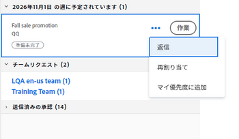
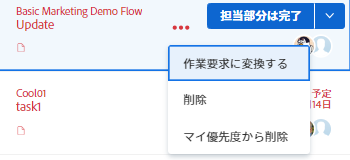

# [!UICONTROL ホーム]エリアでの作業およびチームリクエストを管理する

仕事のタスクやイシューが割り当てられると、それらは[!UICONTROL ホーム]エリアの[!UICONTROL 作業リスト]に一覧表示されます。リクエストの表示、再割り当て、返信、操作、削除を行うことができます。[!UICONTROL ホーム]エリアでの作業リクエストは、リクエストキューに関連するイシューに限定されません。

## アクセス要件

この記事の手順を実行するには、次のアクセス権が必要です。

<table style="table-layout:auto"> 
 <col> 
 </col> 
 <col> 
 </col> 
 <tbody> 
  <tr> 
   <td role="rowheader"><strong>[!DNL Adobe Workfront plan*]</strong></td> 
   <td> 
任意
 </td> 
  </tr> 
  <tr> 
   <td role="rowheader"><strong>[!DNL Adobe Workfront] ライセンス*</strong></td> 
   <td> 
[!UICONTROL Work] 以上
 </td> 
  </tr> 
  <tr> 
   <td role="rowheader"><strong>アクセスレベル設定*</strong></td> 
   <td> 
タスクとイシューに対する[!UICONTROL Edit]アクセス権
 
メモ：まだアクセス権がない場合は、アクセスレベルに追加の制限を設定しているかどうかを [!DNL Workfront] 管理者に確認してください。[!DNL Workfront] 管理者がアクセスレベルを変更する方法について詳しくは、<a href="../../../administration-and-setup/add-users/configure-and-grant-access/create-modify-access-levels.md" class="MCXref xref">カスタムアクセスレベルの作成または変更</a>を参照してください。
 </td> 
  </tr> 
  <tr> 
   <td role="rowheader"><strong>オブジェクト権限</strong></td> 
   <td> 
作業が必要なタスクやイシューに対する参加以上の権限
 
追加のアクセス権のリクエストについて詳しくは、<a href="../../../workfront-basics/grant-and-request-access-to-objects/request-access.md" class="MCXref xref">オブジェクトへのアクセス権のリクエスト</a>を参照してください。
 </td> 
  </tr> 
 </tbody> 
</table>

&#42;ご利用のプラン、ライセンスの種類、アクセス権を確認するには、[!DNL Workfront] 管理者にお問い合わせください。

## 作業リクエストを表示する

自分に割り当てられた作業リクエストは、[!UICONTROL ホーム]の左側のパネルに表示されます。[!UICONTROL 作業リスト]の上部にあるフィルターを使用して、[!UICONTROL ホーム]に表示するリクエストを設定できます。

作業の準備ができた項目または現在作業中の項目を表示するフィルターを選択できます。

この記事では、[!UICONTROL ホーム]エリアのフィルターを使用して、現在作業中の項目、または作業を開始することを検討している項目を表示する方法について説明します。[!UICONTROL ホーム]エリアのすべてのフィルターについて詳しくは、[[!UICONTROL ホーム]エリアの作業リストに項目を表示](../../../workfront-basics/using-home/using-the-home-area/display-items-in-home-work-list.md)を参照してください。

1. 右上隅にある&#x200B;**[!UICONTROL メインメニュー]**  をクリックして、「**[!UICONTROL ホーム]**」をクリックします。
1. 「**[!UICONTROL フィルター]**」ドロップダウンメニューをクリックします。

   

1. タスクに対して、次のいずれかのオプションまたは両方をクリックします。

   **[!UICONTROL 準備完了]：**&#x200B;開始する準備ができたタスクとイシューのみを表示します。以下の条件の両方が成り立つ必要があります。

   * タスクとその親には、作業を妨げる先行タスクやタスク制約がない。
   * タスクまたはイシューの[!UICONTROL 予定開始日]は過去、または最大 2 週間先です。

   **[!UICONTROL 準備未完了]**：まだ開始する準備ができていないタスクとイシューのみを表示します。以下の条件のいずれか 1 つが成り立つ必要があります。

   * タスクとその親に、作業を妨げる先行タスクやタスク制約がある可能性がある。
   * タスクまたはイシューの[!UICONTROL 予定開始日]は 2 週間以上先です。

1. [!UICONTROL タスク]または[!UICONTROL イシュー]の下にある「**[!UICONTROL 作業中]**」をクリックして、現在取り組んでいるタスクとイシューを表示します。
1. [!UICONTROL イシュー]の下の「**[!UICONTROL 要求済み]**」をクリックすると、要求された（割り当てられている）が、まだ作業を承諾していないイシューが表示されます。

## チームリクエストにアクセスする

チームに割り当てられたリクエストには、[!UICONTROL ホーム]エリアから直接アクセスできます。チームリクエストについて詳しくは、[チームリクエストの概要](../../../people-teams-and-groups/work-with-team-requests/team-requests-overview.md)を参照してください。

1. 右上隅にある&#x200B;**[!UICONTROL メインメニュー]** 、「**[!UICONTROL ホーム]**」の順にクリックします。
1. **[!UICONTROL 作業リスト]**&#x200B;エリアで、「**[!UICONTROL チームリクエスト]**」のグループ化をクリックして展開します。

   チームにリクエストが割り当てられていない場合は、グループ化は表示されません。

   

1. チーム名をクリックします。\
   「**[!UICONTROL チームリクエスト]**」セクションには、チームに割り当てられたすべてのリクエストが表示されます。チームリクエストの作業について詳しくは、[作業とチームリクエストを管理](../../../people-teams-and-groups/work-with-team-requests/manage-work-and-team-requests.md)を参照してください。

## リクエストを再割り当てする

1. 右上隅にある&#x200B;**[!UICONTROL メインメニュー]**  をクリックして、「**[!UICONTROL ホーム]**」をクリックします。
1. **[!UICONTROL 作業リスト]**&#x200B;エリアで、再割り当てするリクエストを選択します。

1. 「**[!UICONTROL 割り当て]**」ウィジェットをクリックしてリクエストから自分を削除し、リクエストを再割り当てするユーザーの名前を入力します。

   >[!TIP]
   >
   >作業リクエストがまだ「準備完了」または「準備未完了」状態にない場合は、[!UICONTROL 作業リスト]の&#x200B;**[!UICONTROL その他]**&#x200B;メニューの「**[!UICONTROL 再割り当て]**」ボタンを使用できます。\
   >

1. 完了後にタスクのステータスが「[!UICONTROL 新規]」または「[!UICONTROL 進行中]」に変更された場合、タスクをホームの作業リストに再度表示するには、ユーザーの割り当てを解除し、タスクを保存してからユーザーを再割り当てする必要があります。

## リクエストに返信する

リクエストに返信して、リクエストをより明確にしたり、新しい日付を提案したりできます。

1. 右上隅にある&#x200B;**[!UICONTROL メインメニュー]**  をクリックして、「**[!UICONTROL ホーム]**」をクリックします。
1. **[!UICONTROL 作業リスト]**&#x200B;エリアで、返信するリクエストを選択します。
1. 自分にリクエストを割り当てた個人を見つけます。

   この情報は、タスクの「[!UICONTROL 更新]」タブで確認できます。「**[!UICONTROL システム更新を表示]**」するオプションが有効になっていることを確認してください。

1. 「**[!UICONTROL 新しい更新の開始]**」をクリックして、返信の入力を開始します。
1. 「**[!UICONTROL 通知]**」ボックスに受信者の名前を入力し、「**[!UICONTROL 更新]**」をクリックします。

   >[!TIP]
   >
   >作業リクエストがまだ「準備完了」または「[!UICONTROL 準備未完了]」状態にない場合は、[!UICONTROL 作業リスト]の&#x200B;**[!UICONTROL その他]**&#x200B;メニューの「**[!UICONTROL 返信]**」ボタンを使用できます。\
   >![[!UICONTROL 返信ボタン]](assets/reassign-in-left-panel-350x204.png)   >

## リクエストに応じて作業する

「[!UICONTROL 作業]」ボタンをクリックすると、リクエストを送信したユーザーと、リクエストに割り当てられる可能性のある他のユーザーに対して、リクエストの作業を開始することを示すことになります。リクエストの作業について詳しくは、[作業とチームリクエストを管理](../../../people-teams-and-groups/work-with-team-requests/manage-work-and-team-requests.md)を参照してください。

1. 右上隅にある&#x200B;**[!UICONTROL メインメニュー]**  をクリックして、「**[!UICONTROL ホーム]**」をクリックします。
1. **[!UICONTROL 作業リスト]**&#x200B;エリアで、作業するリクエストを選択して、「**[!UICONTROL 作業]**」をクリックします。\
   イシューに関する情報が右側のパネルに表示されます。

## リクエストを削除する

リクエストに対して作業すべきではないと判断した場合は、タスクまたはイシューをリクエストに変換し直すか、リストから削除することができます。

1. 右上隅にある&#x200B;**[!UICONTROL メインメニュー]**  をクリックして、「**[!UICONTROL ホーム]**」をクリックします。
1. **[!UICONTROL 作業リスト]**&#x200B;で、作業待ちの項目を指します。
1. 「**[!UICONTROL 割当て]**」ウィジェットをクリックして、自分を削除します。これにより、作業アイテムが作業リストから削除されます。リクエストが他のユーザーに割り当てられていない場合、または別のチームや担当業務に割り当てられていない場合、リクエストは未割り当てのままになります。

   または

   [!UICONTROL ホームの作業]リストのタスクまたはイシュー名の右側にある&#x200B;**[!UICONTROL その他]**&#x200B;メニューアイコン  をクリックします。

   

1. 次のオプションから選択します。

   * **[!UICONTROL 作業リクエストに変換]：**&#x200B;作業アイテムを作業リクエストに変換するには、このオプションを選択します。\

     作業アイテムはリクエストに戻され、ユーザーはリクエストに割り当てられたままになります。\
      もう一度「**[!UICONTROL 作業]**」をクリックすると、後でリクエストを受け入れることができます。

   * **[!UICONTROL 削除]：**[!UICONTROL 作業リスト]からリクエストを削除するには、このオプションを選択します。\

     リクエストから割り当てが解除され、リクエストは [!DNL Adobe Workfront] の自分の名前と関連付けられなくなりました。\
      リクエストが他のユーザーに割り当てられていない場合、または別のチームや担当業務に割り当てられていない場合、リクエストは未割り当てのままになります。
