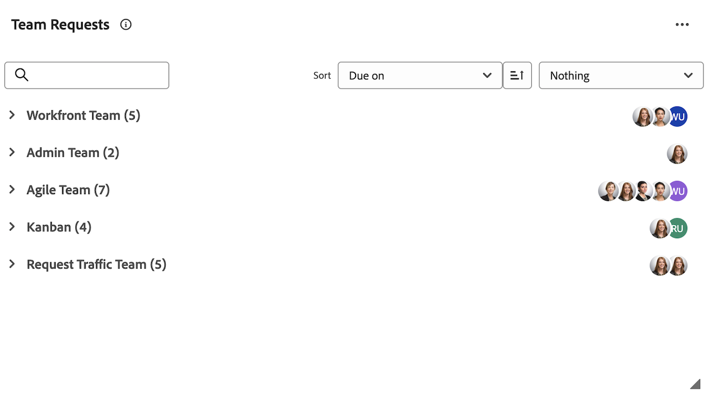
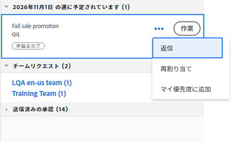

# [!UICONTROL  ホーム ]領域での作業項目とチームの要求の管理

作業タスクとイシューが割り当てられると、マイワークウィジェット、マイタスクウィジェット、マイイシューのウィジェットにリストされます。  作業項目とリクエストを表示、作業、または削除できます。

## アクセス要件

+++ 展開すると、この記事の機能のアクセス要件が表示されます。 

<table style="table-layout:auto"> 
 <col> 
 </col> 
 <col> 
 </col> 
 <tbody> 
  <tr> 
   <td role="rowheader"><strong>[!DNL Adobe Workfront package]</strong></td> 
   <td> 
任意
 </td> 
  </tr> 
  <tr> 
   <td role="rowheader"><strong>[!DNL Adobe Workfront] ライセンス</strong></td> 
   <td>
   
標準

    
Work またはそれ以上
 </td> 
  </tr> 
  <tr> 
   <td role="rowheader"><strong>アクセスレベル設定</strong></td> 
   <td> 
タスクとイシューに対する[!UICONTROL Edit]アクセス権
 </td> 
  </tr> 
  <tr> 
   <td role="rowheader"><strong>オブジェクト権限</strong></td> 
   <td> 
作業が必要なタスクやイシューに対する参加以上の権限
</td> 
  </tr> 
 </tbody> 
</table>

詳しくは、[Workfront ドキュメントのアクセス要件](/help/quicksilver/administration-and-setup/add-users/access-levels-and-object-permissions/access-level-requirements-in-documentation.md)を参照してください。

+++

## マイワークウィジェットでの作業項目の表示

自分に割り当てられている作業項目は、[!UICONTROL  ホーム ]のマイワークウィジェットに表示されます。 ウィジェット [!UICONTROL の上部にあるフィルターを使用して、マイワークウィジェットに表示する作業項目を設定できます。]

作業の準備ができた項目または現在作業中の項目を表示するフィルターを選択できます。

この記事では、[!UICONTROL ホーム]エリアのフィルターを使用して、現在作業中の項目、または作業を開始することを検討している項目を表示する方法について説明します。 [!UICONTROL  ホーム ]領域でフィルターを使用する方法について詳しくは、[!UICONTROL  ホーム ]領域](/help/quicksilver/workfront-basics/using-home/using-the-home-area/display-items-in-home-work-list.md)の[!UICONTROL  ワークリスト ]で[項目を表示するを参照してください。

マイワークウィジェットで作業項目を表示するには：

1. 右上隅の&#x200B;**[!UICONTROL メインメニュー]** をクリックし、**[!UICONTROL ホーム]**&#x200B;をクリックします。
1. （条件付き）「**カスタマイズ**」をクリックして、**マイワーク** ウィジェットを追加します。

1. ウィジェットワークリストの左上隅にある&#x200B;**フィルター** アイコン をクリックします。

1. タスクに対して、次のいずれかのオプションまたは両方をクリックします。

   **[!UICONTROL 準備完了]：**&#x200B;開始する準備ができたタスクとイシューのみを表示します。 以下の条件の両方が成り立つ必要があります。

   * タスクとその親には、作業を妨げる先行タスクやタスク制約がない。
   * タスクまたはイシューの[!UICONTROL 予定開始日]は過去、または最大 2 週間先です。

   **[!UICONTROL 準備未完了]**：まだ開始する準備ができていないタスクとイシューのみを表示します。 以下の条件のいずれか 1 つが成り立つ必要があります。

   * タスクとその親に、作業を妨げる先行タスクやタスク制約がある可能性がある。
   * タスクまたはイシューの[!UICONTROL 予定開始日]は 2 週間以上先です。

1. [!UICONTROL タスク]または[!UICONTROL イシュー]の下にある「**[!UICONTROL 作業中]**」をクリックして、現在取り組んでいるタスクとイシューを表示します。
1. [!UICONTROL イシュー]の下の「**[!UICONTROL 要求済み]**」をクリックすると、要求された（割り当てられている）が、まだ作業を承諾していないイシューが表示されます。

## チームリクエストウィジェットでのチームリクエストへのアクセス

チームに割り当てられたリクエストには、[!UICONTROL  ホーム ] エリアのチームリクエストウィジェットから直接アクセスできます。 チームリクエストについて詳しくは、[チームリクエストの概要](../../../people-teams-and-groups/work-with-team-requests/team-requests-overview.md)を参照してください。

チームリクエストにアクセスするには：

1. 右上隅の&#x200B;**[!UICONTROL メインメニュー]** をクリックし、**[!UICONTROL ホーム]**&#x200B;をクリックします。
1. （条件付き）「**カスタマイズ**」をクリックして、**チームリクエスト** ウィジェットを追加します。

   ウィジェットには、チームのグループ化の下にチームリクエストが表示されます。 **[!UICONTROL チームリクエスト]** ウィジェットには、自分が所属するチームに割り当てられたすべてのリクエストが表示されます。 チームリクエストの作業について詳しくは、[作業とチームリクエストを管理](../../../people-teams-and-groups/work-with-team-requests/manage-work-and-team-requests.md)を参照してください。

   

## マイ作業ウィジェットでの作業項目の作業

「[!UICONTROL  Itで作業]」ボタンをクリックすると、作業項目を提出したユーザーと、作業を開始する作業項目に割り当てられている可能性があるその他のユーザーに指示します。

作業項目に取り組むには：

1. 右上隅の&#x200B;**[!UICONTROL メインメニュー]** をクリックし、**[!UICONTROL ホーム]**&#x200B;をクリックします。
1. （条件付き）「**カスタマイズ**」をクリックして、**マイワーク** ウィジェットを追加します。

1. ウィジェットの&#x200B;**[!UICONTROL ワークリスト]**&#x200B;領域で、作業するリクエストを選択し、**[!UICONTROL 作業]**&#x200B;をクリックします。
1. 作業項目にカーソルを合わせ、**概要** アイコンをクリックして、作業項目に関する情報を表示します。

   

## 作業項目の削除

作業項目を作業しないと判断した場合は、リストから削除できます。

作業項目を削除するには：

1. 右上隅の&#x200B;**[!UICONTROL メインメニュー]** をクリックし、**[!UICONTROL ホーム]**&#x200B;をクリックします。
1. （条件付き）「**カスタマイズ**」をクリックして、**マイワーク** ウィジェットを追加します。

1. ウィジェットワークリストで、作業項目にカーソルを合わせ、**概要** アイコンをクリックして、作業項目に関する情報を表示します。
   
1. 「**割り当て**」セクションで、自分の名前を削除します。
   

<!--
## Reassign a request

1. Click the **[!UICONTROL Main Menu]**  in the upper-right corner, then click **[!UICONTROL Home]**.
1. In the **[!UICONTROL Work List]** area, select the request you want to reassign.

1. Click on the **[!UICONTROL Assignments]** widget and remove yourself from the request, then type the name of the user you want to reassign the request to.

   >[!TIP]
   >
   >If the work request is still in the Ready to Start or Not Ready state, you can use the **[!UICONTROL Reassign]** button in the **[!UICONTROL More]** menu in the [!UICONTROL Work List].\
   >

1. If a task's status is changed to [!UICONTROL New] or [!UICONTROL In Progress] after it was completed, you must unassign the user, save the task, then reassign the user in order for the task to reappear in their Home Work List.

## Reply to a request

You can reply to a request to further clarify the request or to propose a new date.

1. Click the **[!UICONTROL Main Menu]**  in the upper-right corner, then click **[!UICONTROL Home]**.
1. In the **[!UICONTROL Work List]** area, select the request you want to reply to.
1. Locate the individual who assigned the request to you.

   You can find this information on the [!UICONTROL Updates] tab of the task. Make sure the option to **[!UICONTROL Show System Updates]** is enabled.

1. Click **[!UICONTROL Start new update]** and begin typing your reply.
1. Enter the name of the recipient in the **[!UICONTROL Notify]** box, then click **[!UICONTROL Update]**.

   >[!TIP]
   >
   >If the work request is still in the Ready to Start or [!UICONTROL Not Ready] state, you can use the **[!UICONTROL Reply]** button in the **[!UICONTROL More]** menu in the [!UICONTROL Work List].\
   >![[!UICONTROL Reply button]](assets/reassign-in-left-panel-350x204.png)   

   -->
