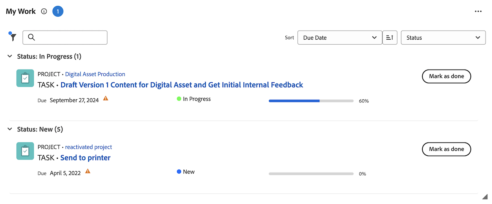

# [!UICONTROL ホーム]エリアで項目を[!UICONTROL 完了]とマーク

タスクまたはイシューの担当者である場合は、タスクまたはイシューを完了としてマークできます。タスクまたはイシューを[!UICONTROL 完了]とマークすると、タスクまたはイシューのステータスは[!UICONTROL 完了]を変更されます。

>[!NOTE]
>
>タスクまたはイシューに割り当てられたリソースの 1 つでない限り、「[!UICONTROL 完了]」ボタンは表示されません。

+++ 展開すると、この記事の機能のアクセス要件が表示されます。

## アクセス要件

この記事の手順を実行するには、次のアクセス権が必要です。

<table style="table-layout:auto"> 
 <col> 
 </col> 
 <col> 
 </col> 
 <tbody> 
  <tr> 
   <td role="rowheader"><strong>[!DNL Adobe Workfront plan*]</strong></td> 
   <td> 
任意
 </td> 
  </tr> 
  <tr> 
   <td role="rowheader"><strong>[!DNL Adobe Workfront] ライセンス*</strong></td> 
   <td> 
[!UICONTROL Work] 以上
 </td> 
  </tr> 
  <tr> 
   <td role="rowheader"><strong>アクセスレベル設定*</strong></td> 
   <td> 
タスクとイシューに対する[!UICONTROL Edit]アクセス権
 
メモ：まだアクセス権がない場合は、アクセスレベルに追加の制限が設定されているか [!DNL Workfront] 管理者に確認してください。[!DNL Workfront] 管理者がアクセスレベルを変更する方法について詳しくは、<a href="../../../administration-and-setup/add-users/configure-and-grant-access/create-modify-access-levels.md" class="MCXref xref">カスタムアクセスレベルの作成または変更</a>を参照してください。
 </td> 
  </tr> 
  <tr> 
   <td role="rowheader"><strong>オブジェクト権限</strong></td> 
   <td> 
作業が必要なタスクやイシューに対する参加以上の権限
 
追加のアクセス権のリクエストについて詳しくは、<a href="../../../workfront-basics/grant-and-request-access-to-objects/request-access.md" class="MCXref xref">オブジェクトへのアクセス権のリクエスト </a>を参照してください。
 </td> 
  </tr> 
 </tbody> 
</table>

&#42;ご利用のプラン、ライセンスタイプまたはアクセス権を確認するには、[!DNL Workfront] 管理者にお問い合わせください。

+++

## 担当作業ウィジェットで作業項目を完了としてマークします

1. 右上隅の **[!UICONTROL メインメニュー]** をクリックし、**[!UICONTROL ホーム]** をクリックします。
1. （条件付き） **カスタマイズ** をクリックして **担当作業** ウィジェットを追加します。
1. 作業項目を見つけ、作業項目の「**[!UICONTROL 完了としてマーク]**」をクリックします。
このボタンの表示方法について詳しくは、[「[!UICONTROL 完了]」ボタンのオプションについて](#understand-the-options-of-the-done-button)を参照してください。
   

## 概要パネルでの作業項目の完了のマーク

概要パネルを使用して、マイタスクおよびマイ問題ウィジェットで作業項目を完了としてマークできます。

1. 右上隅の **[!UICONTROL メインメニュー]** をクリックし、**[!UICONTROL ホーム]** をクリックします。
1. （任意） **カスタマイズ** をクリックして、**マイタスク** または **マイイシュー** ウィジェットを追加します。
1. 作業項目の上にマウスポインターを置き、「**概要** アイコンをクリックします。
   
1. 概要パネルの上部にある「**完了としてマーク**」をクリックします。

## 「[!UICONTROL 完了]」ボタンのオプションについて

デフォルトで、作業アイテムの「[!UICONTROL 完了]」ボタンをクリックすると、その項目のステータスは[!UICONTROL 完了]（タスクの場合）または[!UICONTROL 解決済み]（イシューの場合）に変更されます。

[!DNL Adobe Workfront] 管理者は、「[!UICONTROL 完了]」ボタン関連付けられているステータスをカスタマイズできます。カスタマイズした内容はホームチームに適用できます。

「[!UICONTROL 完了]」ボタンに関連付けられているステータスの数またはタスクまたはイシューに割り当てられているリソースの数に応じて、「[!UICONTROL 完了]」ボタンの外観は変更されます。

* [1 つのステータスに関連付けられた「[!UICONTROL 完了]」ボタン](#done-button-associated-with-one-status)
* [複数のステータスに関連付けられた「[!UICONTROL 完了]」ボタン](#done-button-associated-with-multiple-statuses)
* [複数のリソースに割り当てられた項目の「[!UICONTROL 完了]」ボタン](#done-button-for-items-assigned-to-multiple-resources)

### 1 つのステータスに関連付けられた「[!UICONTROL 完了]」ボタン

「[!UICONTROL 完了]」ボタンが 1 つのステータスに関連付けられ、作業アイテムが割り当てられている場合、ボタンは&#x200B;**[!UICONTROL 完了]**&#x200B;と表示されます。クリックすると、タスクまたはイシューのステータスは、[!UICONTROL 完了]」ボタンに関連付けされたステータスに変更されます。

どのステータスが「[!UICONTROL 完了]」ボタンと関連付けされているかを確認するには、[チーム設定の編集](../../../people-teams-and-groups/create-and-manage-teams/edit-team-settings.md)で説明されるように、「[!UICONTROL 完了ボタン]」セクションのホームチームの[!UICONTROL チーム設定]を確認します。

ホームチームに割り当てられていない場合、前述の[「[!UICONTROL 完了]」ボタンのオプションについて](#understand-the-options-of-the-done-button)で説明されるように、[!UICONTROL 完了]クリック時にデフォルトのステータスが選択されます。

### 複数のステータスに関連付けられた「[!UICONTROL 完了]」ボタン

「[!UICONTROL 完了]」ボタンが複数のステータスに関連付けられている場合、ドロップダウンメニューのボタンに&#x200B;**[!UICONTROL 完了]**&#x200B;と表示されます。このシナリオでは、簡単に「[!UICONTROL 完了]」をクリックできません。ドロップダウンメニューからステータスを選択する必要があります。作業アイテムの完了に最も適したステータスを選択します。これにより、作業アイテムのステータスを変更します。

複数のステータスに「[!UICONTROL 完了]」ボタンを関連付けする方法について詳しくは、[タスクの「[!UICONTROL 完了]」ボタンの設定](../../../people-teams-and-groups/create-and-manage-teams/configure-the-done-button-for-tasks.md)および[イシューの「[!UICONTROL 完了]」ボタンの設定](../../../people-teams-and-groups/create-and-manage-teams/configure-the-done-button-for-issues.md)を参照してください。

### 複数のリソースに割り当てられた項目の「[!UICONTROL 完了]」ボタン

タスクまたはイシューが複数のリソースに割り当てられている場合、ドロップダウンメニューのボタンに&#x200B;**[!UICONTROL 完了]**&#x200B;と表示されます。ドロップダウンメニューでは、**[!UICONTROL 自分の部品で完了]** （チームメンバーに、タスクのどの部分でも完了したことを知らせる）または [!UICONTROL  完了 ] ボタン（項目を完了する）に関連付けられたステータスを選択できます。 「**[!UICONTROL 担当部分は完了]**」を選択した後に、作業アイテムは作業リストから削除されますが、作業アイテムに割り当てられている作業アイテムの作業リストには残ります。\
「完了」ボタンが複数のステータスに関連付けられている場合は、そのステータスが「**担当部分は完了**」の下に表示されます。

>[!NOTE]
>
>複数の担当者がいるタスクまたはイシューの場合、各ユーザーには、タスクまたはイシューに対する自分の割り当てが実際に完了したことを示す責任があります。この理由から、各担当者は「[!UICONTROL 完了]」をクリックし、項目に割り当てられた作業が完了したことを示す必要があります。

