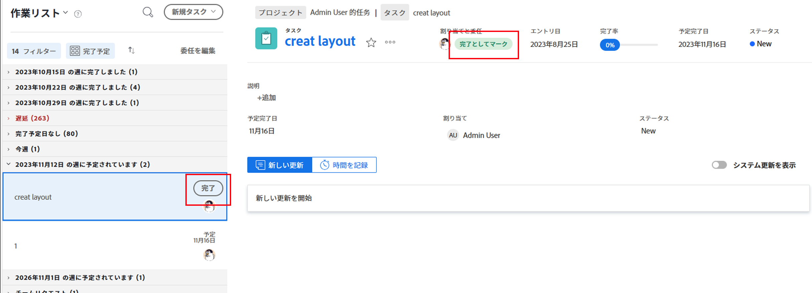
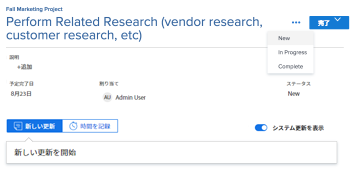
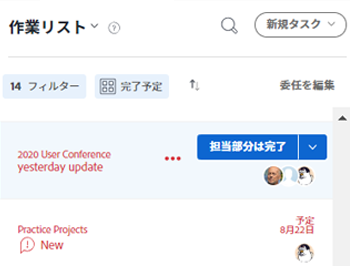

# 項目を次の形式でマーク [!UICONTROL 完了] 内 [!UICONTROL ホーム] 領域

タスクまたはタスクの担当者である場合は、タスクまたはタスクを「完了」としてマークできます。 タスクまたはタスクを次のようにマークする場合 [!UICONTROL 完了]に設定されている場合、タスクまたはイシューのステータスは [!UICONTROL 完了].

>[!NOTE]
>
>次の項目は表示されません： [!UICONTROL 完了] 」ボタンをクリックします。

## アクセス要件

この記事の手順を実行するには、次のアクセス権が必要です。

<table style="table-layout:auto"> 
 <col> 
 </col> 
 <col> 
 </col> 
 <tbody> 
  <tr> 
   <td role="rowheader"><strong>[!DNL Adobe Workfront plan*]</strong></td> 
   <td> 
任意
 </td> 
  </tr> 
  <tr> 
   <td role="rowheader"><strong>[!DNL Adobe Workfront] ライセンス*</strong></td> 
   <td> 
[!UICONTROL Work] 以降
 </td> 
  </tr> 
  <tr> 
   <td role="rowheader"><strong>アクセスレベル設定*</strong></td> 
   <td> 
タスクと問題への [!UICONTROL 編集 ] アクセス
 
注意：まだアクセス権がない場合は、 [!DNL Workfront] 管理者（アクセスレベルに追加の制限を設定している場合） を参照してください。 [!DNL Workfront] 管理者はアクセスレベルを変更できます。詳しくは、 <a href="../../../administration-and-setup/add-users/configure-and-grant-access/create-modify-access-levels.md" class="MCXref xref">カスタムアクセスレベルの作成または変更</a>.
 </td> 
  </tr> 
  <tr> 
   <td role="rowheader"><strong>オブジェクト権限</strong></td> 
   <td> 
作業が必要なタスクや問題に、権限以上を貢献する
 
追加のアクセス権のリクエストについて詳しくは、 <a href="../../../workfront-basics/grant-and-request-access-to-objects/request-access.md" class="MCXref xref">オブジェクトへのアクセスのリクエスト </a>.
 </td> 
  </tr> 
 </tbody> 
</table>

&#42;ご利用のプラン、ライセンスの種類、アクセス権を確認するには、 [!DNL Workfront] 管理者。

## タスクまたはタスクを次のようにマーク [!UICONTROL 完了]

タスクまたはタスクに割り当てられたユーザーのみが、タスクまたはタスクを [!UICONTROL 完了].

1. 次をクリック： **[!UICONTROL メインメニュー]**  右上隅で、「 **[!UICONTROL ホーム]**.
1. 内 **[!UICONTROL 作業用リスト]**&#x200B;で、作業を待っている項目を探します。
1. 次のいずれかの操作を行います。

* クリック **[!UICONTROL 完了]** （作業項目）\
   詳しくは、 [のオプションについて [!UICONTROL 完了] ボタン](#understand-the-options-of-the-done-button) このボタンの表示方法の詳細を参照してください。

* 実行済みとしてマークする項目を選択し、右側のパネルで、 **[!UICONTROL ステータスを更新]**&#x200B;次に、項目のステータスを [!UICONTROL 完了] または [!UICONTROL クローズ].

## のオプションについて [!UICONTROL 完了] ボタン

デフォルトでは、 [!UICONTROL 完了] 作業項目のボタンが、その項目のステータスを [!UICONTROL 完了] （タスクの場合）または [!UICONTROL 解決済み] （問題の場合）。

お使いの [!DNL Adobe Workfront] 管理者は、関連付けられているステータスをカスタマイズできます [!UICONTROL 完了] ボタンをクリックし、それらのカスタマイズをホームチームに適用します。

に関連付けられているステータスの数に応じて、 [!UICONTROL 完了] ボタン、またはタスクまたはイシューに割り当てられているリソースの数、またはタスクまたはイシューの外観 [!UICONTROL 完了] ボタンを変更できます。

* [[!UICONTROL 完了] 1 つのステータスに関連付けられたボタン](#done-button-associated-with-one-status)
* [[!UICONTROL 完了] 複数のステータスに関連付けられたボタン](#done-button-associated-with-multiple-statuses)
* [[!UICONTROL 完了] 複数のリソースに割り当てられた項目のボタン](#done-button-for-items-assigned-to-multiple-resources)

### [!UICONTROL 完了] 1 つのステータスに関連付けられたボタン

次の場合に [!UICONTROL 完了] ボタンが 1 つのステータスに関連付けられ、作業項目が割り当てられている場合、ボタンは次のようになります。 **[!UICONTROL 完了]**. クリックすると、タスクまたはイシューのステータスが、 [!UICONTROL 完了] 」ボタンをクリックします。

どのステータスが [!UICONTROL 完了] ボタンをクリックし、 [!UICONTROL チーム設定] の [!UICONTROL 完了ボタン] の節を参照してください。 [チーム設定を編集](../../../people-teams-and-groups/create-and-manage-teams/edit-team-settings.md).

ホームチームに割り当てられていない場合は、クリック時に既定のステータスが選択されます [!UICONTROL 完了]( 上記の [のオプションについて [!UICONTROL 完了] ボタン](#understand-the-options-of-the-done-button).

### [!UICONTROL 完了] 複数のステータスに関連付けられたボタン

次の場合に [!UICONTROL 完了] ボタンが複数のステータスに関連付けられている場合、ボタンに **[!UICONTROL 完了]** その後にドロップダウンメニューが表示されます。 このシナリオでは、 [!UICONTROL 完了]. ドロップダウンメニューからステータスを選択する必要があります。 作業項目の完了に最も適したステータスを選択します。 これにより、作業項目のステータスを変更します。

複数のステータスを [!UICONTROL 完了] ボタン、「 [の設定 [!UICONTROL 完了] タスクのボタン](../../../people-teams-and-groups/create-and-manage-teams/configure-the-done-button-for-tasks.md) および [の設定 [!UICONTROL 完了] ボタン](../../../people-teams-and-groups/create-and-manage-teams/configure-the-done-button-for-issues.md).

<!--

-->

### [!UICONTROL 完了] 複数のリソースに割り当てられた項目のボタン

タスクまたはイシューが複数のリソースに割り当てられている場合、ボタンに「 **[!UICONTROL 完了]** その後にドロップダウンメニューが表示されます。 ドロップダウンメニューで、次の中から選択できます。 **[!UICONTROL 私の部分で完了]** （これにより、チームメンバーは、自分がタスクの一部について完了したことを知ることができます）または [!UICONTROL 完了] ボタン（項目を完了する） 次を選択した後： **[!UICONTROL 私の部分で完了]**「 」の場合、作業項目は「作業リスト」から削除されますが、作業項目に割り当てられている作業項目の「作業リスト」には残ります。\
「完了」ボタンが複数のステータスに関連付けられている場合は、そのステータスが「 **私の部分で完了**.

>[!NOTE]
>
>複数の担当者がいるタスクまたはタスクの場合、各ユーザーは、タスクまたはタスクに対する自分の割り当てが実際に完了したことを示す責任を持ちます。 この理由から、各担当者は [!UICONTROL 完了] アイテムに割り当てられた作業が完了したことを示すために

