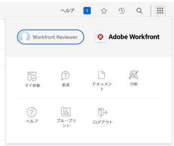
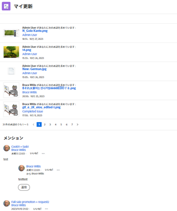
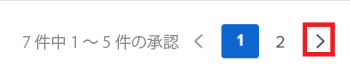
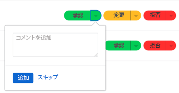
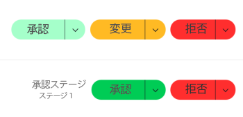
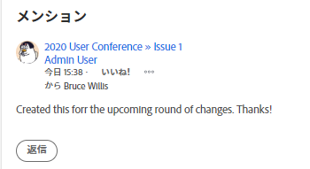

# 以下を使用： [!UICONTROL マイアップデート] 領域

<!--

(NOTE: there is a similar article like this in the "My Work" folder that is conditioned for Classic only)

-->

以下を使用して、 [!UICONTROL マイアップデート] 領域を使用して、決定または会話が含まれるのを待っている承認をすばやく確認できます。

を持つユーザーとして [!UICONTROL レビュー] ライセンス、 [!UICONTROL マイアップデート] 領域 [!UICONTROL メインメニュー] デフォルトでは、 [!UICONTROL マイアップデート] 「領域」はデフォルトのランディングページです。

詳しくは、 [!DNL Adobe Workfront] ライセンス， 「 [[!DNL Adobe Workfront] ライセンスの概要](../../../administration-and-setup/add-users/access-levels-and-object-permissions/wf-licenses.md).

「レビュー」とは異なるライセンスの種類がある場合、 [!DNL Workfront] または、グループ管理者が [!UICONTROL マイアップデート] 領域をレイアウトテンプレートに追加して、メインメニューに表示します。 詳しくは、 [のカスタマイズ [!UICONTROL メインメニュー] レイアウトテンプレートの使用](../../../administration-and-setup/customize-workfront/use-layout-templates/customize-main-menu.md).

## アクセス要件

この記事の手順を実行するには、次のアクセス権が必要です。

<table style="table-layout:auto"> 
 <col> 
 <col> 
 <tbody> 
  <tr> 
   <td role="rowheader"><strong>[!DNL Adobe Workfront plan*]</strong></td> 
   <td> 
任意
 </td> 
  </tr> 
  <tr> 
   <td role="rowheader"><strong>[!DNL Adobe Workfront] ライセンス*</strong></td> 
   <td> 
[!UICONTROL リクエスト ] 以降
 </td> 
  </tr> 
  <tr> 
   <td role="rowheader"><strong>アクセスレベル設定*</strong></td> 
   <td> 
会話でタグ付けされたオブジェクトに対するアクセス権以上の表示、または承認の解決が必要なオブジェクト（プロジェクト、タスク、タスク、問題、ドキュメント）
 
注意：まだアクセス権がない場合は、 [!DNL Workfront] 管理者（アクセスレベルに追加の制限を設定している場合） を参照してください。 [!DNL Workfront] 管理者はアクセスレベルを変更できます。詳しくは、 <a href="../../../administration-and-setup/add-users/configure-and-grant-access/create-modify-access-levels.md" class="MCXref xref">カスタムアクセスレベルの作成または変更</a>.
 </td> 
  </tr> 
  <tr> 
   <td role="rowheader"><strong>オブジェクト権限</strong></td> 
   <td> 
会話でタグ付けされたプロジェクト、タスク、イシュー、ドキュメントに対する [!UICONTROL 表示 ] 権限以上、または承認の解決が必要なプロジェクト、タスク、イシューおよびドキュメントに対する権限
 
追加のアクセス権のリクエストについて詳しくは、 <a href="../../../workfront-basics/grant-and-request-access-to-objects/request-access.md" class="MCXref xref">オブジェクトへのアクセスのリクエスト </a>.
 </td> 
  </tr> 
 </tbody> 
</table>

ご利用のプラン、ライセンスの種類、アクセス権を確認するには、 [!DNL Workfront] 管理者。

## 前提条件

開始する前に、次の条件を満たす必要があります。

* 次の場合、 [!DNL Workfront] ～以外の免許 [!UICONTROL レビュー]、 [!DNL Workfront] または、グループ管理者が [!UICONTROL マイアップデート] 領域 [!UICONTROL メインメニュー] レイアウトテンプレートを使用して、そのテンプレートに割り当てます。

* レビューライセンスユーザーは、 [!UICONTROL マイアップデート] 領域 [!UICONTROL メインメニュー] デフォルトでは。

## 次にアクセス： [!UICONTROL マイアップデート] 領域

1. クリック **[!UICONTROL マイアップデート]** 内 **[!UICONTROL メインメニュー]**.

   

   この [!UICONTROL マイアップデート] 領域が開きます。

   自分に割り当てられているアクセスの承認と要求は、ページの前半部の「更新情報」の下に表示されます。

   

1. （オプション） [!UICONTROL マイアップデート] 領域に移動し、右向き矢印をクリックして、追加のページに表示されるその他の承認を表示します。

   >[!TIP]
   >
   >デフォルトでは、最初の 5 つの承認またはアクセスのリクエストが表示されます。 その他のページには、残りの承認が表示されます。 最大 2000 個の承認を [!UICONTROL マイアップデート] 領域

   

1. （オプション） **[!UICONTROL フィルター]** ドロップダウンメニュー  の右上隅に **[!UICONTROL マイアップデート]** 」セクションで、次のいずれかのオプションを選択します。

   <table style="table-layout:auto"> 
    <col> 
    </col> 
    <col> 
    </col> 
    <tbody> 
     <tr> 
      <td role="rowheader"><strong>[!UICONTROL すべて ]</strong></td> 
      <td>自分に送信された、または別のユーザーによって委任された承認。 承認のデリゲートについて詳しくは、 <a href="../../../review-and-approve-work/manage-approvals/delegate-approval-requests.md" class="MCXref xref">承認リクエストを委任</a>. </td> 
     </tr> 
     <tr> 
      <td role="rowheader"><strong>[!UICONTROL 委任された承認 ]</strong></td> 
      <td>別のユーザーによって委任された承認。 </td> 
     </tr> 
     <tr> 
      <td role="rowheader"><strong>[!UICONTROL マイ承認 ]</strong></td> 
      <td> 
承認が送信されました。 
 
項目の承認について詳しくは、 <a href="../../../review-and-approve-work/manage-approvals/approving-work.md" class="MCXref xref">作業の承認 </a>.
 </td> 
     </tr> 
    </tbody> 
   </table>

1. 承認前にアイテムを承認または却下したり、ドキュメントに対する変更を提案したりするには、次の手順を実行します。

   1. （オプション） **ドロップダウン** アイコン  承認決定 (**[!UICONTROL 承認]**, **[!UICONTROL 変更点]**,**[!UICONTROL 拒否]**) をクリックしてコメントを追加し、「 **[!UICONTROL 追加]**.

      または

      クリック **[!UICONTROL スキップ]** コメントを入力しない場合。

      

      >[!NOTE]
      >
      >この [!UICONTROL 変更点] 「 」オプションは、ドキュメント承認の場合にのみ表示されます。

      選択したドロップダウンアイコンに応じて、項目は承認、却下、または（ドキュメントの承認の場合は）追加の変更をリクエストして承認されます。

      >[!TIP]
      >
      >決定にコメントを追加しない場合は、 **[!UICONTROL 承認]**, **[!UICONTROL 拒否]**&#x200B;または **[!UICONTROL 変更点]** 」ボタンをクリックし、承認の決定を即座に行うことができます。
      >
      >
      >      >

      作業の承認について詳しくは、 [作業の承認](../../../review-and-approve-work/manage-approvals/approving-work.md).

1. クリック **[!UICONTROL アクセスの許可]** 送信されたアクセス要求を許可するには

   または

   を展開します。 **[!UICONTROL アクセスを変更]** リクエストされたアクセスを変更するドロップダウンメニュー。

   

1. （オプション）「 **[!UICONTROL 無視]** をクリックすると、許可リストからアクセス要求をクリアできます。
1. クリック **[!UICONTROL 自分の承認を委任]** 承認の決定を下すことができない場合に、送信された承認を委任する場合。 承認の委任について詳しくは、 [承認リクエストを委任](../../../review-and-approve-work/manage-approvals/delegate-approval-requests.md).
1. スクロールして **[!UICONTROL メンション]** 領域が承認の下に表示されます。 ここでは、会話に含まれたすべての項目を表示できます。

   

   >[!TIP]
   >
   >最初の 50 件のメンションがデフォルトで表示されます。

1. （オプション）「 **[!UICONTROL 更新をさらに表示]** をクリックして、さらに多くのメンションを表示します。
1. （オプション）「 **[!UICONTROL 返信]** コメントに返信するには、回答を入力して、「 **[!UICONTROL 返信]** 再び

   項目の更新について詳しくは、 [作業を更新](../../../workfront-basics/updating-work-items-and-viewing-updates/update-work.md).

1. （オプション）「 **[!UICONTROL 現在のページを固定]** ピン留めする [!UICONTROL マイアップデート] 領域を上部ナビゲーションに移動します。
