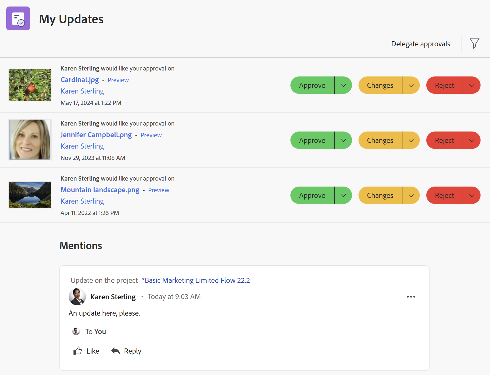
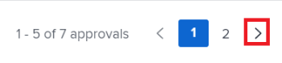
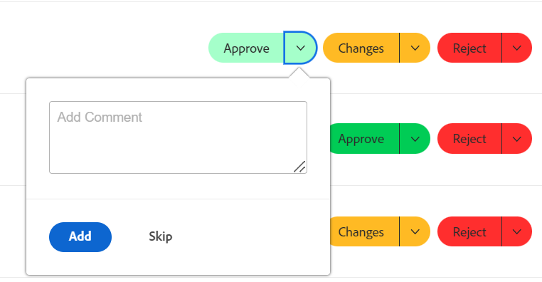
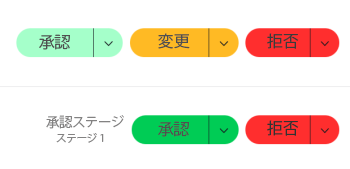
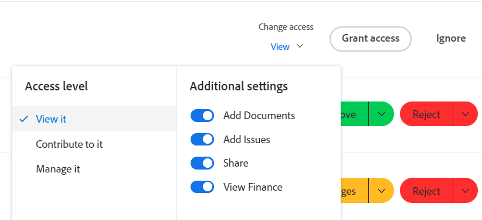
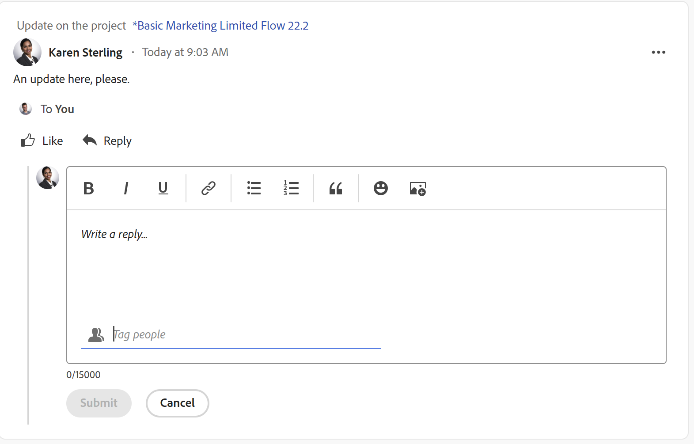

# [!UICONTROL マイ更新]エリアの使用

<!--
The highlighted information on this page refers to functionality not yet generally available. It is available only in the Preview environment for all customers. After the monthly releases to Production, the same features are also available in the Production environment for customers who enabled fast releases.    

For information about fast releases, see [Enable or disable fast releases for your organization](/help/quicksilver/administration-and-setup/set-up-workfront/configure-system-defaults/enable-fast-release-process.md). 
-->

[!UICONTROL マイ更新]エリアを使用して、決定を待っている承認や、参加している会話をすぐにレビューできます。

[!UICONTROL レビュー]ライセンスを持つユーザーの場合、[!UICONTROL マイ更新]エリアはデフォルトで[!UICONTROL メインメニュー]に表示され、[!UICONTROL マイ更新]エリアがデフォルトのランディングページになります。

[!DNL Adobe Workfront] ライセンスについて詳しくは、[[!DNL Adobe Workfront] ライセンスの概要](../../../administration-and-setup/add-users/access-levels-and-object-permissions/wf-licenses.md)を参照してください。

レビューとは異なるライセンスタイプを持つ場合、[!DNL Workfront] またはグループ管理者は、[!UICONTROL マイ更新]エリアをレイアウトテンプレートに追加して、メインメニューに表示する必要があります。詳しくは、[レイアウトテンプレートを使用した[!UICONTROL メインメニュー]のカスタマイズ](../../../administration-and-setup/customize-workfront/use-layout-templates/customize-main-menu.md)を参照してください。

## アクセス要件

+++ 展開すると、この記事の機能のアクセス要件が表示されます。

<table style="table-layout:auto"> 
 <col> 
 <col> 
 <tbody> 
  <tr> 
   <td role="rowheader"><strong>[!DNL Adobe Workfront package]</strong></td> 
   <td> 
任意
 </td> 
  </tr> 
  <tr> 
   <td role="rowheader"><strong>[!DNL Adobe Workfront] ライセンス</strong></td> 
   <td> 
コントリビューター以上

   
リクエスト以上
 </td> 
  </tr> 
  <tr> 
   <td role="rowheader"><strong>アクセスレベルの設定</strong></td> 
   <td> 
会話でタグ付けされたオブジェクトまたは承認の解決が必要なオブジェクト（プロジェクト、タスク、イシュー、ドキュメント）に対する表示権限またはそれ以上の権限
 </td> 
  </tr> 
  <tr> 
   <td role="rowheader"><strong>オブジェクト権限</strong></td> 
   <td> 
会話でタグ付けされたまたは承認の解決が必要なプロジェクト、タスク、イシュー、ドキュメントに対する [!UICONTROL View] 権限またはそれ以上の権限
 </td> 
  </tr> 
 </tbody> 
</table>

詳しくは、[Workfront ドキュメントのアクセス要件](/help/quicksilver/administration-and-setup/add-users/access-levels-and-object-permissions/access-level-requirements-in-documentation.md)を参照してください。

+++

## 前提条件

開始する前に、次の条件を満たす必要があります。

* [!UICONTROL レビュー]以外の [!DNL Workfront] ライセンスを持つ場合、[!DNL Workfront] またはグループ管理者は、レイアウトテンプレートを使用して[!UICONTROL マイ更新]エリアを[!UICONTROL メインメニュー]に追加し、ユーザーをそのテンプレートに割り当てる必要があります。

* レビューライセンスのユーザーは、デフォルトで[!UICONTROL メインメニュー]の[!UICONTROL マイ更新]エリアを表示できます。

## [!UICONTROL マイ更新]エリアへのアクセス

{{step1-to-my-updates}}

[!UICONTROL マイ更新]エリアが開きます。

自分に割り当てられているアクセスの承認とリクエストは、ページの前半部の「**マイ更新**」の下に一覧表示されます。

1. （オプション）[!UICONTROL **マイ更新**]&#x200B;エリアの一番下までスクロールし、右向きの矢印をクリックすると、追加のページに表示される承認がさらに表示されます。

   >[!TIP]
   >
   >デフォルトでは、最初の 5 つの承認またはアクセスのリクエストが表示されます。その他のページには、残りの承認が表示されます。[!UICONTROL マイ更新]エリアには、最大 2000 件の承認を表示できます。

   自分の更新プログラムの

1. （オプション） **[!UICONTROL マイアップデート]** セクションの右上隅にある ドロップダウンメニュー&#x200B;**[!UICONTROL フィルターアイコン]**&#x200B;を展開し、次から選択します。

   <table style="table-layout:auto"> 
    <col> 
    </col> 
    <col> 
    </col> 
    <tbody> 
     <tr> 
      <td role="rowheader"><strong>[!UICONTROL All]</strong></td> 
      <td>自分に送信された、または別のユーザーによってデリゲートされた承認。承認のデリゲーションについて詳しくは、<a href="../../../review-and-approve-work/manage-approvals/delegate-approval-requests.md" class="MCXref xref">承認リクエストのデリゲート</a>を参照してください。 </td> 
     </tr> 
     <tr> 
      <td role="rowheader"><strong>[!UICONTROL Delegated Approvals]</strong></td> 
      <td>別のユーザーによってデリゲートされた承認。 </td> 
     </tr> 
     <tr> 
      <td role="rowheader"><strong>[!UICONTROL My Approvals]</strong></td> 
      <td> 
自分に送信された承認。 
 
アイテムの承認について詳しくは、<a href="../../../review-and-approve-work/manage-approvals/approving-work.md" class="MCXref xref">作業の承認</a>を参照してください。
 </td> 
     </tr> 
    </tbody> 
   </table>

1. 承認前にアイテムを承認または却下したり、ドキュメントに対する変更を提案したりするには、次の手順を実行します。

   1. （オプション）承認決定（**承認済み**、、**[!UICONTROL 却下]**）の横にある&#x200B;**[!UICONTROL ドロップダウンアイコン]** ドロップダウンアイコン **[!UICONTROL をクリックし、コメントを追加してから、]**&#x200B;追加&#x200B;**[!UICONTROL をクリックします。]**

      または

      コメントを入力しない場合、「**[!UICONTROL スキップ]**」をクリックします。

      

      >[!NOTE]
      >
      >「[!UICONTROL 変更]」オプションは、ドキュメント承認の場合にのみ表示されます。

      選択したドロップダウンアイコンに応じて、アイテムは承認または却下されます。ドキュメントの承認の場合は、追加の変更を行うリクエストとともに承認されます。

      >[!TIP]
      >
      >決定にコメントを追加しない場合は、「**[!UICONTROL 承認]**」、「**[!UICONTROL 拒否]**」、または「**[!UICONTROL 変更]**」ボタンをクリックし、承認の決定を即座に行うことができます。
      >
      >
      >
      >
      >作業の承認について詳しくは、[作業の承認](../../../review-and-approve-work/manage-approvals/approving-work.md)を参照してください。

1. **[!UICONTROL アクセス権の付与]**&#x200B;をクリックして、送信されたアクセスリクエストを付与

   または

   **[!UICONTROL アクセス権を変更]**&#x200B;ドロップダウンメニューを展開して、付与する前にリクエストされたアクセス権を変更します。

   

1. （オプション）「**[!UICONTROL 無視]**」をクリックすると、付与なしで承認リストからアクセスリクエストをクリアできます。
1. 承認の決定を下すことができない場合、「**[!UICONTROL 自分の承認をデリゲート]**」をクリックして送信された承認をデリゲートします。承認のデリゲートについて詳しくは、[承認リクエストのデリゲート](../../../review-and-approve-work/manage-approvals/delegate-approval-requests.md)を参照してください。
1. 承認の下にある&#x200B;**[!UICONTROL メンション]**&#x200B;エリアまでスクロールします。ここでは、会話に含まれたすべての項目を表示できます。

   >[!TIP]
   >
   >最初の 50 件のメンションがデフォルトで表示されます。

1. （オプション）「**[!UICONTROL 更新をさらに表示]**」をクリックして、さらに多くのメンションを表示します。
1. （オプション） コメントに返信するには、**[!UICONTROL 返信]**&#x200B;をクリックし、次のいずれかの操作を行います。
   * 返信を入力してください
   * リッチテキストツールバーを使用して、テキストの書式設定、リンク、リスト、絵文字、引用符、または画像をメッセージに追加します
   * ユーザーまたはチームを追加して、返信を通知します。

     更新への返信について詳しくは、[作業の更新](/help/quicksilver/workfront-basics/updating-work-items-and-viewing-updates/update-work.md)を参照してください。

     返信の追加が完了したら、**[!UICONTROL 送信]**&#x200B;をクリックします。

     

1. （オプション）「**[!UICONTROL 現在のページをピン留め]**」をクリックして、[!UICONTROL マイ更新]エリアを上部ナビゲーションにピン留めします。
