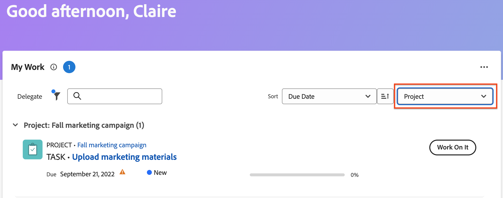

# マイ作業ウィジェットを使用した作業の管理

マイ作業ウィジェットには、割り当てられたタスク、イシュー、リクエストがすべて1か所に表示されます。 ここでは、作業のフィルタリングと整理、時間の記録、更新の実行、作業項目の完了のマークを付けることができます。

>[!IMPORTANT]
>
>マイワークウィジェットにタスクとイシューを表示するには、親プロジェクトが現在のステータスか、現在のステータスと同じステータスである必要があります。

## アクセス要件

+++ 展開すると、この記事の機能のアクセス要件が表示されます。

<table style="table-layout:auto"> 
 <col> 
 </col> 
 <col> 
 </col> 
 <tbody> 
  <tr> 
   <td role="rowheader"><strong>[!DNL Adobe Workfront package]</strong></td> 
   <td> 
任意
 </td> 
  </tr> 
  <tr> 
   <td role="rowheader"><strong>[!DNL Adobe Workfront] ライセンス</strong></td> 
   <td> 
      
明るいまたはそれ以上

   
Contribute以上

  </td> 
  </tr>
  <tr> 
   <td role="rowheader"><strong>アクセスレベル設定</strong></td> 
   <td> 
プロジェクト、タスク、イシュー、ドキュメントに対する [!UICONTROL View] 以上のアクセス
 </td> 
  </tr>  
  <tr> 
   <td role="rowheader"><strong>オブジェクト権限</strong></td> 
   <td> 
作業する必要のあるタスクや問題に対して、権限を付与する必要があります
  </td> 
  </tr> 
 </tbody> 
</table>

詳しくは、[Workfront ドキュメントのアクセス要件](/help/quicksilver/administration-and-setup/add-users/access-levels-and-object-permissions/access-level-requirements-in-documentation.md)を参照してください。

+++

## フィルターを使用した作業の検索

マイ作業フィルターを微調整して、作業のリスト内の特定の項目に焦点を当てることができます。

### フィルターの詳細

<table>
  <tbody>
    <tr>
      <td>作業中</td>
      <td>現在作業中の項目を表示</td>
    </tr>
    <tr>
      <td>開始準備完了</td>
      <td>次の項目を表示 
      <ul>
      <li>不完全な先行タスクやタスクの制約はない</li>
      
and

      <li>予定開始日は過去または最大2週間後です</li>
      </ul>
      </td>
    </tr>
    <tr>
      <td>準備未完了</td>
      <td>を持つ項目を表示します
       <ul>
      <li>アイテムの作業を妨げる不完全な先行タスクまたはタスクの制約</li>
      
または

      <li>予定開始日から2週間以上経過した後</li>
      </ul>
       </td>
    </tr>
    <tr>
      <td>リクエスト日</td>
      <td>作業を開始していない問題を表示します</td>
    </tr>
    <tr>
      <td>私が委任済み</td>
      <td>他のユーザーに委任した項目を表示します</td>
    </tr>
    <tr>
      <td>私に委任済み</td>
      <td>ユーザーが委任した項目を表示します</td>
    </tr>
    <tr>
      <td>完了</td>
      <td>過去2週間以内に完了した作業を表示します。 このフィルターオプションには承認は含まれません。</td>
    </tr>
  </tbody>
</table>

>[!TIP]
>
>より具体的なフィルタリングオプションを探している場合は、マイタスクまたはマイイシューのウィジェットを使用できます。 マイタスクとマイイシューのフィルターについて詳しくは、[&#x200B; ホームウィジェットフィルターの概要](/help/quicksilver/workfront-basics/using-home/using-the-home-area/widget-filter-overview-home.md)を参照してください。

## 作業の整理

マイワークウィジェットの並べ替えおよびグループ機能を使用すると、自分にとって意味のある方法で作業を整理できます。

### 並べ替え

次の方法で作業リストをソートできます

* 期日
期限切れのアイテムには、日付の横に警告アイコンが表示されます。 Workfrontでは、「完了予定日」を使用して、タスクと問題が期限切れであるかどうかを判断します。
* 名前
* 完了率
* ステータス

>[!TIP]
>
>自分の作業ウィジェットの上部にすべての期限切れのアイテムを表示するリストを作成するには、期限で並べ替え、グループ化を適用しません。

### グループ

作業リストは、次の方法でグループ化できます

* プロジェクト
* ステータス
* 期日
期日は、予定完了日によって決まります。

>[!NOTE]
>
>グループ化を適用する場合、並べ替えメニューの選択によって、グループ化の順序が決まります。

## 概要での作業項目情報の更新

概要パネルを開いて、タスクまたはイシューの情報をすばやく更新できます。 概要では、次のことができます

* 完了率の更新
* 更新を追加
* ドキュメント領域に移動してドキュメントをアップロードします
* 作業項目の詳細の表示とカスタムフィールドの更新
Workfront管理者は、レイアウトテンプレートの概要に表示されるフィールドをカスタマイズできます。 詳しくは、[&#x200B; レイアウトテンプレートを使用した概要パネルのカスタマイズ &#x200B;](/help/quicksilver/administration-and-setup/customize-workfront/use-layout-templates/customize-home-summary-layout-template.md)を参照してください。
* 作業項目のステータスの変更
* サブタスクの表示
* 時間を記録
* 添付された承認プロセスの表示

概要を開くには、作業項目にカーソルを合わせ、**概要** アイコン をクリックします。

概要パネルの使用方法について詳しくは、[概要](/help/quicksilver/workfront-basics/the-new-workfront-experience/summary-overview.md)を参照してください。

## クイックアクションを使用して作業項目を更新する

クイックアクションメニューを使用して、次の操作を実行できます

* 時間を記録
* アップデートを追加
* カスタムフォームの更新
* ファイルのアップロード

クイックアクションメニューを見つけるには、作業項目にカーソルを合わせます。 クイックアクションリストは、「**作業中**」または「**完了**」ボタンの近くに表示されます。

## 承認とチームのリクエストを表示

承認とチームのリクエストは、マイワークウィジェットに表示されません。 承認やチームのリクエストを定期的に処理する場合は、新しいホームページに次のウィジェットを追加することをお勧めします。

* 自分の承認
* すべての承認
* チームのリクエスト

新しいホームページへのウィジェットの追加について詳しくは、[&#x200B; ホームでのウィジェットの追加、編集または削除](/help/quicksilver/workfront-basics/using-home/using-the-home-area/add-edit-remove-widgets-in-new-home.md)を参照してください。
