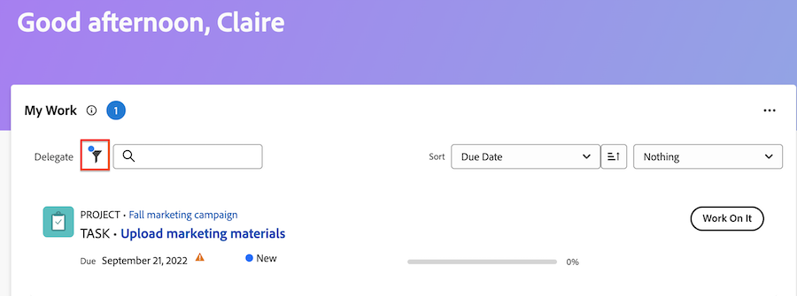
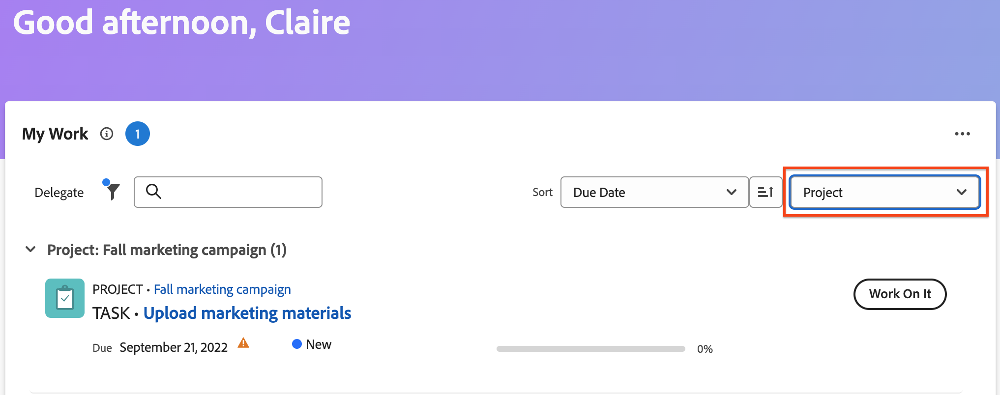

# 担当作業ウィジェットを使用した作業の管理

自分の作業ウィジェットには、割り当てられたすべてのタスク、イシュー、リクエストが 1 か所で表示されます。 ここでは、作業のフィルタリングと整理、時間の記録、更新の実行、作業項目の完了のマークを行うことができます。

## アクセス要件

+++ 展開すると、この記事の機能のアクセス要件が表示されます。

この記事の手順を実行するには、次のアクセス権が必要です。

<table style="table-layout:auto"> 
 <col> 
 </col> 
 <col> 
 </col> 
 <tbody> 
  <tr> 
   <td role="rowheader"><strong>[!DNL Adobe Workfront plan]</strong></td> 
   <td> 
任意
 </td> 
  </tr> 
  <tr> 
   <td role="rowheader"><strong>[!DNL Adobe Workfront] ライセンス</strong></td> 
   <td> 
現在：Contribute

   
または
 
   
新規：[!UICONTROL ライト ] 以上
 
  </td> 
  </tr> </ul>
  <tr> 
   <td role="rowheader"><strong>アクセスレベル設定</strong></td> 
   <td> 
プロジェクト、タスク、イシュー、ドキュメントに対する [!UICONTROL View] 以上のアクセス
 </td> 
  </tr>  
  <tr> 
   <td role="rowheader"><strong>オブジェクト権限</strong></td> 
   <td> 
作業が必要なタスクおよび問題に対するContribute以上の権限
  </td> 
  </tr> 
 </tbody> 
</table>

この表の情報について詳しくは、[Workfront ドキュメントのアクセス要件](/help/quicksilver/administration-and-setup/add-users/access-levels-and-object-permissions/access-level-requirements-in-documentation.md)を参照してください。

+++

## フィルターを使用した作業の検索

マイ作業フィルターを微調整して、作業リストの特定の項目に焦点を当てることができます。

### フィルターの詳細

<table>
  <tbody>
    <tr>
      <td>作業中</td>
      <td>現在作業中の項目を表示します</td>
    </tr>
    <tr>
      <td>開始準備完了</td>
      <td>項目を次で表示 
      <ul>
      <li>未完了の先行タスクまたはタスク制約はありません</li>
      
および

      <li>予定開始日が過去または最大 2 週間以内です</li>
      </ul>
      </td>
    </tr>
    <tr>
      <td>準備未完了</td>
      <td>次を持つ項目を表示
       <ul>
      <li>不完全な先行タスクまたはタスクの制約により、このアイテムは作業できません</li>
      
または

      <li>予定開始日が 2 週間以上先の日付です</li>
      </ul>
       </td>
    </tr>
    <tr>
      <td>リクエスト日</td>
      <td>作業を開始していない問題を表示します</td>
    </tr>
    <tr>
      <td>私が委任済み</td>
      <td>他のユーザーに委任した項目を表示します</td>
    </tr>
    <tr>
      <td>私に委任済み</td>
      <td>ユーザーがあなたに委任した項目を表示します</td>
    </tr>
    <tr>
      <td>完了</td>
      <td>過去 2 週間以内に完了した作業を表示します。 このフィルターオプションには、承認は含まれません。</td>
    </tr>
  </tbody>
</table>

>[!TIP]
>
>より具体的なフィルタリングオプションを探している場合は、マイタスクまたはマイイシューのウィジェットを使用できます。 自分のタスクおよび自分の問題のフィルターについて詳しくは、[ ホーム ウィジェットフィルターの概要 ](/help/quicksilver/workfront-basics/using-home/using-the-home-area/widget-filter-overview-home.md) を参照してください。

## 作業の整理

自分の作業ウィジェットの並べ替え機能とグループ化機能を使用すると、自分にとって意味のある方法で作業を整理できます。

### 並べ替え

以下の基準で作業リストを並べ替えることができます

* 期限日
期限切れ項目には、日付の横に警告アイコンが表示されます。 Workfrontは予定完了日を使用して、タスクと問題が期限切れかどうかを判断します。
* 名前
* 完了率
* ステータス

>[!TIP]
>
>自分の作業ウィジェットの上部にすべての期限切れ項目を表示するリストを作成するには、期限で並べ替え、グループ化を適用しないようにします。

### グループ

作業リストは、次の項目でグループ化できます

* プロジェクト
* ステータス
* 期限日
期限は、予定完了日によって決定されます。

>[!NOTE]
>
>グループ化を適用する場合、並べ替えメニューでの選択によって、グループ化内の順序が決まります。

## 概要の作業項目情報を更新

概要パネルを開くと、タスクまたはイシューの情報をすばやく更新できます。 概要では、次のことができます

* 完了率の更新
* 更新を追加
* ドキュメント エリアに移動して、ドキュメントをアップロードします
* 作業項目の詳細の表示とカスタムフィールドの更新
Workfront管理者は、レイアウトテンプレートの概要に表示するフィールドをカスタマイズできます。 詳しくは、[ レイアウトテンプレートを使用した概要パネルのカスタマイズ ](/help/quicksilver/administration-and-setup/customize-workfront/use-layout-templates/customize-home-summary-layout-template.md) を参照してください。
* 作業項目の状態の変更
* サブタスクの表示
* 時間を記録
* 添付された承認プロセスの表示

概要を開くには、作業項目にマウスポインターを置き、「**概要**」アイコンをクリックし  す。

概要パネルの使用方法について詳しくは、[ 概要の概要 ](/help/quicksilver/workfront-basics/the-new-workfront-experience/summary-overview.md) を参照してください。

## クイックアクションを使用した作業項目の更新

クイックアクションメニューを使用して、次のことができます

* 時間を記録
* 更新を追加
* カスタムフォームの更新
* ファイルのアップロード

クイックアクションメニューを見つけるには、作業項目にポインタを合わせます。 クイックアクションリストは、**作業対象** または **完了** ボタンの近くに表示されます。

## 承認およびチーム要求の表示

承認とチームリクエストがマイ作業ウィジェットに表示されません。 定期的に承認やチームのリクエストに取り組む場合、新しいホームページには次のウィジェットを追加することをお勧めします。

* マイ承認
* すべての承認
* チームのリクエスト

新しいホームページへのウィジェットの追加について詳しくは、[ ホームでのウィジェットの追加、編集、削除 ](/help/quicksilver/workfront-basics/using-home/using-the-home-area/add-edit-remove-widgets-in-new-home.md) を参照してください。
