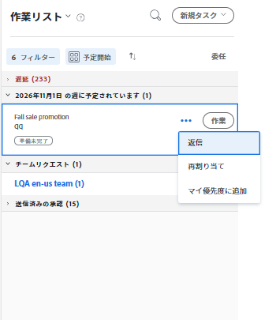
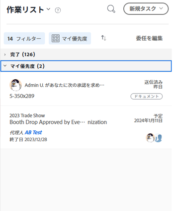

# 作業を [!UICONTROL ホーム] 領域

次の項目に優先順位を付けることができます： [!UICONTROL 作業用リスト] in [!UICONTROL ホーム]. 追加先の項目 [!UICONTROL 優先度] あなただけの優先事項です。 他のユーザーに対して優先順位付けは行われず、優先順位付けを行うことはできません。 最大 20 個の項目を「 [!UICONTROL 優先度] [!UICONTROL 並べ替え基準] オプション。

## アクセス要件

この記事の手順を実行するには、次のアクセス権が必要です。

<table style="table-layout:auto"> 
 <col> 
 </col> 
 <col> 
 </col> 
 <tbody> 
  <tr> 
   <td role="rowheader"><strong>[!DNL Adobe Workfront plan*]</strong></td> 
   <td> 
任意
 </td> 
  </tr> 
  <tr> 
   <td role="rowheader"><strong>[!DNL Adobe Workfront] ライセンス*</strong></td> 
   <td> 
[!UICONTROL Work] 以降
 </td> 
  </tr> 
  <tr> 
   <td role="rowheader"><strong>アクセスレベル設定*</strong></td> 
   <td> 
タスクと問題への [!UICONTROL 編集 ] アクセス
 
注意：まだアクセス権がない場合は、 [!DNL Workfront] 管理者（アクセスレベルに追加の制限を設定している場合） を参照してください。 [!DNL Workfront] 管理者はアクセスレベルを変更できます。詳しくは、 <a href="../../../administration-and-setup/add-users/configure-and-grant-access/create-modify-access-levels.md" class="MCXref xref">カスタムアクセスレベルの作成または変更</a>.
 </td> 
  </tr> 
  <tr> 
   <td role="rowheader"><strong>オブジェクト権限</strong></td> 
   <td> 
優先順位を設定するタスクと問題に、権限以上を貢献する
 
追加のアクセス権のリクエストについて詳しくは、 <a href="../../../workfront-basics/grant-and-request-access-to-objects/request-access.md" class="MCXref xref">オブジェクトへのアクセスのリクエスト </a>.
 </td> 
  </tr> 
 </tbody> 
</table>

ご利用のプラン、ライセンスの種類、アクセス権を確認するには、 [!DNL Workfront] 管理者。

## 項目の追加先 [!UICONTROL 優先度]

自分に割り当てられた任意の項目を [!UICONTROL 作業用リスト] から [!UICONTROL 優先度]. リストの下部に新しい項目が追加されます。

1. 次をクリック： **[!UICONTROL メインメニュー]**  右上隅で、「 **[!UICONTROL ホーム]**.
1. 左側のパネルで、 **[!UICONTROL グループ化の基準]** ドロップダウンメニューは、次のいずれかのオプションで並べ替えられています。

   * [!UICONTROL 完了予定]
   * [!UICONTROL 予定開始]
   * [!UICONTROL コミット日]
   * [!UICONTROL プロジェクト]

1. 作業項目の上にマウスポインターを置いて、 **[!UICONTROL 詳細]** アイコン .

1. 選択 **[!UICONTROL 優先度に追加]**.

   

## 次を使用して項目を優先順位付け [!UICONTROL 優先度] グループ化

選択した後に作業を優先させることができます [!UICONTROL 優先度] グループ化ドロップダウンメニューで、最も重要な項目をリストの先頭に配置します。 設定した優先度は、自分にのみ表示されます。 他のユーザーが自分の仕事を優先することはできません。

作業項目を次に追加する必要があります： [!UICONTROL 優先度] 優先順位付けを開始する前に

詳しくは、 [項目の追加先 [!UICONTROL 優先度]](#add-items-to-my-priority) 」を参照してください。

1. 次をクリック： **[!UICONTROL メインメニュー]**  右上隅で、「 **[!UICONTROL ホーム]**.
1. 左側のパネルで、 **[!UICONTROL グループ化の基準]** ドロップダウンメニューから、 **[!UICONTROL 優先度]**.

1. 作業項目を選択し、適切な場所にドラッグ&amp;ドロップして、リスト内で優先順位を付けます。

   

## から項目を削除 [!UICONTROL 優先度]

次の場所から項目を削除できます： [!UICONTROL 優先度] 作業項目を完了するか、 [!UICONTROL 詳細] アイコン 作業項目から未割り当ての場合は、作業項目も [!UICONTROL 優先度].

1. 次をクリック： **[!UICONTROL メインメニュー]**  右上隅で、「 **[!UICONTROL ホーム]**.
1. 左側のパネルで、 **[!UICONTROL 詳細]** アイコンをクリックし、「 **[!UICONTROL 優先度から削除]**.

   ![[!UICONTROL [!UICONTROL マイ優先度から削除]]](assets/getting-started-remove-from-priority-nwe-350x395.png)
