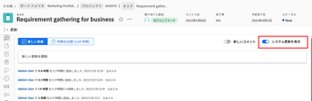
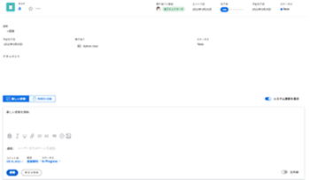
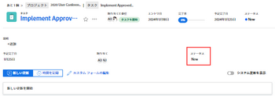

# 内の作業項目を更新または編集する [!UICONTROL ホーム] 領域

内の作業項目の更新を表示して追加できます。 [!UICONTROL ホーム] 領域 [!DNL Adobe Workfront]. 作業項目に関連するその他のデータを編集することもできます（編集するアクセス権がある場合）。

## アクセス要件

この記事の手順を実行するには、次のアクセス権が必要です。

<table style="table-layout:auto"> 
 <col> 
 </col> 
 <col> 
 </col> 
 <tbody> 
  <tr> 
   <td role="rowheader"><strong>[!DNL Adobe Workfront plan*]</strong></td> 
   <td> 
任意
 </td> 
  </tr> 
  <tr> 
   <td role="rowheader"><strong>[!DNL Adobe Workfront] ライセンス*</strong></td> 
   <td> 
[!UICONTROL Work] 以降
 </td> 
  </tr> 
  <tr> 
   <td role="rowheader"><strong>アクセスレベル設定*</strong></td> 
   <td> 
タスクと問題への [!UICONTROL 編集 ] アクセス
 
注意：まだアクセス権がない場合は、 [!DNL Workfront] 管理者（アクセスレベルに追加の制限を設定している場合） を参照してください。 [!DNL Workfront] 管理者はアクセスレベルを変更できます。詳しくは、 <a href="../../../administration-and-setup/add-users/configure-and-grant-access/create-modify-access-levels.md" class="MCXref xref">カスタムアクセスレベルの作成または変更</a>.
 </td> 
  </tr> 
  <tr> 
   <td role="rowheader"><strong>オブジェクト権限</strong></td> 
   <td> 
作業が必要なタスクや問題に、権限以上を貢献する
 
追加のアクセス権のリクエストについて詳しくは、 <a href="../../../workfront-basics/grant-and-request-access-to-objects/request-access.md" class="MCXref xref">オブジェクトへのアクセスのリクエスト </a>.
 </td> 
  </tr> 
 </tbody> 
</table>

&#42;ご利用のプラン、ライセンスの種類、アクセス権を確認するには、 [!DNL Workfront] 管理者。

## 作業項目の更新を表示

更新は、 [!UICONTROL 作業用リスト]:

1. 次をクリック： **[!UICONTROL メインメニュー]**  右上隅で、「 **[!UICONTROL ホーム]**.
1. 内 **[!UICONTROL 作業用リスト]** 「 」領域で、更新を表示する項目を選択します。\
   更新は、右側のパネルに表示されます。

1. （オプション）システムの更新をフィルタリングして、ユーザーの更新のみを表示するには、 **[!UICONTROL システム更新を表示]** をオフにします。

   

## 作業項目の更新を提供

更新は、 [!UICONTROL 作業] リスト：

1. 次をクリック： **[!UICONTROL メインメニュー]**  右上隅で、「 **[!UICONTROL ホーム]**.
1. 内 **[!UICONTROL 作業用リスト]** 「 」領域で、更新を行う品目を選択します。
1. 右側のパネルで、 **[!UICONTROL 更新]** をクリックして、テキストフィールドを表示します。

   

1. 提供されたフィールドで、更新を指定します。
1. （オプション）次のいずれかの情報を指定します。\
   **[!UICONTROL コミット日]:** 作業項目を完了するコミット時に、日付選択から日付を選択します。\
   **[!UICONTROL どうだ？]:** タスクまたはタスクの新しい条件を選択します。 タスクと問題の条件について詳しくは、 [タスクおよび問題の条件を更新](../../../manage-work/projects/updating-work-in-a-project/update-condition-for-tasks-and-issues.md).\
   **[!UICONTROL ステータス]:** タスクまたはタスクの新しいステータスを選択します。 タスクのステータスについて詳しくは、 [タスクステータスを更新](../../../manage-work/projects/updating-work-in-a-project/update-task-status.md). 問題のステータスについて詳しくは、 [システムの問題ステータスのリストへのアクセス](../../../administration-and-setup/customize-workfront/creating-custom-status-and-priority-labels/issue-statuses.md).\
   **[!UICONTROL 完了バー]:** 進行状況バーを目的の割合にスライドして、完了した作業の割合を示します。 完了バーをダブルクリックして、完了率を入力することもできます。

1. クリック **[!UICONTROL 更新]**.

## 作業項目の編集

編集にアクセスできる任意の作業項目の任意のフィールドを編集できます。

1. 次をクリック： **[!UICONTROL メインメニュー]**  右上隅で、「 **[!UICONTROL ホーム]**.
1. 内 **[!UICONTROL 作業用リスト]** 」領域で、編集する項目を選択します。\
   ビューにアクセスできるすべてのフィールドが右側のパネルに表示されます。

1. 右側のパネルで、編集するフィールドの上にマウスポインターを置きます。\
   フィールドの編集権限がある場合は、フィールドにカーソルを合わせると、そのフィールドがハイライト表示されます。

   

1. 編集するフィールドをクリックし、必要な更新をおこないます。
1. 「 」フィールドをクリックして、変更を保存します。
