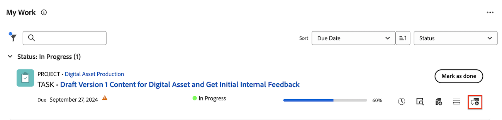
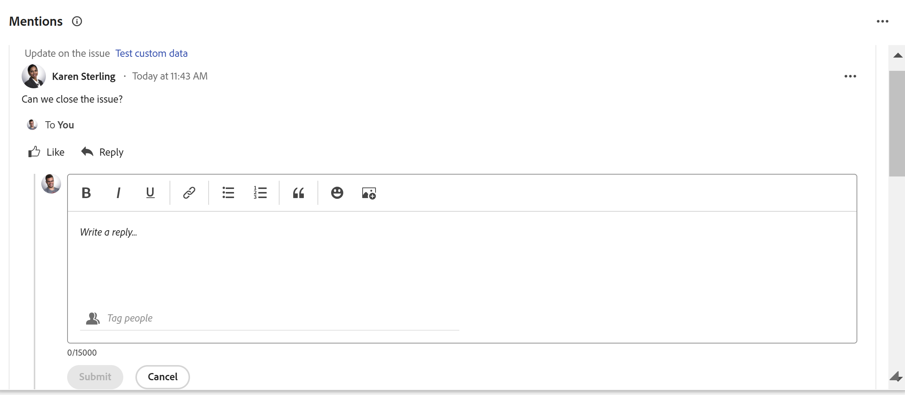
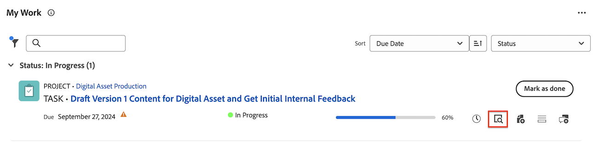

# [!UICONTROL ホーム]エリア内の作業アイテムを更新または編集する

<!--Audited: 04/2024-->

<!--
The highlighted information on this page refers to functionality not yet generally available. It is available only in the Preview environment for all customers. After the monthly releases to Production, the same features are also available in the Production environment for customers who enabled fast releases.    

For information about fast releases, see [Enable or disable fast releases for your organization](/help/quicksilver/administration-and-setup/set-up-workfront/configure-system-defaults/enable-fast-release-process.md). 
-->

[!DNL Adobe Workfront] の [!UICONTROL ホーム]エリア内の作業アイテムの更新を表示して追加できます。編集アクセス権がある場合は、作業アイテムに関連する他のデータを編集することもできます。

## アクセス要件

+++ 展開すると、この記事の機能のアクセス要件が表示されます。

<table style="table-layout:auto"> 
 <col> 
 </col> 
 <col> 
 </col> 
 <tbody> 
  <tr> 
   <td role="rowheader"><strong>[!DNL Adobe Workfront package]</strong></td> 
   <td> 
任意
 </td> 
  </tr> 
  <tr> 
   <td role="rowheader"><strong>[!DNL Adobe Workfront] ライセンス*</strong></td> 
   <td> 
標準

   
Work またはそれ以上
 </td> 
  </tr> 
  <tr> 
   <td role="rowheader"><strong>アクセスレベルの設定</strong></td> 
   <td> 
タスクとイシューに対する[!UICONTROL Edit]アクセス権
 </td> 
  </tr> 
  <tr> 
   <td role="rowheader"><strong>オブジェクト権限</strong></td> 
   <td> 
作業する必要のあるタスクや問題に対して、権限を付与する必要があります
 </td> 
  </tr> 
 </tbody> 
</table>

詳しくは、[Workfront ドキュメントのアクセス要件](/help/quicksilver/administration-and-setup/add-users/access-levels-and-object-permissions/access-level-requirements-in-documentation.md)を参照してください。

+++

<!--
not sure if this  from the old UI: we don't have a Work List anymore - should this section come off? 

## View updates on a work item

You can view updates on any work item in the [!UICONTROL Work List]:

1. Click the **[!UICONTROL Main Menu]**  in the upper-right corner, or the **Main Menu**  in the upper-left corner, if available, then click **[!UICONTROL Home]**.
1. In the **[!UICONTROL Work List]** area, select the item where you want to view updates.\
   Updates are displayed in the right panel.

-->

## ホーム領域でコメントを追加したりアイテムを編集したりできるウィジェットの概要

コメントは、ホーム領域の次のウィジェットに追加できます。

| ウィジェット | 説明 |
|--------------|---------------------------------------------------------------------------------------------------|
| ボード | 作成した、または使用するように招待されたボードを表示します |
| 担当作業 | 割り当てられたタスクとイシューを表示します |
| マイプロジェクト | 所有しているプロジェクトまたは所有しているプロジェクトを表示します |
| マイタスク | 割り当てられたタスクを表示します |
| マイイシュー | 割り当てられたイシューを表示 |
| マイリクエスト | 送信したすべてのリクエストを表示します |
| マイ承認 | 保留中、割り当て済み、委任済み、送信済みのすべての承認を表示します |
| メンション | マイ更新ページと同様に、Workfront 全体で最近のコメントスレッドと、ウィジェット内で返信を作成できる返信ボタンを表示します。 |

ホーム領域の次のウィジェットで作業項目を編集できます。

| ウィジェット | 説明 |
|--------------|---------------------------------------------------------------------------------------------------|
| ボード | 作成した、または使用するように招待されたボードを表示します |
| 担当作業 | 割り当てられたタスクとイシューを表示します |
| マイプロジェクト | 所有しているプロジェクトまたは所有しているプロジェクトを表示します |
| マイタスク | 割り当てられたタスクを表示します |
| マイイシュー | 割り当てられたイシューを表示 |
| マイリクエスト | 送信したすべてのリクエストを表示します |
| マイ承認 | 保留中、割り当て済み、委任済み、送信済みのすべての承認を表示します |

## マイワークウィジェットの作業項目にコメントを追加する

[!UICONTROL  マイワーク ] ウィジェットの任意の作業項目に関する更新を提供できます。

1. 右上隅の&#x200B;**[!UICONTROL メインメニュー]** 、または左上隅の&#x200B;**メインメニュー** をクリックし、使用可能な場合は&#x200B;**[!UICONTROL ホーム]**&#x200B;をクリックします。
1. （条件付き）「**カスタマイズ**」をクリックして、[!UICONTROL **マイワーク**] ウィジェットを追加します。

1. 更新する作業項目を&#x200B;[!UICONTROL **マイワーク**] ウィジェットで探します。
1. 名前にカーソルを合わせ、**新しい更新プログラムを追加** アイコンをクリックします。

   

1. コメントの入力を開始します。
1. （オプション）「**ユーザーまたはチームにタグ付け**」ボックスで、ユーザーの名前または電子メール、またはこのコメントに含めるチームを入力し始め、リストに表示されたら選択します。
1. （オプション）リッチテキストツールバーのオプションを使用して、テキストの書式設定、絵文字、リンク、または画像をコメントに追加し、コンテンツを強化します。
1. 「**送信**」をクリックして、作業項目にコメントを追加します。

   >[!IMPORTANT]
   >
   >コメントは、送信後15分以内にのみ編集できます。 コメントを編集するには、コメントの右上隅にある&#x200B;**詳細** メニューをクリックし、**編集**&#x200B;をクリックします。

   更新プログラムの追加について詳しくは、[作業の更新](/help/quicksilver/workfront-basics/updating-work-items-and-viewing-updates/update-work.md)を参照してください。

## メンションウィジェットのアイテムにコメントを追加する

1. 「**メンション**」ウィジェットをホームエリアに追加します。

1. 更新プログラムに含まれ、返信するアイテムを探します。

1. 「**返信**」をクリックします。

   

1. コメントの入力を開始します。
1. （オプション）「**ユーザーをタグ付け**」ボックスで、このコメントに含めるユーザーまたはチームの名前を入力し始め、リストに表示されたら選択します。
1. （オプション）リッチテキストツールバーのオプションを使用して、テキストの書式設定、絵文字、リンク、または画像をコメントに追加し、コンテンツを強化します。
1. 「**送信**」をクリックして、作業項目にコメントを追加します。

   >[!IMPORTANT]
   >
   >コメントは、送信後15分以内にのみ編集できます。 コメントを編集するには、コメントの右上隅にある&#x200B;**詳細** メニューをクリックし、**編集**&#x200B;をクリックします。

   更新プログラムの追加について詳しくは、[作業の更新](/help/quicksilver/workfront-basics/updating-work-items-and-viewing-updates/update-work.md)を参照してください。

## 作業アイテムを編集する

編集にアクセスできる任意の作業アイテムの任意のフィールドを編集できます。

1. 右上隅の&#x200B;**[!UICONTROL メインメニュー]** 、または左上隅の&#x200B;**メインメニュー** をクリックし、使用可能な場合は&#x200B;**[!UICONTROL ホーム]**&#x200B;をクリックします。
1. （条件付き）「**カスタマイズ**」をクリックして、**マイワーク** ウィジェットを追加します。

1. 作業項目にカーソルを合わせて、**概要** アイコンをクリックします。
   

1. 概要パネルで、編集するフィールドにカーソルを合わせます。
フィールドの編集権限がある場合は、フィールドにカーソルを合わせると、そのフィールドがハイライト表示されます。
1. 編集するフィールドをクリックし、目的の更新を行います。
1. フィールドの外側をクリックして、変更を保存します。
