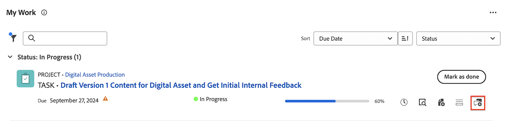

# [!UICONTROL ホーム]エリア内の作業アイテムを更新または編集する

<!--Audited: April 2024-->

[!DNL Adobe Workfront] の [!UICONTROL ホーム]エリア内の作業アイテムの更新を表示して追加できます。編集アクセス権がある場合は、作業アイテムに関連する他のデータを編集することもできます。

+++ 展開すると、この記事の機能のアクセス要件が表示されます。

## アクセス要件

この記事の手順を実行するには、次のアクセス権が必要です。

<table style="table-layout:auto"> 
 <col> 
 </col> 
 <col> 
 </col> 
 <tbody> 
  <tr> 
   <td role="rowheader"><strong>[!DNL Adobe Workfront plan]</strong></td> 
   <td> 
任意
 </td> 
  </tr> 
  <tr> 
   <td role="rowheader"><strong>[!DNL Adobe Workfront] ライセンス*</strong></td> 
   <td> 
新規：標準

   または

現在：[!UICONTROL Work] 以上
 </td> 
  </tr> 
  <tr> 
   <td role="rowheader"><strong>アクセスレベルの設定</strong></td> 
   <td> 
タスクとイシューに対する[!UICONTROL Edit]アクセス権
 </td> 
  </tr> 
  <tr> 
   <td role="rowheader"><strong>オブジェクト権限</strong></td> 
   <td> 
作業が必要なタスクやイシューに対する参加以上の権限
 </td> 
  </tr> 
 </tbody> 
</table>

*ご利用のプラン、ライセンスタイプまたはアクセス権について詳しくは、[!DNL Workfront] 管理者にお問い合わせください。詳しくは、[Workfront ドキュメントのアクセス要件](/help/quicksilver/administration-and-setup/add-users/access-levels-and-object-permissions/access-level-requirements-in-documentation.md)を参照してください。

+++

## 作業アイテムの更新を表示する

[!UICONTROL 作業リスト]内の任意の作業アイテムの更新を表示できます。

1. 右上隅の&#x200B;**[!UICONTROL メインメニュー]** 、または可能であれば左上隅の&#x200B;**メインメニュー**  をクリックし、「**[!UICONTROL ホーム]**」をクリックします。
1. **[!UICONTROL 作業リスト]**&#x200B;エリアで、更新を表示する項目を選択します。\
   更新は、右側のパネルに表示されます。

## 作業項目へのコメントの追加

[!UICONTROL 作業]リスト内の任意の作業アイテムの更新を提供できます。

1. 右上隅の&#x200B;**[!UICONTROL メインメニュー]** 、または可能であれば左上隅の&#x200B;**メインメニュー**  をクリックし、「**[!UICONTROL ホーム]**」をクリックします。
1. （条件付き） **カスタマイズ** をクリックして、次のいずれかのウィジェットを追加します。

   | ウィジェット | 説明 |
   |--------------|---------------------------------------------------------------------------------------------------|
   | ボード | 作成または招待したボードを表示します |
   | 担当作業 | 自分に割り当てられているタスクおよび問題を表示します |
   | マイプロジェクト | 所有しているプロジェクトまたは自分が参加しているプロジェクトを表示します |
   | マイタスク | 自分に割り当てられているタスクを表示します |
   | マイイシュー | 自分に割り当てられている問題を表示します |
   | マイリクエスト | 送信したすべての要求を表示します |
   | マイ承認 | 承認待ち、割り当て、委任、および送信済みのすべてを表示します |

1. 更新する作業項目を見つけます。
1. 名前の上にマウスポインターを置き、「**新しい更新を追加**」をクリックします。
   
1. コメントを入力してください。
1. （任意）「**ユーザーまたはチームのタグ付け**」ボックスに、このコメントに含めるユーザーまたはチームの名前またはメールの入力を開始し、リストに表示されたら選択します。
1. （オプション） リッチテキストツールバーのオプションを使用してテキストの書式を設定したり、コメントに絵文字、リンクまたは画像を追加してコンテンツを充実させることができます。
1. 「**送信**」をクリックして、作業項目にコメントを追加します。

   >[!IMPORTANT]
   >
   >コメントの編集は、送信後 15 分以内に完了します。 コメントを編集するには、コメントの右上隅にある **詳細** メニューをクリックしてから、「**編集** をクリックします。

更新の追加について詳しくは、[ 作業項目に更新を追加 ](/help/quicksilver/workfront-basics/updating-work-items-and-viewing-updates/update-work.md) を参照してください。

## 作業アイテムを編集する

編集にアクセスできる任意の作業アイテムの任意のフィールドを編集できます。

1. 右上隅の&#x200B;**[!UICONTROL メインメニュー]** 、または可能であれば左上隅の&#x200B;**メインメニュー**  をクリックし、「**[!UICONTROL ホーム]**」をクリックします。
1. （条件付き） **カスタマイズ** をクリックして、次のいずれかのウィジェットを追加します。

   | ウィジェット | 説明 |
   |--------------|---------------------------------------------------------------------------------------------------|
   | ボード | 作成または招待したボードを表示します |
   | 担当作業 | 自分に割り当てられているタスクおよび問題を表示します |
   | マイプロジェクト | 所有しているプロジェクトまたは自分が参加しているプロジェクトを表示します |
   | マイタスク | 自分に割り当てられているタスクを表示します |
   | マイイシュー | 自分に割り当てられている問題を表示します |
   | マイリクエスト | 送信したすべての要求を表示します |
   | マイ承認 | 承認待ち、割り当て、委任、および送信済みのすべてを表示します |

1. 作業項目の上にマウスポインターを置き、「**概要** アイコンをクリックします。
   

1. 概要パネルで、編集するフィールドの上にポインタを合わせます。
フィールドの編集権限がある場合は、フィールドにカーソルを合わせると、そのフィールドがハイライト表示されます。
1. 編集するフィールドをクリックし、必要な更新を行います。
1. フィールドの外側をクリックして、変更を保存します。
