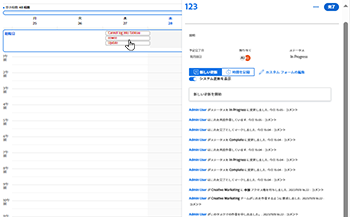
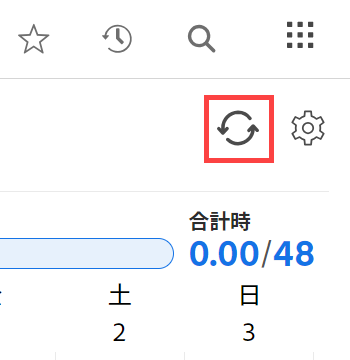
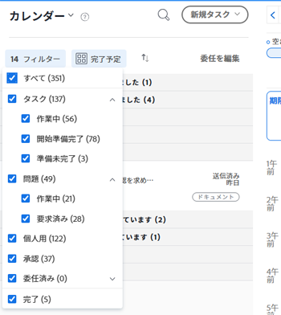
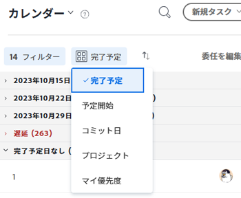
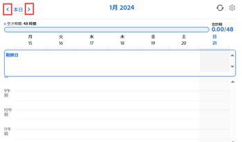

# 以下を使用： [!UICONTROL ホームカレンダー] 表示

カレンダービューは、 [!UICONTROL ホーム] 作業日と作業割り当てを管理する領域。 自分だけが [!UICONTROL ホームカレンダー].

>[!NOTE]
>
>この [!UICONTROL カレンダー] 表示 [!UICONTROL ホーム] 領域が [!DNL Adobe Workfront] [!UICONTROL カレンダー] レポート：作業内容を視覚的に表現する動的レポートです。 詳しくは、 [!DNL Workfront] [!UICONTROL カレンダー] レポート： [カレンダーレポートの概要](../../../reports-and-dashboards/reports/calendars/calendar-reports-overview.md).
>
>  <!--
>  <li data-mc-conditions="QuicksilverOrClassic.Draft mode">Due to a temporary problem, your Workfront Calendar data might not display as described in this article. This problem will be fixed in the near future. (NOTE: From Alina: Spoke with Lisa and Court and they agreed to draft or delete this. Court could not remember what this was referring to and Lisa did not add this note. Lisa might update this if she hears from the team that this is still accurate.)</li>>
>  -->

## アクセス要件

この記事の手順を実行するには、次のアクセス権が必要です。

<table style="table-layout:auto"> 
 <col> 
 </col> 
 <col> 
 </col> 
 <tbody> 
  <tr> 
   <td role="rowheader"><strong>[!DNL Adobe Workfront plan*]</strong></td> 
   <td> 
任意
 </td> 
  </tr> 
  <tr> 
   <td role="rowheader"><strong>[!DNL Adobe Workfront] ライセンス*</strong></td> 
   <td> 
[!UICONTROL Work] 以降
 </td> 
  </tr> 
  <tr> 
   <td role="rowheader"><strong>アクセスレベル設定*</strong></td> 
   <td> 
タスクと問題への [!UICONTROL 編集 ] アクセス
 
注意：まだアクセス権がない場合は、 [!DNL Workfront] 管理者（アクセスレベルに追加の制限を設定している場合） を参照してください。 [!DNL Workfront] 管理者はアクセスレベルを変更できます。詳しくは、 <a href="../../../administration-and-setup/add-users/configure-and-grant-access/create-modify-access-levels.md" class="MCXref xref">カスタムアクセスレベルの作成または変更</a>.
 </td> 
  </tr> 
  <tr> 
   <td role="rowheader"><strong>オブジェクト権限</strong></td> 
   <td> 
カレンダーに追加するタスクおよび問題に対する [!UICONTROL Contribute] の権限以上
 
追加のアクセス権のリクエストについて詳しくは、 <a href="../../../workfront-basics/grant-and-request-access-to-objects/request-access.md" class="MCXref xref">オブジェクトへのアクセスのリクエスト </a>.
 </td> 
  </tr> 
 </tbody> 
</table>

&#42;ご利用のプラン、ライセンスの種類、アクセス権を確認するには、 [!DNL Workfront] 管理者。

## 作業項目を [!UICONTROL ホームカレンダー]

以下を使用して、 [!UICONTROL ホームカレンダー] を使用して、1 週間の作業項目をスケジュールします。

>[!NOTE]
>
>作業項目を [!UICONTROL ホームカレンダー] は、作業項目に関連付けられている既存の日付を変更しません。

を追加するには、以下を実行します。 [!DNL Workfront] 作業項目をカレンダーに追加します。

1. 次に移動： [!UICONTROL ホームカレンダー] ビュー ( [次を表示： [!UICONTROL ホームカレンダー]](../../../workfront-basics/using-home/using-the-home-area/view-home-calendar.md).

   自分または自分のグループ、チーム、またはジョブの役割に割り当てられているすべての作業項目が左のパネルに表示されます。 リストを並べ替えたり、フィルターして特定の項目のみを表示することができます。

   詳しくは、 [作業項目のフィルタリングと並べ替え](#filter-and-sort-work-items) この記事の後半で説明します。

1. 左のパネルから、作業項目を作業する日時にドラッグします。

   計画完了日の後、または計画されている時間数を超える時間でアイテムを作業するようにスケジュールを設定した場合、作業項目は赤で表示され、警告が表示されます。

   作業項目の期限、および割り当て時間に対する [!UICONTROL ホームカレンダー]を参照してください。  [[!UICONTROL ホームカレンダー] 表示](../../../workfront-basics/using-home/using-the-home-area/home-calendar-view.md).

1. 次のいずれかの操作を行います。

   * **作業項目を複数日間スケジュールするには、次の手順に従います。** 手順 2 を繰り返して、作業する日時ごとに項目を追加します。
   * **カレンダ・アイテムの期間を変更する手順は、次のとおりです。** 項目の下端の上にマウスポインターを置き、カーソルが二重矢印に変わったら、下端をドラッグして終了時間を指定します。
   * **カレンダ・アイテムを削除する手順は、次のとおりです。** 項目の上にマウスポインターを置いて、 [!UICONTROL ごみ箱] 表示されるアイコン。

## の作業項目を更新する [!UICONTROL ホームカレンダー]

表示される作業項目を更新できます。 [!UICONTROL ホームカレンダー] 表示 更新内容は、 [!UICONTROL 更新] 実際の作業項目のタブ

1. 次に移動： [!UICONTROL ホームカレンダー] ビュー ( [次を表示： [!UICONTROL ホームカレンダー]](../../../workfront-basics/using-home/using-the-home-area/view-home-calendar.md).

1. を開きます。 [!UICONTROL 詳細] 更新する作業項目のパネル：

   * 左側のパネルから、次の操作を実行します。作業項目を選択し、「 **[!UICONTROL 詳細]**.
   * カレンダーから：予定されているカレンダーイベントをクリックします。

   作業項目の詳細は、ウィンドウの右側に表示されるパネルに表示されます。

   

1. 作業項目を更新するには、次のいずれかの操作を行います。

   * 内 **[!UICONTROL 新しい更新を開始]** ボックスに、更新を入力し、次のいずれかの情報を指定して、 **[!UICONTROL 更新]**.

      <table style="table-layout:auto">
      <col>
      <col>
      <tbody>
       <tr>
        <td role="rowheader"><strong>[!UICONTROL 通知 ]</strong></td>
        <td>
 更新を通知するユーザーにタグを付けます。 詳しくは、 <a href="../../../workfront-basics/updating-work-items-and-viewing-updates/tag-others-on-updates.md" class="MCXref xref">更新時の他のユーザーへのタグ付け</a>.

 
</td>
       </tr>
       <tr data-mc-conditions="">
        <td role="rowheader"><strong>[!UICONTROL コミット日 ]</strong></td>
        <td>ドロップダウンカレンダーで、作業項目を完了する予定の日付を選択します。 [!UICONTROL コミット日 ] の設定について詳しくは、 <a href="../../../manage-work/projects/updating-work-in-a-project/overview-of-commit-dates.md" class="MCXref xref">[!UICONTROL コミット日 ] の概要</a>.</td>
       </tr>
       <tr data-mc-conditions="">
        <td role="rowheader"><strong>[!UICONTROL これはどうなっていますか？]</strong></td>
        <td>タスクまたはタスクの新しい条件を選択します。 タスクと問題の条件について詳しくは、 <a href="../../../manage-work/projects/updating-work-in-a-project/update-condition-for-tasks-and-issues.md" class="MCXref xref">タスクおよび問題の条件を更新</a>.</td>
       </tr>
       <tr>
        <td role="rowheader"><strong>[!UICONTROL 会社の非公開</strong></td>
        <td>を無効にすると、会社外のユーザーがこの更新を表示できなくなります。</td>
       </tr>
      </tbody>
     </table>

   * 現在の **[!UICONTROL ステータス]** 項目の場合は、表示されるリストで新しいステータスをクリックします。 詳しくは、 [承認プロセスの概要](../../../review-and-approve-work/manage-approvals/approval-process-in-workfront.md).

      >[!NOTE]
      >
      >自分に割り当てられた作業項目を [!UICONTROL 完了 — 承認待ち]の場合は、カレンダーに表示されなくなることに気付くかもしれません。 これは、項目を承認する設定を持つユーザーが項目を「 [!UICONTROL 承認済み]. この場合、カレンダー上の項目を [!UICONTROL 承認済み] 項目。

   * （オプション）既存のコメントまたは更新に返信するには、 **[!UICONTROL 返信]**、 **[!UICONTROL 通知]** ボックスに返信を入力し、「 **[!UICONTROL 返信]**.\

      受信者の指定について詳しくは、 [更新時の他のユーザーへのタグ付け](../../../workfront-basics/updating-work-items-and-viewing-updates/tag-others-on-updates.md).

1. （オプション）を閉じるには、 **[!UICONTROL 詳細]** パネルの外側をクリックします。

## 統合されたカレンダーからイベントを更新

統合されたカレンダーイベントを [!UICONTROL ホームカレンダー]:

1. 次に移動： [!UICONTROL ホームカレンダー] ビュー ( [次を表示： [!UICONTROL ホームカレンダー]](../../../workfront-basics/using-home/using-the-home-area/view-home-calendar.md).
1. クリック **[!UICONTROL カレンダーを更新]** の右上隅に [!UICONTROL ホームカレンダー].

   

   統合されたカレンダーイベントは、 [!UICONTROL ホームカレンダー] 表示するか、 [!UICONTROL ホームカレンダー].

## 作業項目のフィルタリングと並べ替え

1. 次に移動： [!UICONTROL ホームカレンダー] ビュー ( [次を表示： [!UICONTROL ホームカレンダー]](../../../workfront-basics/using-home/using-the-home-area/view-home-calendar.md).
1. 次をクリック： **[!UICONTROL フィルター]** ドロップダウンメニュー。

   >[!NOTE]
   >
   >オブジェクト（タスク、リクエスト、イシュー、承認、配達確認および個人）に基づくフィルターオプションと、状態 ([!UICONTROL 作業], [!UICONTROL 開始準備完了], [!UICONTROL 準備ができていません]、および [!UICONTROL 完了]) をクリックします。 状態が選択されていない場合、 [!UICONTROL ホームカレンダー] 任意の状態の選択したすべてのオブジェクトを表示します。 同様に、オブジェクトが選択されていない場合は、選択した状態のすべてのオブジェクトが表示されます。

1. 次のフィルターオプションから選択して、表示する項目のタイプを指定します。

   <table style="table-layout:auto"> 
    <col> 
    <col> 
    <tbody> 
     <tr> 
      <td role="rowheader"><strong>[!UICONTROL すべて ]</strong></td> 
      <td>すべての項目を表示および選択します。 これにはタスクが含まれます。 問題、承認、個人用タスク、完了したタスクおよびタスクとタスク。</td> 
     </tr> 
     <tr> 
      <td role="rowheader"><strong>[!UICONTROL 作業中のタスク ]</strong></td> 
      <td> 
作業中のタスクのみを表示します。 これらは、[!UICONTROL Work On It] ボタンをクリックしたユーザーに割り当てられたタスクです。 
 </td> 
     </tr> 
     <tr> 
      <td role="rowheader"><strong>[!UICONTROL タスクの開始準備完了 ]</strong></td> 
      <td> 
       
 
        
開始する準備が整ったタスクのみを表示します。 次のステートメントの両方が真である必要があります。
 
        <ul style="list-style-type: square;"> 
         <li> 
タスクとその親には、作業を妨げる先行タスクやタスクの制約はありません。
 </li> 
         <li> 
タスクの [!UICONTROL 予定開始日 ] が過去のタスクか、最大 2 週間後のタスクです。
 </li> 
        </ul> 
       
 </td> 
     </tr> 
     <tr> 
      <td role="rowheader"><strong>[!UICONTROL タスクの準備ができていません ]</strong></td> 
      <td> 
       
 
        
まだ開始する準備ができていないタスクのみを表示します。 次のいずれかのステートメントが true である必要があります。
 
        <ul> 
         <li> 
タスクとその親には、作業を妨げる先行タスクやタスクの制約がある場合があります。
 </li> 
         <li> 
タスクには [!UICONTROL 予定開始日 ] があり、これは 2 週間以上後です。
 </li> 
        </ul> 
       
 </td> 
     </tr> 
     <tr> 
      <td role="rowheader"><strong>[!UICONTROL での作業に関する問題</strong></td> 
      <td> 
現在作業中の問題のみが表示されます。 これらは、[!UICONTROL 作業 ] ボタンをクリックしたユーザーに割り当てられた問題です。
 </td> 
     </tr> 
     <tr> 
      <td role="rowheader"><strong>[!UICONTROL リクエストされた問題 ]</strong></td> 
      <td>割り当てられているが [!UICONTROL 作業 ] ボタンをクリックしていない問題のみを表示します。 </td> 
     </tr> 
     <tr> 
      <td role="rowheader"><strong>[!UICONTROL 個人 ]</strong></td> 
      <td>個人のタスクのみを表示します。 これらは、[!UICONTROL タスク ] タスクとして作成するタスクです (「 <a href="../../../workfront-basics/using-home/using-the-home-area/create-work-items-in-home.md#creating-a-personal-task">[!UICONTROL 個人用タスクの作成 ]</a> 記事内 <a href="../../../workfront-basics/using-home/using-the-home-area/create-work-items-in-home.md">[!UICONTROL Home] 領域から作業項目を作成する</a>.</td> 
     </tr> 
     <tr> 
      <td role="rowheader"><strong>[!UICONTROL 承認 ]</strong></td> 
      <td> 
       
 
        
自分に割り当てられた、または委任された承認と、自分が送信した承認のみを表示します。 承認には、作業項目（プロジェクト、タスク、問題）に対する承認、およびドキュメント、配達確認、アクセス要求、タイムシートに対する承認が含まれます。 承認について詳しくは、次の記事を参照してください。
 
        <ul> 
         <li><a href="../../../review-and-approve-work/manage-approvals/view-approvals.md" class="MCXref xref">承認を表示 </a> </li> 
        </ul> 
        <ul> 
         <li> 
<a href="../../../review-and-approve-work/manage-approvals/manage-approvals.md" class="MCXref xref">承認を管理</a> 
 </li> 
        </ul> 
        
注意：自分が送信した承認と、自分が承認者の 1 人でもある場所が、2 回カウントされます。 
 
       
 </td> 
     </tr> 
     <tr> 
      <td role="rowheader"><strong>[!UICONTROL 完了 ]</strong></td> 
      <td>完了したタスク、タスクおよび個人のタスクのみを表示します。 完了した作業は、過去 2 週間の間表示され、週に従ってワークリストにグループ化されます。 承認は含まれません。 </td> 
     </tr> 
    </tbody> 
   </table>

   

1. 作業のリストをグループ化して並べ替えるには、 **[!UICONTROL グループ化の基準]** ドロップダウンメニューから、使用する条件を選択します。

   項目は、基準と指定した順序に従って、カレンダーの左側に表示されます。

   

   次のオプションから選択します。

   <table style="table-layout:auto">
    <tr>
        <td><strong>[!UICONTROL 計画完了 ]</strong></td>
        <td>タスクと問題は、[!UICONTROL 計画完了日 ] の順に並べ替えられます。 [!UICONTROL 予定完了日 ] について詳しくは、 <a href="../../../manage-work/tasks/task-information/planned-hours.md">計画時間の概要</a>.</td>
        <td></td>
    </tr>
    <tr>
        <td><strong>[!UICONTROL 予定開始 ]</strong></td>
        <td>タスクとタスクは、[!UICONTROL 予定開始日 ] の順に並べ替えられます。 タスク [!UICONTROL 予定開始日 ] の詳細については、 <a href="../../../manage-work/tasks/task-information/task-planned-start-date.md">タスク [!UICONTROL 予定開始日 ] の概要</a>.</td>
    </tr>
    <tr>
        <td><strong>[!UICONTROL コミット日 ]</strong></td>
        <td>タスクと問題は [!UICONTROL コミット日 ] の順に並べ替えられます。 [!UICONTROL コミット日付 ] について詳しくは、 <a href="../../../manage-work/projects/updating-work-in-a-project/overview-of-commit-dates.md">[!UICONTROL コミット日 ] の概要</a>.</td>
    </tr>
    <tr>
        <td><strong>[!UICONTROL プロジェクト ]</strong></td>
        <td>作業項目はプロジェクトで並べ替えられます。</td>
    </tr>
    <tr>
        <td><strong>[!UICONTROL マイ優先度 ]</strong></td>
        <td>選択した順序で項目が表示されます。 詳しくは、 <a href="../../../workfront-basics/using-home/using-the-home-area/prioritize-work-in-home.md">[!UICONTROL ホーム ] 領域で作業を優先する</a>.</td>
    </tr>
   </table>

## 別の週に移動

1. 次に移動： [!UICONTROL ホームカレンダー] ビュー ( [次を表示： [!UICONTROL ホームカレンダー]](../../../workfront-basics/using-home/using-the-home-area/view-home-calendar.md).
1. の **[!UICONTROL カレンダーツールバー]**&#x200B;をクリックし、カレンダービューを 1 週間前に戻すには日付インジケーターの左向き矢印をクリックし、1 週間前に進むには右向き矢印をクリックします。

   

   次をクリックできます。 **[!UICONTROL 今日]** 現在の週に戻る

## 表示するカレンダーを指定

PTO、誕生日、休日などの統合されたカレンダーを指定し、 [!UICONTROL ホームカレンダー]. 手順については、 [の設定 [!UICONTROL ホームカレンダー] 設定を表示](../../../workfront-basics/using-home/using-the-home-area/configure-home-calendar-view.md).
