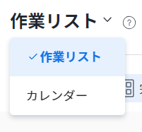
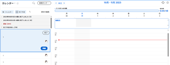

# [!UICONTROL ホームのカレンダー]を表示

[!DNL Adobe Workfront Home] で[!UICONTROL カレンダー]ビューを使用し、割り当てられたすべての作業アイテムを 1 か所で管理できます。お使いの[!UICONTROL ホームのカレンダー]ビューは、自分のみに表示され、自分だけが[!UICONTROL ホームのカレンダー]を管理できます。

ホームのカレンダーの詳細については、[ホームのカレンダービュー](../../../workfront-basics/using-home/using-the-home-area/home-calendar-view.md)を参照してください。

## アクセス要件

この記事の手順を実行するには、次のアクセス権が必要です。

<table style="table-layout:auto"> 
 <col> 
 </col> 
 <col> 
 </col> 
 <tbody> 
  <tr> 
   <td role="rowheader"><strong>[!DNL Adobe Workfront plan*]</strong></td> 
   <td> 
任意
 </td> 
  </tr> 
  <tr> 
   <td role="rowheader"><strong>[!DNL Adobe Workfront] ライセンス*</strong></td> 
   <td> 
[!UICONTROL Work] 以上
 </td> 
  </tr> 
  <tr> 
   <td role="rowheader"><strong>アクセスレベル設定*</strong></td> 
   <td> 
タスクとイシューに対する[!UICONTROL Edit]アクセス権
 
メモ：それでもアクセスできない場合は、アクセスレベルに追加の制限が設定されていないかどうかを [!DNL Workfront] 管理者にお問い合わせください。[!DNL Workfront] 管理者がアクセスレベルを変更する方法について詳しくは、<a href="../../../administration-and-setup/add-users/configure-and-grant-access/create-modify-access-levels.md" class="MCXref xref">カスタムアクセスレベルの作成または変更</a>を参照してください。
 </td> 
  </tr> 
  <tr> 
   <td role="rowheader"><strong>オブジェクト権限</strong></td> 
   <td> 
カレンダーに追加するタスクおよびイシューに対する [!UICONTROL Contribute] の権限以上
 
追加のアクセス権のリクエストについて詳しくは、<a href="../../../workfront-basics/grant-and-request-access-to-objects/request-access.md" class="MCXref xref">オブジェクトへのアクセス権のリクエスト</a>を参照してください。
 </td> 
  </tr> 
 </tbody> 
</table>

&#42;ご利用のプラン、ライセンスタイプまたはアクセス権を確認するには、[!DNL Workfront] 管理者にお問い合わせください。

## [!UICONTROL [!DNL Workfront] のホームのカレンダー]を表示

1. Adobe Workfront の左上隅で、**[!UICONTROL ホーム]**&#x200B;アイコン  をクリックします。

   >[!NOTE]
   >
   >[!DNL Workfront] 管理者は、環境の[!UICONTROL ホーム]アイコンに次の変更を行います。
   >
   >* 組織を説明するようにカスタマイズされた画像に置き換える。この場合、アイコンはこの記事に示すものとは異なる外観になります。
   >* リンクされたページを別のページに置き換える。この場合、ページの右上隅で、**[!UICONTROL メインメニュー]**、「**[!UICONTROL ホーム]**」の順にクリックします。

1. ホームの左上隅で、「**[!UICONTROL 作業リスト]**」、ドロップダウンメニューで「**[!UICONTROL カレンダー]**」の順にクリックします。

   

   [!UICONTROL ホームのカレンダー]ビューが表示されます。

   

   自分に割り当てられた作業アイテム、または自分のグループ、チーム、または役割に割り当てられた作業アイテムがすべて左側のパネルに表示されます。

   左側のパネルからカレンダーにタスクをドラッグ＆ドロップすることで、作業日を管理できます。[!UICONTROL ホームのカレンダー]に入力する方法について詳しくは、[[!UICONTROL ホームのカレンダー]ビュー](../../../workfront-basics/using-home/using-the-home-area/use-home-calendar-view.md)の使用を参照してください。
