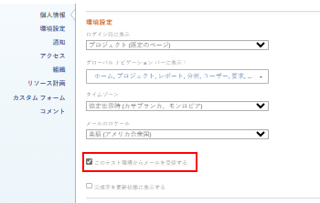

# 独自の電子メール通知を変更する

<!-- Audited: 1/2024 -->

Adobe [!DNL Workfront] 管理者は、Workfrontでイベントが発生したときにユーザーが受け取る電子メール通知を設定します ( [[!UICONTROL イベントの設定] システム内の全員に対する通知](../../administration-and-setup/manage-workfront/emails/configure-event-notifications-for-everyone-in-the-system.md)) をクリックします。

また、グループ管理者は、自分や、 [!UICONTROL ホームグループ]. 次の場合、 [!UICONTROL ホームグループ] がサブグループの場合、グループの上の最上位グループに対してアクティブ化された通知を受け取ります。

受信する通知を設定することで、この設定をさらにカスタマイズできます。イベントの発生時に通知を受け取るか、1 日に 1 件のダイジェストメールで通知を受け取るかを選択することもできます。

電子メール通知について詳しくは、 [[!DNL Adobe Workfront] 通知](../../workfront-basics/using-notifications/wf-notifications.md).

>[!NOTE]
>
>* 通知タイプを有効化して、そのタイプの通知を受け取っていない場合は、そのタイプが役割に適用されない可能性があります。
>* [!DNL Workfront] 管理者またはグループ管理者は、[!DNL Workfront Goals] の通知を設定することはできません。[!DNL Workfront] 管理者が設定できる通知について詳しくは、[システムの全員に対するイベント通知を設定](../../administration-and-setup/manage-workfront/emails/configure-event-notifications-for-everyone-in-the-system.md)を参照してください。[!DNL Workfront Goals] の個々の通知を設定する方法については、この記事を引き続きお読みください。
>

## アクセス要件

この記事の手順を実行するには、次のアクセス権が必要です。

<table style="table-layout:auto"> 
 <col> 
 </col> 
 <col> 
 </col> 
 <tbody> 
  <tr> 
   <td role="rowheader"><strong>[!DNL Adobe Workfront plan]</strong></td> 
   <td> 
任意
 </td> 
  </tr> 
  <tr> 
   <td role="rowheader"><strong>[!DNL Adobe Workfront] ライセンス</strong></td> 
   <td>  
新規：
 
   <ul><li>寄稿者以上</li></ul>
   
現在：

   <ul><li>Request 以上</li></ul>
   </td> 
  </tr> 
 </tbody> 
</table>

この表の情報の詳細については、 [Workfrontドキュメントのアクセス要件](/help/quicksilver/administration-and-setup/add-users/access-levels-and-object-permissions/access-level-requirements-in-documentation.md).

## メール通知設定を表示および変更

{{step1-click-profile-pic}}

1. 次をクリック： **[!UICONTROL その他]** アイコン  名前の横にある「 」をクリックし、 **[!UICONTROL 編集]**.

1. 表示される&#x200B;**[!UICONTROL ユーザーの編集]**&#x200B;ボックスで、「**[!UICONTROL 通知]**」セクションに移動します。

1. カテゴリをクリックすると、そのカテゴリに関連する通知設定が表示されます。

   

1. 右側のチェックボックスを選択または選択解除して、通知を毎日、即時、またはその両方で受信するかどうかを指定します。

   また、あるカテゴリのチェックボックスを使用して、そのカテゴリ内のすべての通知をアクティブ化または非アクティブ化することもできます。

   >[!NOTE]
   >
   >プロジェクトのチームメンバーの場合は、プロジェクトへのアクセス権を持たなくなっても、チームから削除されるまで、そのプロジェクトに関するメール通知を引き続き受け取ります。チームからユーザーを削除する手順については、[プロジェクトからユーザーを削除](../../manage-work/projects/manage-projects/remove-users-from-projects.md)を参照してください。

   **[!UICONTROL コミュニケーション]**&#x200B;カテゴリでは、即時配信のみ個別の通知を選択することができます。日刊ダイジェストで通知を配信するには、すべてを選択する必要があります。

   特定のカテゴリに関するすべてのメール通知がアクティブ化されている場合は、カテゴリタイトルのボックスが選択された状態で表示されます。特定のカテゴリ内のすべてのメール通知が非アクティブ化されている場合、ボックスは選択されません。一部の通知がアクティブ化され、その他の通知が非アクティブ化されている場合は、カテゴリチェックボックスが直線として表示されます。\
   通知設定を変更すると、**[!UICONTROL 編集済み]**&#x200B;ラベルがその通知設定に対して表示され、その通知設定が変更されたことがわかります。

1. 日刊ダイジェストとして送信する通知を選択した場合は、その通知を受信する時刻を「**[!UICONTROL 通知]**」セクション上部の&#x200B;**[!UICONTROL この時刻を過ぎると日刊ダイジェストメールを送信]**&#x200B;メニューで選択します。

   

   日次ダイジェストには、選択した時間の 24 時間前に通知の条件を満たすイベントが含まれます。通知のタイプごとに、1 通の日刊ダイジェストメールを受け取ります。\
   日次ダイジェストは、システムで配信用にキューに入れられているメールの数に応じて、選択した時間の後に到着する場合があります。一覧に表示される時刻は、ブラウザー設定で指定されたローカル時間です。

1. （オプションおよび条件付き）プレビュー環境でメール通知の設定を変更する場合、**[!UICONTROL このテスト環境からメールを受信]**&#x200B;設定を有効にして、メールを受信します。プレビュー環境からメールが自動的に生成されることはありません。

   

1. 「**[!UICONTROL 変更を保存]**」をクリックします。
