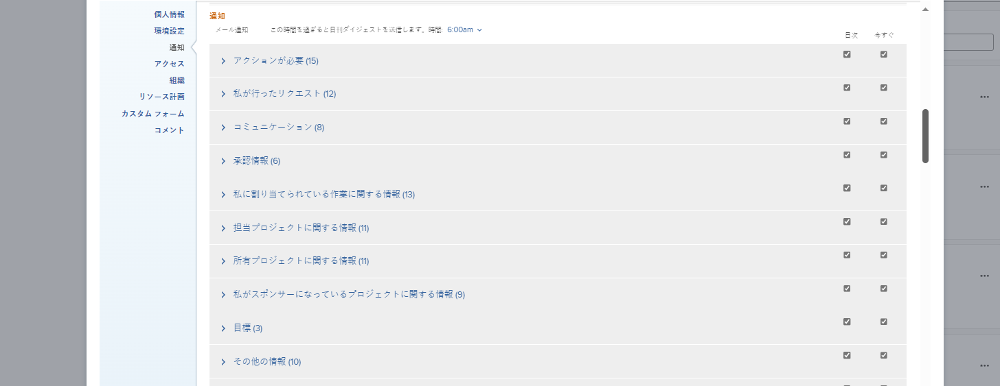
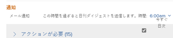

# 独自のイベント通知をアクティブ化または非アクティブ化する

Adobe [!DNL Workfront] 管理者は、Workfrontでイベントが発生したときにユーザーが受け取るイベント通知を設定します ( [[!UICONTROL イベントの設定] システム内の全員への通知](../../administration-and-setup/manage-workfront/emails/configure-event-notifications-for-everyone-in-the-system.md)) をクリックします。

また、グループ管理者は、自分やホームグループのユーザーに対して有効化するイベント通知を設定することもできます。 次に、 [!UICONTROL ホームグループ] がサブグループの場合、グループの上の最上位グループに対してアクティブ化されたイベント通知を受け取ります。

受信する通知を設定することで、この設定をさらにカスタマイズできます。 イベントの発生時に通知を受け取るか、1 日に 1 件のダイジェスト電子メールで通知を受け取るかを選択することもできます。

電子メール通知について詳しくは、 [[!DNL Adobe Workfront] 通知](../../workfront-basics/using-notifications/wf-notifications.md).

>[!NOTE]
>
>* 通知タイプを有効化して、そのタイプの通知を受け取っていない場合は、そのタイプが役割に適用されない可能性があります。
>* この [!DNL Workfront] 管理者またはグループ管理者は、 [!DNL Workfront Goals]. 通知の詳細については、 [!DNL Workfront] 管理者が設定できます。詳しくは、 [システムの全員に対するイベント通知を設定する](../../administration-and-setup/manage-workfront/emails/configure-event-notifications-for-everyone-in-the-system.md). 個々の通知を設定する方法については、 [!DNL Workfront Goals] この記事を引き続きお読みください。
>

## アクセス要件

この記事の手順を実行するには、次のアクセス権が必要です。

<table style="table-layout:auto"> 
 <col> 
 </col> 
 <col> 
 </col> 
 <tbody> 
  <tr> 
   <td role="rowheader"><strong>[!DNL Adobe Workfront plan*]</strong></td> 
   <td> 
任意
 </td> 
  </tr> 
  <tr> 
   <td role="rowheader"><strong>[!DNL Adobe Workfront] ライセンス*</strong></td> 
   <td> 
[!UICONTROL リクエスト ] 以降
 </td> 
  </tr> 
 </tbody> 
</table>

&#42;保有するプランやライセンスの種類を確認するには、 [!DNL Workfront] 管理者。

## 電子メール通知設定を表示および変更する

1. 次をクリック： **[!UICONTROL メインメニュー]** アイコン  右上隅に [!DNL Adobe Workfront]をクリックし、プロフィール画像の横にあるユーザー名をクリックします。

1. 次をクリック： **[!UICONTROL 詳細]** アイコン  を選択し、「 **[!UICONTROL 編集]**.

1. 内 **[!UICONTROL 担当者の編集]** 表示されるボックスで、 **[!UICONTROL 通知]** 」セクションに入力します。

1. カテゴリをクリックすると、そのカテゴリに関連する通知設定が表示されます。

   

1. 右側のチェックボックスをオンまたはオフにして、通知を毎日、即時、またはその両方で受信するかどうかを指定します。

   また、あるカテゴリのチェックボックスを使用して、そのカテゴリ内のすべての通知をアクティブ化または非アクティブ化することもできます。

   >[!NOTE]
   >
   >プロジェクトのチームメンバーの場合は、プロジェクトへのアクセス権を持たなくなっても、チームから削除されるまで、そのプロジェクトに関する電子メール通知を引き続き受け取ります。 チームからユーザーを削除する手順については、 [プロジェクトからユーザーを削除](../../manage-work/projects/manage-projects/remove-users-from-projects.md).

   の **[!UICONTROL 通信]** 」カテゴリでは、個々の通知を選択して即時配信のみを行うことができます。 日別のダイジェストで通知を配信するには、すべてを選択する必要があります。

   特定のカテゴリに関するすべての電子メール通知がアクティブ化されている場合は、カテゴリタイトルのボックスが選択された状態で表示されます。 特定のカテゴリ内のすべての電子メール通知が非アクティブ化されている場合、「 」ボックスはオフになります。 一部の通知がアクティブ化され、その他の通知が非アクティブ化されている場合は、カテゴリチェックボックスが直線として表示されます。\
   通知設定を変更すると、ラベル **[!UICONTROL 編集済み]** はその通知設定に対して表示され、その通知設定が変更されたことを知らせます。

1. 日別のダイジェストとして送信する通知を選択した場合は、その通知を日の上部で受信する時刻を **[!UICONTROL 通知]** セクション **[!UICONTROL 1 日のダイジェストの電子メール送信後]** メニュー

   

   1 日のダイジェストには、選択した時間の 24 時間前に通知の条件を満たすイベントが含まれます。 通知のタイプごとに 1 通の 1 日に 1 通のダイジェスト電子メールを受け取ります。\
   毎日のダイジェストは、選択した時間の後に、システムで配信用にキューに登録されている電子メールの数に応じて、到着する場合があります。 一覧に表示される時刻は、ブラウザー設定で指定されたローカル時間です。

1. （オプションおよび条件付き）プレビュー環境で電子メール通知の設定を変更する場合、 **[!UICONTROL このテスト環境からメールを受信]** 電子メールを受信する設定 プレビュー環境から電子メールが自動的に生成されることはありません。

   

1. 「**[!UICONTROL 変更を保存]**」をクリックします。
