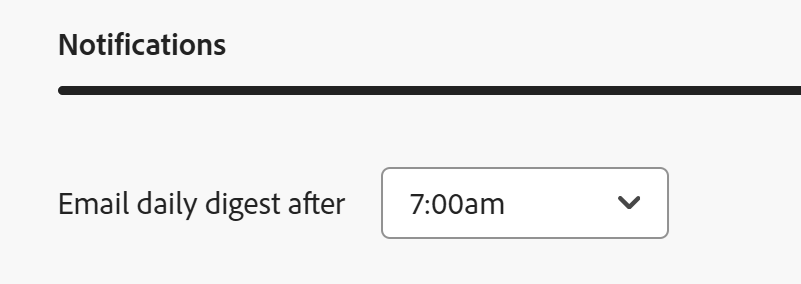

# 自身のメール通知の変更

<!-- Audited: 1/2024 -->

Adobe [!DNL Workfront] 管理者は、Workfront でイベントが発生したときにユーザーが受信するメール通知を設定します。詳しくは、[[!UICONTROL システムの全ユーザーに対するイベント]通知の設定](../../administration-and-setup/manage-workfront/emails/configure-event-notifications-for-everyone-in-the-system.md)を参照してください。

また、グループ管理者も、自分や自分の[!UICONTROL ホームグループ]のユーザーに対して有効化するイベント通知を設定できます。 [!UICONTROL ホームグループ]がサブグループの場合、自分のグループの上にある最上位グループに対してアクティブ化されたイベント通知も受け取ります。

受信する通知を設定することで、この設定をさらにカスタマイズできます。 イベントの発生時に通知を受け取るか、1 日に 1 件のダイジェストメールで通知を受け取るかを選択することもできます。

メール通知について詳しくは、[[!DNL Adobe Workfront] 通知](../../workfront-basics/using-notifications/wf-notifications.md)を参照してください。

>[!NOTE]
>
>* 通知タイプを有効化して、そのタイプの通知を受け取っていない場合は、そのタイプが役割に適用されない可能性があります。
>* [!DNL Workfront] 管理者またはグループ管理者は、[!DNL Workfront Goals] の通知を設定することはできません。 [!DNL Workfront] 管理者が設定できる通知について詳しくは、[システムの全員に対するイベント通知を設定](../../administration-and-setup/manage-workfront/emails/configure-event-notifications-for-everyone-in-the-system.md)を参照してください。 [!DNL Workfront Goals] の個々の通知を設定する方法については、この記事を引き続きお読みください。
>* 承認通知は、レガシードキュメントの承認にのみ適用されます。 統合ドキュメント承認の通知コントロールは現在使用できません。

## アクセス要件

+++ 展開すると、この記事の機能のアクセス要件が表示されます。

<table style="table-layout:auto"> 
 <col> 
 </col> 
 <col> 
 </col> 
 <tbody> 
  <tr> 
   <td role="rowheader"><strong>[!DNL Adobe Workfront package]</strong></td> 
   <td> 
任意
 </td> 
  </tr> 
  <tr> 
   <td role="rowheader"><strong>[!DNL Adobe Workfront] ライセンス</strong></td> 
   <td> 
コントリビューター以上

   
リクエスト以上

   </td> 
  </tr> 
 </tbody> 
</table>

詳しくは、[Workfront ドキュメントのアクセス要件](/help/quicksilver/administration-and-setup/add-users/access-levels-and-object-permissions/access-level-requirements-in-documentation.md)を参照してください。

+++

## メール通知設定を表示および変更

{{step1-click-profile-pic}}

1. 名前の横にある&#x200B;**[!UICONTROL 詳細]** アイコン をクリックし、**[!UICONTROL ユーザーを編集]**&#x200B;をクリックします。

1. 表示される「**[!UICONTROL ユーザーを編集]**」ボックスで、**[!UICONTROL 通知]** セクションに移動します。

1. カテゴリをクリックすると、そのカテゴリに関連する通知設定が表示されます。

   

1. 右側のチェックボックスを選択または選択解除して、通知を毎日、即時、またはその両方で受信するかどうかを指定します。

   また、あるカテゴリのチェックボックスを使用して、そのカテゴリ内のすべての通知をアクティブ化または非アクティブ化することもできます。

   >[!NOTE]
   >
   >プロジェクトのチームメンバーの場合は、プロジェクトへのアクセス権を持たなくなっても、チームから削除されるまで、そのプロジェクトに関するメール通知を引き続き受け取ります。 チームからユーザーを削除する手順については、[プロジェクトからユーザーを削除](../../manage-work/projects/manage-projects/remove-users-from-projects.md)を参照してください。

   **[!UICONTROL コミュニケーション]**&#x200B;カテゴリでは、即時配信のみ個別の通知を選択することができます。 日刊ダイジェストで通知を配信するには、すべてを選択する必要があります。

   特定のカテゴリに関するすべてのメール通知がアクティブ化されている場合は、カテゴリタイトルのボックスが選択された状態で表示されます。 特定のカテゴリ内のすべてのメール通知が非アクティブ化されている場合、ボックスは選択されません。 一部の通知がアクティブ化され、その他の通知が非アクティブ化されている場合は、カテゴリチェックボックスが直線として表示されます。

   通知設定を変更すると、**[!UICONTROL 編集済み]**&#x200B;ラベルがその通知設定に対して表示され、その通知設定が変更されたことがわかります。

1. 毎日のダイジェストとして送信する通知を選択した場合は、**[!UICONTROL 毎日のダイジェストの後]** メニューの&#x200B;**[!UICONTROL 通知]** セクションの上部で、受信する日の時刻を選択します。

   

   日次ダイジェストには、選択した時間の 24 時間前に通知の条件を満たすイベントが含まれます。 通知のタイプごとに、1 通の日刊ダイジェストメールを受け取ります。\
   日次ダイジェストは、システムで配信用にキューに入れられているメールの数に応じて、選択した時間の後に到着する場合があります。 一覧に表示される時刻は、ブラウザー設定で指定されたローカル時間です。

1. （オプションおよび条件付き）プレビュー環境でメール通知の設定を変更する場合、**[!UICONTROL このテスト環境からメールを受信]**&#x200B;設定を有効にして、メールを受信します。 プレビュー環境からメールが自動的に生成されることはありません。

   

1. 「**[!UICONTROL 保存]**」をクリックします。
