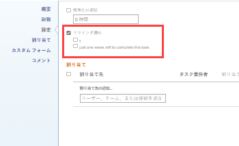

# オブジェクトにリマインダー通知を添付する

リマインダー通知は、複数の異なるオブジェクトタイプに関連付けることができます。プロジェクト、タスク、タスク、タスク、タイムシート、テンプレート、テンプレートタスク、および定期タイムシートプロファイル。

オブジェクトにリマインダー通知を添付する前に、 [!DNL Adobe Workfront] 管理者は、 [リマインダー通知の設定](../../administration-and-setup/manage-workfront/emails/set-up-reminder-notifications.md).

リマインダー通知を添付する手順は、添付するオブジェクトの種類に関係なく同じです。

## アクセス要件

この記事の手順を実行するには、次のアクセス権が必要です。

<table style="table-layout:auto"> 
 <col> 
 </col> 
 <col> 
 </col> 
 <tbody> 
  <tr> 
   <td role="rowheader"><strong>[!DNL Adobe Workfront plan*]</strong></td> 
   <td> 
任意
 </td> 
  </tr> 
  <tr> 
   <td role="rowheader"><strong>[!DNL Adobe Workfront] ライセンス*</strong></td> 
   <td> 
[!UICONTROL Work] 
 </td> 
  </tr> 
  <tr> 
   <td role="rowheader"><strong>アクセスレベル設定*</strong></td> 
   <td> 
[!UICONTROL Worker] 以降
 
注意：まだアクセス権がない場合は、 [!DNL Workfront] 管理者（アクセスレベルに追加の制限を設定している場合） を参照してください。 [!DNL Workfront] 管理者はアクセスレベルを変更できます。詳しくは、 <a href="../../administration-and-setup/add-users/configure-and-grant-access/create-modify-access-levels.md" class="MCXref xref">カスタムアクセスレベルの作成または変更</a>.
 </td> 
  </tr> 
  <tr> 
   <td role="rowheader"><strong>オブジェクト権限</strong></td> 
   <td> 
オブジェクトへのアクセスを管理
 
追加のアクセス権のリクエストについて詳しくは、 <a href="../../workfront-basics/grant-and-request-access-to-objects/request-access.md" class="MCXref xref">オブジェクトへのアクセスのリクエスト </a>.
 </td> 
  </tr> 
 </tbody> 
</table>

&#42;ご利用のプラン、ライセンスの種類、アクセス権を確認するには、 [!DNL Workfront] 管理者。

## オブジェクトにリマインダー通知を添付する

1. リマインダー通知を添付するオブジェクトに移動します。
1. 編集アイコンをクリックします。 .
1. ( **[!UICONTROL 編集]** 表示されるボックスで、 **[!UICONTROL 設定]**.

1. の下 **[!UICONTROL リマインダー通知]**、オブジェクトに関連付ける通知を選択します。

   この例では、編集中のオブジェクトはタスクです。

   

   この [!DNL Workfront] 管理者が複数のリマインダー通知を作成しました。1 つのオブジェクトに複数の通知を添付できます。

1. クリック **[!UICONTROL 変更を保存]**.

   リマインダー通知の配信をテストする際に不明な点がある場合は、 [!DNL Workfront] 管理者。
