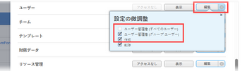

# プレビューサンドボックス環境からの E メールの配信を有効にする

[!UICONTROL Adobe Workfront] は、プレビューとカスタム更新サンドボックス環境の両方からのすべての電子メール通信を無効にします。 プレビューサンドボックス環境について詳しくは、 [Adobe Workfrontプレビューサンドボックス環境](../../administration-and-setup/set-up-workfront/workfront-testing-environments/wf-preview-sandbox-environment.md). カスタム更新サンドボックス環境について詳しくは、 [Adobe Workfront Custom Refresh Sandbox 環境](../../administration-and-setup/set-up-workfront/workfront-testing-environments/wf-custom-refresh-sandbox-environment.md).

プレビューサンドボックス環境から次の電子メール通知を受け取る場合は、プレビューにログイン中に、ユーザー設定でこの機能を有効にする必要があります。

* イベント通知によってトリガーされる電子メール通知
* リマインダ通知
* 遅延または早期のリマインダー通知の自動送信
* E メールの招待状

これは、自分で行うことも、編集するアクセス権を持つ任意のユーザーに対して行うこともできます。 ユーザーの編集に必要なアクセスについて詳しくは、 [ユーザーへのアクセス権の付与](../../administration-and-setup/add-users/configure-and-grant-access/grant-access-other-users.md).

>[!NOTE]
>
>モバイルアプリのレポート配信とプッシュ通知は、プレビューサンドボックス環境では常に無効になります。 あなたも [!DNL Workfront] 管理者は、プレビューサンドボックス環境にアクセスする際に、モバイルアプリのレポート配信またはプッシュ通知を有効にすることができます。
>
>レポートの配信について詳しくは、 [レポート配信の概要](../../reports-and-dashboards/reports/creating-and-managing-reports/set-up-report-deliveries.md).

## アクセス要件

この記事の手順を実行するには、次のアクセス権が必要です。

<table style="table-layout:auto"> 
 <col> 
 </col> 
 <col> 
 </col> 
 <tbody> 
  <tr> 
   <td role="rowheader"><strong>[!DNL Adobe Workfront plan*]</strong></td> 
   <td> 
任意
 </td> 
  </tr> 
  <tr> 
   <td role="rowheader"><strong>[!DNL Adobe Workfront] ライセンス*</strong></td> 
   <td> 
[!UICONTROL リクエスト ] 以上を使用して、独自の設定を変更
 
[!UICONTROL プラン ] を使用して、他のユーザー用の設定を編集
 </td> 
  </tr> 
  <tr> 
   <td role="rowheader"><strong>アクセスレベル設定*</strong></td> 
   <td> 
次のいずれかが必要です。
 
    <ul> 
     <li> 
[!UICONTROL System Administrator] アクセスレベル。
 
 このアクセスレベルについて詳しくは、 <a href="../../administration-and-setup/add-users/configure-and-grant-access/grant-a-user-full-administrative-access.md" class="MCXref xref">ユーザーに完全な管理アクセス権を付与する</a>. 
 </li> 
     <li> 
アクセスレベルで、[!UICONTROL Users] 設定で [!UICONTROL Edit] が選択されている必要があります。 また、[!UICONTROL Users] 設定の場合は、[!UICONTROL 設定の微調整 ]  に設定されている場合は、[!UICONTROL 作成 ] オプションと、2 つの [!UICONTROL ユーザー管理 ] オプションのうち少なくとも 1 つを有効にする必要があります。 
 
[!UICONTROL ユーザー管理（グループユーザー）] オプションを使用している場合は、ユーザーがメンバーとなっているグループのグループ管理者である必要があります。
 
  
 
アクセスレベルでの [!UICONTROL Users] 設定について詳しくは、 <a href="../../administration-and-setup/add-users/configure-and-grant-access/grant-access-other-users.md" class="MCXref xref">ユーザーへのアクセス権の付与</a>.
 </li> 
    </ul> 
注意：まだアクセス権がない場合は、 [!DNL Workfront] 管理者（アクセスレベルに追加の制限を設定している場合） を参照してください。 [!DNL Workfront] 管理者はアクセスレベルを変更できます。詳しくは、 <a href="../../administration-and-setup/add-users/configure-and-grant-access/create-modify-access-levels.md" class="MCXref xref">カスタムアクセスレベルの作成または変更</a>.
 </td> 
  </tr> 
 </tbody> 
</table>

&#42;ご利用のプラン、ライセンスの種類、アクセス権を確認するには、 [!DNL Workfront] 管理者。

## プレビューサンドボックス環境からの E メールの配信を有効にする

1. プレビューサンドボックス環境にログインします。
1. 右上隅のプロフィール画像をクリック [!DNL Adobe Workfront]. 次に、 **[!UICONTROL 詳細]** メニューと選択 **[!UICONTROL 編集]**.

   または

   でのユーザーの検索 [!DNL Workfront] をクリックし、名前をクリックします。 次に、 **[!UICONTROL 詳細]** メニューと選択 **[!UICONTROL 編集]**.

   または

   複数のユーザーの場合：次をクリック： **[!UICONTROL メインメニュー]** アイコン  Workfrontの右上隅で、 **[!UICONTROL ユーザー]** .  次に、複数のユーザーを選択し、 **[!UICONTROL 編集]**.

1. クリック **[!UICONTROL 環境設定]**.
1. 選択 **[!UICONTROL このテスト環境からメールを受信]**.

   >[!NOTE]
   >
   >このオプションは、実稼動環境では使用できません。

1. クリック **[!UICONTROL 変更を保存]**.
